# Capstone Project 1: Production-Grade Static Website

**Duration:** ⏱️ 3-4 hours  
**Level:** Intermediate  
**Skills:** Cloud Storage, Cloud CDN, Load Balancing, Cloud DNS, SSL Certificates

---

## 🎯 Project Objective

Build a **production-ready static website** with global CDN, HTTPS, custom domain, and monitoring—exactly how real companies deploy web properties.

### What You'll Learn
- ✅ Configure Cloud Storage for static website hosting
- ✅ Set up Cloud CDN for global performance
- ✅ Configure HTTPS with Google-managed SSL certificates
- ✅ Use Cloud DNS for custom domain routing
- ✅ Implement Cloud Monitoring and logging
- ✅ Follow production security and performance best practices

---

## 🏗️ Architecture

```mermaid
graph TB
    User[👤 Global Users] --> DNS[Cloud DNS<br/>yourdomain.com]
    DNS --> GLB[Global Load Balancer<br/>HTTPS]
    GLB --> SSL[Managed SSL Cert]
    GLB --> CDN[Cloud CDN<br/>Edge Caching]
    CDN --> Backend[Backend Bucket]
    Backend --> GCS[(Cloud Storage<br/>Website Files)]
    
    Monitor[Cloud Monitoring] -.-> GLB
    Monitor -.-> CDN
    
    style GLB fill:#4285f4
    style CDN fill:#34a853
    style GCS fill:#fbbc04
```



---

## 📋 Prerequisites

- [ ] Active GCP project with billing enabled
- [ ] Basic HTML/CSS skills
- [ ] Domain name (optional but recommended)
- [ ] Completed: Cloud Storage, Load Balancing modules

---

## 🚀 Implementation Guide

### Phase 1: Create Website Content (30 min)

#### Step 1: Prepare Website Files

Create a simple portfolio website locally:

```bash
# Create project directory
mkdir gcp-static-site
cd gcp-static-site

# Create index.html
cat > index.html << 'EOF'
<!DOCTYPE html>
<html lang="en">
<head>
    <meta charset="UTF-8">
    <meta name="viewport" content="width=device-width, initial-scale=1.0">
    <title>My GCP Portfolio</title>
    <link rel="stylesheet" href="styles.css">
</head>
<body>
    <header>
        <h1>Welcome to My Cloud Portfolio</h1>
        <p>Deployed on Google Cloud Platform</p>
    </header>
    <main>
        <section>
            <h2>About This Project</h2>
            <p>This static website demonstrates production-grade cloud architecture:</p>
            <ul>
                <li>✅ Global CDN distribution</li>
                <li>✅ HTTPS with managed certificates</li>
                <li>✅ Custom domain routing</li>
                <li>✅ Cloud monitoring integration</li>
            </ul>
        </section>
    </main>
    <footer>
        <p>Hosted on Google Cloud Storage | Powered by Cloud CDN</p>
    </footer>
</body>
</html>
EOF

# Create styles.css
cat > styles.css << 'EOF'
* { margin: 0; padding: 0; box-sizing: border-box; }
body { font-family: 'Segoe UI', sans-serif; line-height: 1.6; color: #333; }
header { background: linear-gradient(135deg, #667eea 0%, #764ba2 100%); 
         color: white; padding: 60px 20px; text-align: center; }
main { max-width: 800px; margin: 40px auto; padding: 20px; }
section { background: #f8f9fa; padding: 30px; border-radius: 8px; box-shadow: 0 2px 4px rgba(0,0,0,0.1); }
footer { text-align: center; padding: 20px; background: #333; color: white; margin-top: 40px; }
EOF

# Create 404 page
cat > 404.html << 'EOF'
<!DOCTYPE html>
<html>
<head><title>404 - Page Not Found</title></head>
<body style="text-align:center; padding:100px; font-family:Arial;">
    <h1>404</h1>
    <p>Page not found. <a href="/">Go home</a></p>
</body>
</html>
EOF
```

---

### Phase 2: Cloud Storage Setup (30 min)

#### Step 2: Create Storage Bucket

```bash
# Set variables
PROJECT_ID=$(gcloud config get-value project)
BUCKET_NAME="www-${PROJECT_ID}"

# Create bucket with uniform access
gcloud storage buckets create gs://${BUCKET_NAME} \
    --location=us-central1 \
    --uniform-bucket-level-access \
    --public-access-prevention

# Upload website files
gcloud storage cp index.html gs://${BUCKET_NAME}/
gcloud storage cp styles.css gs://${BUCKET_NAME}/
gcloud storage cp 404.html gs://${BUCKET_NAME}/

# Verify upload
gcloud storage ls gs://${BUCKET_NAME}/
```

#### Step 3: Configure Website Settings

```bash
# Set main page and 404 page
gcloud storage buckets update gs://${BUCKET_NAME} \
    --web-main-page-suffix=index.html \
    --web-error-page=404.html
```

---

### Phase 3: Load Balancer + CDN Setup (60 min)

#### Step 4: Reserve Static IP Address

```bash
# Reserve global static IP for HTTPS load balancer
gcloud compute addresses create website-ip \
    --ip-version=IPV4 \
    --global

# Get the IP address
gcloud compute addresses describe website-ip --global --format="get(address)"
```

#### Step 5: Create Backend Bucket

```bash
# Create backend bucket pointing to GCS
gcloud compute backend-buckets create website-backend \
    --gcs-bucket-name=${BUCKET_NAME} \
    --enable-cdn \
    --cache-mode=CACHE_ALL_STATIC \
    --default-ttl=3600 \
    --max-ttl=86400
```

#### Step 6: Create URL Map

```bash
# Create URL map
gcloud compute url-maps create website-url-map \
    --default-backend-bucket=website-backend
```

#### Step 7: Create Managed SSL Certificate

```bash
# For custom domain (replace with your domain)
DOMAIN="example.com"  # Change this!

gcloud compute ssl-certificates create website-ssl-cert \
    --domains=${DOMAIN},www.${DOMAIN} \
    --global

# Check provisioning status (takes 15-30 minutes)
gcloud compute ssl-certificates describe website-ssl-cert --global
```

#### Step 8: Create HTTPS Proxy

```bash
# Create target HTTPS proxy
gcloud compute target-https-proxies create website-https-proxy \
    --url-map=website-url-map \
    --ssl-certificates=website-ssl-cert
```

#### Step 9: Create Forwarding Rule

```bash
# Create global forwarding rule
gcloud compute forwarding-rules create website-https-rule \
    --address=website-ip \
    --global \
    --target-https-proxy=website-https-proxy \
    --ports=443
```

---

### Phase 4: DNS Configuration (30 min)

#### Step 10: Configure Cloud DNS

```bash
# Create DNS zone
gcloud dns managed-zones create mywebsite-zone \
    --dns-name=${DOMAIN}. \
    --description="My website DNS zone"

# Get name servers
gcloud dns managed-zones describe mywebsite-zone \
    --format="get(nameServers)"

# Create A records
LOAD_BALANCER_IP=$(gcloud compute addresses describe website-ip --global --format="get(address)")

gcloud dns record-sets create ${DOMAIN}. \
    --zone=mywebsite-zone \
    --type=A \
    --ttl=300 \
    --rrdatas=${LOAD_BALANCER_IP}

gcloud dns record-sets create www.${DOMAIN}. \
    --zone=mywebsite-zone \
    --type=A \
    --ttl=300 \
    --rrdatas=${LOAD_BALANCER_IP}
```

> **⏳ Important:** Update your domain registrar's name servers to the ones provided by Cloud DNS.

---

### Phase 5: Security & IAM (20 min)

#### Step 11: Configure Bucket IAM

```bash
# Make bucket publicly readable (required for website hosting)
gcloud storage buckets add-iam-policy-binding gs://${BUCKET_NAME} \
    --member=allUsers \
    --role=roles/storage.objectViewer
```

#### Step 12: Enable Cloud Armor (Optional - DDoS Protection)

```bash
# Create security policy
gcloud compute security-policies create website-security-policy \
    --description="Basic DDoS protection"

# Add rate limiting rule
gcloud compute security-policies rules create 1000 \
    --security-policy=website-security-policy \
    --expression="true" \
    --action=rate-based-ban \
    --rate-limit-threshold-count=100 \
    --rate-limit-threshold-interval-sec=60 \
    --ban-duration-sec=600

# Attach to backend
gcloud compute backend-buckets update website-backend \
    --security-policy=website-security-policy
```

---

### Phase 6: Monitoring & Logging (30 min)

#### Step 13: Create Uptime Check

```bash
# Create uptime check
gcloud monitoring uptime create website-uptime \
    --resource-type=uptime-url \
    --display-name="Website Uptime" \
    --http-check-path="/" \
    --monitored-resource-host=${DOMAIN}
```

#### Step 14: Create Alert Policy

```bash
# Create alerting policy for downtime
gcloud alpha monitoring policies create \
    --notification-channels=<YOUR_EMAIL_CHANNEL> \
    --display-name="Website Down Alert" \
    --condition-display-name="Uptime check failed" \
    --condition-threshold-value=1 \
    --condition-threshold-duration=60s
```

#### Step 15: Enable CDN Logging

```bash
# Enable Cloud CDN logging
gcloud compute backend-buckets update website-backend \
    --enable-logging \
    --logging-sample-rate=1.0
```

---

## ✅ Verification Checklist

### Functionality Tests
- [ ] Visit `https://yourdomain.com` → Shows your website
- [ ] Visit `https://www.yourdomain.com` → Shows your website
- [ ] Visit non-existent page → Shows 404.html
- [ ] Check SSL certificate → Green lock icon in browser
- [ ] Test from different geographic regions → Fast load times

### Security Tests
```bash
# Check SSL grade
curl -I https://${DOMAIN}

# Verify HTTPS redirect
curl -I http://${DOMAIN}  # Should redirect to HTTPS

# Check CSP headers (if configured)
curl -I https://${DOMAIN} | grep -i security
```

### Performance Tests
```bash
# Check CDN cache hits
gcloud logging read "resource.type=http_load_balancer" --limit=10 \
    --format="table(httpRequest.requestUrl, httpRequest.cacheHit)"

# View CDN metrics
gcloud monitoring time-series list \
    --filter='metric.type="loadbalancing.googleapis.com/https/backend_request_count"' \
    --format=json
```

---

## 🎓 Interview Prep: How to Explain This Project

### Problem Statement
> "I needed to deploy a production-grade static website with global reach, HTTPS security, and enterprise-level reliability."

### Why This Architecture?
| Decision | Rationale | Alternative Considered |
|----------|-----------|------------------------|
| Cloud Storage | Cost-effective ($0.026/GB/month vs $7+/month for VM) | Compute Engine (too expensive) |
| Cloud CDN | Reduces latency globally (150+ edge locations) | No CDN (slower for global users) |
| Managed SSL | Auto-renewal, no certificate management | Self-signed cert (browser warnings) |
| Load Balancer | Required for HTTPS + CDN integration | Direct bucket access (no HTTPS) |

### Trade-offs Made
- **Higher initial complexity** vs simple bucket hosting → Worth it for production
- **Cost of Load Balancer** ($18/month) → Required for HTTPS
- **DNS propagation delay** (15-60 min) → One-time setup cost

### What I'd Improve Next
1. **Add Cloud Armor WAF rules** for common attack patterns
2. **Implement Cache-Control headers** for better CDN efficiency
3. **Add custom logging** to BigQuery for analytics
4. **Set up multi-region failover** with Traffic Director

---

## 💰 Cost Breakdown

| Resource | Monthly Cost (est.) |
|----------|---------------------|
| Cloud Storage (10 GB) | $0.26 |
| Load Balancer | $18.00 |
| Cloud CDN (100 GB egress) | $8.00 |
| Cloud DNS (1 zone) | $0.20 |
| Managed SSL cert | **FREE** |
| **Total** | **~$27/month** |

> 💡 **Cost Optimization Tip:** Use Cloud Storage lifecycle rules to delete old versions and reduce storage costs.

---

## 🧹 Cleanup (When Done)

```bash
# Delete forwarding rule
gcloud compute forwarding-rules delete website-https-rule --global --quiet

# Delete proxy
gcloud compute target-https-proxies delete website-https-proxy --quiet

# Delete URL map
gcloud compute url-maps delete website-url-map --quiet

# Delete SSL certificate
gcloud compute ssl-certificates delete website-ssl-cert --global --quiet

# Delete backend bucket
gcloud compute backend-buckets delete website-backend --quiet

# Delete storage bucket
gcloud storage rm -r gs://${BUCKET_NAME}

# Release IP
gcloud compute addresses delete website-ip --global --quiet

# Delete DNS zone (first delete all records)
gcloud dns managed-zones delete mywebsite-zone --quiet
```

---

## 📚 Portfolio Submission

### README.md Template
```markdown
# Production Static Website on GCP

## Architecture
- Cloud Storage for hosting
- Cloud CDN for global distribution
- HTTPS Load Balancer with managed SSL
- Cloud DNS for domain routing
- Cloud Monitoring for uptime

## Live Demo
https://yourdomain.com

## What I Learned
- Configuring GCP networking stack
- SSL certificate management
- CDN cache optimization
- Production security best practices
```

---

## 🎯 Resume Bullet Example

> "Architected and deployed a production-grade static website on GCP using Cloud Storage, Cloud CDN, and HTTPS Load Balancer, achieving <100ms global latency and 99.9% uptime with managed SSL certificates."
