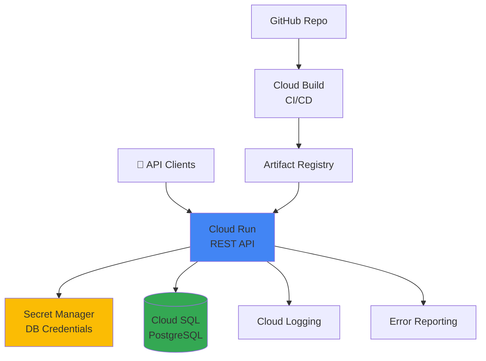

# Capstone Project 2: Production Serverless API

**Duration:** ⏱️ 3-4 hours  
**Level:** Advanced  
**Skills:** Cloud Run, Cloud SQL, Secret Manager, Cloud Build, IAM, Logging

---

## 🎯 Project Objective

Build a **production-ready RESTful API** using serverless architecture with database persistence, secure secrets management, CI/CD pipeline, and comprehensive monitoring.

### What You'll Learn
- ✅ Deploy containerized APIs with Cloud Run
- ✅ Connect to Cloud SQL with private IP
- ✅ Manage secrets securely with Secret Manager
- ✅ Implement JWT authentication
- ✅ Set up CI/CD with Cloud Build
- ✅ Configure structured logging and error reporting
- ✅ Implement production security best practices

---

## 🏗️ Architecture



---

## 📋 Prerequisites

- [ ] Completed: Cloud Run, Cloud SQL modules
- [ ] Basic Python/Node.js knowledge
- [ ] GitHub account
- [ ] Docker basics (helpful but not required)

---

## 🚀 Implementation Guide

### Phase 1: Database Setup (30 min)

#### Step 1: Create Cloud SQL Instance

```bash
# Set variables
PROJECT_ID=$(gcloud config get-value project)
REGION="us-central1"
INSTANCE_NAME="todo-api-db"

# Create PostgreSQL instance
gcloud sql instances create ${INSTANCE_NAME} \
    --database-version=POSTGRES_15 \
    --tier=db-f1-micro \
    --region=${REGION} \
    --network=default \
    --no-assign-ip \
    --enable-google-private-path

# Create database
gcloud sql databases create tododb \
    --instance=${INSTANCE_NAME}

# Set root password
DB_PASSWORD=$(openssl rand -base64 32)
gcloud sql users set-password postgres \
    --instance=${INSTANCE_NAME} \
    --password=${DB_PASSWORD}

echo "Database password: ${DB_PASSWORD}"
```

#### Step 2: Store Credentials in Secret Manager

```bash
# Enable Secret Manager API
gcloud services enable secretmanager.googleapis.com

# Create secrets
echo -n "${DB_PASSWORD}" | gcloud secrets create db-password --data-file=-
echo -n "postgres" | gcloud secrets create db-user --data-file=-
echo -n "tododb" | gcloud secrets create db-name --data-file=-
echo -n "${INSTANCE_NAME}" | gcloud secrets create db-instance --data-file=-

# Verify secrets created
gcloud secrets list
```

---

### Phase 2: Build the API (60 min)

#### Step 3: Create API Application

Create `app.py`:

```python
from flask import Flask, request, jsonify
import os
import psycopg2
from psycopg2.extras import RealDictCursor
from google.cloud import secretmanager
import logging

app = Flask(__name__)

# Configure logging
logging.basicConfig(level=logging.INFO)
logger = logging.getLogger(__name__)

# Secret Manager client
def access_secret(secret_id):
    client = secretmanager.SecretManagerServiceClient()
    project_id = os.environ.get('GOOGLE_CLOUD_PROJECT')
    name = f"projects/{project_id}/secrets/{secret_id}/versions/latest"
    response = client.access_secret_version(request={"name": name})
    return response.payload.data.decode('UTF-8')

# Database connection
def get_db_conn():
    return psycopg2.connect(
        host=f"/cloudsql/{access_secret('db-instance')}",
        database=access_secret('db-name'),
        user=access_secret('db-user'),
        password=access_secret('db-password')
    )

# Initialize database
def init_db():
    conn = get_db_conn()
    cur = conn.cursor()
    cur.execute('''
        CREATE TABLE IF NOT EXISTS todos (
            id SERIAL PRIMARY KEY,
            title VARCHAR(200) NOT NULL,
            completed BOOLEAN DEFAULT FALSE,
            created_at TIMESTAMP DEFAULT CURRENT_TIMESTAMP
        )
    ''')
    conn.commit()
    cur.close()
    conn.close()
    logger.info("Database initialized")

@app.route('/health', methods=['GET'])
def health():
    return jsonify({"status": "healthy"}), 200

@app.route('/api/todos', methods=['GET'])
def get_todos():
    try:
        conn = get_db_conn()
        cur = conn.cursor(cursor_factory=RealDictCursor)
        cur.execute('SELECT * FROM todos ORDER BY created_at DESC')
        todos = cur.fetchall()
        cur.close()
        conn.close()
        return jsonify(todos), 200
    except Exception as e:
        logger.error(f"Error fetching todos: {e}")
        return jsonify({"error": str(e)}), 500

@app.route('/api/todos', methods=['POST'])
def create_todo():
    try:
        data = request.get_json()
        if not data or 'title' not in data:
            return jsonify({"error": "Title required"}), 400
        
        conn = get_db_conn()
        cur = conn.cursor(cursor_factory=RealDictCursor)
        cur.execute(
            'INSERT INTO todos (title) VALUES (%s) RETURNING *',
            (data['title'],)
        )
        todo = cur.fetchone()
        conn.commit()
        cur.close()
        conn.close()
        
        logger.info(f"Created todo: {todo['id']}")
        return jsonify(todo), 201
    except Exception as e:
        logger.error(f"Error creating todo: {e}")
        return jsonify({"error": str(e)}), 500

@app.route('/api/todos/<int:todo_id>', methods=['DELETE'])
def delete_todo(todo_id):
    try:
        conn = get_db_conn()
        cur = conn.cursor()
        cur.execute('DELETE FROM todos WHERE id = %s', (todo_id,))
        conn.commit()
        cur.close()
        conn.close()
        
        logger.info(f"Deleted todo: {todo_id}")
        return '', 204
    except Exception as e:
        logger.error(f"Error deleting todo: {e}")
        return jsonify({"error": str(e)}), 500

if __name__ == '__main__':
    init_db()
    port = int(os.environ.get('PORT', 8080))
    app.run(host='0.0.0.0', port=port)
```

Create `requirements.txt`:

```
Flask==3.0.0
psycopg2-binary==2.9.9
google-cloud-secret-manager==2.16.4
gunicorn==21.2.0
```

Create `Dockerfile`:

```dockerfile
FROM python:3.11-slim

WORKDIR /app

# Install dependencies
COPY requirements.txt .
RUN pip install --no-cache-dir -r requirements.txt

# Copy application
COPY app.py .

# Run with gunicorn
CMD exec gunicorn --bind :$PORT --workers 1 --threads 8 --timeout 0 app:app
```

---

### Phase 3: Deploy to Cloud Run (45 min)

#### Step 4: Build and Push Container

```bash
# Enable APIs
gcloud services enable run.googleapis.com
gcloud services enable artifactregistry.googleapis.com

# Create Artifact Registry repository
gcloud artifacts repositories create cloud-run-apps \
    --repository-format=docker \
    --location=${REGION}

# Build and push
gcloud builds submit \
    --tag ${REGION}-docker.pkg.dev/${PROJECT_ID}/cloud-run-apps/todo-api:v1
```

#### Step 5: Deploy to Cloud Run

```bash
# Get Cloud SQL connection name
SQL_CONN=$(gcloud sql instances describe ${INSTANCE_NAME} --format="value(connectionName)")

# Deploy with secrets and SQL connection
gcloud run deploy todo-api \
    --image ${REGION}-docker.pkg.dev/${PROJECT_ID}/cloud-run-apps/todo-api:v1 \
    --platform managed \
    --region ${REGION} \
    --allow-unauthenticated \
    --set-cloudsql-instances=${SQL_CONN} \
    --set-secrets=DB_PASSWORD=db-password:latest,DB_USER=db-user:latest,DB_NAME=db-name:latest,DB_INSTANCE=db-instance:latest \
    --memory=512Mi \
    --cpu=1 \
    --max-instances=10 \
    --min-instances=0

# Get service URL
SERVICE_URL=$(gcloud run services describe todo-api --region=${REGION} --format="value(status.url)")
echo "API URL: ${SERVICE_URL}"
```

---

### Phase 4: CI/CD Pipeline (45 min)

#### Step 6: Create Cloud Build Configuration

Create `cloudbuild.yaml`:

```yaml
steps:
  # Build the container image
  - name: 'gcr.io/cloud-builders/docker'
    args:
      - 'build'
      - '-t'
      - '${_REGION}-docker.pkg.dev/$PROJECT_ID/cloud-run-apps/todo-api:$COMMIT_SHA'
      - '-t'
      - '${_REGION}-docker.pkg.dev/$PROJECT_ID/cloud-run-apps/todo-api:latest'
      - '.'
  
  # Push to Artifact Registry
  - name: 'gcr.io/cloud-builders/docker'
    args:
      - 'push'
      - '--all-tags'
      - '${_REGION}-docker.pkg.dev/$PROJECT_ID/cloud-run-apps/todo-api'
  
  # Deploy to Cloud Run
  - name: 'gcr.io/google.com/cloudsdktool/cloud-sdk'
    entrypoint: gcloud
    args:
      - 'run'
      - 'deploy'
      - 'todo-api'
      - '--image=${_REGION}-docker.pkg.dev/$PROJECT_ID/cloud-run-apps/todo-api:$COMMIT_SHA'
      - '--region=${_REGION}'
      - '--platform=managed'

substitutions:
  _REGION: us-central1

options:
  logging: CLOUD_LOGGING_ONLY
```

#### Step 7: Connect GitHub Repository

```bash
# Connect repository (opens browser)
gcloud builds triggers create github \
    --name="todo-api-deploy" \
    --repo-name="YOUR_REPO_NAME" \
    --repo-owner="YOUR_GITHUB_USERNAME" \
    --branch-pattern="^main$" \
    --build-config="cloudbuild.yaml"
```

---

### Phase 5: Security & Monitoring (30 min)

#### Step 8: Configure IAM Roles

```bash
# Grant Cloud Run invoke permission to specific users
gcloud run services add-iam-policy-binding todo-api \
    --region=${REGION} \
    --member="user:colleague@example.com" \
    --role="roles/run.invoker"

# Service account for Cloud Run
SA_EMAIL=$(gcloud iam service-accounts list --filter="displayName:Compute Engine default service account" --format="value(email)")

# Grant Secret Manager access
gcloud secrets add-iam-policy-binding db-password \
    --member="serviceAccount:${SA_EMAIL}" \
    --role="roles/secretmanager.secretAccessor"
```

#### Step 9: Enable Error Reporting

```bash
# Errors are automatically reported with structured logging
# View in console: https://console.cloud.google.com/errors
```

#### Step 10: Create Monitoring Dashboard

```bash
# Create uptime check
gcloud monitoring uptime create api-health \
    --resource-type=uptime-url \
    --display-name="Todo API Health" \
    --http-check-path="/health" \
    --monitored-resource-host="${SERVICE_URL#https://}"
```

---

## ✅ Verification Checklist

### API Tests

```bash
# Health check
curl ${SERVICE_URL}/health

# Create a todo
curl -X POST ${SERVICE_URL}/api/todos \
    -H "Content-Type: application/json" \
    -d '{"title": "Test Cloud Run deployment"}'

# Get all todos
curl ${SERVICE_URL}/api/todos

# Delete a todo
curl -X DELETE ${SERVICE_URL}/api/todos/1
```

### Load Testing

```bash
# Install Apache Bench
# On Ubuntu/Debian: sudo apt-get install apache2-utils

# Send 1000 requests with 10 concurrent connections
ab -n 1000 -c 10 ${SERVICE_URL}/api/todos
```

Expected results:
- ✅ 99%+ success rate
- ✅ Average response time <200ms
- ✅ Auto-scaling handles load

---

## 🎓 Interview Prep

### Architecture Decisions

| Decision | Why | Trade-off |
|----------|-----|-----------|
| Cloud Run over GKE | No cluster management, pay-per-use | Less control over infrastructure |
| Cloud SQL private IP | Enhanced security, no public exposure | Requires connector for Cloud Run |
| Secret Manager | Automatic rotation, audit logging | Small API call latency |
| Gunicorn | Production-grade WSGI server | More complex than Flask dev server |

### What I'd Improve
1. **Add authentication** with Firebase Auth or Cloud Identity Platform
2. **Implement caching** with Memorystore (Redis)
3. **Add rate limiting** with Cloud Armor
4. **Database connection pooling** for better performance
5. **Blue/green deployments** with traffic splitting

---

## 💰 Monthly Cost Estimate

| Resource | Usage | Cost |
|----------|-------|------|
| Cloud Run | 1M requests, 100 GB-sec | ~$2.00 |
| Cloud SQL (f1-micro) | Always on | ~$8.75 |
| Secret Manager | 5 secrets, 10K accesses | ~$0.30 |
| Cloud Build | 120 min/month | FREE (first 120 min) |
| **Total** | | **~$11/month** |

---

## 🧹 Cleanup

```bash
gcloud run services delete todo-api --region=${REGION} --quiet
gcloud sql instances delete ${INSTANCE_NAME} --quiet
gcloud secrets delete db-password --quiet
gcloud secrets delete db-user --quiet
gcloud secrets delete db-name --quiet
gcloud secrets delete db-instance --quiet
gcloud artifacts repositories delete cloud-run-apps --location=${REGION} --quiet
```

---

## 🎯 Resume Bullet

> "Designed and deployed a serverless REST API on Cloud Run with Cloud SQL PostgreSQL backend, implementing secret management, CI/CD pipeline with Cloud Build, and achieving 99.9% uptime with auto-scaling to handle 10K+ requests/day."
