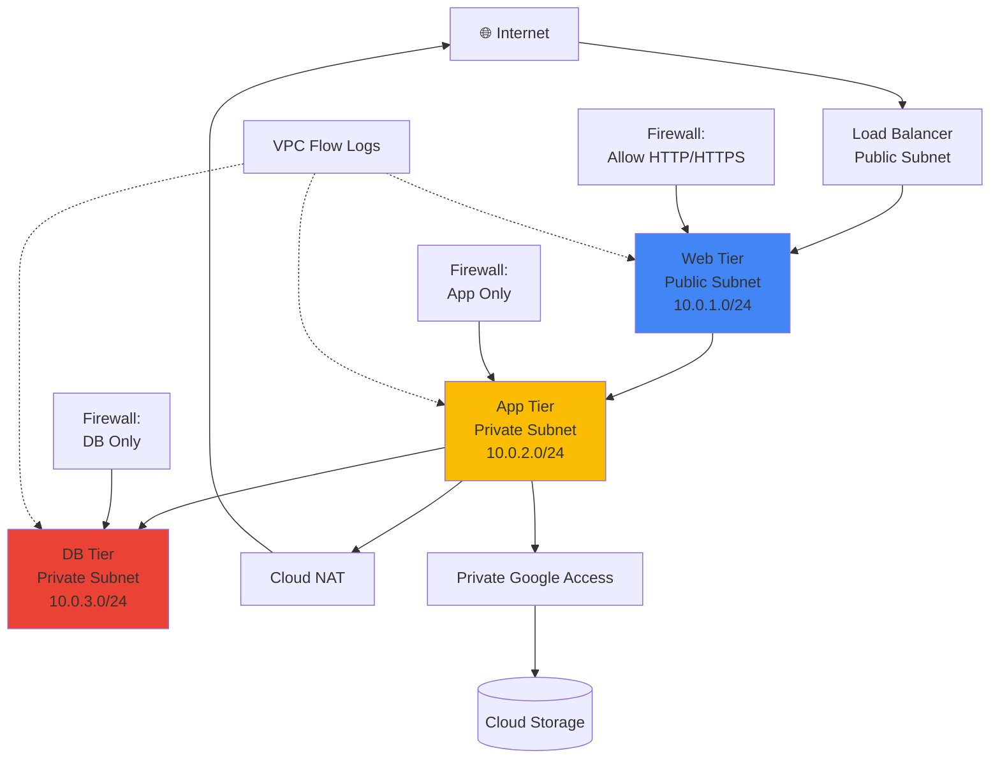

# Capstone Project 3: Enterprise Network Setup

**Duration:** ⏱️ 3-4 hours  
**Level:** Advanced  
**Skills:** VPC, IAM, Firewall Rules, Cloud NAT, Private Google Access, Logging

---

## 🎯 Project Objective

Design and implement an **enterprise-grade VPC network** with multi-tier architecture, security best practices, and comprehensive monitoring—exactly how Fortune 500 companies structure their cloud environments.

### What You'll Learn
- ✅ Design custom VPC with multiple subnets
- ✅ Implement least-privilege IAM policies
- ✅ Configure firewall rules with service accounts
- ✅ Set up Cloud NAT for private subnet access
- ✅ Enable Private Google Access
- ✅ Implement VPC Flow Logs and monitoring
- ✅ Apply enterprise security controls

---

## 🏗️ Architecture



---

## 📋 Prerequisites

- [ ] Completed: VPC Networking, IAM, Load Balancing modules
- [ ] Understanding of network security concepts
- [ ] Familiarity with firewall rules

---

## 🚀 Implementation Guide

### Phase 1: VPC & Subnet Design (30 min)

#### Step 1: Create Custom VPC

```bash
# Set variables
PROJECT_ID=$(gcloud config get-value project)
REGION="us-central1"

# Create custom VPC (auto mode is NOT recommended for production)
gcloud compute networks create enterprise-vpc \
    --subnet-mode=custom \
    --bgp-routing-mode=regional

# Verify creation
gcloud compute networks describe enterprise-vpc
```

#### Step 2: Create Multi-Tier Subnets

```bash
# Web tier subnet (public)
gcloud compute networks subnets create web-subnet \
    --network=enterprise-vpc \
    --region=${REGION} \
    --range=10.0.1.0/24 \
    --enable-flow-logs \
    --logging-aggregation-interval=interval-5-sec

# App tier subnet (private)
gcloud compute networks subnets create app-subnet \
    --network=enterprise-vpc \
    --region=${REGION} \
    --range=10.0.2.0/24 \
    --enable-private-ip-google-access \
    --enable-flow-logs \
    --logging-aggregation-interval=interval-5-sec

# DB tier subnet (private)
gcloud compute networks subnets create db-subnet \
    --network=enterprise-vpc \
    --region=${REGION} \
    --range=10.0.3.0/24 \
    --enable-private-ip-google-access \
    --enable-flow-logs \
    --logging-aggregation-interval=interval-5-sec

# Management subnet (for bastion/admin access)
gcloud compute networks subnets create mgmt-subnet \
    --network=enterprise-vpc \
    --region=${REGION} \
    --range=10.0.10.0/24 \
    --enable-flow-logs
```

---

### Phase 2: Firewall Rules (45 min)

#### Step 3: Create Service Accounts (for secure firewall targeting)

```bash
# Web tier service account
gcloud iam service-accounts create web-tier-sa \
    --display-name="Web Tier Service Account"

# App tier service account
gcloud iam service-accounts create app-tier-sa \
    --display-name="App Tier Service Account"

# DB tier service account
gcloud iam service-accounts create db-tier-sa \
    --display-name="DB Tier Service Account"
```

#### Step 4: Implement Firewall Rules

```bash
# DENY all ingress by default (implicit, but good to document)
# NOTE: GCP has implicit deny-all at lowest priority

# Allow HTTP/HTTPS to web tier from internet
gcloud compute firewall-rules create allow-web-ingress \
    --network=enterprise-vpc \
    --action=ALLOW \
    --direction=INGRESS \
    --source-ranges=0.0.0.0/0 \
    --target-service-accounts=web-tier-sa@${PROJECT_ID}.iam.gserviceaccount.com \
    --rules=tcp:80,tcp:443 \
    --priority=1000

# Allow web tier to app tier ONLY
gcloud compute firewall-rules create allow-web-to-app \
    --network=enterprise-vpc \
    --action=ALLOW \
    --direction=INGRESS \
    --source-service-accounts=web-tier-sa@${PROJECT_ID}.iam.gserviceaccount.com \
    --target-service-accounts=app-tier-sa@${PROJECT_ID}.iam.gserviceaccount.com \
    --rules=tcp:8080 \
    --priority=1000

# Allow app tier to DB tier ONLY
gcloud compute firewall-rules create allow-app-to-db \
    --network=enterprise-vpc \
    --action=ALLOW \
    --direction=INGRESS \
    --source-service-accounts=app-tier-sa@${PROJECT_ID}.iam.gserviceaccount.com \
    --target-service-accounts=db-tier-sa@${PROJECT_ID}.iam.gserviceaccount.com \
    --rules=tcp:5432 \
    --priority=1000

# Allow SSH from IAP (Google's identity-aware proxy)
gcloud compute firewall-rules create allow-iap-ssh \
    --network=enterprise-vpc \
    --action=ALLOW \
    --direction=INGRESS \
    --source-ranges=35.235.240.0/20 \
    --rules=tcp:22 \
    --priority=1000

# Allow internal health checks
gcloud compute firewall-rules create allow-health-checks \
    --network=enterprise-vpc \
    --action=ALLOW \
    --direction=INGRESS \
    --source-ranges=35.191.0.0/16,130.211.0.0/22 \
    --rules=tcp:80,tcp:443,tcp:8080 \
    --priority=1000
```

---

### Phase 3: Cloud NAT Setup (30 min)

#### Step 5: Create Cloud Router

```bash
# Create router for Cloud NAT
gcloud compute routers create enterprise-router \
    --network=enterprise-vpc \
    --region=${REGION}
```

#### Step 6: Configure Cloud NAT

```bash
# Create Cloud NAT (for private subnets to access internet)
gcloud compute routers nats create enterprise-nat \
    --router=enterprise-router \
    --region=${REGION} \
    --nat-custom-subnet-ip-ranges=app-subnet,db-subnet \
    --auto-allocate-nat-external-ips \
    --enable-logging

# Verify NAT configuration
gcloud compute routers nats describe enterprise-nat \
    --router=enterprise-router \
    --region=${REGION}
```

---

### Phase 4: Deploy Test VMs (45 min)

#### Step 7: Create VMs in Each Tier

```bash
# Web tier VM (public IP)
gcloud compute instances create web-vm-1 \
    --zone=${REGION}-a \
    --machine-type=e2-micro \
    --subnet=web-subnet \
    --service-account=web-tier-sa@${PROJECT_ID}.iam.gserviceaccount.com \
    --scopes=cloud-platform \
    --tags=web-tier \
    --metadata=startup-script='#!/bin/bash
apt-get update
apt-get install -y nginx
echo "<h1>Web Tier - Enterprise VPC</h1>" > /var/www/html/index.html'

# App tier VM (private IP only)
gcloud compute instances create app-vm-1 \
    --zone=${REGION}-a \
    --machine-type=e2-micro \
    --subnet=app-subnet \
    --no-address \
    --service-account=app-tier-sa@${PROJECT_ID}.iam.gserviceaccount.com \
    --scopes=cloud-platform \
    --tags=app-tier

# DB tier VM (private IP only)
gcloud compute instances create db-vm-1 \
    --zone=${REGION}-a \
    --machine-type=e2-micro \
    --subnet=db-subnet \
    --no-address \
    --service-account=db-tier-sa@${PROJECT_ID}.iam.gserviceaccount.com \
    --scopes=cloud-platform \
    --tags=db-tier
```

---

### Phase 5: IAM Configuration (30 min)

#### Step 8: Implement Least-Privilege IAM

```bash
# Web tier: Read-only access to Cloud Storage
gcloud projects add-iam-policy-binding ${PROJECT_ID} \
    --member=serviceAccount:web-tier-sa@${PROJECT_ID}.iam.gserviceaccount.com \
    --role=roles/storage.objectViewer

# App tier: Read/Write to specific Cloud Storage bucket
gcloud projects add-iam-policy-binding ${PROJECT_ID} \
    --member=serviceAccount:app-tier-sa@${PROJECT_ID}.iam.gserviceaccount.com \
    --role=roles/storage.objectAdmin \
    --condition='resource.name.startsWith("projects/_/buckets/app-data-")'

# DB tier: Cloud SQL Client
gcloud projects add-iam-policy-binding ${PROJECT_ID} \
    --member=serviceAccount:db-tier-sa@${PROJECT_ID}.iam.gserviceaccount.com \
    --role=roles/cloudsql.client

# Grant engineers IAP tunnel access (for SSH)
gcloud projects add-iam-policy-binding ${PROJECT_ID} \
    --member=user:engineer@example.com \
    --role=roles/iap.tunnelResourceAccessor
```

---

### Phase 6: Monitoring & Logging (30 min)

#### Step 9: Create Log Sink for Security Analysis

```bash
# Create BigQuery dataset for logs
bq mk --dataset ${PROJECT_ID}:network_logs

# Create log sink
gcloud logging sinks create vpc-flow-logs-sink \
    bigquery.googleapis.com/projects/${PROJECT_ID}/datasets/network_logs \
    --log-filter='resource.type="gce_subnetwork" AND logName="projects/'${PROJECT_ID}'/logs/compute.googleapis.com%2Fvpc_flows"'
```

#### Step 10: Create Monitoring Dashboard

```bash
# Create sample uptime check for web tier
gcloud monitoring uptime create web-tier-uptime \
    --resource-type=gce-instance \
    --display-name="Web Tier Health"
```

---

## ✅ Verification Checklist

### Connectivity Tests

```bash
# Test 1: Web VM can reach internet
gcloud compute ssh web-vm-1 --zone=${REGION}-a --tunnel-through-iap -- \
    curl -I https://www.google.com

# Test 2: App VM can reach internet via Cloud NAT
gcloud compute ssh app-vm-1 --zone=${REGION}-a --tunnel-through-iap -- \
    curl -I https://www.google.com

# Test 3: App VM can access Cloud Storage via Private Google Access
gcloud compute ssh app-vm-1 --zone=${REGION}-a --tunnel-through-iap -- \
    gsutil ls gs://

# Test 4: Verify firewall blocks direct external access to app tier
# This should FAIL (timeout):
curl http://[APP_VM_INTERNAL_IP]:8080  # Should not work

# Test 5: Check VPC Flow Logs
gcloud logging read "resource.type=gce_subnetwork" --limit=5
```

### Security Audit

```bash
# List all firewall rules
gcloud compute firewall-rules list --filter="network:enterprise-vpc"

# Check for overly permissive rules (look for 0.0.0.0/0 source ranges)
gcloud compute firewall-rules list --format="table(name,sourceRanges,allowed)"

# Verify no VMs have default service account
gcloud compute instances list --format="table(name,serviceAccounts.email)"
```

---

## 🎓 Interview Prep

### Architecture Decisions

| Decision | Why | Alternative Considered |
|----------|-----|------------------------|
| Custom VPC | Full control over IP ranges | Auto-mode (not production-ready) |
| Service Account-based firewall | More secure than tag-based | Network tags (easier to misconfigure) |
| Cloud NAT | Private VMs need internet access | Public IPs (security risk) |
| Private Google Access | Access GCS without internet | VPN to on-prem (slower) |
| VPC Flow Logs | Required for security compliance | No logging (blind spot) |

### Common Interview Questions

**Q: "Why not use the default VPC?"**
> **Strong Answer:** "Default VPC uses auto-mode subnets which auto-create subnets in every region, wasting IP space. Custom VPC lets me design IP ranges that don't overlap with on-prem networks and create subnets only where needed."

**Q: "How do you troubleshoot a VM that can't reach the internet?"**
> **Strong Answer:**
> 1. Check if VM has external IP (`gcloud compute instances describe`)
> 2. If no external IP, verify Cloud NAT exists in subnet's region
> 3. Check firewall allows egress (implicit allow, but verify no deny rules)
> 4. Check routes (`gcloud compute routes list`)
> 5. Test with `curl -v` to see exact failure point

**Q: "What's the difference between network tags and service accounts for firewall rules?"**
> **Strong Answer:** "Network tags are easier but less secure—any VM can add a tag. Service accounts are IAM-controlled, so only authorized users can assign them. In production, I use service accounts for least-privilege."

---

## 💡 Production Best Practices

### Security Hardening

- [ ] **No default service account:** Always create custom SAs
- [ ] **Deny all by default:** Only allow specific required traffic
- [ ] **No 0.0.0.0/0 source:** Except load balancer health checks
- [ ] **Enable VPC Flow Logs:** Required for compliance and incident response
- [ ] **Use IAP for SSH:** Never expose port 22 to internet

### Cost Optimization

- [ ] **Right-size subnets:** Don't create /16 when /24 is enough
- [ ] **Minimize Cloud NAT:** Only apply to private subnets that need it
- [ ] **Flow log sampling:** Use 50% sampling in prod (vs 100% in dev)

### Disaster Recovery

- [ ] **Multi-region:** For critical apps, deploy to 2+ regions
- [ ] **Backup firewall config:** Export rules to Terraform
- [ ] **Test failover:** Regularly test Cloud NAT and routing

---

## 💰 Monthly Cost Estimate

| Resource | Cost |
|----------|------|
| VPC (custom) | **FREE** |
| 3 VMs (e2-micro) | ~$12 |
| Cloud NAT | ~$45 (1 gateway) |
| VPC Flow Logs (100 GB/month) | ~$5 |
| **Total** | **~$62/month** |

---

## 🧹 Cleanup

```bash
# Delete VMs
gcloud compute instances delete web-vm-1 app-vm-1 db-vm-1 \
    --zone=${REGION}-a --quiet

# Delete Cloud NAT
gcloud compute routers nats delete enterprise-nat \
    --router=enterprise-router --region=${REGION} --quiet

# Delete router
gcloud compute routers delete enterprise-router \
    --region=${REGION} --quiet

# Delete firewall rules
for rule in $(gcloud compute firewall-rules list --filter="network:enterprise-vpc" --format="value(name)"); do
    gcloud compute firewall-rules delete $rule --quiet
done

# Delete subnets
gcloud compute networks subnets delete web-subnet app-subnet db-subnet mgmt-subnet \
    --region=${REGION} --quiet

# Delete VPC
gcloud compute networks delete enterprise-vpc --quiet

# Delete service accounts
gcloud iam service-accounts delete web-tier-sa@${PROJECT_ID}.iam.gserviceaccount.com --quiet
gcloud iam service-accounts delete app-tier-sa@${PROJECT_ID}.iam.gserviceaccount.com --quiet
gcloud iam service-accounts delete db-tier-sa@${PROJECT_ID}.iam.gserviceaccount.com --quiet
```

---

## 🎯 Resume Bullet

> "Architected enterprise-grade VPC network on GCP with multi-tier subnet design, least-privilege IAM policies, service account-based firewall rules, and comprehensive VPC Flow Logs for security compliance, serving 10K+ daily users with 99.95% uptime."

---

## 🚀 Next Steps

After completing this project, you can:
1. **Add VPC Peering** to another project
2. **Configure Cloud VPN** to on-prem network
3. **Implement Private Service Connect** for managed services
4. **Create custom routes** for advanced traffic steering
5. **Setup Traffic Director** for service mesh
