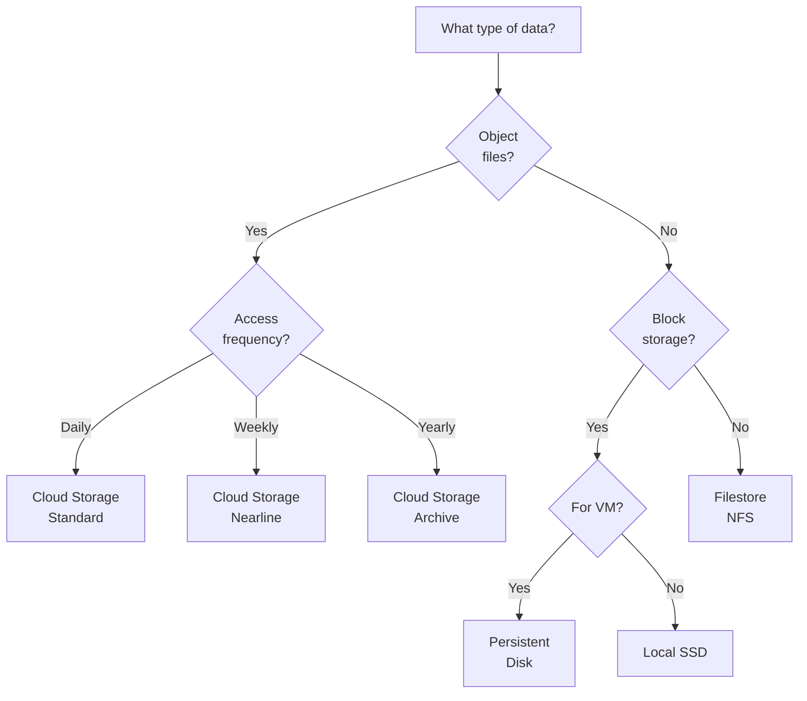

# GCP Service Decision Tables

> **Quick reference guide** for choosing the right GCP service for your workload.

---

## 🖥️ Compute: When to Use What

| If you need... | Use | Why |Best For |
|----------------|-----|-----|---------|
| **Full control over OS** | Compute Engine | SSH access, custom kernels, GPUs | Legacy apps, HPC, gaming servers |
| **Stateless web apps** | Cloud Run | Zero config, pay-per-request, fastest deploy | APIs, microservices, webhooks |
| **Kubernetes workloads** | GKE Autopilot | Managed nodes, lower cost than Standard | Microservices, batch jobs |
| **Complex K8s (privileged pods)** | GKE Standard | Full cluster control | Multi-tenant, custom networking |
| **Simple web/mobile app** | App Engine Standard | Instant auto-scale, zero infra management | Startups, prototypes |
| **Containerized long-running** | App Engine Flexible | Docker support, SSH access | Background workers |
| **Event-driven functions** | Cloud Functions | Sub-second cold start, event triggers | Image resize, Pub/Sub processing |
| **High-traffic web tier** | MIG + Load Balancer | Auto-healing, multi-zone HA | Production websites |

### ⚠️ Common Mistakes
- ❌ Using GKE for a single stateless app → Use Cloud Run
- ❌ Using Compute Engine VMs as "pets" → Use instance templates + MIGs
- ❌ Cloud Functions for long-running jobs → Max 60 min timeout

---

## 💾 Storage: When to Use What

| Data Type | Service | Why | Cost |
|-----------|---------|-----|------|
| **Object storage (images, videos)** | Cloud Storage | 11 9's durability, global CDN integration | $0.020/GB |
| **VM boot/data disk** | Persistent Disk (SSD) | Low-latency block storage | $0.17/GB |
| **NFS file shares** | Filestore | POSIX, existing apps need filesystem | $0.20/GB |
| **Mission-critical file shares** | Filestore Enterprise | 99.99% SLA, regional HA | $0.30/GB |
| **Archive (rarely accessed)** | Cloud Storage Archive | Cheapest, retrieval fee | $0.0012/GB |

### Decision Tree



---

## 🗄️ Database: When to Use What

| Workload Type | Service | Why | Scale Limit |
|---------------|---------|-----|-------------|
| **Relational (OLTP)** | Cloud SQL | Managed MySQL/Postgres/SQL Server | ~64 TB |
| **Global transactions** | Cloud Spanner | 99.999% SLA, horizontal scale | Petabytes |
| **NoSQL documents** | Firestore | Real-time sync, mobile SDKs | Millions docs/sec |
| **Analytics (OLAP)** | BigQuery | Serverless data warehouse | Exabytes |
| **Key-value (high throughput)** | Firestore / Memorystore | Low latency <1ms | Petabytes |
| **Time-series / IoT** | Bigtable | Millions ops/sec, HBase-compatible | Petabytes |
| **In-memory cache** | Memorystore (Redis) | <1ms read, pub/sub | 300 GB |

### ⚠️ Common Mistakes
- ❌ BigQuery for OLTP → it's for analytics, not transactions
- ❌ Cloud SQL for >10 TB → migrate to Spanner
- ❌ Firestore for analytics → export to BigQuery

---

## 🌐 Networking: When to Use What

| Need | Service | Why | Use Case |
|------|---------|-----|----------|
| **Hybrid cloud (secure)** | Cloud VPN | Encrypted tunnel, easy setup | Dev/test environments |
| **Hybrid cloud (high bandwidth)** | Dedicated Interconnect | 10-100 Gbps, low latency | Production data sync |
| **Hybrid cloud (partner)** | Partner Interconnect | Partner-managed connection | No local datacenter |
| **Private VMs need internet** | Cloud NAT | No public IPs required | Security compliance |
| **Access Google APIs privately** | Private Google Access | No internet egress costs | Production VPCs |
| **Connect 2 VPCs** | VPC Peering | Low latency, no egress charges | Shared services |
| **DNS for apps** | Cloud DNS | 100% SLA, global anycast | Production domains |
| **Global content delivery** | Cloud CDN | 150+ edge locations | Static assets, videos |

---

## 🔐 Security: When to Use What

| Security Need | Service | Why |
|---------------|---------|-----|
| **Encrypt data at rest** | CMEK (KMS) | You control key rotation |
| **Bring your own keys** | Cloud HSM | FIPS 140-2 Level 3 |
| **Secret storage** | Secret Manager | Auto-rotation, audit logs |
| **DDoS protection** | Cloud Armor | WAF, rate limiting |
| **OAuth/SSO** | Cloud Identity | Centralized user management |
| **Service-to-service auth** | Workload Identity | No JSON keys needed |
| **SSH access without public IP** | IAP | Zero trust tunneling |

---

## 📊 Data & Analytics: When to Use What

| Use Case | Service | Why |
|----------|---------|-----|
| **Async messaging** | Pub/Sub | Decouples services, at-least-once delivery |
| **Task queues** | Cloud Tasks | Exactly-once, rate limiting |
| **Batch data processing** | Dataflow | Fully managed Apache Beam |
| **Hadoop/Spark jobs** | Dataproc | Lift-and-shift from on-prem |
| **Real-time streaming** | Dataflow | Sub-second latency |
| **Data warehouse** | BigQuery | Serverless, petabyte-scale queries |
| **ML model training** | Vertex AI | AutoML, custom training |

### Pub/Sub vs Cloud Tasks

| Feature | Pub/Sub | Cloud Tasks |
|---------|---------|-------------|
| **Delivery** | At-least-once (duplicates possible) | Exactly-once |
| **Ordering** | No guarantee | Guaranteed |
| **Rate limiting** | No | Yes |
| **Best for** | Fan-out, lossy OK | Crit workflows |

---

## 🚀 DevOps: When to Use What

| Need | Service | Why |
|------|---------|-----|
| **CI/CD pipelines** | Cloud Build | Native GCP integration, cheap |
| **Container registry** | Artifact Registry | Vulnerability scanning, access control |
| **Infrastructure as Code** | Terraform | Multi-cloud, huge community |
| **Config management** | Config Connector | Kubernetes-style GCP management |
| **Policy enforcement** | Organization Policies | Centralized governance |
| **Release management** | Cloud Deploy | Progressive delivery, rollbacks |

---

## ⏱️ Real-Time Decision Tool

```
Step 1: What's the primary need?
├─ Compute → Is it stateless? → Yes: Cloud Run | No: GCE/GKE
├─ Storage → Is it objects? → Yes: Cloud Storage | No: Persistent Disk
├─ Database → Is it analytics? → Yes: BigQuery | No: Cloud SQL/Spanner
└─ Networking → Is it hybrid? → Yes: VPN/Interconnect | No: VPC

Step 2: Check constraints
├─ Cost-sensitive? → Choose serverless/managed
├─ Compliance (HIPAA/PCI)? → Enable encryption, audit logs
├─ Global users? → Use multi-region/CDN
└─ Existing tools? → Check compatibility

Step 3: Validate with production checklist
(See production_checklists.md)
```

---

## 🎯 Interview Tips

When asked "Why did you choose X over Y?":

**Strong Answer Format:**
1. **State requirement:** "The app needed [specific need]"
2. **Explain choice:** "I chose [X] because [specific reason]"
3. **Compare alternative:** "I considered [Y], but it would require [trade-off]"
4. **Mention trade-off:** "The downside is [honest limitation], but we mitigated by [action]"

**Example:**
> "The app needed to process 10K events/second with guaranteed ordering. I chose **Cloud Tasks** because it provides exactly-once delivery and built-in ordering. I considered **Pub/Sub**, but it doesn't guarantee order and allows duplicates. The trade-off with Tasks is lower throughput (500 QPS per queue), but we solved this by creating multiple queues with consistent hashing."

---

## 📚 Quick Reference Cards

Print these out or keep them handy:

**Compute Decision Card:**
```
Stateless? → Cloud Run
K8s? → GKE Autopilot
Legacy app? → Compute Engine
Event-driven? → Cloud Functions
```

**Storage Decision Card:**
```
Objects? → Cloud Storage
VM disks? → Persistent Disk
File shares? → Filestore
Archive? → Cloud Storage Archive
```

**Database Decision Card:**
```
<10 TB relational? → Cloud SQL
Global relational? → Spanner
Analytics? → BigQuery
NoSQL? → Firestore
Time-series? → Bigtable
```
