```mermaid
graph LR
    User[👤 User] --> CDN[Cloud CDN]
    CDN --> GCS[(Cloud Storage)]
    GCS --> Index[index.html]
    GCS --> Assets[CSS/JS/Images]
```

```mermaid
graph LR
    User[👤 Client] --> Run[Cloud Run]
    Run --> SQL[(Cloud SQL)]
    Run --> SM[Secret Manager]
    SM --> |DB Password| Run
```

```mermaid
graph LR
    Upload[📁 File Upload] --> GCS[(Cloud Storage)]
    GCS --> Notify[Pub/Sub Notification]
    Notify --> Topic[Pub/Sub Topic]
    Topic --> Sub[Subscription]
    Sub --> CF[Cloud Function]
    CF --> BQ[(BigQuery)]
    Sub --> DLQ[Dead Letter Queue]
```

# GCP Mini-Projects Portfolio

> **Build Your Portfolio:** Complete these projects to demonstrate real cloud engineering skills.

---

## 📋 Project Overview

| # | Project | Skills | Difficulty | Time |
|---|---------|--------|------------|------|
| 1 | Static Website Hosting | GCS, IAM, CDN | ⭐ Beginner | 30 min |
| 2 | Auto-Healing Web Cluster | MIG, Load Balancing, Health Checks | ⭐⭐ Intermediate | 60 min |
| 3 | Serverless API | Cloud Run, Secret Manager, Cloud SQL | ⭐⭐ Intermediate | 90 min |
| 4 | Event-Driven Pipeline | Pub/Sub, Cloud Functions, BigQuery | ⭐⭐⭐ Advanced | 120 min |
| 5 | Infrastructure as Code | Terraform, VPC, Compute | ⭐⭐⭐ Advanced | 90 min |

---

## 🌐 Project 1: Static Website Hosting

**Skills:** Cloud Storage, IAM, Signed URLs, (Optional) Cloud CDN

### Architecture



### Objectives
- [ ] Create a Cloud Storage bucket with website hosting
- [ ] Upload HTML/CSS files
- [ ] Configure public access via IAM
- [ ] Generate Signed URL for private asset
- [ ] (Bonus) Enable Cloud CDN

### Steps

```bash
# 1. Create bucket
gcloud storage buckets create gs://my-portfolio-site-$PROJECT_ID \
    --location=us-central1 \
    --uniform-bucket-level-access

# 2. Enable website hosting
gcloud storage buckets update gs://my-portfolio-site-$PROJECT_ID \
    --web-main-page-suffix=index.html \
    --web-error-page=404.html

# 3. Grant public access
gcloud storage buckets add-iam-policy-binding gs://my-portfolio-site-$PROJECT_ID \
    --member=allUsers \
    --role=roles/storage.objectViewer

# 4. Upload files
gcloud storage cp index.html gs://my-portfolio-site-$PROJECT_ID/
gcloud storage cp styles.css gs://my-portfolio-site-$PROJECT_ID/

# 5. Test
echo "Visit: https://storage.googleapis.com/my-portfolio-site-$PROJECT_ID/index.html"
```

### Success Criteria
- [ ] Website accessible via public URL
- [ ] CSS/images load correctly
- [ ] Signed URL works for private file

### 🎤 How to Explain This in an Interview
> **Problem:** "I needed a cost-effective way to host a static portfolio site."
>
> **Why GCS:** "Cloud Storage is pennies/month vs $7+/month for a VM. It scales automatically and integrates with CDN."
>
> **Trade-off:** "Public bucket is simple but less secure. For sensitive assets, I'd use Signed URLs or IAP."
>
> **What I'd improve:** "Add Cloud CDN for global latency, custom domain with Cloud DNS."

### ⚠️ What Can Break (& How to Fix)

| Failure Scenario | Cause | Fix |
|------------------|-------|-----|
| 403 Forbidden | Missing `allUsers` IAM binding | Add `Storage Object Viewer` role |
| CSS not loading | Incorrect Content-Type | Set proper MIME types on upload |
| Costs spiking | No lifecycle rules | Add lifecycle to delete old versions |

---

## 🖥️ Project 2: Auto-Healing Web Cluster

**Skills:** Instance Templates, Regional MIG, HTTP Load Balancer, Health Checks

### Architecture


### Objectives
- [ ] Create instance template with startup script
- [ ] Create Regional MIG with auto-healing
- [ ] Configure HTTP health check
- [ ] Set up Global HTTP(S) Load Balancer
- [ ] Test auto-healing by killing a VM

### Steps

```bash
# 1. Create instance template
gcloud compute instance-templates create web-template \
    --machine-type=e2-micro \
    --tags=http-server \
    --metadata=startup-script='#!/bin/bash
apt-get update && apt-get install -y apache2
HOSTNAME=$(hostname)
echo "<h1>Hello from $HOSTNAME</h1>" > /var/www/html/index.html
echo "OK" > /var/www/html/health'

# 2. Create health check
gcloud compute health-checks create http web-hc \
    --port=80 \
    --request-path=/health

# 3. Create Regional MIG
gcloud compute instance-groups managed create web-mig \
    --template=web-template \
    --size=3 \
    --region=us-central1 \
    --health-check=web-hc \
    --initial-delay=60

# 4. Create backend service
gcloud compute backend-services create web-backend \
    --global \
    --health-checks=web-hc \
    --port-name=http

# 5. Add MIG to backend
gcloud compute backend-services add-backend web-backend \
    --global \
    --instance-group=web-mig \
    --instance-group-region=us-central1

# 6. Test auto-healing
gcloud compute instances delete <VM_NAME> --zone=us-central1-a --quiet
watch gcloud compute instance-groups managed list-instances web-mig --region=us-central1
```

### Success Criteria
- [ ] Load balancer distributes traffic to all VMs
- [ ] Health check shows green for all instances
- [ ] Deleted VM auto-recreates within 2 minutes

### 🎤 How to Explain This in an Interview
> **Problem:** "I needed a web tier that survives zone failures and self-heals without manual intervention."
>
> **Why Regional MIG:** "Spreads VMs across 3 zones automatically. If one zone goes down, 2/3 capacity remains."
>
> **Trade-off:** "Regional MIG costs more than Zonal, but production SLA requires it. I'd use Zonal only for dev/test."
>
> **What I'd improve:** "Add Spot VMs in a separate node pool for cost savings, configure scheduled scaling for known traffic peaks."

### ⚠️ What Can Break (& How to Fix)

| Failure Scenario | Cause | Fix |
|------------------|-------|-----|
| VMs keep recreating | Health check path wrong | Verify `/health` returns 200 |
| Health checks failing | Firewall blocking probe IPs | Allow `35.191.0.0/16`, `130.211.0.0/22` |
| LB returns 502 | Backend not registered | Check `port-name` matches named port |
| VMs stuck CREATING | Quota exhausted | Request quota increase or reduce size |

---

## 🚀 Project 3: Serverless API with Cloud Run

**Skills:** Cloud Run, Secret Manager, Cloud SQL, Container Registry

### Architecture



### Objectives
- [ ] Create Cloud SQL instance
- [ ] Store credentials in Secret Manager
- [ ] Build and deploy API to Cloud Run
- [ ] Connect Run to SQL via private IP
- [ ] Test CRUD operations

### Steps

```bash
# 1. Create Cloud SQL instance
gcloud sql instances create demo-db \
    --database-version=POSTGRES_14 \
    --tier=db-f1-micro \
    --region=us-central1

# 2. Set password and store in Secret Manager
gcloud sql users set-password postgres \
    --instance=demo-db \
    --password=SuperSecret123

echo -n "SuperSecret123" | gcloud secrets create db-password --data-file=-

# 3. Build container (example Dockerfile needed)
gcloud builds submit --tag gcr.io/$PROJECT_ID/demo-api

# 4. Deploy to Cloud Run
gcloud run deploy demo-api \
    --image gcr.io/$PROJECT_ID/demo-api \
    --platform managed \
    --region us-central1 \
    --add-cloudsql-instances=$PROJECT_ID:us-central1:demo-db \
    --set-secrets=DB_PASS=db-password:latest
```

### Success Criteria
- [ ] API accessible via Cloud Run URL
- [ ] Database connection works
- [ ] Secret not exposed in logs or environment

### 🎤 How to Explain This in an Interview
> **Problem:** "I needed a scalable API that connects to a database without managing servers."
>
> **Why Cloud Run:** "Scales to zero when idle, container-based so I control the runtime, built-in HTTPS."
>
> **Trade-off:** "Cloud Run has cold starts. For latency-critical APIs, I'd set min-instances=1 (costs more)."
>
> **What I'd improve:** "Add Cloud Armor for DDoS protection, implement connection pooling for Cloud SQL."

### ⚠️ What Can Break (& How to Fix)

| Failure Scenario | Cause | Fix |
|------------------|-------|-----|
| Connection refused | Cloud SQL Auth Proxy not added | Use `--add-cloudsql-instances` flag |
| Secret not found | Wrong secret version | Use `:latest` or specific version number |
| Cold start > 10s | Large container image | Use distroless/alpine, reduce dependencies |
| 500 errors at scale | DB connection limit hit | Implement connection pooling |

---

## 📊 Project 4: Event-Driven Data Pipeline

**Skills:** Pub/Sub, Cloud Functions, BigQuery, Dead Letter Queue

### Architecture



### Objectives
- [ ] Create Pub/Sub topic with DLQ
- [ ] Configure GCS notifications
- [ ] Write Cloud Function to process files
- [ ] Load data into BigQuery
- [ ] Test error handling with DLQ

### Steps

```bash
# 1. Create topics
gcloud pubsub topics create file-events
gcloud pubsub topics create file-events-dlq

# 2. Create subscription with DLQ
gcloud pubsub subscriptions create file-sub \
    --topic=file-events \
    --dead-letter-topic=file-events-dlq \
    --max-delivery-attempts=5

# 3. Create BigQuery dataset
bq mk --dataset my_dataset

# 4. Create Cloud Function
gcloud functions deploy process-file \
    --gen2 \
    --runtime=python310 \
    --trigger-topic=file-events \
    --entry-point=process \
    --region=us-central1

# 5. Configure GCS notification
gcloud storage buckets notifications create gs://my-data-bucket \
    --topic=file-events
```

### Success Criteria
- [ ] Uploaded files trigger function
- [ ] Data appears in BigQuery
- [ ] Failed messages go to DLQ

### 🎤 How to Explain This in an Interview
> **Problem:** "I needed to process uploaded files automatically and load them into a data warehouse."
>
> **Why Pub/Sub:** "Decouples upload from processing. If BigQuery is slow, messages queue instead of failing."
>
> **Trade-off:** "At-least-once delivery means I handle duplicates. For exactly-once, I'd enable that feature."
>
> **What I'd improve:** "Add Dataflow for complex transformations, implement idempotent writes to BigQuery."

### ⚠️ What Can Break (& How to Fix)

| Failure Scenario | Cause | Fix |
|------------------|-------|-----|
| Backlog growing | Function too slow | Increase memory/CPU, batch writes |
| DLQ filling up | Malformed files | Add validation, improve error handling |
| Duplicate rows | At-least-once delivery | Use BigQuery MERGE or deduplication |
| Function timeout | Large files | Stream data, don't load all in memory |

---

## 🏗️ Project 5: Infrastructure as Code

**Skills:** Terraform, VPC, Subnets, Firewall Rules, Compute Engine

### Architecture


### Objectives
- [ ] Write Terraform config for custom VPC
- [ ] Create 2 subnets (web, database)
- [ ] Deploy VMs in each subnet
- [ ] Configure firewall rules
- [ ] Use remote state in GCS

### Files to Create

**main.tf:**
- Provider configuration
- VPC resource
- 2 Subnet resources
- 2 VM resources
- Firewall rules

**variables.tf:**
- project_id
- region
- environment

**backend.tf:**
- GCS remote state

### Success Criteria
- [ ] `terraform plan` shows expected resources
- [ ] `terraform apply` creates all resources
- [ ] VMs can communicate on internal IPs
- [ ] State stored in GCS bucket

### 🎤 How to Explain This in an Interview
> **Problem:** "I needed repeatable infrastructure that multiple team members could collaborate on."
>
> **Why Terraform:** "Multi-cloud, huge community, state management with locking prevents conflicts."
>
> **Trade-off:** "Terraform requires learning HCL. For GCP-only, Deployment Manager is an option but less popular."
>
> **What I'd improve:** "Add modules for reusability, implement Terragrunt for DRY configs, add policy checks with Sentinel."

### ⚠️ What Can Break (& How to Fix)

| Failure Scenario | Cause | Fix |
|------------------|-------|-----|
| State lock error | Concurrent runs | Wait for lock or break manually (carefully) |
| Drift detected | Manual console changes | Import changes or reset to known state |
| Destroy fails | Resource dependencies | Use `terraform destroy -target` carefully |
| API errors | APIs not enabled | Enable Compute API, IAM API first |

---

## 📝 Portfolio Submission Checklist

When showcasing these projects:

- [ ] Screenshot of working architecture
- [ ] GitHub repo with code
- [ ] Cost estimate (use Google Cloud Pricing Calculator)
- [ ] What I learned section
- [ ] Improvements I would make

### Resume Bullet Examples

> "Deployed auto-scaling web cluster on GCP with Regional MIG, achieving 99.9% uptime through auto-healing health checks"

> "Built event-driven data pipeline processing 10K+ events/day using Pub/Sub and Cloud Functions"

> "Implemented Infrastructure as Code with Terraform, reducing deployment time from 2 hours to 5 minutes"
