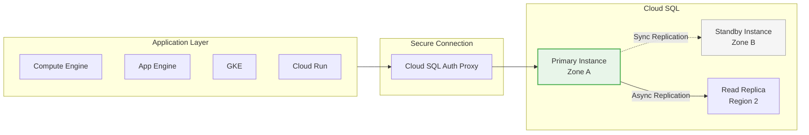
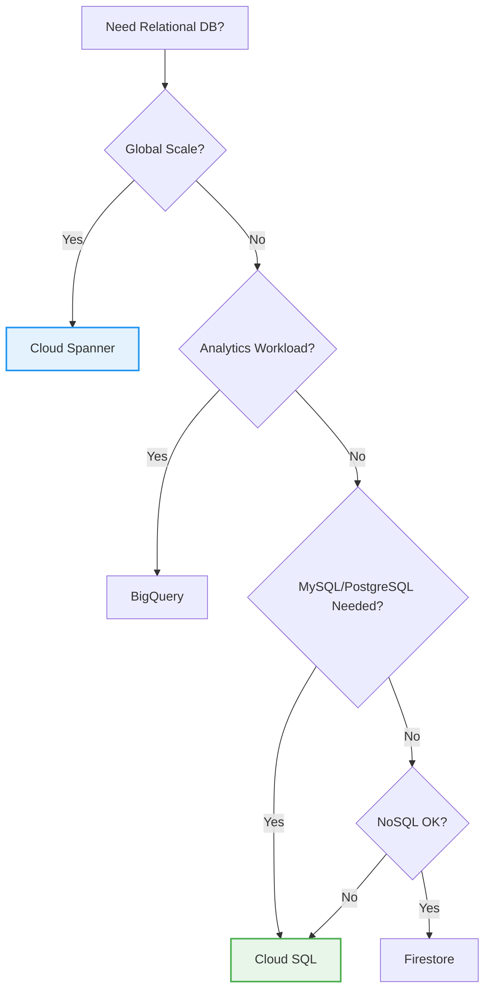

# Module 10: Cloud SQL Database

> **🎯 Objectives:**
> *   Master core concepts
> *   Build hands-on resources
> *   Pass the ACE exam scenarios

| 📚 Concepts | 🧪 Lab | 📝 Quiz | 💼 Interview |
|---|---|---|---|
| [Jump to Theory](#concepts) | [Jump to Lab](#hands-on-lab) | [Jump to Quiz](#knowledge-check) | [Jump to Interview](#interview-questions) |

---


> **🎯 Objectives:**
> *   Master core concepts
> *   Build hands-on resources
> *   Pass the ACE exam scenarios

| 📚 Concepts | 🧪 Lab | 📝 Quiz | 💼 Interview |
|---|---|---|---|
| [Jump to Theory](#concepts) | [Jump to Lab](#hands-on-lab) | [Jump to Quiz](#knowledge-check) | [Jump to Interview](#interview-questions) |

---


> **🎯 Objectives:**
> *   Master core concepts
> *   Build hands-on resources
> *   Pass the ACE exam scenarios

| 📚 Concepts | 🧪 Lab | 📝 Quiz | 💼 Interview |
|---|---|---|---|
| [Jump to Theory](#concepts) | [Jump to Lab](#hands-on-lab) | [Jump to Quiz](#knowledge-check) | [Jump to Interview](#interview-questions) |

---


**Duration:** ⏱️ 60 Minutes  
**Level:** Intermediate  
**ACE Exam Weight:** ⭐⭐⭐⭐ High (Database selection is heavily tested)

---

> [!TIP]
> **TL;DR (Cloud SQL Essentials)**  
> Cloud SQL = Fully managed MySQL, PostgreSQL, or SQL Server. Google handles patching, backups, and failover. **Read Replicas** improve READ performance. **Vertical scaling** (more CPU/RAM) improves WRITE performance. Cloud SQL is **regional** (max 64TB). Need global? Use **Cloud Spanner**. Always connect via **Cloud SQL Auth Proxy** for security.

---

## 🎯 Learning Objectives

| ✅ Skill | Why It Matters |
|---------|----------------|
| **Explain** managed vs self-managed | Understand the operational benefits |
| **Select** the right database engine | MySQL, PostgreSQL, or SQL Server |
| **Implement** HA and Read Replicas | Production-ready configurations |
| **Connect** securely via Auth Proxy | Security best practice |
| **Compare** Cloud SQL vs Spanner vs BigQuery | Pick the right service |

---

## 🧠 1. What is Cloud SQL? (Plain-English)

**Cloud SQL = You focus on data, Google handles everything else.**

### What Google Manages

| Task | Self-Managed VM | Cloud SQL |
|------|----------------|-----------|
| OS Patching | ❌ You | ✅ Google |
| Database Patching | ❌ You | ✅ Google |
| Backups | ❌ You | ✅ Automated daily |
| Failover | ❌ You | ✅ Automatic HA |
| Scaling | ❌ You | ✅ One-click |
| Security | ❌ You | ✅ Encryption at rest |

### 💡 Real-World Analogy: Hiring a DBA

| MySQL on VM | Cloud SQL |
|-------------|-----------|
| You're the janitor, driver, and chef | You hired a 24/7 expert DBA (Google) |
| 3 AM crash = you wake up | Google handles the fires |
| You manage everything | You focus on writing app code |

---

## 🏗️ 2. Cloud SQL Architecture



### Supported Engines

| Engine | Version | Use Case |
|--------|---------|----------|
| **MySQL** | 5.7, 8.0 | Most common, WordPress, Laravel |
| **PostgreSQL** | 9.6 - 15 | Advanced features, GIS, JSON |
| **SQL Server** | 2017, 2019 | .NET apps, Microsoft stack |

---

## ⚖️ 3. Database Selection Matrix

### Cloud SQL vs Spanner vs BigQuery

| Requirement | Cloud SQL | Spanner | BigQuery |
|-------------|-----------|---------|----------|
| **Scale** | Regional (~64TB) | Global (unlimited) | Petabytes |
| **Transactions** | ✅ ACID | ✅ ACID + Global | Limited |
| **SQL** | Standard | Standard + extensions | Standard |
| **Use Case** | Web apps, ERP | Global finance, inventory | Analytics, BI |
| **Cost** | $$ | $$$$ | Pay per query |
| **Exam Keywords** | "Lift & shift", "MySQL" | "Global", "Horizontal" | "Warehouse", "OLAP" |

### Decision Tree



---

## 🔄 4. High Availability & Scaling

### HA Configuration

| Configuration | Description | Use Case |
|--------------|-------------|----------|
| **Single Zone** | One instance, one zone | Dev/Test |
| **High Availability** | Primary + standby in different zones | Production |
| **Cross-Region Replica** | Read replica in different region | Disaster recovery |

### Scaling Options

| Need | Solution |
|------|----------|
| More Write Performance | Vertical scaling (increase CPU/RAM) |
| More Read Performance | Add Read Replicas |
| Global Reads | Cross-region replicas |
| Beyond 64TB | Migrate to Cloud Spanner |

> **🎯 ACE Tip:** Read Replicas only help with READ performance. For WRITE performance, you must vertically scale the primary instance.

---

## 🛠️ 5. Hands-On Lab: Create & Query Cloud SQL

### Step 1: Create Instance
```bash
gcloud sql instances create hero-db \
    --database-version=MYSQL_8_0 \
    --tier=db-f1-micro \
    --region=us-central1 \
    --root-password=SecurePassword123!
```

### Step 2: Connect via Cloud SQL Proxy
```bash
# Enable the API
gcloud services enable sqladmin.googleapis.com

# Connect using built-in proxy
gcloud sql connect hero-db --user=root
```

### Step 3: Create Database and Table
```sql
CREATE DATABASE hero_corp;
USE hero_corp;

CREATE TABLE users (
    id INT PRIMARY KEY AUTO_INCREMENT,
    name VARCHAR(100),
    email VARCHAR(100),
    created_at TIMESTAMP DEFAULT CURRENT_TIMESTAMP
);

INSERT INTO users (name, email) VALUES ('GCP Student', 'student@gcp.com');
SELECT * FROM users;
```

### Step 4: Enable HA (Optional)
```bash
gcloud sql instances patch hero-db \
    --availability-type=REGIONAL \
    --backup-start-time=02:00
```

### Step 5: Cleanup
```bash
gcloud sql instances delete hero-db --quiet
```

---

## ⚠️ 6. Exam Traps & Pro Tips

### ❌ Common Mistakes
| Mistake | Reality |
|---------|---------|
| "Read replicas improve writes" | No! Only vertical scaling improves writes |
| "Cloud SQL is global" | No! Cloud SQL is regional (use Spanner for global) |
| "Use public IP in production" | No! Use Cloud SQL Proxy or Private IP |

### ✅ Pro Tips
*   **Always enable automated backups** with point-in-time recovery
*   **Use Cloud SQL Auth Proxy** for secure connections
*   **Enable Private IP** for production databases
*   **Set maintenance windows** during low-traffic periods

---

<!-- QUIZ_START -->
## 📝 7. Knowledge Check Quiz

1. **Which of these is NOT a managed feature of Cloud SQL?**
    *   A. Automated backups
    *   B. OS Patching
    *   C. **Writing SQL Queries** ✅
    *   D. High Availability failover

2. **A global retail company needs a relational database with horizontal scaling across US, Europe, and Asia. Which service?**
    *   A. Cloud SQL
    *   B. **Cloud Spanner** ✅
    *   C. Bigtable
    *   D. BigQuery

3. **Your Cloud SQL database is slow due to too many SELECT queries. What should you add?**
    *   A. More CPU to primary
    *   B. **Read Replicas** ✅
    *   C. Cloud CDN
    *   D. More RAM to primary

4. **What is the most secure way to connect to Cloud SQL from a GKE pod?**
    *   A. Public IP with firewall
    *   B. VPN tunnel
    *   C. **Cloud SQL Auth Proxy** ✅
    *   D. SSH tunnel

5. **Your write performance is poor on Cloud SQL. What should you do?**
    *   A. Add read replicas
    *   B. **Vertically scale (increase CPU/RAM)** ✅
    *   C. Add more databases
    *   D. Enable Cloud CDN
<!-- QUIZ_END -->

---

## ✅ Day 10 Checklist

- [ ] Know the 3 supported database engines
- [ ] Understand Cloud SQL vs Spanner use cases
- [ ] Connect to Cloud SQL via Cloud Shell
- [ ] Understand Read Replicas vs Vertical Scaling
- [ ] Complete the hands-on lab

---

<!-- FLASHCARDS
[
  {"term": "Cloud SQL", "def": "Managed relational database. Supports MySQL, PostgreSQL, SQL Server. Regional only."},
  {"term": "Read Replica", "def": "Additional read-only copy of database. Improves read performance, not writes."},
  {"term": "Cloud SQL Auth Proxy", "def": "Secure way to connect to Cloud SQL. Handles authentication and encryption."},
  {"term": "High Availability", "def": "Primary + standby in different zones. Automatic failover if primary fails."},
  {"term": "Vertical Scaling", "def": "Increase CPU/RAM of instance. The only way to improve write performance."},
  {"term": "Cloud Spanner", "def": "Global relational database with horizontal scaling. Use when Cloud SQL is too small."}
]
-->
---

### 🗑️ Lab Cleanup (Mandatory)

> **⚠️ Critical:** Delete resources to avoid unecessary billing!

1.  **Delete Project:** (Fastest way)
    ```bash
    gcloud projects delete $PROJECT_ID
    ```
2.  **Or Delete Resources Individually:**
    ```bash
    # Example commands (verify before running)
    gcloud compute instances delete [INSTANCE_NAME] --quiet
    gcloud storage rm -r gs://[BUCKET_NAME]
    ```