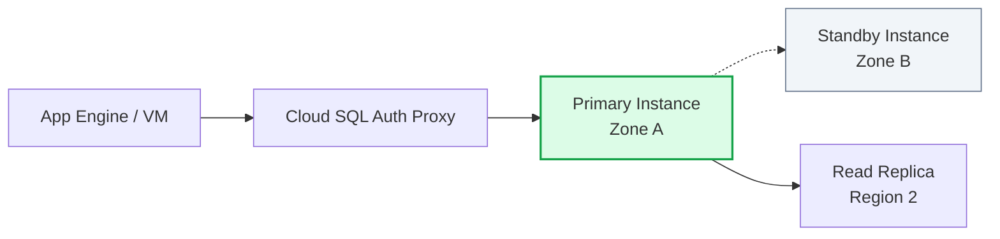

# Day 10: Cloud SQL (Managed Relational Databases)

**Duration:** ⏱️ 45 Minutes  
**Level:** Intermediate  
**ACE Exam Weight:** ⭐⭐⭐⭐ High (Critical for Lift & Shift)

---

## 🎯 Learning Objectives

By the end of Day 10, you will be able to:
*   **Explain** the benefits of managed databases vs. self-managed VMs.
*   **Select** the right database engine (MySQL, PostgreSQL, SQL Server).
*   **Implement** High Availability (HA) and Read Replicas.
*   **Connect** securely to a database from Cloud Shell.

---

## 🧠 1. What is Cloud SQL?

**Cloud SQL** is a fully managed service that takes the "pain" out of database administration.

### What Google Manages for You
*   ✅ **Auto-Backups:** Daily snapshots of your data.
*   ✅ **Patching:** Google updates the OS and the Database Engine automatically.
*   ✅ **Failover:** If the primary zone fails, traffic is moved to a standby instance.
*   ✅ **Scaling:** Increase CPU or Storage with a few clicks.



---

## 👔 2. The Analogy: Hiring an Expert DBA

*   **MySQL on a VM:** You are the janitor, the driver, and the chef. If the server crashes at 3 AM, **you** wake up.
*   **Cloud SQL:** You **hired a 24/7 Expert DBA (Google)**. 
    *   You give them the keys (Config).
    *   They handle the maintenance, the fires, and the security.
    *   You focus on writing the app code.

---

## ⚖️ 3. The SQL Decision Matrix

Choosing the right database is a major part of the ACE exam.

| Service | Best For | Scale | Exam Keyword |
| :--- | :--- | :--- | :--- |
| **Cloud SQL** | Blogs, ERP, Standard Web Apps. | Regional (~64TB) | "Lift & Shift", "MySQL/Postgres". |
| **Cloud Spanner** | Global Finance, Inventory. | **Global** (Unlimited) | "Horizontal Scale", "Global Consistency". |
| **BigQuery** | Analytics, Data Mining. | Petabytes | "Warehouse", "OLAP", "Large Datasets". |

> [!IMPORTANT]
> **Read Performance:** If your app is slow because of too many "SELECT" queries, add a **Read Replica**. This creates a second copy of your database dedicated to reading data.

---

## 🛠️ 4. Hands-On Lab: Your First Managed DB

**🧪 Lab Objective:** Create a MySQL instance and run your first query.

### ✅ Step 1: Create the Instance
1.  Go to **SQL** in the Console.
2.  Click **Create Instance** and select **MySQL**.
3.  Instance ID: `hero-db-1`.
4.  **Configuration:** Choose **Enterprise** (Standard).
5.  **Location:** **Single Zone** (to save money for the lab).

### ✅ Step 2: Set the Password
Choose a root password and **copy it somewhere safe**.

### ✅ Step 3: Secure Connection
1.  Once the instance is ready, click **Connect using Cloud Shell**.
2.  Run:
    ```bash
    gcloud sql connect hero-db-1 --user=root --quiet
    ```
3.  Enter your password.
4.  Create a table:
    ```sql
    CREATE DATABASE hero_corp;
    USE hero_corp;
    CREATE TABLE users (id INT, name VARCHAR(50));
    INSERT INTO users VALUES (1, 'GCP Student');
    SELECT * FROM users;
    ```

> [!WARNING]
> **Cloud SQL Auth Proxy:** In production, never use Public IPs for your DB. Use the **Cloud SQL Auth Proxy** or **Private Service Access** for a secure, encrypted connection.

---

## 📝 5. Checkpoint Quiz

1.  **Which of these is NOT a managed feature of Cloud SQL?**
    *   A. Automated backups
    *   B. OS Patching
    *   C. **Writing SQL Queries** ✅ (That's your job!)
    *   D. High Availability failover

2.  **A global retail company needs a relational database that can scale horizontally across the US, Europe, and Asia with strong consistency. Which should they use?**
    *   A. Cloud SQL
    *   B. **Cloud Spanner** ✅
    *   C. Cloud Bigtable
    *   D. BigQuery

3.  **True or False: To increase the write performance of a single Cloud SQL instance, you should add more Read Replicas.**
    *   *Answer:* **False.** Read Replicas only help with READS. To increase WRITE performance, you must **Vertically Scale** (increase CPU/RAM).

---

<div class="checklist-card" x-data="{ 
    items: [
        { text: 'I know the 3 engines supported by Cloud SQL.', checked: false },
        { text: 'I understand when to choose Spanner over Cloud SQL.', checked: false },
        { text: 'I successfully ran a query in a managed SQL instance.', checked: false },
        { text: 'I know that Read Replicas are for scaling read traffic.', checked: false }
    ]
}">
    <h3>
        <svg viewBox="0 0 24 24" fill="none" stroke="currentColor" stroke-width="2" stroke-linecap="round" stroke-linejoin="round" width="24" height="24" class="text-blurple">
            <path d="M22 11.08V12a10 10 0 1 1-5.93-9.14"></path>
            <polyline points="22 4 12 14.01 9 11.01"></polyline>
        </svg>
        Day 10 Checklist
    </h3>
    <template x-for="(item, index) in items" :key="index">
        <div class="checklist-item" @click="item.checked = !item.checked">
            <div class="checklist-box" :class="{ 'checked': item.checked }">
                <svg viewBox="0 0 24 24" fill="none" stroke="currentColor" stroke-width="3" stroke-linecap="round" stroke-linejoin="round">
                    <polyline points="20 6 9 17 4 12"></polyline>
                </svg>
            </div>
            <span x-text="item.text" :class="{ 'line-through text-slate-400': item.checked }"></span>
        </div>
    </template>
</div>
