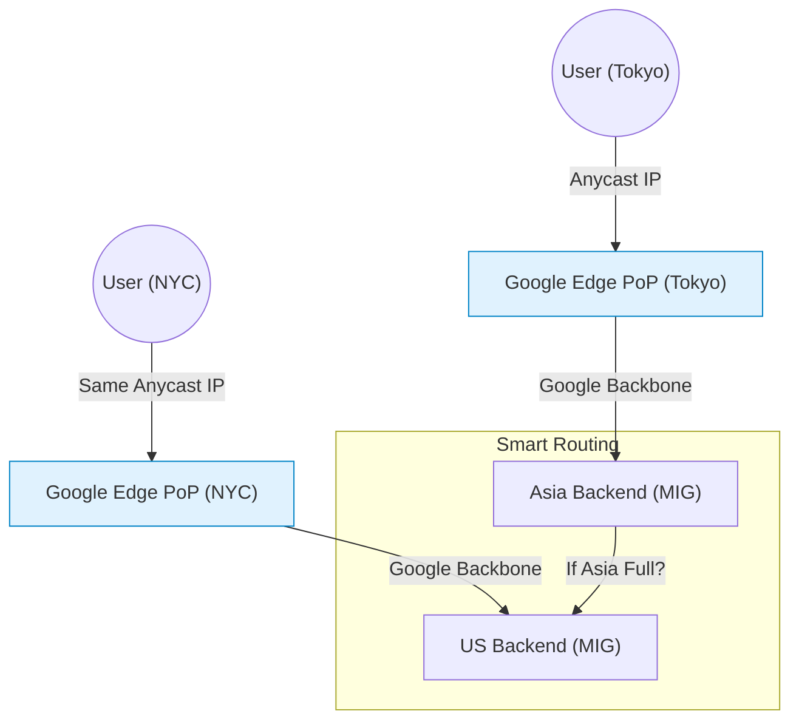

# SECTION 10: Load Balancing

> **Official Doc Reference**: [Cloud Load Balancing](https://cloud.google.com/load-balancing/docs)

## 1️⃣ Overview: The Single Global IP
Google Cloud Load Balancing (GCLB) is a fully distributed, software-defined managed service. It is not a physical hardware device in a rack.
*   **Global Scope**: You get **One Single Anycast IP** for the entire world.
*   **No Pre-Warming**: It handles 1 million+ requests per second instantly. (Unlike AWS ALB which needs scaling).
*   **Self-Healing**: If a VM dies, the LB stops sending it traffic immediately.

## 2️⃣ The "Decision Tree" (Exam Critical 🚨)
Choosing the right Load Balancer is 50% of the networking exam questions.

| Layer | Protocol | Scope | Type | **Use This When...** |
| :--- | :--- | :--- | :--- | :--- |
| **Layer 7** | HTTP(S) | Global | **External HTTP(S) LB** | You have a Website, API, or need SSL termination. |
| **Layer 4** | TCP/UDP | Global | **External TCP/UDP Proxy** | You have a Gaming users or Non-HTTP Global App. |
| **Layer 4** | TCP/UDP | Regional | **External Network LB** | You need to pass-through "Encrypted Traffic" untouched. |
| **Layer 7** | HTTP(S) | Regional | **Internal HTTP(S) LB** | You have a Microservice talking to another Microservice. |

## 3️⃣ Architecture Diagram (Global Traffic Flow)


*   **Magical Feature:** If the Asia datacenter burns down, the LB automatically routes Tokyo users to the US Backend.

## 4️⃣ Lab Mission: "The Viral Website" 👨‍💻
**Scenario:** You start a cat meme website. Suddenly, it goes viral in Japan and the US. Your single server climbs to 100% CPU and crashes.
**Mission:** Create a Global Load Balancer that routes US users to US servers and Japan users to Asia servers.

### Task 1: Create the Instance Template (The Blueprint)
```bash
gcloud compute instance-templates create web-server-template \
    --machine-type=e2-micro \
    --metadata=startup-script='#! /bin/bash
    apt-get update
    apt-get install -y apache2
    echo "Hello from $(hostname)" > /var/www/html/index.html'
```

### Task 2: Create Managed Instance Groups (The Fleet)
```bash
# US Fleet
gcloud compute instance-groups managed create us-fleet \
    --template=web-server-template --size=2 --zone=us-central1-a

# Asia Fleet
gcloud compute instance-groups managed create asia-fleet \
    --template=web-server-template --size=2 --zone=asia-east1-a
```

### Task 3: The Load Balancer Setup
1.  **Health Check:** "Are you alive?"
    `gcloud compute health-checks create http http-basic-check`
2.  **Backend Service:** The Logic.
    `gcloud compute backend-services create my-web-backend --protocol=HTTP --global`
3.  **Add Backends:** Link the fleets.
    `gcloud compute backend-services add-backend my-web-backend --instance-group=us-fleet --global`
    `gcloud compute backend-services add-backend my-web-backend --instance-group=asia-fleet --global`
4.  **URL Map:** The Rules.
    `gcloud compute url-maps create my-url-map --default-service=my-web-backend`

## 5️⃣ Zero-to-Hero: Pro Tips ⚡
*   **Session Affinity:** If you need a user to stick to the same server (e.g. Shopping Cart), enable "Cookie Affinity".
*   **CDN Integration:** Click one button ("Enable Cloud CDN") on the Backend Service to cache static assets globally.
*   **SSL Certificates:** Use **Google-managed SSL certificates**. Google automatically provisions and renews the TLS cert for your domain.

## 6️⃣ Exam Traps 🚨
*   **Trap:** "I need to terminate SSL certification to offload CPU from my VMs."
    *   *Answer:* Use **HTTP(S) Load Balancer**. It terminates SSL at the Edge (Google's PoP), so your VMs only see plain HTTP.
*   **Trap:** "I need to see the client's original IP address on my server."
    *   *Answer:* The LB proxies traffic, so the "Source IP" becomes Google's IP. You MUST look at the **`X-Forwarded-For`** header to see the real user IP.

## 7️⃣ Checkpoint Questions (Exam Style)
**Q1. You are building a global gaming application using UDP. Which Load Balancer do you choose?**
*   A. HTTP(S) Load Balancer
*   B. TCP Proxy Load Balancer
*   C. UDP Proxy Load Balancer
*   D. Internal Network Load Balancer
> **Answer: C.** (Or "External TCP/UDP Network LB"). HTTP LB only supports generic HTTP.

**Q2. Your website is under a DDoS attack. You want to block traffic from a specific country at the edge. What do you use with your Load Balancer?**
*   A. VPC Firewall Rules
*   B. Cloud Armor
*   C. Cloud NAT
*   D. Identity-Aware Proxy
> **Answer: B.** Cloud Armor is the WAF (Web App Firewall) that attaches to the LB to block attacks.

**Q3. Does a Global HTTPS Load Balancer require "Pre-Warming" before a flash sale?**
*   A. Yes, contact support 24h prior.
*   B. No, it scales instantly.
*   C. Only if using Cloud CDN.
*   D. Yes, for TCP but not UDP.
> **Answer: B.** Unlike AWS ELB/ALB, Google's LBs do not require pre-warming.

**Q4. Where is SSL terminated when using a Google HTTPS Load Balancer?**
*   A. At the VM Instance
*   B. At the Regional data center
*   C. At the Global Edge (Point of Presence)
*   D. It is not terminated (Passthrough)
> **Answer: C.** SSL is terminated at the PoP, closest to the user.


<!-- FLASHCARDS
[
  {
    "term": "Load Balancer",
    "def": "Distributes traffic across multiple VMs to prevent overloading."
  },
  {
    "term": "Global HTTP(S) LB",
    "def": "Layer 7 LB. Terminates SSL. Good for web apps."
  },
  {
    "term": "Network LB",
    "def": "Layer 4 LB. TCP/UDP traffic. Ultra low latency."
  },
  {
    "term": "Health Check",
    "def": "Pings instances to see if they are alive. Removes dead ones."
  },
  {
    "term": "Backend Service",
    "def": "The group of instances the LB sends traffic to."
  }
]
-->
