# Day 11: Cloud Storage Advanced (Lifecycle & Security)

**Duration:** ⏱️ 60 Minutes  
**Level:** Intermediate  
**ACE Exam Weight:** ⭐⭐⭐⭐ High (Essential for cost & security questions)

---

## 🎯 Learning Objectives

By the end of Day 11, you will be able to:

*   **Automate** cost savings with Object Lifecycle Management
*   **Protect** data with Object Versioning
*   **Implement** secure temporary access with Signed URLs
*   **Apply** Retention Policies and Bucket Lock for compliance
*   **Compare** storage classes and choose appropriately

---

## 🧠 1. Storage Classes Recap

### Cost vs Access Time Tradeoff

| Class | Min Duration | Use Case | Cost (per GB) |
|-------|--------------|----------|---------------|
| **Standard** | None | Frequently accessed data | $$$ |
| **Nearline** | 30 days | Monthly access | $$ |
| **Coldline** | 90 days | Quarterly access | $ |
| **Archive** | 365 days | Yearly access | ¢ |

### The Key Insight
```
Storage Cost: Standard > Nearline > Coldline > Archive
Retrieval Cost: Archive > Coldline > Nearline > Standard
```

> **🎯 ACE Tip:** If data is accessed frequently, Standard is cheapest. If rarely accessed, Archive is cheapest.

---

## 🔄 2. Object Lifecycle Management

**Automate storage class transitions and deletions to save money.**

### Lifecycle State Machine

```mermaid
flowchart LR
    STD[Standard] -->|30 days| NL[Nearline]
    NL -->|60 days| CL[Coldline]
    CL -->|275 days| AR[Archive]
    AR -->|10 years| DEL[❌ Delete]
    
    style STD fill:#fee2e2,stroke:#ef4444
    style NL fill:#fff7ed,stroke:#ea580c
    style CL fill:#dbeafe,stroke:#2563eb
    style AR fill:#e0e7ff,stroke:#4338ca
```



### Lifecycle Rule Actions

| Action | Description |
|--------|-------------|
| **SetStorageClass** | Move to cheaper class |
| **Delete** | Permanently remove object |
| **AbortIncompleteUpload** | Clean up failed uploads |

### Lifecycle Rule Conditions

| Condition | Example |
|-----------|---------|
| **Age** | Object is >30 days old |
| **CreatedBefore** | Object created before 2023-01-01 |
| **NumNewerVersions** | >3 newer versions exist |
| **IsLive** | Is latest version (not archived) |

### Create Lifecycle Policy
```bash
# Create lifecycle.json
cat > lifecycle.json << 'EOF'
{
  "lifecycle": {
    "rule": [
      {
        "action": {"type": "SetStorageClass", "storageClass": "NEARLINE"},
        "condition": {"age": 30}
      },
      {
        "action": {"type": "SetStorageClass", "storageClass": "COLDLINE"},
        "condition": {"age": 90}
      },
      {
        "action": {"type": "Delete"},
        "condition": {"age": 365}
      }
    ]
  }
}
EOF

# Apply to bucket
gcloud storage buckets update gs://my-bucket --lifecycle-file=lifecycle.json
```

---

## 🛡️ 3. Object Versioning

**Keep previous versions of objects for recovery and audit.**

### How Versioning Works


### Enable Versioning
```bash
# Enable versioning
gcloud storage buckets update gs://my-bucket --versioning

# List all versions
gcloud storage ls --all-versions gs://my-bucket/

# Restore previous version
gcloud storage cp gs://my-bucket/file#1234567890 gs://my-bucket/file
```

### ⚠️ The Cost Trap

| Scenario | Storage Paid |
|----------|-------------|
| 1GB file, no versioning | 1 GB |
| 1GB file, 10 versions | **10 GB** |
| 1GB file, 24 daily versions | **24 GB** |

**Solution:** Combine with lifecycle rule to delete old versions:
```json
{
  "action": {"type": "Delete"},
  "condition": {"numNewerVersions": 3}
}
```

---

## ✍️ 4. Signed URLs (Temporary Access)

**Grant time-limited access without requiring Google accounts.**

### How Signed URLs Work


### Signed URL Properties

| Property | Description |
|----------|-------------|
| **Expiration** | 1 minute to 7 days |
| **Method** | GET, PUT, DELETE (one per URL) |
| **Self-authenticating** | URL contains signature |
| **No account needed** | Works for anyone with the URL |

### Generate Signed URL
```bash
# Generate download URL (valid 1 hour)
gcloud storage sign-url gs://my-bucket/secret-file.pdf \
    --duration=1h \
    --private-key-file=service-account.json

# Generate upload URL
gcloud storage sign-url gs://my-bucket/uploads/ \
    --duration=15m \
    --http-verb=PUT \
    --private-key-file=service-account.json
```

---

## 🔒 5. Retention Policies & Bucket Lock

**For compliance: Ensure data cannot be deleted.**

### Comparison

| Feature | Retention Policy | Bucket Lock |
|---------|-----------------|-------------|
| **Purpose** | Minimum hold period | Permanent enforcement |
| **Modifiable** | Yes (can extend or remove) | **No (irreversible)** |
| **Use Case** | Soft compliance | Legal/regulatory hold |

### Configure Retention
```bash
# Set 1-year retention
gcloud storage buckets update gs://my-bucket \
    --retention-period=365d

# Lock bucket (IRREVERSIBLE!)
gcloud storage buckets update gs://my-bucket --lock-retention-policy
```

> **⚠️ Warning:** Bucket Lock is **permanent**. Once locked, policy cannot be removed until retention period expires.

---

## 🛠️ 6. Hands-On Lab: Lifecycle & Versioning

### Step 1: Create Bucket with Versioning
```bash
gcloud storage buckets create gs://my-advanced-bucket-${PROJECT_ID} \
    --location=us-central1 \
    --versioning
```

### Step 2: Test Versioning
```bash
# Create initial file
echo "Version 1" > test.txt
gcloud storage cp test.txt gs://my-advanced-bucket-${PROJECT_ID}/

# Create version 2
echo "Version 2" > test.txt
gcloud storage cp test.txt gs://my-advanced-bucket-${PROJECT_ID}/

# List all versions
gcloud storage ls --all-versions gs://my-advanced-bucket-${PROJECT_ID}/
```

### Step 3: Add Lifecycle Policy
```bash
cat > lifecycle.json << 'EOF'
{
  "lifecycle": {
    "rule": [
      {
        "action": {"type": "Delete"},
        "condition": {"numNewerVersions": 2}
      }
    ]
  }
}
EOF

gcloud storage buckets update gs://my-advanced-bucket-${PROJECT_ID} \
    --lifecycle-file=lifecycle.json
```

### Step 4: Cleanup
```bash
gcloud storage rm -r gs://my-advanced-bucket-${PROJECT_ID}
```

---

## ⚠️ 7. Exam Traps & Pro Tips

### ❌ Common Mistakes
| Mistake | Reality |
|---------|---------|
| "Lifecycle can upgrade to Standard" | No! Only downgrades to colder classes |
| "Versioning is free" | No! You pay for every version stored |
| "Signed URLs last forever" | No! Maximum 7 days |

### ✅ Pro Tips
*   **Combine versioning + lifecycle** to limit version count
*   **Use Signed URLs** for user uploads/downloads
*   **Never lock a bucket** without legal requirement
*   **Archive class** is 50x cheaper than Standard for long-term storage

---

<!-- QUIZ_START -->
## 📝 8. Knowledge Check Quiz

1. **You need to keep objects for 7 years for legal compliance, preventing any deletion. What should you use?**
    *   A. Object Versioning
    *   B. Lifecycle Policy
    *   C. **Bucket Lock with Retention Policy** ✅
    *   D. IAM Deny Policy

2. **A vendor needs to download 10 files for exactly 2 hours. Most secure method?**
    *   A. Make bucket public
    *   B. **Generate 10 Signed URLs with 2-hour expiration** ✅
    *   C. Add vendor's email to IAM
    *   D. Create a service account for vendor

3. **Lifecycle rules can move data from Coldline to Standard. True or False?**
    *   A. True
    *   B. **False (only moves to colder classes)** ✅
    *   C. Only with versioning enabled
    *   D. Only for Archive to Standard

4. **Your bucket has 1TB of data with 10 versions each. How much storage are you paying for?**
    *   A. 1 TB
    *   B. 2 TB
    *   C. **10 TB** ✅
    *   D. Versioning is free

5. **Which action prevents you from ever removing a retention policy?**
    *   A. Enable versioning
    *   B. Set retention period
    *   C. **Lock the bucket** ✅
    *   D. Enable uniform access
<!-- QUIZ_END -->

---

## ✅ Day 11 Checklist

- [ ] Understand storage class cost tradeoffs
- [ ] Create lifecycle rules for automatic transitions
- [ ] Enable and test object versioning
- [ ] Generate a signed URL
- [ ] Understand when to use Bucket Lock

---

<!-- FLASHCARDS
[
  {"term": "Lifecycle Management", "def": "Rules to automatically transition or delete objects based on age or versions."},
  {"term": "Object Versioning", "def": "Keep all versions of objects. Enables recovery but increases storage costs."},
  {"term": "Signed URL", "def": "Time-limited URL that grants temporary access. No Google account needed."},
  {"term": "Retention Policy", "def": "Minimum time objects must be kept. Prevents accidental deletion."},
  {"term": "Bucket Lock", "def": "Permanently enforces retention policy. Cannot be reversed."},
  {"term": "Archive Class", "def": "Cheapest storage for rarely accessed data. 365-day minimum storage."}
]
-->
