# Day 11: Cloud Storage Advanced (Lifecycle & Security)

**Duration:** ⏱️ 45 Minutes  
**Level:** Intermediate  
**ACE Exam Weight:** ⭐⭐⭐⭐ High (Essential for Cost & Security)

---

## 🎯 Learning Objectives

By the end of Day 11, you will be able to:
*   **Automate** cost optimization using Object Lifecycle Management.
*   **Protect** data from accidental deletion with Object Versioning.
*   **Implement** secure, temporary access using Signed URLs.
*   **Identify** use cases for Retention Policies and Bucket Lock.

---

## 🧠 1. Lifecycle Policies (Automated Housekeeping)

Storage costs add up. You shouldn't pay for "Standard" storage for logs from 2 years ago. **Lifecycle Policies** automate the "downgrade" or deletion of objects.

### The Lifecycle State Machine

```mermaid
graph TD
    Live[🔥 Standard Storage] -- "After 30 Days" --> Nearline[🌤️ Nearline]
    Nearline -- "After 90 Days" --> Coldline[❄️ Coldline]
    Coldline -- "After 365 Days" --> Archive[🧊 Archive]
    Archive -- "After 10 Years" --> Delete[❌ Delete]
    
    style Live fill:#fee2e2,stroke:#ef4444
    style Archive fill:#dbeafe,stroke:#1e40af
```

> [!TIP]
> **Combine Rules:** You can set a rule to move to Nearline after 30 days AND a rule to delete it after 365 days. The most restrictive/cost-saving rule usually takes precedence in your strategy.

---

## 🛡️ 2. Object Versioning (The "Undo" Button)

What happens if a script accidentally overwrites your 5GB database backup with a 0-byte file?
*   **Without Versioning:** Data is lost.
*   **With Versioning:** Google keeps the old version. You just "restore" the previous generation.

> [!CAUTION]
> **The Cost Trap:**
> You pay for **every single version**. If you have a 1GB file and you update it every hour for 24 hours, you are paying for **24GB** of storage! Always use Lifecycle rules to "Delete older versions" after X days.

---

## ✍️ 3. Signed URLs (Temporary Access)

How do you let a user upload a profile picture to your bucket if they don't have a Google Account?

**Signed URL Properties:**
*   **Temporary:** Valid for minutes or hours (max 7 days).
*   **Specific:** Limited to one action (GET, PUT, or DELETE).
*   **Self-Contained:** The URL *is* the authentication.

---

## 🛠️ 4. Hands-On Lab: Lifecycle & Versioning

**🧪 Lab Objective:** Configure a bucket to automatically clean up old file versions.

### ✅ Phase 1: Enable Protection
1.  Go to your bucket from Day 4.
2.  Select the **Protection** tab.
3.  Toggle **Object Versioning** to **ON**.

### ✅ Phase 2: Test File Recovery
1.  Upload a file `security_plan.txt` with some text.
2.  Upload it again with different text (overwrite).
3.  Click **Version History** toggle. You will see two "Generations" of the file!

### ✅ Phase 3: Add Lifecycle Automation
1.  Go to the **Lifecycle** tab.
2.  Click **Add a Rule**.
3.  **Action:** Delete Object.
4.  **Condition:** "Number of newer versions" = `1`.
5.  *Result:* Whenever you upload a new version, the old one is immediately deleted. Great for testing, saves money!

---

## 📝 5. Checkpoint Quiz

1.  **You want to ensure that any object in your bucket is kept for at least 7 years for legal compliance, even if a user tries to delete it. What should you use?**
    *   A. Object Versioning
    *   B. Lifecycle Policy
    *   C. **Bucket Lock (Retention Policy)** ✅
    *   D. IAM Owner Role

2.  **A developer needs to give a third-party vendor access to download 10 large video files for exactly 2 hours. What is the most secure method?**
    *   A. Make the bucket public.
    *   B. **Generate 10 Signed URLs with a 2-hour expiration.** ✅
    *   C. Add the vendor's email to the IAM policy.

3.  **True or False: Object Lifecycle Management rules can be used to move data between any two storage classes (e.g., Coldline to Standard).**
    *   *Answer:* **False.** Lifecycle rules only move data to **colder** storage classes (lower cost) or delete it. You can't use them to "upgrade" data to Standard.

---

    <h3>
        <svg viewBox="0 0 24 24" fill="none" stroke="currentColor" stroke-width="2" stroke-linecap="round" stroke-linejoin="round" width="24" height="24" class="text-blurple">
            <path d="M22 11.08V12a10 10 0 1 1-5.93-9.14"></path>
            <polyline points="22 4 12 14.01 9 11.01"></polyline>
        </svg>
        Day 11 Checklist
    </h3>
    <template x-for="(item, index) in items" :key="index">
        

            

                <svg viewBox="0 0 24 24" fill="none" stroke="currentColor" stroke-width="3" stroke-linecap="round" stroke-linejoin="round">
                    <polyline points="20 6 9 17 4 12"></polyline>
                </svg>
            

            
        

    </template>

