# Day 12: App Engine (Platform as a Service)

**Duration:** ⏱️ 60 Minutes  
**Level:** Intermediate  
**ACE Exam Weight:** ⭐⭐⭐⭐ High (Core PaaS service, heavily tested)

---

## 🎯 Learning Objectives

By the end of Day 12, you will be able to:

*   **Define** Platform as a Service (PaaS) model
*   **Decide** between Standard and Flexible environments
*   **Deploy** applications using gcloud CLI
*   **Implement** traffic splitting for canary deployments
*   **Compare** App Engine vs Cloud Run vs Cloud Functions

---

## 🧠 1. What is App Engine? (Plain-English)

**App Engine = You write code, Google runs it. No servers to manage.**

### The App Engine Philosophy
*   ✅ Upload your code
*   ✅ Google handles scaling, load balancing, patching
*   ✅ Pay only for what you use
*   ❌ No SSH access (you don't need it!)

### 💡 Real-World Analogy

| Service | Analogy |
|---------|---------|
| **Compute Engine** | Buying a car - you maintain everything |
| **App Engine** | Taking an Uber - just tell it where to go |
| **Cloud Functions** | Ordering delivery - even less work |

---

## 🏗️ 2. App Engine Hierarchy

Understanding this structure is critical for the exam:

```mermaid
graph TD
    APP[📱 Application<br/>One per project] --> SVC1[⚙️ Service: web-frontend]
    APP --> SVC2[⚙️ Service: api-backend]
    APP --> SVC3[⚙️ Service: worker]
    
    SVC1 --> V1[📄 Version: v1]
    SVC1 --> V2[📄 Version: v2]
    SVC1 --> V3[📄 Version: v3]
    
    V2 --> I1[🖥️ Instance 1]
    V2 --> I2[🖥️ Instance 2]
    V2 --> IN[🖥️ Instance N]
    
    style APP fill:#fff3e0,stroke:#ff9800,stroke-width:2px
    style V2 fill:#e8f5e9,stroke:#4caf50
```



### Key Facts
*   **One Application** per GCP project
*   **Multiple Services** per application (microservices)
*   **Multiple Versions** per service (for rollback/canary)
*   **Multiple Instances** per version (auto-scaling)

---

## ⚔️ 3. Standard vs Flexible Environment

This is THE most common App Engine exam question.

### Comparison Table

| Feature | Standard | Flexible |
|---------|----------|----------|
| **Startup Time** | Milliseconds | Minutes |
| **Scale to Zero** | ✅ Yes | ❌ No (min 1 instance) |
| **Languages** | Specific versions only | Any (via Docker) |
| **SSH Access** | ❌ No | ✅ Yes |
| **Custom Runtime** | ❌ No | ✅ Yes |
| **Network** | App Engine network only | VPC access |
| **Cost at Idle** | **Free** | ~$40/month minimum |

### Decision Tree


> **🎯 ACE Tip:** If the question mentions "cost-effective" or "scale to zero" → **Standard**. If it mentions "custom Docker" or "SSH" → **Flexible**.

---

## 🚦 4. Traffic Splitting (Canary Deployments)

Test new versions on a subset of users before full rollout.

### Splitting Architecture

```mermaid
flowchart LR
    USERS[🌐 All Users] --> GAE[App Engine]
    GAE -->|90%| V1[Stable v1]
    GAE -->|10%| V2[New v2]
    
    style V2 fill:#fff3e0,stroke:#ff9800,stroke-width:2px
```



### Split Methods

| Method | Description | Best For |
|--------|-------------|----------|
| **IP Address** | Same IP always goes to same version | Anonymous users |
| **Cookie** | Session-consistent routing | Logged-in users |
| **Random** | Truly random distribution | A/B testing |

### gcloud Commands
```bash
# Deploy new version without traffic
gcloud app deploy --version=v2 --no-promote

# Split traffic 90/10
gcloud app services set-traffic default \
    --splits=v1=0.9,v2=0.1 \
    --split-by=cookie

# Migrate all traffic to v2
gcloud app services set-traffic default --splits=v2=1
```

---

## 🛠️ 5. Hands-On Lab: Deploy Hello World

### Step 1: Create App Files
```bash
mkdir gcp-hero-app && cd gcp-hero-app

# Create main.py
cat > main.py << 'EOF'
from flask import Flask
app = Flask(__name__)

@app.route('/')
def hello():
    return '<h1>GCP Hero: App Engine Success! 🚀</h1>'

if __name__ == '__main__':
    app.run(host='0.0.0.0', port=8080)
EOF

# Create requirements.txt
echo "Flask==2.3.3" > requirements.txt
```

### Step 2: Create app.yaml
```yaml
# app.yaml
runtime: python39
instance_class: F1
automatic_scaling:
  min_instances: 0
  max_instances: 2
  target_cpu_utilization: 0.65
```

### Step 3: Deploy
```bash
# Initialize App Engine (first time only)
gcloud app create --region=us-central

# Deploy
gcloud app deploy --quiet

# Open in browser
gcloud app browse
```

### Step 4: View Logs
```bash
gcloud app logs tail -s default
```

---

## ⚠️ 6. Exam Traps & Pro Tips

### ❌ Common Mistakes
| Mistake | Reality |
|---------|---------|
| "Flexible scales to zero" | No! Only Standard scales to zero |
| "Multiple apps per project" | No! One app per project only |
| "App Engine runs containers" | Standard doesn't; Flexible does |

### ✅ Pro Tips
*   **Use Standard for cost savings** when you can
*   **Set min_instances=0** for true scale-to-zero
*   **Use traffic splitting** for safe deployments
*   **Version names are immutable** - use timestamps

---

<!-- QUIZ_START -->
## 📝 7. Knowledge Check Quiz

1. **You're building a microservice that triggers once an hour for 5 minutes. Which environment is most cost-effective?**
    *   A. Flexible
    *   B. **Standard (scales to zero)** ✅
    *   C. Compute Engine VM
    *   D. GKE Autopilot

2. **How many App Engine Applications can you have per GCP Project?**
    *   A. Unlimited
    *   B. 10
    *   C. **Exactly one** ✅
    *   D. One per region

3. **You want to test a new login page on 5% of users before full rollout. What feature do you use?**
    *   A. Instance Templates
    *   B. **Traffic Splitting** ✅
    *   C. IAM Roles
    *   D. Cloud DNS

4. **Which App Engine environment supports SSH access and custom Docker runtimes?**
    *   A. Standard
    *   B. **Flexible** ✅
    *   C. Both
    *   D. Neither

5. **Your App Engine app is idle most of the time. Which configuration minimizes cost?**
    *   A. Flexible with min_instances=1
    *   B. **Standard with min_instances=0** ✅
    *   C. Standard with min_instances=1
    *   D. Flexible with max_instances=0
<!-- QUIZ_END -->

---

## ✅ Day 12 Checklist

- [ ] Understand Standard vs Flexible differences
- [ ] Know the App → Service → Version hierarchy
- [ ] Deploy an app using app.yaml
- [ ] Implement traffic splitting
- [ ] Complete the hands-on lab

---

<!-- FLASHCARDS
[
  {"term": "App Engine", "def": "Fully managed PaaS. Upload code, Google handles everything else."},
  {"term": "Standard Environment", "def": "Fast startup, scales to zero, limited runtimes. Best for cost savings."},
  {"term": "Flexible Environment", "def": "Docker-based, SSH access, VPC support. Min 1 instance always running."},
  {"term": "Traffic Splitting", "def": "Route percentage of traffic to different versions. For canary deployments."},
  {"term": "app.yaml", "def": "Configuration file defining runtime, scaling, and environment settings."},
  {"term": "Scale to Zero", "def": "No instances running when idle = no cost. Only Standard environment."}
]
-->
