# Day 12: App Engine (PaaS)

**Duration:** ⏱️ 45 Minutes  
**Level:** Intermediate  
**ACE Exam Weight:** ⭐⭐⭐⭐ High (Core PaaS Service)

---

## 🎯 Learning Objectives

By the end of Day 12, you will be able to:
*   **Define** the Platform as a Service (PaaS) model.
*   **Decide** between App Engine Standard and Flexible environments.
*   **Deploy** applications using the `gcloud` CLI.
*   **Execute** traffic splitting for canary deployments.

---

## 🧠 1. What is App Engine?

**App Engine** is a fully managed serverless platform. The philosophy is: **You write code, Google handles everything else.**

### The Hierarchy Model
Understanding the nested structure of App Engine is crucial for managing deployments.

```mermaid
graph TD
    App[📱 Application <br/> one per project] --> Svc1[⚙️ Service: Web-Frontend]
    App --> Svc2[⚙️ Service: API-Backend]
    
    Svc1 --> V1[📄 Version: v1]
    Svc1 --> V2[📄 Version: v2]
    
    V1 --> I1[🖥️ Instance 1]
    V1 --> I2[🖥️ Instance 2]
    
    style App fill:#fef08a,stroke:#ca8a04,stroke-width:2px
    style Svc1 fill:#f0f9ff,stroke:#0369a1
```



---

## ⚔️ 2. Standard vs. Flexible (The Big Decision)

This is the most frequent App Engine question on the ACE exam.

| Feature | **Standard Environment** | **Flexible Environment** |
| :--- | :--- | :--- |
| **Startup** | Milliseconds | Minutes (Docker Boot) |
| **Scaling** | **Scale to Zero** (Free if unused) | Always has min 1 instance |
| **Access** | No OS/SSH access | SSH allowed |
| **Languages** | Specific versions only | Any (via Docker) |

> [!IMPORTANT]
> **Scaling to Zero:** Only the **Standard** environment can scale down to zero instances when no traffic is present, saving you significant money!

---

## 🚦 3. Traffic Splitting (Canary Deployments)

App Engine allows you to host multiple versions of your app simultaneously and route a percentage of traffic to each.


> [!TIP]
> **Splitting Methods:** You can split traffic based on **IP Address** (good for anonymous users) or **Cookies** (more reliable for session persistence).

---

## 🛠️ 4. Hands-On Lab: Deploying "Hello World"

**🧪 Lab Objective:** Deploy a Python application and view its configuration.

### ✅ Step 1: Prepare the Files
1.  Open Cloud Shell.
2.  Create your app directory: `mkdir gcp-hero-app && cd gcp-hero-app`.
3.  Create the entry point `main.py`:
    ```python
    from flask import Flask
    app = Flask(__name__)

    @app.route('/')
    def hello():
        return '<h1>GCP Hero: App Engine Success!</h1>'
    ```

### ✅ Step 2: Create the Manifest
Every App Engine app needs an `app.yaml` file to tell Google what environment to use.
```yaml
runtime: python39
instance_class: F1
```

### ✅ Step 3: Deploy to Production
1.  Run the deployment command:
    ```bash
    gcloud app deploy --quiet
    ```
2.  Once finished (approx 2 mins), run:
    ```bash
    gcloud app browse
    ```

---

## 📝 5. Checkpoint Quiz

1.  **You are building a microservice that only triggers once an hour for 5 minutes. Which App Engine environment is most cost-effective?**
    *   A. Flexible
    *   B. **Standard (Scales to Zero)** ✅
    *   C. Compute Engine VM

2.  **How many App Engine "Applications" can you have per GCP Project?**
    *   *Answer:* **Exactly one.** You can have many services, but only one "App" per project.

3.  **You want to test a new login page but only for 5% of your global user base. What feature do you use?**
    *   A. Instance Templates
    *   B. **Traffic Splitting** ✅
    *   C. IAM Roles
    *   D. Cloud DNS

---

<div class="checklist-card" x-data="{ 
    items: [
        { text: 'I understand why Standard is better for sudden traffic spikes.', checked: false },
        { text: 'I know that Flexible uses Docker containers under the hood.', checked: false },
        { text: 'I successfully deployed an app with an app.yaml file.', checked: false },
        { text: 'I can explain the App -> Service -> Version hierarchy.', checked: false }
    ]
}">
    <h3>
        <svg viewBox="0 0 24 24" fill="none" stroke="currentColor" stroke-width="2" stroke-linecap="round" stroke-linejoin="round" width="24" height="24" class="text-blurple">
            <path d="M22 11.08V12a10 10 0 1 1-5.93-9.14"></path>
            <polyline points="22 4 12 14.01 9 11.01"></polyline>
        </svg>
        Day 12 Checklist
    </h3>
    <template x-for="(item, index) in items" :key="index">
        <div class="checklist-item" @click="item.checked = !item.checked">
            <div class="checklist-box" :class="{ 'checked': item.checked }">
                <svg viewBox="0 0 24 24" fill="none" stroke="currentColor" stroke-width="3" stroke-linecap="round" stroke-linejoin="round">
                    <polyline points="20 6 9 17 4 12"></polyline>
                </svg>
            </div>
            <span x-text="item.text" :class="{ 'line-through text-slate-400': item.checked }"></span>
        </div>
    </template>
</div>
