# Day 13: Cloud Run (Serverless Containers)

**Duration:** ⏱️ 60 Minutes  
**Level:** Intermediate  
**ACE Exam Weight:** ⭐⭐⭐⭐⭐ Critical (The future of compute!)

---

## 🎯 Learning Objectives

By the end of Day 13, you will be able to:

*   **Explain** the serverless container model
*   **Compare** Cloud Run vs App Engine vs GKE vs Functions
*   **Deploy** applications from container images
*   **Configure** concurrency, scaling, and traffic management
*   **Implement** secure service-to-service communication

---

## 🧠 1. What is Cloud Run? (Plain-English)

**Cloud Run = Docker container flexibility + serverless simplicity.**

You bring a container, Google runs it. No clusters, no VMs, no patches.

### The Sweet Spot


### 💡 Real-World Analogy

| Service | Analogy |
|---------|---------|
| **GKE** | Owning a restaurant building - you manage everything |
| **App Engine** | Managed food court - their kitchens, their menus |
| **Cloud Run** | **Pop-up food truck** - you bring your kitchen, Google provides the parking |
| **Functions** | Vending machine - single purpose, instant |

---

## 🏗️ 2. Cloud Run Architecture

```mermaid
flowchart LR
    subgraph Dev["Development"]
        CODE[💻 Your Code]
        DOCKER[🐳 Dockerfile]
    end
    
    subgraph Build["Build"]
        CB[Cloud Build]
        AR[Artifact Registry]
    end
    
    subgraph Run["Cloud Run"]
        SVC[Service]
        REV1[Revision 1]
        REV2[Revision 2]
    end
    
    subgraph Scale["Auto-Scaling"]
        I1[Instance 1]
        I2[Instance 2]
        IN[Instance N]
    end
    
    CODE --> DOCKER --> CB --> AR --> SVC
    SVC --> REV1 & REV2
    REV2 --> I1 & I2 & IN
    
    style SVC fill:#e8f5e9,stroke:#4caf50,stroke-width:2px
```



### Key Features
*   ✅ **Scale to Zero** - Pay nothing when idle
*   ✅ **Container Portability** - Works on any cloud or laptop
*   ✅ **Auto-scaling** - Handles traffic spikes automatically
*   ✅ **HTTPS by default** - Automatic TLS certificates
*   ✅ **Revisions** - Easy rollback and traffic splitting

---

## ⚡ 3. Concurrency & Scaling

Cloud Run scales based on **concurrent requests**, not CPU.

### How Concurrency Works


### Concurrency Settings

| Setting | Value | Effect |
|---------|-------|--------|
| **Max Concurrency** | 1-1000 (default 80) | Requests per instance |
| **Min Instances** | 0-N | Cold start prevention |
| **Max Instances** | 1-1000 | Cost/resource limit |

### Scaling Formula
```
Instances Needed = Concurrent Requests / Concurrency Setting
Example: 200 requests / 80 concurrency = 3 instances
```

> **🎯 ACE Tip:** Higher concurrency = fewer instances = lower cost. But set it too high and your app might struggle.

---

## 🔒 4. Security & Networking

### Authentication Options

| Option | Use Case |
|--------|----------|
| **Allow unauthenticated** | Public APIs, websites |
| **Require authentication** | Internal services, admin panels |
| **IAM + Service account** | Service-to-service communication |

### Secure Service-to-Service
```bash
# Service A calling Service B
curl -H "Authorization: Bearer $(gcloud auth print-identity-token)" \
    https://service-b-xxx.run.app/api
```

### VPC Connectivity
```bash
# Connect Cloud Run to VPC
gcloud run services update my-service \
    --vpc-connector=my-connector \
    --vpc-egress=all-traffic
```

---

## 🛠️ 5. Hands-On Lab: Deploy a Container

### Step 1: Deploy from Public Image
```bash
gcloud run deploy hello-service \
    --image=us-docker.pkg.dev/cloudrun/container/hello \
    --region=us-central1 \
    --allow-unauthenticated
```

### Step 2: Build and Deploy Your Own
```bash
# Create a simple app
mkdir my-app && cd my-app

cat > main.py << 'EOF'
from flask import Flask
import os

app = Flask(__name__)

@app.route('/')
def hello():
    return f'<h1>Hello from Cloud Run! 🚀</h1>'

if __name__ == '__main__':
    app.run(host='0.0.0.0', port=int(os.environ.get('PORT', 8080)))
EOF

cat > Dockerfile << 'EOF'
FROM python:3.11-slim
WORKDIR /app
COPY . .
RUN pip install flask gunicorn
CMD exec gunicorn --bind :$PORT --workers 1 --threads 8 main:app
EOF

# Build and deploy
gcloud run deploy my-app \
    --source . \
    --region=us-central1 \
    --allow-unauthenticated
```

### Step 3: Configure Scaling
```bash
gcloud run services update my-app \
    --min-instances=1 \
    --max-instances=10 \
    --concurrency=100 \
    --region=us-central1
```

### Step 4: Split Traffic (Canary)
```bash
# Deploy new revision
gcloud run deploy my-app --source . --no-traffic

# Send 10% traffic to new revision
gcloud run services update-traffic my-app \
    --to-revisions=my-app-00002=10 \
    --region=us-central1
```

---

## 🔄 6. Cloud Run vs Alternatives

### Compute Service Comparison

| Feature | Cloud Run | App Engine | GKE | Functions |
|---------|-----------|------------|-----|-----------|
| **Container Support** | ✅ | Flexible only | ✅ | ❌ |
| **Scale to Zero** | ✅ | Standard only | ❌ | ✅ |
| **Custom Runtime** | ✅ | Flexible only | ✅ | ❌ |
| **Kubernetes** | ❌ | ❌ | ✅ | ❌ |
| **Long-running** | ✅ (60 min) | ✅ | ✅ | ❌ (9 min) |
| **Min Overhead** | None | None | Cluster | None |

### When to Use What

| Scenario | Best Choice |
|----------|-------------|
| Simple web app, no containers | App Engine Standard |
| Containerized app, serverless | **Cloud Run** |
| Kubernetes required | GKE |
| Event handler, short tasks | Cloud Functions |
| Full cluster control needed | GKE Standard |

---

## ⚠️ 7. Exam Traps & Pro Tips

### ❌ Common Mistakes
| Mistake | Reality |
|---------|---------|
| "Cloud Run requires Kubernetes" | No! Cloud Run is serverless |
| "Files persist between requests" | No! Must be stateless |
| "Concurrency=1 is efficient" | No! Higher concurrency = fewer instances |

### ✅ Pro Tips
*   **Use min-instances=1** for production to avoid cold starts
*   **Set concurrency high** if your app handles it (saves money)
*   **Use Cloud Run Jobs** for batch processing
*   **Always use regions close to users** for low latency

---

<!-- QUIZ_START -->
## 📝 8. Knowledge Check Quiz

1. **Which GCP service runs custom Docker containers in a serverless environment that scales to zero?**
    *   A. App Engine Standard
    *   B. **Cloud Run** ✅
    *   C. Compute Engine
    *   D. GKE Autopilot

2. **What is the default maximum concurrency for a Cloud Run instance?**
    *   A. 1
    *   B. **80** ✅
    *   C. 1000
    *   D. Unlimited

3. **Your Cloud Run service has cold start issues. What configuration helps?**
    *   A. Increase max concurrency
    *   B. **Set min-instances >= 1** ✅
    *   C. Use a smaller container
    *   D. Enable Cloud CDN

4. **You have a Python 2.7 app without Docker. Which service is easiest for migration?**
    *   A. Cloud Run
    *   B. **App Engine Standard** ✅
    *   C. Cloud Functions
    *   D. GKE

5. **What happens to data saved to local disk in Cloud Run?**
    *   A. It persists forever
    *   B. It's backed up automatically
    *   C. **It's deleted when instance scales down** ✅
    *   D. It's moved to Cloud Storage
<!-- QUIZ_END -->

---

## ✅ Day 13 Checklist

- [ ] Understand Cloud Run vs alternatives
- [ ] Deploy a container from public image
- [ ] Build and deploy your own container
- [ ] Configure concurrency and scaling
- [ ] Implement traffic splitting

---

<!-- FLASHCARDS
[
  {"term": "Cloud Run", "def": "Serverless container platform. Deploy Docker containers without managing infrastructure."},
  {"term": "Concurrency", "def": "Number of simultaneous requests per instance. Default 80, max 1000."},
  {"term": "Revision", "def": "Immutable snapshot of a Cloud Run service. Used for traffic splitting and rollback."},
  {"term": "Scale to Zero", "def": "No instances running when idle. Pay nothing. Cloud Run advantage."},
  {"term": "Stateless", "def": "No local data persists. Store state in Cloud SQL, Firestore, or Storage."},
  {"term": "Cold Start", "def": "Delay when new instance starts. Mitigate with min-instances."}
]
-->
