# Day 13: Cloud Run (Serverless Containers)

**Duration:** ⏱️ 45 Minutes  
**Level:** Intermediate  
**ACE Exam Weight:** ⭐⭐⭐⭐⭐ Critical (The Future of Computing)

---

## 🎯 Learning Objectives

By the end of Day 13, you will be able to:
*   **Explain** the "Serverless Container" model.
*   **Compare** Cloud Run with App Engine and GKE.
*   **Deploy** applications from container images.
*   **Manage** concurrency and scaling settings.

---

## 🧠 1. What is Cloud Run?

**Cloud Run** is the "sweet spot" of Google Cloud. It gives you the flexibility of containers (Docker) with the ease of serverless (App Engine).

### The Developer Workflow
Unlike App Engine, you don't send source code. You send a **Container Image**.

```mermaid
graph LR
    Code[💻 Your Code] --> Docker[🐳 Docker Build]
    Docker --> Registry[📦 Artifact Registry]
    Registry --> Run[🚀 Cloud Run]
    
    style Registry fill:#fdf4ff,stroke:#a21caf
    style Run fill:#ecfdf5,stroke:#10b981,stroke-width:2px
```

**Key Benefits:**
*   **Portability:** If you hate GCP tomorrow, you can take your container and run it on AWS or your own laptop. No "lock-in".
*   **Zero Infrastructure:** No clusters to manage. No VMs to patch.
*   **Scale to Zero:** You only pay while your code is actually running.

---

## 🏪 2. The Analogy: The Pop-Up Store

*   **App Engine:** A managed Food Court. You can only use their kitchens and menus.
*   **Kubernetes (GKE):** Owning a Restaurant Building. You manage the plumbing, the staff, and the taxes.
*   **Cloud Run:** A **Pop-Up Food Truck**. 
    *   You bring your own kitchen (Container).
    *   Google provides the parking spot and the electricity.
    *   If no customers show up, the truck disappears and you pay $0.

---

## ⚡ 3. Scaling & Concurrency

Cloud Run scales differently than VMs. It uses **Concurrency**.

> [!TIP]
> **Concurrency:** A single Cloud Run instance can handle up to **1000 requests** at the same time (default is 80). This makes it much faster at scaling than traditional VMs.

> [!IMPORTANT]
> **Statelessness:** Your app **must** be stateless. If you save a file to the local disk, it will be DELETED when the instance scales down to zero. Always save data to **Cloud SQL** or **Firestore**.

---

## 🛠️ 4. Hands-Hands Lab: 60-Second Deployment

**🧪 Lab Objective:** Experience the speed of Cloud Run by deploying a public image.

### ✅ Step 1: Create the Service
1.  Go to **Cloud Run** in the Console.
2.  Click **CREATE SERVICE**.
3.  **Container Image:** `us-docker.pkg.dev/cloudrun/container/hello`
4.  **Service Name:** `hello-gcp-hero`.
5.  **Region:** Choose your nearest region.

### ✅ Step 2: Configure Traffic
1.  Authentication: Select **"Allow unauthenticated invocations"**.
2.  Click **CREATE**.

### ✅ Step 3: Test Scaling
1.  Once the URL appears, click it. 
2.  Observe the "Hello World" screen.
3.  Refresh rapidly. You are seeing the power of a global serverless endpoint.

---

## 📝 5. Checkpoint Quiz

1.  **Which GCP service allows you to run a custom Docker container in a serverless environment that scales to zero?**
    *   A. App Engine Standard
    *   B. **Cloud Run** ✅
    *   C. Compute Engine
    *   D. GKE Autopilot

2.  **What is the maximum number of concurrent requests a single Cloud Run instance can handle by default?**
    *   A. 1
    *   B. **80** ✅
    *   C. 1000
    *   D. Unlimited

3.  **You have a legacy Python 2.7 app that doesn't use Docker. Which service is the easiest to "lift and shift"?**
    *   A. Cloud Run
    *   B. **App Engine Standard** ✅
    *   C. Cloud Functions

---

    <h3>
        <svg viewBox="0 0 24 24" fill="none" stroke="currentColor" stroke-width="2" stroke-linecap="round" stroke-linejoin="round" width="24" height="24" class="text-blurple">
            <path d="M22 11.08V12a10 10 0 1 1-5.93-9.14"></path>
            <polyline points="22 4 12 14.01 9 11.01"></polyline>
        </svg>
        Day 13 Checklist
    </h3>
    <template x-for="(item, index) in items" :key="index">
        

            

                <svg viewBox="0 0 24 24" fill="none" stroke="currentColor" stroke-width="3" stroke-linecap="round" stroke-linejoin="round">
                    <polyline points="20 6 9 17 4 12"></polyline>
                </svg>
            

            
        

    </template>

