# Day 13: Cloud DNS & Cloud CDN

> **Official Doc Reference**: [Cloud DNS](https://cloud.google.com/dns/docs) | [Cloud CDN](https://cloud.google.com/cdn/docs)

## Learning Objectives
By the end of this day, you should be able to:
- Configure Cloud DNS managed zones for public and private domains
- Set up Cloud CDN with a Global HTTP(S) Load Balancer
- Understand cache behavior and invalidation strategies
- Troubleshoot DNS and CDN issues

---

## 1️⃣ Cloud DNS: The Internet's Phonebook 📞

**Cloud DNS** translates human-readable names (google.com) to IP addresses (142.250.x.x). It's Google's **100% SLA** service (the only one!).

### DNS Record Types

| Record Type | Purpose | Example |
|-------------|---------|---------|
| **A** | Maps domain to IPv4 | `mysite.com → 34.120.1.1` |
| **AAAA** | Maps domain to IPv6 | `mysite.com → 2001:db8::1` |
| **CNAME** | Alias to another domain | `www.mysite.com → mysite.com` |
| **MX** | Mail server routing | `mysite.com → mail.google.com` |
| **TXT** | Verification, SPF, DKIM | Domain ownership proof |
| **NS** | Nameserver delegation | Points to DNS servers |

### Zone Types

```mermaid
graph TB
    subgraph "Public Zone"
        PZ[🌐 myapp.com]
        PZ --> ExtUser[👤 External User]
        PZ --> IntUser[👤 Internal User]
    end
    
    subgraph "Private Zone"
        PRZ[🔒 internal.corp]
        PRZ --> VPC[☁️ VPC Only]
        PRZ -.->|❌ No Access| ExtUser2[👤 External User]
    end
    
    subgraph "Split Horizon"
        SH[🔀 myapp.com]
        SH -->|Public IP| Ext[🌍 Internet: 34.120.1.1]
        SH -->|Private IP| Int[🏠 VPC: 10.0.0.5]
    end
```



---

## 2️⃣ Cloud CDN: Your Global Mini-Stores 🏪

**Cloud CDN** caches content at Google's 100+ edge locations worldwide. Instead of fetching from your origin server every time, users get content from the nearest edge.

### How CDN Works

```mermaid
sequenceDiagram
    participant User as 👤 User (Tokyo)
    participant Edge as 🗼 Edge (Tokyo)
    participant Origin as 🏠 Origin (US)
    
    User->>Edge: GET /logo.png
    Note over Edge: Cache MISS
    Edge->>Origin: Fetch /logo.png
    Origin-->>Edge: logo.png + cache headers
    Edge-->>User: logo.png
    Note over Edge: Cached for 1 hour
    
    User->>Edge: GET /logo.png (again)
    Note over Edge: Cache HIT ⚡
    Edge-->>User: logo.png (from cache)
```



### Key Concepts

| Term | Description |
|------|-------------|
| **Cache Hit** | Content served from edge (fast!) |
| **Cache Miss** | Content fetched from origin (slower) |
| **TTL** | Time-to-Live - how long content stays cached |
| **Cache Invalidation** | Force-refresh cached content |
| **Origin** | Your backend (GCS bucket, instance group, etc.) |

---

## 3️⃣ Hands-On Lab: Configure DNS & CDN 🛠️

### Part A: Create a DNS Zone

```bash
# Step 1: Create a public managed zone
gcloud dns managed-zones create my-zone \
    --dns-name="myapp.example.com." \
    --description="My application zone"

# Step 2: Add an A record
gcloud dns record-sets create myapp.example.com. \
    --zone="my-zone" \
    --type="A" \
    --ttl=300 \
    --rrdatas="34.120.1.1"

# Step 3: Verify
gcloud dns record-sets list --zone="my-zone"
```

### Part B: Create a Private Zone (VPC-only)

```bash
# Create private zone visible only to your VPC
gcloud dns managed-zones create internal-zone \
    --dns-name="internal.corp." \
    --description="Internal services" \
    --visibility=private \
    --networks=default

# Add internal service record
gcloud dns record-sets create db.internal.corp. \
    --zone="internal-zone" \
    --type="A" \
    --ttl=300 \
    --rrdatas="10.128.0.5"
```

### Part C: Enable Cloud CDN

```bash
# Step 1: Create a backend bucket with Cloud Storage
gcloud compute backend-buckets create my-cdn-bucket \
    --gcs-bucket-name=my-static-assets \
    --enable-cdn

# Step 2: Create URL map
gcloud compute url-maps create my-cdn-map \
    --default-backend-bucket=my-cdn-bucket

# Step 3: Create HTTPS proxy (assumes SSL cert exists)
gcloud compute target-https-proxies create my-cdn-proxy \
    --url-map=my-cdn-map \
    --ssl-certificates=my-cert

# Step 4: Create forwarding rule
gcloud compute forwarding-rules create my-cdn-rule \
    --global \
    --target-https-proxy=my-cdn-proxy \
    --ports=443
```

### Part D: Cache Invalidation

```bash
# Invalidate a specific file
gcloud compute url-maps invalidate-cdn-cache my-cdn-map \
    --path="/images/logo.png"

# Invalidate all content (use sparingly!)
gcloud compute url-maps invalidate-cdn-cache my-cdn-map \
    --path="/*"
```

---

## 4️⃣ CDN Cache Control Headers

| Header | Example | Effect |
|--------|---------|--------|
| `Cache-Control: max-age=3600` | Cache for 1 hour | CDN caches for 3600s |
| `Cache-Control: no-cache` | Always validate | CDN checks origin each time |
| `Cache-Control: no-store` | Never cache | CDN never caches |
| `Cache-Control: private` | User-specific | CDN doesn't cache |

---

## 5️⃣ Exam Scenarios & Traps 🚨

| Scenario | Answer |
|----------|--------|
| "Users complain about stale content" | **Invalidate the cache** |
| "Need internal DNS names for VMs" | **Private Managed Zone** |
| "100% Availability SLA for DNS" | **Cloud DNS** (only service with 100%) |
| "Speed up global static content delivery" | **Cloud CDN** |
| "CDN with Regional Load Balancer" | ❌ **Not possible** - requires Global HTTP(S) LB |

> [!WARNING]
> **Trap**: Cloud CDN ONLY works with Global HTTP(S) Load Balancer, NOT regional load balancers!

> [!TIP]
> **Split Horizon DNS**: Same domain returns different IPs based on where the query comes from (internal vs external).

---

## 6️⃣ Cheat Sheet

```text
┌─────────────────────────────────────────────────────────┐
│                 DNS & CDN CHEAT SHEET                   │
├─────────────────────────────────────────────────────────┤
│ CLOUD DNS:                                              │
│ gcloud dns managed-zones create ZONE --dns-name=DOMAIN  │
│ gcloud dns record-sets create RECORD --zone=ZONE        │
│ Private Zone: --visibility=private --networks=VPC       │
├─────────────────────────────────────────────────────────┤
│ CLOUD CDN:                                              │
│ Requires: Global HTTP(S) Load Balancer                 │
│ Enable: --enable-cdn on backend service/bucket          │
│ Invalidate: gcloud compute url-maps invalidate-cdn-cache│
├─────────────────────────────────────────────────────────┤
│ Cache Hit = Fast (edge) | Cache Miss = Slow (origin)   │
│ Cloud DNS: 100% SLA (only GCP service with this!)      │
└─────────────────────────────────────────────────────────┘
```

---

## 7️⃣ Checkpoint Quiz

1. **True or False: Cloud CDN can be used with a Regional Load Balancer.**
   - Answer: **False** - Requires Global HTTP(S) Load Balancer

2. **Which DNS record type points a domain to an IP address?**
   - Answer: **A Record** (or AAAA for IPv6)

3. **What is the Cloud DNS SLA?**
   - A) 99.9%
   - B) 99.95%
   - C) 99.99%
   - D) 100% ✅

4. **How do you force CDN to serve fresh content?**
   - A) Delete the backend
   - B) Cache invalidation ✅
   - C) Restart the load balancer
   - D) Update DNS

5. **Your internal VMs need to resolve `db.internal.corp`. What do you create?**
   - A) Public managed zone
   - B) Private managed zone ✅
   - C) CNAME record
   - D) Cloud CDN cache

---

<!-- FLASHCARDS
[
  {"term": "Cloud DNS", "def": "Managed DNS service with 100% SLA."},
  {"term": "Private Zone", "def": "DNS zone visible only within specified VPCs."},
  {"term": "Split Horizon", "def": "Same domain returns different IPs for internal vs external queries."},
  {"term": "Cloud CDN", "def": "Content delivery network using Google's 100+ edge locations."},
  {"term": "Cache Invalidation", "def": "Forcing CDN to fetch fresh content from origin."},
  {"term": "TTL", "def": "Time-to-Live - how long DNS/cache records remain valid."}
]
-->
