# Day 14: Hybrid Connectivity - VPN & Interconnect

> **Official Doc Reference**: [Cloud VPN](https://cloud.google.com/network-connectivity/docs/vpn) | [Cloud Interconnect](https://cloud.google.com/network-connectivity/docs/interconnect)

## Learning Objectives
By the end of this day, you should be able to:
- Compare Cloud VPN vs Cloud Interconnect for on-premises connectivity
- Understand HA VPN architecture and BGP routing
- Choose the right hybrid connectivity option based on requirements
- Configure basic VPN tunnels

---

## 🏢 Industry Context: Hybrid Networking in Production

> [!NOTE]
> **Role Lens:** Network Engineers and Solutions Architects make these decisions. Know the trade-offs cold.

### Job Roles & Hybrid Connectivity Usage

| Role | How They Use Hybrid | Day-to-Day Tasks |
|------|---------------------|------------------|
| **Network Engineer** | Design and maintain connections | VPN tunnels, BGP peering, Interconnect |
| **Solutions Architect** | Choose connectivity strategy | Cost/bandwidth/latency trade-offs |
| **Cloud Engineer** | Troubleshoot connectivity | Tunnel status, routing issues |
| **Security Engineer** | Secure data in transit | IPsec, private connectivity |

### Decision Factors

| Requirement | Best Choice | Why |
|-------------|-------------|-----|
| < 3 Gbps, quick setup | **Cloud VPN** | Hours to set up, encrypted |
| > 10 Gbps, dedicated | **Dedicated Interconnect** | Physical fiber, lowest latency |
| No colocation access | **Partner Interconnect** | Via service provider |

### ❌ Interview Mistakes to Avoid

| Mistake | Why It's Bad | What to Say Instead |
|---------|--------------|---------------------|
| "Classic VPN gives 99.99% SLA" | Only HA VPN does | "HA VPN with 4 tunnels + BGP for 99.99%" |
| "VPN is always the cheapest" | At scale, Interconnect is cheaper | "VPN for < 3 Gbps; Interconnect for consistent high bandwidth" |
| "I don't know what BGP does" | Critical networking knowledge | "BGP dynamically exchanges routes between networks" |

---

## 1️⃣ Why Hybrid Connectivity? 🔗

Most enterprises don't move 100% to the cloud overnight. **Hybrid connectivity** bridges your on-premises data center with Google Cloud.

```mermaid
graph LR
    subgraph "On-Premises Data Center"
        DC[🏢 Data Center]
        VPN_GW[🔐 VPN Gateway]
    end
    
    subgraph "Connectivity Options"
        Option1[🌐 Cloud VPN]
        Option2[⚡ Dedicated Interconnect]
        Option3[🤝 Partner Interconnect]
    end
    
    subgraph "Google Cloud"
        VPC[☁️ VPC Network]
        GCE[💻 Compute Engine]
        GCS[(🗄️ Cloud Storage)]
    end
    
    VPN_GW --> Option1 --> VPC
    DC --> Option2 --> VPC
    DC --> Option3 --> VPC
    VPC --> GCE & GCS
```



---

## 2️⃣ Connectivity Options Comparison

| Feature | Cloud VPN | Dedicated Interconnect | Partner Interconnect |
|---------|-----------|----------------------|---------------------|
| **Connection** | Over public internet | Physical fiber | Via partner network |
| **Bandwidth** | Up to 3 Gbps/tunnel | 10-200 Gbps | 50 Mbps - 50 Gbps |
| **Latency** | Variable | Low, consistent | Low to moderate |
| **SLA** | 99.9% (HA VPN) | 99.9% - 99.99% | 99.9% - 99.99% |
| **Cost** | Lowest | Highest | Medium |
| **Setup Time** | Hours | Weeks | Days |
| **Best For** | Dev/test, small workloads | High-bandwidth production | No colocation access |

---

## 3️⃣ Cloud VPN Deep Dive

### Classic VPN vs HA VPN


### HA VPN Requirements for 99.99% SLA
- Two VPN interfaces on GCP side
- Two tunnels per interface (4 total)
- BGP routing configured
- Dual peer gateways on-premises

---

## 4️⃣ Cloud Router & BGP

**Cloud Router** enables dynamic routing using BGP (Border Gateway Protocol).

| Routing Type | Description | Use Case |
|--------------|-------------|----------|
| **Static** | Manually define routes | Simple, small networks |
| **Dynamic (BGP)** | Routes exchanged automatically | Large, changing networks |


---

## 5️⃣ Hands-On Lab: Create HA VPN 🛠️

### Step 1: Create HA VPN Gateway
```bash
gcloud compute vpn-gateways create my-ha-vpn \
    --network=my-vpc \
    --region=us-central1
```

### Step 2: Create Cloud Router
```bash
gcloud compute routers create my-router \
    --network=my-vpc \
    --region=us-central1 \
    --asn=65001
```

### Step 3: Create VPN Tunnels
```bash
# Tunnel 1
gcloud compute vpn-tunnels create tunnel-1 \
    --vpn-gateway=my-ha-vpn \
    --peer-gcp-gateway=peer-vpn-gw \
    --region=us-central1 \
    --ike-version=2 \
    --shared-secret=mysecret123 \
    --router=my-router \
    --vpn-gateway-interface=0

# Tunnel 2 (repeat for interface 1)
gcloud compute vpn-tunnels create tunnel-2 \
    --vpn-gateway=my-ha-vpn \
    --peer-gcp-gateway=peer-vpn-gw \
    --region=us-central1 \
    --ike-version=2 \
    --shared-secret=mysecret456 \
    --router=my-router \
    --vpn-gateway-interface=1
```

### Step 4: Configure BGP Sessions
```bash
gcloud compute routers add-bgp-peer my-router \
    --peer-name=bgp-peer-1 \
    --interface=tunnel-1-interface \
    --peer-ip-address=169.254.0.2 \
    --peer-asn=65002 \
    --region=us-central1
```

---

## 6️⃣ Cloud Interconnect

### Dedicated Interconnect
- **Direct physical connection** at a colocation facility
- 10 Gbps or 100 Gbps circuits
- You manage the physical connection

### Partner Interconnect
- Connect via a **service provider** (e.g., AT&T, Equinix)
- No physical hardware to manage
- Good when you're not near a Google colocation

```mermaid
graph LR
    subgraph "Your Data Center"
        DC[🏢 Your Equipment]
    end
    
    subgraph "Colocation Facility"
        COLO[🏗️ Meet-Me Room]
        Google[🔷 Google POP]
    end
    
    subgraph "Google Cloud"
        VPC[☁️ VPC]
    end
    
    DC -->|Your Fiber| COLO
    COLO --> Google
    Google -->|Google Network| VPC
```



---

## 7️⃣ Decision Tree: Which Option?

```mermaid
graph TD
    Start[Need to connect on-prem to GCP?]
    Start --> Q1{Bandwidth needed?}
    
    Q1 -->|< 3 Gbps| VPN[✅ Cloud VPN]
    Q1 -->|> 10 Gbps| Q2{Near Google colocation?}
    
    Q2 -->|Yes| Dedicated[✅ Dedicated Interconnect]
    Q2 -->|No| Partner[✅ Partner Interconnect]
    
    VPN --> Q3{Need 99.99% SLA?}
    Q3 -->|Yes| HAVPN[Use HA VPN with BGP]
    Q3 -->|No| Classic[Classic VPN is fine]
```



---

## 8️⃣ Exam Scenarios & Traps 🚨

| Scenario | Answer |
|----------|--------|
| "Need encrypted connection over internet" | **Cloud VPN** |
| "Need 50+ Gbps to GCP" | **Dedicated Interconnect** |
| "No colocation access, need private connection" | **Partner Interconnect** |
| "99.99% SLA for VPN" | **HA VPN with 4 tunnels + BGP** |
| "Routes should update automatically" | **Cloud Router with BGP** |

> [!WARNING]
> **Trap**: Classic VPN only supports 99.9% SLA. For 99.99%, you MUST use HA VPN with proper configuration.

> [!TIP]
> **Exam Watch**: "Private, dedicated, low-latency" = Interconnect. "Encrypted, over internet" = VPN.

---

## 9️⃣ Cheat Sheet

```text
┌─────────────────────────────────────────────────────────┐
│              HYBRID CONNECTIVITY CHEAT SHEET            │
├─────────────────────────────────────────────────────────┤
│ CLOUD VPN:                                              │
│ - Uses IPsec over public internet                       │
│ - HA VPN: 99.99% SLA (4 tunnels + BGP)                 │
│ - Classic VPN: 99.9% SLA                               │
├─────────────────────────────────────────────────────────┤
│ DEDICATED INTERCONNECT:                                 │
│ - Physical fiber at colocation                          │
│ - 10 Gbps or 100 Gbps circuits                         │
│ - Lowest latency, highest bandwidth                     │
├─────────────────────────────────────────────────────────┤
│ PARTNER INTERCONNECT:                                   │
│ - Via service provider                                  │
│ - 50 Mbps to 50 Gbps                                   │
│ - Good when not near Google POP                        │
├─────────────────────────────────────────────────────────┤
│ CLOUD ROUTER: Dynamic routing with BGP                 │
│ BGP ASN: 16-bit (1-65534) or 32-bit                   │
└─────────────────────────────────────────────────────────┘
```

---

## 🔟 Checkpoint Quiz

1. **Which connectivity option uses the public internet?**
   - A) Dedicated Interconnect
   - B) Partner Interconnect
   - C) Cloud VPN ✅
   - D) Cloud Router

2. **What's required for 99.99% SLA with VPN?**
   - A) Classic VPN with 2 tunnels
   - B) HA VPN with 4 tunnels and BGP ✅
   - C) Any VPN configuration
   - D) Dedicated Interconnect

3. **Your company has no presence near Google colocations. Which option?**
   - A) Dedicated Interconnect
   - B) Partner Interconnect ✅
   - C) Classic VPN only
   - D) Cloud Router

4. **What protocol does Cloud Router use for dynamic routing?**
   - Answer: **BGP (Border Gateway Protocol)**

5. **A startup needs occasional 1 Gbps connection to GCP. Best option?**
   - A) Dedicated Interconnect
   - B) Cloud VPN ✅
   - C) Partner Interconnect
   - D) Direct Peering

---

<!-- FLASHCARDS
[
  {"term": "Cloud VPN", "def": "IPsec VPN connecting on-prem to GCP over public internet."},
  {"term": "HA VPN", "def": "High-availability VPN with 99.99% SLA using 4 tunnels."},
  {"term": "Dedicated Interconnect", "def": "Physical fiber connection at Google colocation (10-200 Gbps)."},
  {"term": "Partner Interconnect", "def": "Private connection via service provider (50 Mbps - 50 Gbps)."},
  {"term": "Cloud Router", "def": "Managed router that enables dynamic BGP routing."},
  {"term": "BGP", "def": "Border Gateway Protocol - exchanges routes between networks automatically."}
]
-->

---

### 🗑️ Lab Cleanup (Mandatory)

> **⚠️ Critical:** Delete resources to avoid unecessary billing!

1.  **Delete Project:** (Fastest way)
    ```bash
    gcloud projects delete $PROJECT_ID
    ```
2.  **Or Delete Resources Individually:**
    ```bash
    # Example commands (verify before running)
    gcloud compute instances delete [INSTANCE_NAME] --quiet
    gcloud storage rm -r gs://[BUCKET_NAME]
    ```
