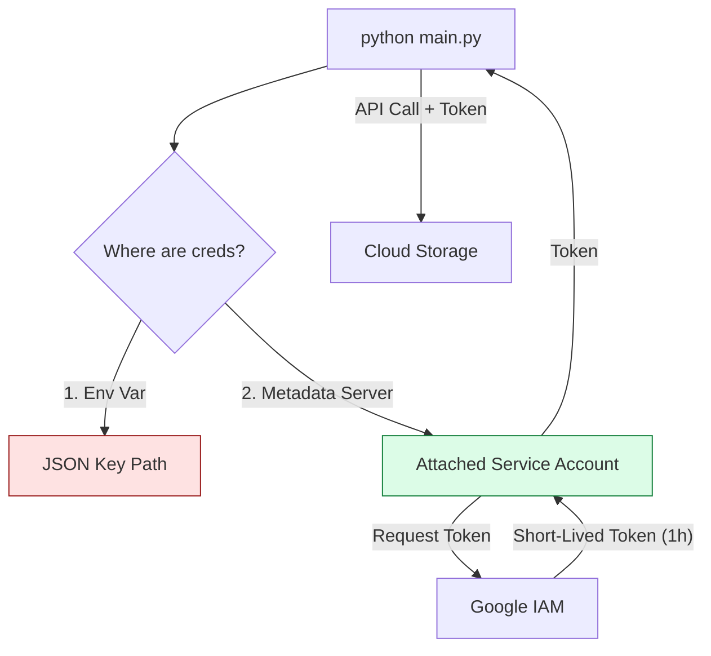

# SECTION 13: Service Accounts Impact

> **Official Doc Reference**: [Service Accounts](https://cloud.google.com/iam/docs/service-accounts)

## 1️⃣ Overview: Identity for Robots
A **Service Account (SA)** is a special Google Account that belongs to your **Code** (Application/VM), not a human.
*   **Email:** `my-app@my-project.iam.gserviceaccount.com`
*   **No Password:** It uses Keys (Bad) or Platform-Managed Credentials (Good).

## 2️⃣ The Security Spectrum (Critical for Exam + Real World)

| Method | Safety | Description | **Use When...** |
| :--- | :--- | :--- | :--- |
| **Attached (Managed)** | 🟢 **Safe** | Attach SA to the VM. Google rotates keys daily automatically. | Your code runs **inside GCP** (VM, Cloud Run, GKE). |
| **Workload Identity** | 🟡 **Secure** | Exchanging external tokens (AWS/GitHub) for GCP tokens. | Your code runs **outside GCP** (AWS, On-Prem, GitHub Actions). |
| **JSON Keys** | 🔴 **Dangerous** | Download `key.json`. "Whoever has the file is the King." | **Legacy / Last Resort.** (e.g., old on-prem server). |

## 3️⃣ Architecture Diagram: Application Default Credentials (ADC)
How does your code find credentials? It follows a search path.


*   **The Magic:** If you run this code on your laptop, it looks for a key. If you move the *same* code to a Compute Engine VM, it automatically finds the Metadata Server. **Zero code changes.**

## 4️⃣ Service Account Impersonation (The "Sudo" of Cloud)
Stop logging in as `admin`.
*   **Concept:** Login as `Alice` (User). Ask IAM: "Can I act as `DeployBot` (SA) for 5 minutes?"
*   **Benefit:** Traceability. The logs will say: "DeployBot created a VM (Impersonated by Alice)."

### Hands-On: The "No-Key" Challenge 🚫🔑
**Mission:** Access a storage bucket from your local laptop WITHOUT downloading a key file.
1.  **Grant:** Give `user:you@gmail.com` the role `Service Account Token Creator` on `sa-name`.
2.  **Command:**
    ```bash
    gcloud storage ls gs://my-bucket \
        --impersonate-service-account=my-sa@project.iam.gserviceaccount.com
    ```
3.  **Result:** Successful access using a short-lived token.

## 5️⃣ Exam Topic: Scopes vs IAM ⚠️
This is legacy technical debt, but exams love it.
*   **Access Token Permissions** = **Intersection** of (IAM Roles) AND (Access Scopes).
*   **Scenario:**
    *   IAM Role: `Storage Admin` (Allow).
    *   VM Access Scope: `https://www.googleapis.com/auth/compute` (Compute Only).
    *   **Result:** Storage Access **DENIED**. The scope blocked it.
*   **Best Practice:** Set Scope to `cloud-platform` (Allow All APIs) and manage security purely via IAM.

## 6️⃣ Checkpoint Questions (Exam Style)
**Q1. You are running a Python script on a Compute Engine VM. What is the most secure way to authenticate to Cloud Storage?**
*   A. Hardcode the username/password.
*   B. Download a JSON key and upload it to the VM.
*   C. Assign a Service Account to the VM.
*   D. Run `gcloud auth login` inside the VM.
> **Answer: C.** Managed Service Accounts are auto-rotated and secure.

**Q2. Your security team detects a leaked JSON key on GitHub. What is the immediate first step?**
*   A. Delete the Service Account.
*   B. Disable the Key (or Delete the Key).
*   C. Email GitHub support.
*   D. Change the Service Account email address.
> **Answer: B.** Deleting the key stops the bleeding immediately without breaking other systems that might use different keys on the same SA.

**Q3. What is Workload Identity Federation used for?**
*   A. Connecting two VPCs.
*   B. Authenticating AWS/Azure/On-Prem workloads to GCP without keys.
*   C. syncing users from Active Directory.
*   D. Managing Firewalls.
> **Answer: B.** It replaces the need for long-lived JSON keys in multi-cloud scenarios.
