# Day 14: Week 2 Review & Exam Strategy

**Level:** Review  
**Milestone:** 🏁 Week 2 Complete!

---

## 🎯 1. Week 2 Recap: Management & Scale

You've moved from managing single servers to architecting global systems that heal and scale themselves.

| Day | Topic | Key Takeaway |
| :--- | :--- | :--- |
| **8** | **MIGs** | Cattle philosophy. Templates + Auto-healing = Resilience. |
| **9** | **LB & CDN** | Layer 7 vs Layer 4. One Anycast IP for the whole world. |
| **10** | **Cloud SQL** | Managed DBs. HA for failover, Read Replicas for scale. |
| **11** | **Storage Adv.** | Lifecycle policies for cost. Signed URLs for security. |
| **12** | **App Engine** | PaaS. Standard (Scale to 0) vs Flexible (Docker). |
| **13** | **Cloud Run** | Serverless Containers. Portability + Lightning speed. |

---

## 🏗️ 2. Visual Decision Matrices (Exam Power-Ups)

### The Serverless Showdown
Which serverless product should you use?

```mermaid
graph TD
    Start{What are you deploying?} --> Source[Source Code]
    Start --> Container[Container Image]
    Source -- "Simple Function" --> Functions[⚡ Cloud Functions]
    Source -- "Full Web App" --> GAE[🏗️ App Engine Standard]
    Container -- "Portability Needed" --> Run[🚀 Cloud Run]
    Container -- "Custom OS/Kernel" --> GAEFlex[🐳 App Engine Flex]
    
    style Run fill:#dcfce7,stroke:#16a34a,stroke-width:2px
    style GAE fill:#f0f9ff,stroke:#0369a1
```



### The Load Balancing Tree

```mermaid
graph TD
    Traffic{Traffic Type?} --> HTTP[HTTP/S]
    Traffic --> TCP[TCP/UDP]
    HTTP -- "Global" --> GHTTP[🌐 Global HTTP/S LB]
    HTTP -- "Internal" --> IHTTP[🔒 Internal HTTP/S LB]
    TCP -- "External" --> NetLB[🌍 Network LB]
    TCP -- "Internal" --> IntLB[🔐 Internal TCP LB]
    
    style GHTTP fill:#fee2e2,stroke:#ef4444,stroke-width:2px
```


---

## ⚠️ 3. Critical Exam "Gotchas"

> [!IMPORTANT]
> **Trap #1: The Health Check Firewall**
> If you create a Load Balancer and it returns `502 Bad Gateway`, check your firewall! You MUST allow traffic from Google's probe ranges: `130.211.0.0/22` and `35.191.0.0/16`.

> [!TIP]
> **Trap #2: Scaling to Zero**
> Only **App Engine Standard** and **Cloud Run** can scale down to zero instances. **App Engine Flexible** and **GKE** always have a minimum of 1 instance running (and costing money).

> [!CAUTION]
> **Trap #3: Cloud SQL HA**
> High Availability (HA) handles **zonal failure**, but it does not protect against someone accidentally running `DROP DATABASE`. For that, you need **Backups**.

---

## 🧪 4. Weekend Capstone Lab: The Unbreakable App

**Scenario:** Build a Load Balanced, Auto-healing cluster using the CLI.

### ✅ Step 1: Prep the Template
```bash
gcloud compute instance-templates create web-template-v2 \
  --tags=http-server,hc-allow \
  --metadata=startup-script='#!/bin/bash
  apt update && apt install -y apache2
  echo "Week 2 Champion" > /var/www/html/index.html'
```

### ✅ Step 2: Build the Auto-Healing Loop
```bash
# Create Health Check
gcloud compute health-checks create-http champion-hc --port=80

# Create Managed Instance Group
gcloud compute instance-groups managed create global-cluster \
  --template=web-template-v2 \
  --size=2 \
  --region=us-central1 \
  --health-check=champion-hc \
  --initial-delay=300
```

### ✅ Step 3: Secure the Perimeter
```bash
gcloud compute firewall-rules create allow-gcp-health-checks \
  --allow=tcp:80 \
  --source-ranges=130.211.0.0/22,35.191.0.0/16 \
  --target-tags=hc-allow
```

---

## 🏆 5. What's Next? (Week 3! Kubernetes)

Week 2 was about **Scale**. Week 3 is about **Orchestration**.

*   **Docker Mastery:** Packaging any app into a box.
*   **GKE Concepts:** Pods, Nodes, and Clusters.
*   **GKE Autopilot:** The "hands-free" way to run Kubernetes.
*   **Hybrid Networking:** Connecting GCP to your corporate data center.

---

<!-- QUIZ_START -->
## 📝 6. Week 2 Knowledge Check

1.  **Your Load Balancer returns a 502 Bad Gateway error. What is the MOST likely cause?**
    *   A. The backend VMs are too small
    *   B. **Firewall rules are blocking health check probes** ✅
    *   C. The SSL certificate is expired
    *   D. Cloud CDN is misconfigured

2.  **Which serverless compute option can scale to ZERO instances when not in use?**
    *   A. GKE Autopilot
    *   B. App Engine Flexible
    *   C. **Cloud Run** ✅
    *   D. Compute Engine with Autoscaler

3.  **You need to handle read-heavy traffic on Cloud SQL. What should you configure?**
    *   A. Increase the machine type
    *   B. Enable High Availability
    *   C. **Create Read Replicas** ✅
    *   D. Switch to Firestore

4.  **A Managed Instance Group (MIG) automatically replaces a crashed VM. What feature enables this?**
    *   A. Autoscaling
    *   B. **Auto-healing with Health Checks** ✅
    *   C. Load Balancing
    *   D. Instance Templates

5.  **You need to deploy a containerized application with maximum portability and no vendor lock-in. Which service is best?**
    *   A. App Engine Standard
    *   B. **Cloud Run** ✅
    *   C. Cloud Functions
    *   D. App Engine Flexible
<!-- QUIZ_END -->

---

<div class="checklist-card" x-data="{ 
    items: [
        { text: 'I know when to use Cloud Run vs App Engine.', checked: false },
        { text: 'I understand why Health Checks need specific firewall rules.', checked: false },
        { text: 'I can explain the difference between HA and Read Replicas.', checked: false },
        { text: 'I successfully built a self-healing cluster using gcloud.', checked: false }
    ]
}">
    <h3>
        <svg viewBox="0 0 24 24" fill="none" stroke="currentColor" stroke-width="2" stroke-linecap="round" stroke-linejoin="round" width="24" height="24" class="text-blurple">
            <path d="M22 11.08V12a10 10 0 1 1-5.93-9.14"></path>
            <polyline points="22 4 12 14.01 9 11.01"></polyline>
        </svg>
        Week 2 Milestone Checklist
    </h3>
    <template x-for="(item, index) in items" :key="index">
        <div class="checklist-item" @click="item.checked = !item.checked">
            <div class="checklist-box" :class="{ 'checked': item.checked }">
                <svg viewBox="0 0 24 24" fill="none" stroke="currentColor" stroke-width="3" stroke-linecap="round" stroke-linejoin="round">
                    <polyline points="20 6 9 17 4 12"></polyline>
                </svg>
            </div>
            <span x-text="item.text" :class="{ 'line-through text-slate-400': item.checked }"></span>
        </div>
    </template>
</div>

---

### 🗑️ Lab Cleanup (Mandatory)

> **⚠️ Critical:** Delete resources to avoid unecessary billing!

1.  **Delete Project:** (Fastest way)
    ```bash
    gcloud projects delete $PROJECT_ID
    ```
2.  **Or Delete Resources Individually:**
    ```bash
    # Example commands (verify before running)
    gcloud compute instances delete [INSTANCE_NAME] --quiet
    gcloud storage rm -r gs://[BUCKET_NAME]
    ```
