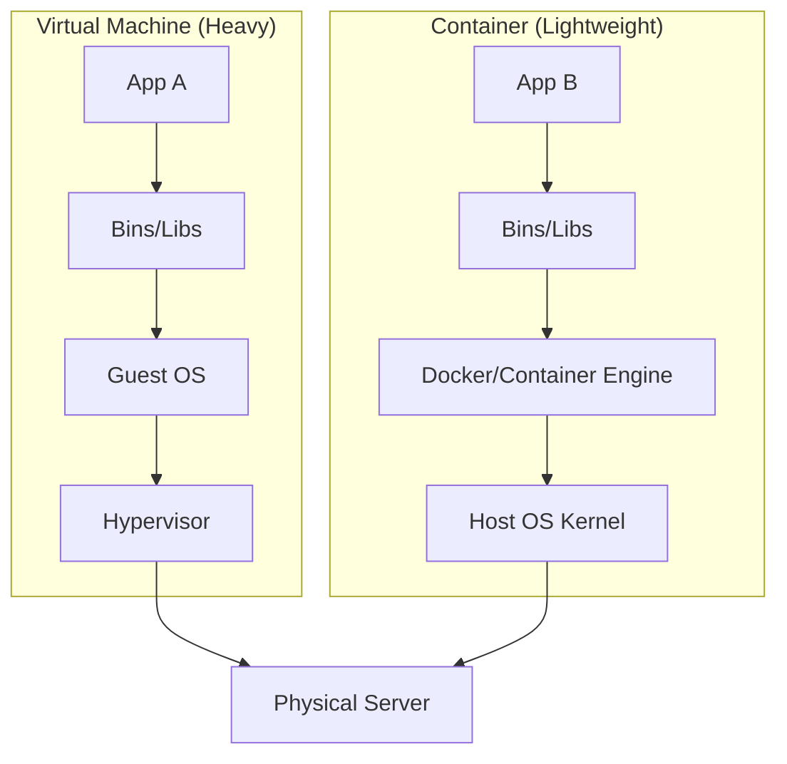
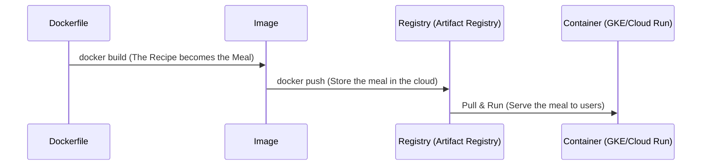

# Day 15: Docker & Containers 101

**Duration:** ⏱️ 45 Minutes  
**Level:** Beginner/Intermediate  
**ACE Exam Weight:** ⭐⭐⭐ Foundation for GKE

---

## 🎯 Learning Objectives

By the end of Day 15, you will be able to:
*   **Deconstruct** the architecture of a container vs. a virtual machine.
*   **Visualize** the Docker layer system and image caching.
*   **Architect** a multi-step Docker workflow from local build to Cloud Registry.
*   **Deploy** a functional container using Cloud Shell and Artifact Registry.

---

## 🏢 Industry Context: Containers in Production

> [!NOTE]
> **Role Lens:** Container skills are mandatory for DevOps and Platform Engineering roles. This is your gateway to Kubernetes.

### Job Roles & Container Usage

| Role | How They Use Containers | Day-to-Day Tasks |
|------|------------------------|------------------|
| **DevOps Engineer** | Build CI/CD pipelines with containers | Writing Dockerfiles, optimizing images |
| **Platform Engineer** | Standardize base images across org | Golden image management, security scanning |
| **SRE** | Debug container issues in production | Container logs, resource limits |
| **Backend Developer** | Containerize applications | Local dev with Docker, multi-stage builds |

### Production Patterns

| Pattern | Architecture | When to Use |
|---------|--------------|-------------|
| **Multi-Stage Builds** | Build in one image, run in slim image | Reduce image size, security |
| **Distroless Images** | Google's minimal runtime images | Production, minimal attack surface |
| **Golden Image Pipeline** | Base image → Team images → App images | Large organizations |

### ❌ Interview Mistakes to Avoid

| Mistake | Why It's Bad | What to Say Instead |
|---------|--------------|---------------------|
| "I use Ubuntu as base image" | Too large, slow pulls | "I use slim or alpine for production" |
| "COPY . . at the top of Dockerfile" | Breaks layer caching | "I put frequently changed steps at the bottom" |
| "I run containers as root" | Security vulnerability | "I use non-root USER directive" |

---

## 🧠 1. Containers vs. Virtual Machines

Understanding the difference is critical for the ACE exam. While VMs virtualize **Hardware**, Containers virtualize the **Operating System**.

### The Architectural Difference



| Feature | Virtual Machines (VMs) | Containers |
| :--- | :--- | :--- |
| **Isolation** | Hardware-level (Hypervisor) | OS-level (Kernel namespaces) |
| **Startup** | Minutes (Full OS boot) | Seconds (Process start) |
| **Size** | GBs (includes kernel) | MBs (shared kernel) |
| **Portability** | Hard (specific hypervisor) | High (Run anywhere with Docker) |

---

## 🐳 2. The Docker Lifecycle: Recipe to Reality

On GCP, you rarely just run Docker; you manage the lifecycle of images.

### The Standard Workflow



> [!TIP]
> **ACE Pro Tip: Caching Matters**
> Each line in a `Dockerfile` creates a **layer**. Docker caches these layers. If you change a line at the bottom, Docker reuses all cached layers above it. Always put the most frequently changed lines (like `COPY . .`) at the bottom to speed up builds!

---

## 🛠️ 3. Hands-On Lab: Build. Push. Run.

In this lab, we'll go beyond local Docker and prepare for GCP by using **Artifact Registry**.

### 🧪 Lab Objective
Build a Python container and push it to Google Cloud's official storage for images.

### ✅ Steps

1.  **Initialize Environment**:
    ```bash
    gcloud services enable artifactregistry.googleapis.com
    mkdir gcp-docker-lab && cd gcp-docker-lab
    ```

2.  **Create the Application** (`app.py`):
    ```python
    print("GCP Container is alive!")
    ```

3.  **Draft the Dockerfile**:
    ```dockerfile
    # 1. Use a tiny base image
    FROM python:3.9-slim
    # 2. Set directory
    WORKDIR /app
    # 3. Copy app
    COPY app.py .
    # 4. Execute
    CMD ["python", "app.py"]
    ```

4.  **Build & Tag**:
    ```bash
    # Replace [PROJECT_ID] with your actual ID
    docker build -t gcr.io/[PROJECT_ID]/quickstart-image:v1 .
    ```

5.  **Authenticate & Push**:
    ```bash
    gcloud auth configure-docker
    docker push gcr.io/[PROJECT_ID]/quickstart-image:v1
    ```

---

## ⚠️ 4. Exam Traps & Best Practices

> [!IMPORTANT]
> **Security Trap**: By default, containers share the host kernel. If a container is compromised, the host is at risk. GKE uses **GKE Sandbox** (based on gVisor) for extra isolation if needed.

> [!WARNING]
> **Image Size**: For the exam, always prefer "slim" or "alpine" base images. Smaller images pull faster (better for auto-scaling) and have a smaller attack surface.

---

<!-- QUIZ_START -->
## 📝 5. Knowledge Check

1.  **Why are containers more efficient than VMs?**
    *   A. They include a dedicated OS kernel for every app.
    *   B. **They share the host OS kernel and virtualize at the OS level.** ✅
    *   C. They run directly on hardware without any OS.
    *   D. They utilize hardware-level virtualization only.

2.  **What GCP service is the primary successor to Container Registry (GCR)?**
    *   A. Cloud Storage Buckets
    *   B. **Artifact Registry** ✅
    *   C. Cloud Build
    *   D. Compute Engine Images

3.  **You want to speed up your Docker builds. Where should you place the command `COPY . .`?**
    *   A. At the very top (first line).
    *   B. **Near the bottom, after installing OS dependencies.** ✅
    *   C. In a separate script outside the Dockerfile.
    *   D. It doesn't matter; Docker builds all lines at once.

4.  **A command like `docker run -it ubuntu /bin/bash` does what?**
    *   A. Builds a new image from the Ubuntu directory.
    *   B. Pushes an image to the cloud.
    *   C. **Starts an interactive container session from the Ubuntu image.** ✅
    *   D. Deletes all running Ubuntu containers.

5.  **Which feature provides extra kernel isolation for containers in GKE?**
    *   A. Cloud Armor
    *   B. VPC Service Controls
    *   C. **GKE Sandbox (gVisor)** ✅
    *   D. Binary Authorization
<!-- QUIZ_END -->
---

<div class="checklist-card" x-data="{ 
    items: [
        { text: 'I can explain why containers start in seconds vs minutes for VMs.', checked: false },
        { text: 'I understand that Dockerfiles build read-only images.', checked: false },
        { text: 'I know that Artifact Registry is the storage for GCP containers.', checked: false },
        { text: 'I can identify the impact of layer caching on build speed.', checked: false }
    ]
}">
    <h3>
        <svg viewBox="0 0 24 24" fill="none" stroke="currentColor" stroke-width="2" stroke-linecap="round" stroke-linejoin="round" class="text-blurple">
            <path d="M22 11.08V12a10 10 0 1 1-5.93-9.14"></path>
            <polyline points="22 4 12 14.01 9 11.01"></polyline>
        </svg>
        Day 15 Mastery Checklist
    </h3>
    <template x-for="(item, index) in items" :key="index">
        <div class="checklist-item" @click="item.checked = !item.checked">
            <div class="checklist-box" :class="{ 'checked': item.checked }">
                <svg viewBox="0 0 24 24" fill="none" stroke="currentColor" stroke-width="3" stroke-linecap="round" stroke-linejoin="round">
                    <polyline points="20 6 9 17 4 12"></polyline>
                </svg>
            </div>
            <span x-text="item.text" :class="{ 'line-through text-slate-400': item.checked }"></span>
        </div>
    </template>
</div>
