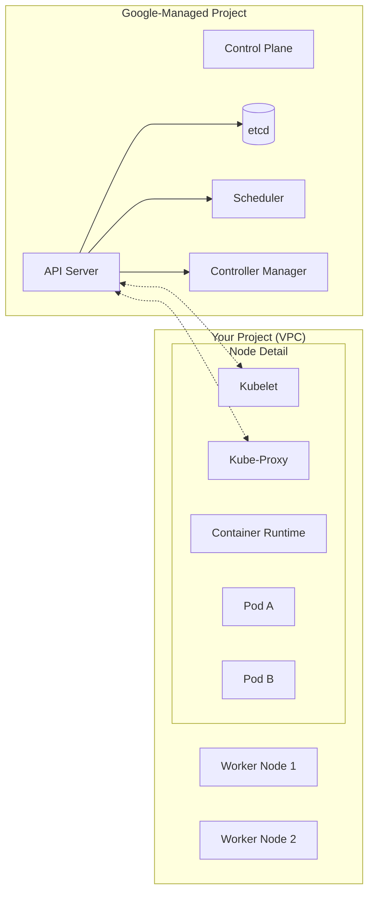

# Day 16: GKE Architecture (Control Plane & Nodes)

**Duration:** ⏱️ 45 Minutes  
**Level:** Intermediate  
**ACE Exam Weight:** ⭐⭐⭐⭐ High

---

## 🎯 Learning Objectives

By the end of Day 16, you will be able to:
*   **Visualize** the Kubernetes Control Plane and Worker Node interaction.
*   **Explain** the "Shared Responsibility" model in Google Kubernetes Engine.
*   **Identify** key components like the API Server, Scheduler, and Kubelet.
*   **Navigate** the logical boundary between Google-managed and customer-managed resources.

---

## 🧠 1. The Kubernetes "Command & Control" Center

A GKE cluster consists of two distinct pools of responsibility: the **Control Plane** (The Brain) and the **Nodes** (The Muscle).

### Architectural Blueprint



| Component | Responsibility | ACE Exam Note |
| :--- | :--- | :--- |
| **API Server** | Cluster "Front Door" | All `kubectl` commands talk to this. |
| **etcd** | Cluster State DB | Stores configuration. **Never** accessible to you in GKE. |
| **Scheduler** | Workload Placement | Decides which Node has enough RAM/CPU for a Pod. |
| **Kubelet** | Node Resident Agent | Reports Node health back to the API Server. |
| **Kube-Proxy** | Networking | Manages IP tables/rules for Service connectivity. |

---

## 🏗️ 2. The GKE Difference: Shared Responsibility

In standard Kubernetes (on-prem), you manage the ETCD database and control plane. In **GKE**, Google handles the heavy lifting.

> [!IMPORTANT]
> **ACE Exam Alert: The Control Plane Cost**
> For GKE **Standard** clusters, you pay a management fee per cluster per hour ($0.10/hr). For **Autopilot**, the management fee is usually included, but you pay for the resource usage of the pods. 

---

## 🛠️ 3. Hands-On Lab: Peeking Under the Hood

Even though the Control Plane is managed, we can see its effects through `kubectl`.

### 🧪 Lab Objective
Inspect the default system components and understand where they live.

### ✅ Steps

1.  **Get Credentials**:
    ```bash
    gcloud container clusters get-credentials [CLUSTER_NAME] --zone [ZONE]
    ```

2.  **List System Workloads**:
    ```bash
    # We use -n kube-system to see the internal components
    kubectl get pods -n kube-system
    ```
    > [!NOTE]
    > Notice you see `kube-proxy` and `fluentbit` (logging), but you **cannot** see the API Server or etcd. That's because they run in a hidden Google-managed project!

3.  **Inspect a Node**:
    ```bash
    kubectl describe node [NODE_NAME]
    ```
    *Look for the "Conditions" section. This is what the **Kubelet** reports back to the brain.*

---

## ⚠️ 4. Exam Traps & Best Practices

> [!WARNING]
> **etcd Access**: A common exam trap asks how to backup the etcd database in GKE. **The answer is: You don't.** Google manages all etcd backups and high availability automatically.

> [!TIP]
> **Version Management**: GKE allows you to choose "Release Channels" (Rapid, Regular, Stable). For production, **Stable** is the recommended choice for maximum reliability.

---

<!-- QUIZ_START -->
## 📝 5. Knowledge Check

1.  **Which component is responsible for deciding which node a new Pod should run on?**
    *   A. Kubelet
    *   B. API Server
    *   C. **Scheduler** ✅
    *   D. etcd

2.  **In GKE, where is the Control Plane located?**
    *   A. On the first worker node in your VPC.
    *   B. **In a separate Google-managed project.** ✅
    *   C. In a Cloud Storage bucket.
    *   D. It runs as a container on every node.

3.  **What is the role of the Kubelet?**
    *   A. It acts as the load balancer for incoming traffic.
    *   B. It stores the state of the cluster.
    *   C. **It is the agent that runs on each node and ensures containers are running in a Pod.** ✅
    *   D. It schedules new workloads based on resource availability.

4.  **Why can't you see the etcd pods when running `kubectl get pods -n kube-system`?**
    *   A. They are hidden for security reasons.
    *   B. You don't have the "Owner" role.
    *   C. **They run on the master nodes, which are managed by Google and not visible in your node list.** ✅
    *   D. etcd is not used in GKE.

5.  **Which GKE release channel is recommended for production workloads?**
    *   A. Rapid
    *   B. Regular
    *   C. **Stable** ✅
    *   D. Extended
<!-- QUIZ_END -->
---

<div class="checklist-card" x-data="{ 
    items: [
        { text: 'I understand the difference between Control Plane and Worker Nodes.', checked: false },
        { text: 'I know that I do not manage etcd in GKE.', checked: false },
        { text: 'I can identify the API Server as the entry point for kubectl.', checked: false },
        { text: 'I understand the shared responsibility model.', checked: false }
    ]
}">
    <h3>
        <svg viewBox="0 0 24 24" fill="none" stroke="currentColor" stroke-width="2" stroke-linecap="round" stroke-linejoin="round" class="text-blurple">
            <path d="M22 11.08V12a10 10 0 1 1-5.93-9.14"></path>
            <polyline points="22 4 12 14.01 9 11.01"></polyline>
        </svg>
        Day 16 Mastery Checklist
    </h3>
    <template x-for="(item, index) in items" :key="index">
        <div class="checklist-item" @click="item.checked = !item.checked">
            <div class="checklist-box" :class="{ 'checked': item.checked }">
                <svg viewBox="0 0 24 24" fill="none" stroke="currentColor" stroke-width="3" stroke-linecap="round" stroke-linejoin="round">
                    <polyline points="20 6 9 17 4 12"></polyline>
                </svg>
            </div>
            <span x-text="item.text" :class="{ 'line-through text-slate-400': item.checked }"></span>
        </div>
    </template>
</div>
