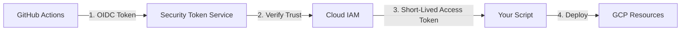

# SECTION 17: Advanced IAM: Workload Identity & Conditions

> **Official Doc Reference**: [IAM Conditions](https://cloud.google.com/iam/docs/conditions-overview)

## 1️⃣ Workload Identity (The "No-Key" Standard)
**The Problem:** In the old days, if your code running in AWS or GitHub Actions needed to access GCP, you downloaded a JSON Service Account Key.
*   🚫 **Risk:** Developers accidentally commit these JSON keys to public GitHub repos. Hackers find them in seconds.

**The Solution:** **Workload Identity Federation**.
*   **Concept:** Exchange a "Token" from AWS/Azure/GitHub for a short-lived GCP Token.
*   **Result:** No long-lived keys exist.

### Architecture Diagram: Workload Identity Flow

## 2️⃣ IAM Conditions (Context-Aware Access)
Standard IAM says **WHO** can do **WHAT**.
Conditional IAM adds **WHEN** and **WHERE**.

*   **syntax:** `resource.name.startsWith(...)` or `request.time < ...`
*   **Use Cases:**
    1.  **Time-Bound:** Allow access only during working hours (9 AM - 5 PM).
    2.  **Network-Bound:** Allow access only from Corporate VPN IP range.
    3.  **Resource-Bound:** Allow managing VMs only if they have the tag `env:dev`.

> **Exam Tip:** If a question asks "How to ensure developers can ONLY stop VMs that are labeled 'dev'?", the answer is **Conditional IAM Policies**.

## 3️⃣ Deny Policies (IAM v2)
Traditionally, IAM is "Allow Only". If you don't grant it, it's denied.
**Deny Policies** are new. They allow you to say "Even if you are Owner, you CANNOT do this."
*   **Use Case:** Prevent anyone (even admins) from disabling Audit Logs.

## 4️⃣ Hands-On Lab: The "Monday-Friday" Policy 🛡️
**Mission:** Create a bucket that can only be read on weekdays.

1.  **Create a Bucket:** `gsutil mb gs://my-conditional-bucket`
2.  **Add Policy via Console:**
    *   **Principal:** `user:friend@gmail.com`
    *   **Role:** `Storage Object Viewer`
    *   **Add Condition:**
        *   **Title:** "Weekdays Only"
        *   **Expression Builder:**
            *   Time -> Application -> Day of Week
            *   Operator: `!=` (Not Equal)
            *   Values: `SATURDAY`, `SUNDAY`
3.  **Verify:** Try accessing it on a Sunday (or simulate by changing the condition).

## 5️⃣ Best Practices (Zero Trust)
1.  **Least Privilege:** Always start with no permissions.
2.  **Just-in-Time (JIT):** Use conditions to grant access only when needed.
3.  **Attributes:** Move from "Role-based" to "Attribute-based" access control (ABAC) using tags.

## 6️⃣ Checkpoint Questions
1.  **True or False: Workload Identity requires you to download a JSON key.**
    *   *Answer: False. It uses token exchange to avoid keys entirely.*
2.  **Which IAM feature prevents an admin from accidentally deleting a production project?**
    *   *Answer: IAM Deny Policies (or Liens).*
3.  **You want to allow a user to edit Firewalls, but only in the 'frontend' subnet. What do you use?**
    *   *Answer: IAM Conditions based on resource name.*
