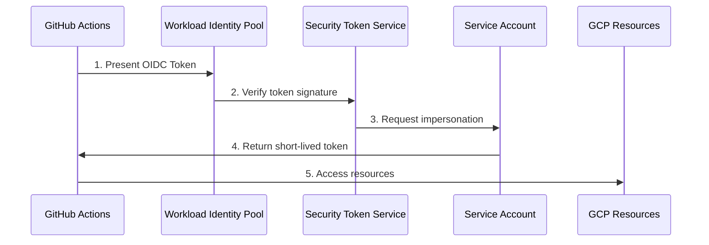
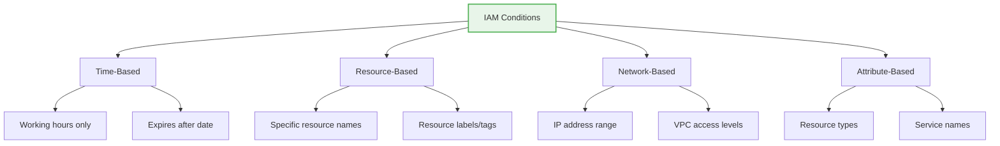

# BONUS: Advanced IAM - Workload Identity & Conditions

**Duration:** ⏱️ 45 Minutes  
**Level:** Advanced  
**ACE Exam Weight:** ⭐⭐⭐ High (Security domain is 19% of exam)

---

> [!TIP]
> **TL;DR (Advanced IAM Essentials)**  
> **Workload Identity Federation** = Exchange external tokens (GitHub, AWS, Azure) for GCP access. **NO JSON KEYS NEEDED!** **IAM Conditions** = Add WHEN (time) and WHERE (IP/resource) to access control using CEL expressions. **Deny Policies** = Override all allow policies for hard guardrails (e.g., prevent audit log deletion). This is the gold standard for CI/CD security.

---

## 🎯 Learning Objectives

| ✅ Skill | Why It Matters |
|---------|----------------|
| **Implement** Workload Identity Federation | Eliminate long-lived JSON keys |
| **Configure** IAM Conditions | Context-aware access (time, IP, resource) |
| **Apply** IAM Deny Policies | Create unbreakable guardrails |
| **Design** Zero Trust patterns | Modern security architecture |

---

## 🧠 1. The JSON Key Problem (Plain-English)

**The Old Way:** Download a JSON Service Account key, store it in your CI/CD pipeline, and hope no one leaks it.

**The Reality:** 
- Developers commit keys to GitHub accidentally
- Keys get stored in plaintext in build systems
- Hackers scan GitHub for exposed keys 24/7

### 💡 Real-World Analogy: House Keys

| Old Approach (JSON Keys) | New Approach (Workload Identity) |
|-------------------------|----------------------------------|
| Giving a permanent house key to every contractor | Using a smart lock with temporary codes |
| Key can be copied infinitely | Code expires in hours |
| No audit trail | Every entry is logged |
| Lost key = change all locks | Revoke code instantly |

---

## 🔐 2. Workload Identity Federation

### How It Works



### Supported Identity Providers

| Provider | Use Case |
|----------|----------|
| **AWS** | AWS workloads accessing GCP |
| **Azure AD** | Azure/Microsoft workloads |
| **GitHub Actions** | CI/CD pipelines |
| **GitLab** | CI/CD pipelines |
| **Kubernetes** | Any K8s cluster |
| **OIDC Providers** | Custom identity providers |

### Setup: GitHub Actions → GCP

```bash
# 1. Create Workload Identity Pool
gcloud iam workload-identity-pools create "github-pool" \
    --location="global" \
    --display-name="GitHub Actions Pool"

# 2. Create Provider for GitHub
gcloud iam workload-identity-pools providers create-oidc "github-provider" \
    --location="global" \
    --workload-identity-pool="github-pool" \
    --issuer-uri="https://token.actions.githubusercontent.com" \
    --attribute-mapping="google.subject=assertion.sub,attribute.repository=assertion.repository"

# 3. Allow GitHub to impersonate Service Account
gcloud iam service-accounts add-iam-policy-binding "my-sa@PROJECT.iam.gserviceaccount.com" \
    --role="roles/iam.workloadIdentityUser" \
    --member="principalSet://iam.googleapis.com/projects/PROJECT_NUMBER/locations/global/workloadIdentityPools/github-pool/attribute.repository/my-org/my-repo"
```

---

## 🎯 3. IAM Conditions (Context-Aware Access)

Standard IAM: **WHO** can do **WHAT** on **WHICH RESOURCE**
Conditional IAM: + **WHEN** and **WHERE**

### Condition Types



### Condition Expression Language (CEL)

| Condition | CEL Expression |
|-----------|---------------|
| Weekdays only | `request.time.getDayOfWeek() != 0 && request.time.getDayOfWeek() != 6` |
| Dev resources only | `resource.name.startsWith("projects/my-project/zones/us-central1-a/instances/dev-")` |
| From corporate IP | `request.auth.accessLevels.contains("accessPolicies/123/accessLevels/corpnet")` |
| Before expiry date | `request.time < timestamp("2024-12-31T23:59:59Z")` |

### Apply Condition via gcloud
```bash
gcloud projects add-iam-policy-binding my-project \
    --member="user:developer@example.com" \
    --role="roles/compute.instanceAdmin.v1" \
    --condition="expression=resource.name.startsWith('projects/my-project/zones/us-central1-a/instances/dev-'),title=DevVMsOnly"
```

---

## 🚫 4. IAM Deny Policies (The Guardrails)

**Standard IAM:** "Allow-only" - if not granted, it's denied
**Deny Policies:** Override allows - "Even if you're Owner, you CANNOT do this"

### Use Cases for Deny Policies

| Scenario | Deny Rule |
|----------|-----------|
| Prevent anyone from disabling audit logs | Deny `logging.sinks.delete` |
| Block public bucket creation | Deny `storage.buckets.setIamPolicy` with allUsers |
| Prevent project deletion | Deny `resourcemanager.projects.delete` |
| Block external IP assignment | Deny `compute.instances.setMetadata` for external IPs |

### Create Deny Policy
```bash
# Create deny policy file
cat > deny-policy.json << 'EOF'
{
  "displayName": "Block Public Buckets",
  "rules": [
    {
      "denyRule": {
        "deniedPrincipals": ["principalSet://goog/public:all"],
        "deniedPermissions": ["storage.buckets.setIamPolicy"],
        "denialCondition": {
          "expression": "resource.name.contains('allUsers')"
        }
      }
    }
  ]
}
EOF

# Apply policy
gcloud iam policies create block-public \
    --attachment-point="cloudresourcemanager.googleapis.com/projects/my-project" \
    --kind="denypolicies" \
    --policy-file=deny-policy.json
```

---

## 🛠️ 5. Hands-On Lab: The "Weekday-Only" Developer

**Mission:** Grant a contractor access to development VMs, but only on weekdays during business hours.

### Step 1: Create the Conditional Binding
```bash
gcloud projects add-iam-policy-binding my-project \
    --member="user:contractor@example.com" \
    --role="roles/compute.instanceAdmin.v1" \
    --condition='
      expression=resource.name.startsWith("projects/my-project/zones/us-central1-a/instances/dev-") && 
        request.time.getDayOfWeek() >= 1 && 
        request.time.getDayOfWeek() <= 5 &&
        request.time.getHours("America/Los_Angeles") >= 9 &&
        request.time.getHours("America/Los_Angeles") <= 17,
      title=DevVMsWeekdayHoursOnly,
      description=Access to dev VMs during weekday business hours only'
```

### Step 2: Verify
```bash
# Check current IAM policy
gcloud projects get-iam-policy my-project --format=json | jq '.bindings[] | select(.condition)'
```

---

## ⚠️ 6. Exam Traps & Pro Tips

### ❌ Common Mistakes
| Mistake | Reality |
|---------|---------|
| "Workload Identity needs a JSON key" | No! It eliminates keys entirely |
| "Conditions work on all roles" | Some roles don't support conditions |
| "Deny policies are evaluated first" | No, they're evaluated with Allow policies |

### ✅ Pro Tips
*   **Workload Identity is the gold standard** for CI/CD
*   **Use IAM Recommender** to identify unused permissions
*   **Deny policies are in beta** - know they exist for the exam
*   **Conditions use CEL** (Common Expression Language)

---

<!-- QUIZ_START -->
## 📝 7. Knowledge Check Quiz

1. **What does Workload Identity Federation eliminate?**
    *   A. Service Accounts
    *   B. **Long-lived JSON keys** ✅
    *   C. IAM roles
    *   D. Access tokens

2. **Which language is used to write IAM Conditions?**
    *   A. Python
    *   B. JavaScript
    *   C. **CEL (Common Expression Language)** ✅
    *   D. SQL

3. **You want to prevent ANYONE from deleting audit logs, even project owners. What do you use?**
    *   A. Conditional IAM
    *   B. **IAM Deny Policies** ✅
    *   C. Organization Policies
    *   D. VPC Service Controls

4. **A developer should only access VMs labeled "env:dev". What IAM feature enables this?**
    *   A. Custom Roles
    *   B. **IAM Conditions** ✅
    *   C. Service Accounts
    *   D. Resource Quotas

5. **Which identity providers does Workload Identity Federation support?**
    *   A. Only Google Workspace
    *   B. Only AWS
    *   C. **AWS, Azure, GitHub, and any OIDC provider** ✅
    *   D. Only on-premises Active Directory
<!-- QUIZ_END -->

---

<!-- FLASHCARDS
[
  {"term": "Workload Identity Federation", "def": "Exchange external identity tokens for short-lived GCP tokens. No JSON keys needed."},
  {"term": "IAM Conditions", "def": "Context-aware access control. Add WHEN and WHERE to WHO/WHAT/WHICH."},
  {"term": "CEL", "def": "Common Expression Language. Used to write IAM condition expressions."},
  {"term": "Deny Policies", "def": "Override Allow policies. Enforce guardrails that even admins cannot bypass."},
  {"term": "OIDC", "def": "OpenID Connect. Protocol used by Workload Identity to verify external identities."},
  {"term": "Attribute-Based Access Control", "def": "ABAC. Grant access based on resource attributes/tags instead of just identity."}
]
-->

---

### 🗑️ Lab Cleanup (Mandatory)

> **⚠️ Critical:** Delete resources to avoid unecessary billing!

1.  **Delete Project:** (Fastest way)
    ```bash
    gcloud projects delete $PROJECT_ID
    ```
2.  **Or Delete Resources Individually:**
    ```bash
    # Example commands (verify before running)
    gcloud compute instances delete [INSTANCE_NAME] --quiet
    gcloud storage rm -r gs://[BUCKET_NAME]
    ```
