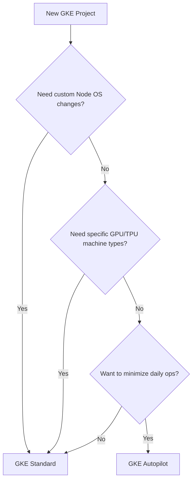

# Day 17: GKE Modes (Standard vs. Autopilot)

**Duration:** ⏱️ 45 Minutes  
**Level:** Intermediate  
**ACE Exam Weight:** ⭐⭐⭐⭐⭐ Critical

---

## 🎯 Learning Objectives

By the end of Day 17, you will be able to:
*   **Evaluate** the trade-offs between GKE Standard and Autopilot.
*   **Architect** a cluster choice based on cost, security, and operational overhead.
*   **Understand** the Autopilot "Hardened" security posture.
*   **Deploy** a production-ready Autopilot cluster using best practices.

---

## 🧠 1. Standard vs. Autopilot: The Choice

The ACE exam frequently tests your ability to choose the right GKE mode for a given scenario.

### Decision Flowchart



---

## 📋 2. Deep Dive Comparison

| Feature | GKE Standard | GKE Autopilot |
| :--- | :--- | :--- |
| **Management** | You manage Nodes & Node Pools. | Google manages the entire infrastructure. |
| **Pricing** | Pay for the Compute Engine Nodes. | Pay for Pod resources requested. |
| **Security** | You harden the OS yourself. | **Hardened by default** (Shielded VMs, disabled SSH). |
| **Upgrades** | You configure maintenance windows. | Handled automatically by Google. |
| **Flexibility** | Full control over Kubernetes flags. | Some flags/configurations are restricted. |

> [!TIP]
> **ACE Pro Tip: Workload Separation**
> In Standard, you create **Node Pools** to separate different types of work (e.g., high-memory nodes for DBs). In Autopilot, you don't manage pools; you just use **Taints and Tolerations** or **Selectors**, and Google creates the hidden capacity for you.

---

## 🛠️ 3. Hands-On Lab: The Autopilot Workflow

Autopilot is the recommended path for 90% of new GCP workloads. Let's see how it feels in the CLI.

### 🧪 Lab Objective
Launch an Autopilot cluster and verify its unique characteristics.

### ✅ Steps

1.  **Creation Command**:
    ```bash
    # Note: Autopilot clusters MUST be regional
    gcloud container clusters create-auto autopilot-prod \
        --region us-central1 \
        --project [PROJECT_ID]
    ```

2.  **Verify Node Management**:
    ```bash
    kubectl get nodes
    ```
    *Notice the machine types. Google automatically picks the best machine for your pods.*

3.  **Attempt Restricted Action (Security Test)**:
    ```bash
    # Try to run a privileged pod (this should fail on Autopilot)
    kubectl run secure-test --image=nginx --privileged
    ```
    *Result:* Autopilot will block this because it enforces security "Guardrails" out of the box.

---

## ⚠️ 4. Exam Traps & Best Practices

> [!IMPORTANT]
> **The "Bin Packing" Trap**: In **Standard**, if your pod uses 100MB RAM but is on a 4GB node, you pay for 4GB. In **Autopilot**, you only pay for the 100MB (plus a small system overhead). This is called "Pod-based billing."

> [!WARNING]
> **SSH Access**: You cannot SSH into the worker nodes of an Autopilot cluster. If the exam asks how to "debug a kernel issue on the node" in Autopilot, the answer is usually: "You can't; switch to Standard or use Cloud Logging."

---

<!-- QUIZ_START -->
## 📝 5. Knowledge Check

1.  **Which GKE mode is billed based on the resources (CPU, RAM, Disk) requested by the Pods?**
    *   A. Standard
    *   B. **Autopilot** ✅
    *   C. Both follow Pod-based billing.
    *   D. Neither; both follow Node-based billing.

2.  **You need to run a legacy application that requires a specific kernel module. Which mode should you use?**
    *   A. Autopilot
    *   B. **Standard** ✅
    *   C. Cloud Run
    *   D. App Engine Standard

3.  **A team wants to 'minimize operational overhead' for their Kubernetes cluster. What is the best recommendation?**
    *   A. GKE Standard with Auto-scaling enabled.
    *   B. **GKE Autopilot** ✅
    *   C. Compute Engine with manual Kubernetes installation.
    *   D. GKE Standard with manual node pool management.

4.  **GKE Autopilot clusters are always:**
    *   A. Zonal for cost savings
    *   B. **Regional for High Availability** ✅
    *   C. Private with no public IPs
    *   D. Using only E2 machine types

5.  **What happens if you try to run a privileged container in GKE Autopilot?**
    *   A. It runs with warnings
    *   B. It runs but costs more
    *   C. **It is blocked by security guardrails** ✅
    *   D. It requires Owner role approval
<!-- QUIZ_END -->
---

<div class="checklist-card" x-data="{ 
    items: [
        { text: 'I can explain why Autopilot is more cost-effective for small workloads.', checked: false },
        { text: 'I know that Autopilot clusters are regional by default.', checked: false },
        { text: 'I understand why Standard is needed for custom OS configurations.', checked: false },
        { text: 'I launched an Autopilot cluster successfully.', checked: false }
    ]
}">
    <h3>
        <svg viewBox="0 0 24 24" fill="none" stroke="currentColor" stroke-width="2" stroke-linecap="round" stroke-linejoin="round" class="text-blurple">
            <path d="M22 11.08V12a10 10 0 1 1-5.93-9.14"></path>
            <polyline points="22 4 12 14.01 9 11.01"></polyline>
        </svg>
        Day 17 Mastery Checklist
    </h3>
    <template x-for="(item, index) in items" :key="index">
        <div class="checklist-item" @click="item.checked = !item.checked">
            <div class="checklist-box" :class="{ 'checked': item.checked }">
                <svg viewBox="0 0 24 24" fill="none" stroke="currentColor" stroke-width="3" stroke-linecap="round" stroke-linejoin="round">
                    <polyline points="20 6 9 17 4 12"></polyline>
                </svg>
            </div>
            <span x-text="item.text" :class="{ 'line-through text-slate-400': item.checked }"></span>
        </div>
    </template>
</div>

---

### 🗑️ Lab Cleanup (Mandatory)

> **⚠️ Critical:** Delete resources to avoid unecessary billing!

1.  **Delete Project:** (Fastest way)
    ```bash
    gcloud projects delete $PROJECT_ID
    ```
2.  **Or Delete Resources Individually:**
    ```bash
    # Example commands (verify before running)
    gcloud compute instances delete [INSTANCE_NAME] --quiet
    gcloud storage rm -r gs://[BUCKET_NAME]
    ```
