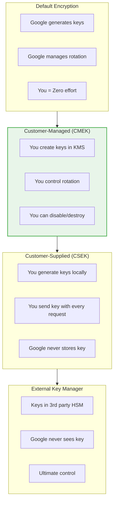
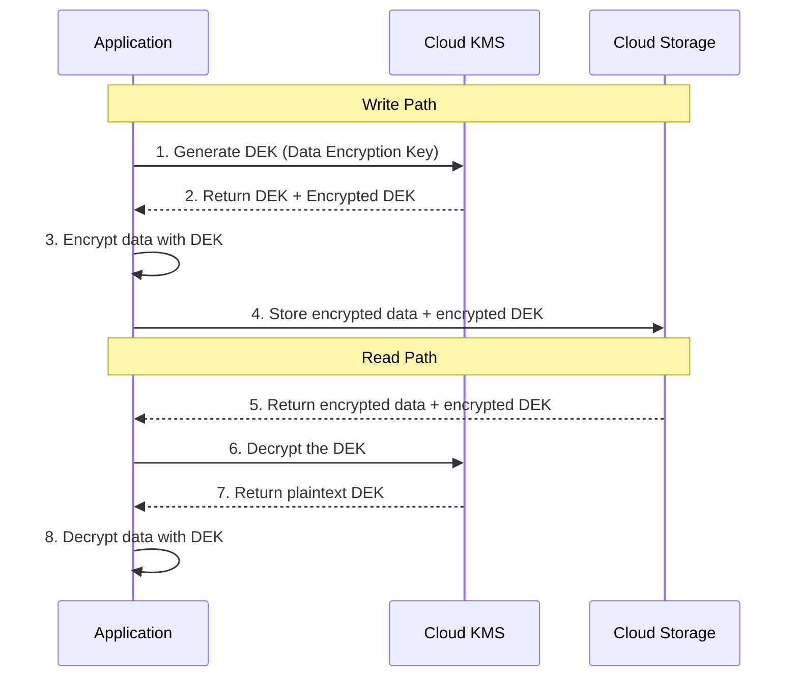

# BONUS: Cloud KMS & Data Protection

**Duration:** ⏱️ 45 Minutes  
**Level:** Advanced  
**ACE Exam Weight:** ⭐⭐⭐ High (Encryption is a key security topic)

---

## 🎯 Learning Objectives

By the end of this lesson, you will:

*   **Understand** the encryption hierarchy (Default → CMEK → CSEK)
*   **Implement** Customer-Managed Encryption Keys (CMEK)
*   **Explain** envelope encryption and why it matters
*   **Configure** Cloud HSM and External Key Manager

---

## 🧠 1. GCP Encryption Overview (Plain-English)

**All data in GCP is encrypted at rest by default.** You don't have to do anything.

But for compliance (banks, healthcare, government), you might need to prove:
- YOU control the keys
- You can revoke access anytime
- Keys never leave your control

### 💡 Real-World Analogy: Safe Deposit Box

| Encryption Level | Analogy | Who Holds Key? |
|-----------------|---------|----------------|
| **Default** | Bank's vault (Google's keys) | Google |
| **CMEK** | Your safe inside bank's vault | You (in KMS) |
| **CSEK** | Your personal safe at home | You (on-prem) |
| **EKM** | Your safe, bank just stores it | You (3rd party) |

---

## 🔐 2. Encryption Hierarchy



### Comparison Table

| Feature | Default | CMEK | CSEK | EKM |
|---------|---------|------|------|-----|
| **Key Location** | Google | Cloud KMS | Your Server | 3rd Party |
| **Setup Effort** | None | Low | High | Highest |
| **Cost** | Free | Per key operation | Free | Highest |
| **Compliance** | Basic | HIPAA, PCI | Military | Government |
| **Rotation** | Auto | Manual or Auto | Manual | Manual |

---

## 🔄 3. Envelope Encryption

**Problem:** Encrypting 1 petabyte with a remote KMS key would be painfully slow.

**Solution:** Envelope encryption - use two keys.

### How It Works



### Key Terms

| Term | Description |
|------|-------------|
| **DEK** | Data Encryption Key - encrypts the actual data (fast, local) |
| **KEK** | Key Encryption Key - encrypts the DEK (stored in KMS) |
| **Wrapped Key** | The encrypted DEK (safe to store with data) |

> **Why This Matters:** KMS is only called twice (to wrap/unwrap DEK), not for every byte of data.

---

## 🛠️ 4. Hands-On Lab: Create CMEK-Encrypted Bucket

### Step 1: Create Key Ring and Key
```bash
# Create a key ring (container for keys)
gcloud kms keyrings create my-keyring \
    --location=us-central1

# Create an encryption key
gcloud kms keys create my-encryption-key \
    --keyring=my-keyring \
    --location=us-central1 \
    --purpose=encryption \
    --rotation-period=90d \
    --next-rotation-time=$(date -u -d "+90 days" +%Y-%m-%dT%H:%M:%SZ)
```

### Step 2: Grant Storage Access to Key
```bash
# Get the storage service account
PROJECT_NUMBER=$(gcloud projects describe $PROJECT_ID --format="value(projectNumber)")

# Grant access
gcloud kms keys add-iam-policy-binding my-encryption-key \
    --keyring=my-keyring \
    --location=us-central1 \
    --member="serviceAccount:service-${PROJECT_NUMBER}@gs-project-accounts.iam.gserviceaccount.com" \
    --role="roles/cloudkms.cryptoKeyEncrypterDecrypter"
```

### Step 3: Create CMEK Bucket
```bash
# Create bucket with CMEK
gcloud storage buckets create gs://my-cmek-bucket-${PROJECT_ID} \
    --location=us-central1 \
    --default-encryption-key=projects/${PROJECT_ID}/locations/us-central1/keyRings/my-keyring/cryptoKeys/my-encryption-key
```

### Step 4: Verify Encryption
```bash
# Upload a file
echo "Secret data" > secret.txt
gcloud storage cp secret.txt gs://my-cmek-bucket-${PROJECT_ID}/

# Check encryption details
gcloud storage objects describe gs://my-cmek-bucket-${PROJECT_ID}/secret.txt --format="value(metadata.kmsKeyName)"
```

---

## ⚡ 5. Cloud HSM (Hardware Security Module)

**For the most sensitive workloads**, keys never leave tamper-resistant hardware.

### HSM Protection Levels

| Level | Name | Description |
|-------|------|-------------|
| **SOFTWARE** | Software Keys | Keys protected by Google's secure infrastructure |
| **HSM** | Cloud HSM | FIPS 140-2 Level 3 certified hardware |
| **EXTERNAL** | External Key Manager | Keys in your own HSM (Thales, Fortanix) |

### Create HSM-Protected Key
```bash
gcloud kms keys create my-hsm-key \
    --keyring=my-keyring \
    --location=us-central1 \
    --purpose=encryption \
    --protection-level=hsm
```

---

## ⚠️ 6. Crypto-Shredding

**What happens if you destroy a CMEK key?**

The data becomes **permanently unreadable**. This is called "crypto-shredding."

### Use Cases
*   **Data retention compliance** - Destroy key after 7 years
*   **Customer offboarding** - Customer leaves, destroy their key
*   **Security incident** - Suspected breach, destroy all keys

> **⚠️ WARNING:** Destroying a key is irreversible. The data is gone forever.

---

<!-- QUIZ_START -->
## 📝 7. Knowledge Check Quiz

1. **Which encryption level requires you to send the key with every API request?**
    *   A. Default Encryption
    *   B. CMEK
    *   C. **CSEK (Customer-Supplied)** ✅
    *   D. Cloud HSM

2. **Why does GCP use envelope encryption?**
    *   A. To save storage space
    *   B. **To avoid slow remote encryption of large data** ✅
    *   C. To comply with GDPR
    *   D. To enable multi-region storage

3. **What happens to data encrypted with a CMEK key if you destroy the key?**
    *   A. Data is automatically decrypted
    *   B. Data moves to Archive storage
    *   C. **Data becomes permanently unreadable (crypto-shredded)** ✅
    *   D. Google recovers the key from backup

4. **Which protection level uses FIPS 140-2 Level 3 certified hardware?**
    *   A. SOFTWARE
    *   B. **HSM** ✅
    *   C. EXTERNAL
    *   D. DEFAULT

5. **A DEK (Data Encryption Key) is encrypted by which key?**
    *   A. Another DEK
    *   B. **KEK (Key Encryption Key)** ✅
    *   C. User password
    *   D. Service Account key
<!-- QUIZ_END -->

---

<!-- FLASHCARDS
[
  {"term": "CMEK", "def": "Customer-Managed Encryption Key. You create keys in Cloud KMS, Google uses them."},
  {"term": "CSEK", "def": "Customer-Supplied Encryption Key. You provide key with each request. Google never stores it."},
  {"term": "Envelope Encryption", "def": "Two-layer encryption. DEK encrypts data locally, KEK encrypts DEK in KMS."},
  {"term": "DEK", "def": "Data Encryption Key. Encrypts actual data. Fast, used locally."},
  {"term": "KEK", "def": "Key Encryption Key. Encrypts the DEK. Stored in Cloud KMS."},
  {"term": "Crypto-Shredding", "def": "Destroying encryption key to make data permanently unreadable."},
  {"term": "Cloud HSM", "def": "Hardware Security Module. FIPS 140-2 Level 3 certified tamper-resistant hardware."}
]
-->
