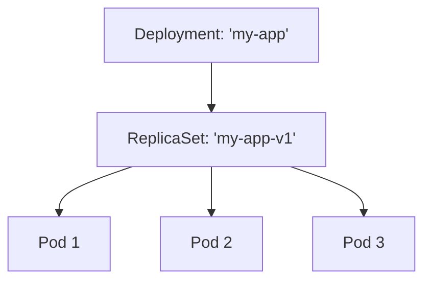
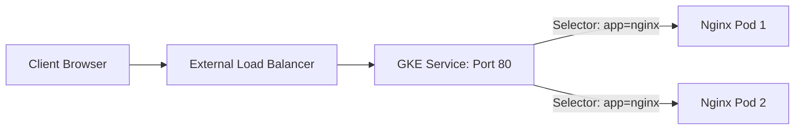

# Day 18: GKE Workloads (Deployments & Services)

**Duration:** ⏱️ 60 Minutes  
**Level:** Intermediate  
**ACE Exam Weight:** ⭐⭐⭐⭐⭐ Critical

---

## 🎯 Learning Objectives

By the end of Day 18, you will be able to:
*   **Deploy** and scale containerized applications using Kubernetes Deployments.
*   **Expose** applications internally and externally using GKE Services.
*   **Visualize** the relationship between Pods, ReplicaSets, and Services.
*   **Manage** self-healing workloads and stable network endpoints.

---

## 🚀 1. Deployments: The Desired State Manager

In Kubernetes, you rarely manage Pods directly. You manage **Deployments**. A Deployment ensures that a specific number of Pod replicas are running at all times.

### Deployment Hierarchy



> [!TIP]
> **ACE Pro Tip: Self-Healing**
> If a Node fails or a Pod crashes, the **ReplicaSet** (managed by your Deployment) notices the "Current State" (2 pods) doesn't match the "Desired State" (3 pods) and immediately starts a new one.

---

## 🔌 2. Services: Stable Networking

Pods are ephemeral—they die and get new IP addresses. To provide a stable entry point, we use **Services**.

### Service Types Cheat Sheet

| Type | Visibility | Use Case |
| :--- | :--- | :--- |
| **ClusterIP** | Internal Only | Backend microservices or databases. |
| **NodePort** | External (Basic) | Opens a port (30000+) on every Node. Great for testing. |
| **LoadBalancer** | **External (Prod)** | Provisions a Google Cloud Load Balancer with a static IP. |



---

## 🛠️ 3. Hands-On Lab: The "Full Stack" Exposure

We will deploy an Nginx web server and expose it to the public internet using a GCP Load Balancer.

### 🧪 Lab Objective
Practice the complete workflow: Create Deployment -> Scale -> Expose -> Verify.

### ✅ Steps

1.  **Create Deployment**:
    ```bash
    kubectl create deployment nginx-web --image=nginx:latest --replicas=3
    ```

2.  **Scale Up**:
    ```bash
    kubectl scale deployment nginx-web --replicas=5
    ```

3.  **Expose to Internet**:
    ```bash
    # This command creates a Service of type LoadBalancer
    kubectl expose deployment nginx-web --type=LoadBalancer --port=80 --target-port=80
    ```

4.  **Verify & Test**:
    ```bash
    # Wait until EXTERNAL-IP is assigned
    kubectl get svc nginx-web
    ```
    *Copy the External IP into your browser. You are now hitting a Google Cloud Load Balancer!*

---

## ⚠️ 4. Exam Traps & Best Practices

> [!IMPORTANT]
> **Label Selectors**: A Service finds its target Pods using **Labels**. If your Pod is labeled `env=prod` and your service selects `env=dev`, traffic will never reach the Pod. This is a common exam troubleshooting question.

> [!WARNING]
> **Pod IP Volatility**: Never hardcode a Pod's IP address. Always use the **Service Name** (which uses internal DNS) to communicate between workloads.

---

<!-- QUIZ_START -->
## 📝 5. Knowledge Check

1.  **Which Kubernetes object is responsible for ensuring that a specific number of Pod replicas are running?**
    *   A. Pod
    *   B. Service
    *   C. **ReplicaSet (via Deployment)** ✅
    *   D. Kubelet

2.  **You want to expose a backend database so that only other microservices inside the cluster can reach it. Which Service type should you use?**
    *   A. NodePort
    *   B. LoadBalancer
    *   C. **ClusterIP** ✅
    *   D. ExternalName

3.  **What happens if a Node running a Pod in a Deployment crashes?**
    *   A. The Pod is lost forever.
    *   B. **The Deployment detects the failure and schedules a new Pod on a healthy Node.** ✅
    *   C. The entire Deployment stops.
    *   D. The Service IP address changes.

4.  **A Service uses which mechanism to decide which Pods should receive its traffic?**
    *   A. Pod IP ranges
    *   B. **Labels and Selectors** ✅
    *   C. Round-robin scheduling via API Server
    *   D. Node names

5.  **How do you update a Deployment to a new container image version without downtime?**
    *   A. Delete all pods first, then create new ones
    *   B. **Use `kubectl set image` which triggers a rolling update** ✅
    *   C. Restart the entire cluster
    *   D. Scale to 0 then back to desired replicas
<!-- QUIZ_END -->
---

<div class="checklist-card" x-data="{ 
    items: [
        { text: 'I understand the hierarchy: Deployment -> ReplicaSet -> Pod.', checked: false },
        { text: 'I can differentiate between ClusterIP and LoadBalancer services.', checked: false },
        { text: 'I successfully exposed a deployment to the internet.', checked: false },
        { text: 'I know how to scale a deployment using kubectl.', checked: false }
    ]
}">
    <h3>
        <svg viewBox="0 0 24 24" fill="none" stroke="currentColor" stroke-width="2" stroke-linecap="round" stroke-linejoin="round" class="text-blurple">
            <path d="M22 11.08V12a10 10 0 1 1-5.93-9.14"></path>
            <polyline points="22 4 12 14.01 9 11.01"></polyline>
        </svg>
        Day 18 Mastery Checklist
    </h3>
    <template x-for="(item, index) in items" :key="index">
        <div class="checklist-item" @click="item.checked = !item.checked">
            <div class="checklist-box" :class="{ 'checked': item.checked }">
                <svg viewBox="0 0 24 24" fill="none" stroke="currentColor" stroke-width="3" stroke-linecap="round" stroke-linejoin="round">
                    <polyline points="20 6 9 17 4 12"></polyline>
                </svg>
            </div>
            <span x-text="item.text" :class="{ 'line-through text-slate-400': item.checked }"></span>
        </div>
    </template>
</div>
