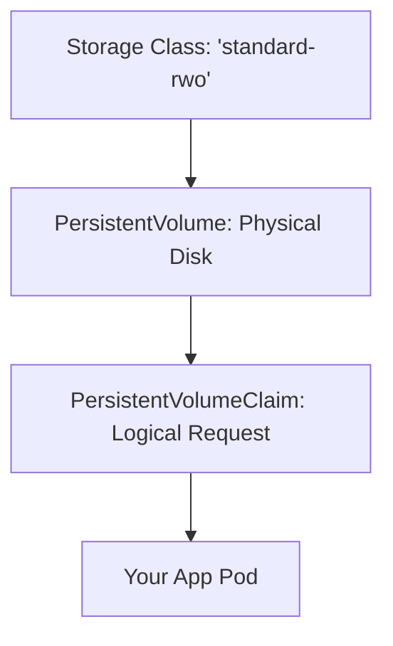
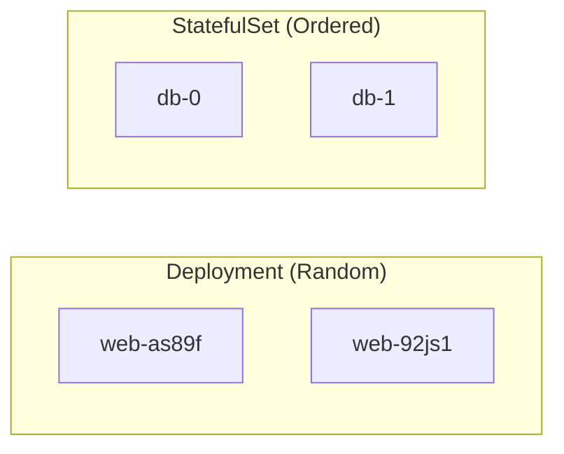

# Day 19: Stateful Workloads (PVs, PVCs & StatefulSets)

**Duration:** ⏱️ 60 Minutes  
**Level:** Intermediate/Advanced  
**ACE Exam Weight:** ⭐⭐⭐⭐ High

---

## 🎯 Learning Objectives

By the end of Day 19, you will be able to:
*   **Manage** persistent data in GKE using PersistentVolumes (PV) and Claims (PVC).
*   **Differentiate** between Stateless (Deployments) and Stateful (StatefulSets) workloads.
*   **Understand** Dynamic Provisioning and Storage Classes.
*   **Architect** a storage solution that survives Pod restarts and Node failures.

---

## 💾 1. Persistence in a Disposable World

By default, data inside a container is **ephemeral**. If the container crashes, the data is gone. To solve this, Kubernetes uses a "Claim" system for storage.

### The Storage Hierarchy



| Component | Responsibility | ACE Exam Note |
| :--- | :--- | :--- |
| **StorageClass** | The "Menu" | Defines the *type* of disk (SSD, Standard, etc.). |
| **PV** | The "Physical Disk" | The actual resource in GCP (Persistent Disk). |
| **PVC** | The "Voucher" | A request by a user for storage of a certain size/mode. |

---

## 🏛️ 2. Deployments vs. StatefulSets

Most apps use Deployments, but databases (MySQL, MongoDB) need **StatefulSets**.

### Critical Differences



*   **Deployments**: Pods are identical and random. If `web-as89f` dies, it's replaced by `web-qwer0`.
*   **StatefulSets**: Pods have unique, sticky identities. If `db-0` dies, it is replaced by a new `db-0` that re-attaches to the **same** disk.

> [!TIP]
> **ACE Pro Tip: Dynamic Provisioning**
> In GKE, you don't need to manually create Persistent Disks. When you create a PVC, GKE uses the **StorageClass** to automatically create the disk in GCP for you. This is "Dynamic Provisioning."

---

## 🛠️ 3. Hands-On Lab: Requesting a Disk

We will create a PersistentVolumeClaim and see GKE provision a disk automatically.

### 🧪 Lab Objective
Understand the PVC lifecycle and see the GCP Persistent Disk creation.

### ✅ Steps

1.  **Define a PVC** (`storage-claim.yaml`):
    ```yaml
    apiVersion: v1
    kind: PersistentVolumeClaim
    metadata:
      name: my-disk-claim
    spec:
      accessModes:
        - ReadWriteOnce
      resources:
        requests:
          storage: 10Gi
      storageClassName: standard-rwo
    ```

2.  **Apply the Claim**:
    ```bash
    kubectl apply -f storage-claim.yaml
    ```

3.  **Verify Status**:
    ```bash
    kubectl get pvc
    ```
    *Result: Once status is `Bound`, run the next command.*

4.  **Confirm in GCP**:
    ```bash
    gcloud compute disks list
    ```
    *You will see a new 10GB disk created specifically for this Kubernetes claim!*

---

## ⚠️ 4. Exam Traps & Best Practices

> [!IMPORTANT]
> **Access Modes**: 
> - **ReadWriteOnce (RWO)**: Only 1 node can mount the disk (standard).
> - **ReadOnlyMany (ROX)**: Many nodes can read (great for shared config).
> - **ReadWriteMany (RWX)**: Many nodes can read/write. **Note:** GCP Persistent Disks do NOT support RWX. You need **Filestore** for this.

> [!WARNING]
> **StatefulSet Replicas**: Never scale down a StatefulSet to zero and expect the disks to be deleted. PVCs are protected and must be deleted manually to avoid accidental data loss (and bills!).

---

<!-- QUIZ_START -->
## 📝 5. Knowledge Check

1.  **Which Kubernetes object acts as a "request" for storage by a user?**
    *   A. StorageClass
    *   B. PersistentVolume (PV)
    *   C. **PersistentVolumeClaim (PVC)** ✅
    *   D. ConfigMap

2.  **You are deploying a database that requires a stable network identifier and a sticky disk. Which workload type should you use?**
    *   A. Deployment
    *   B. **StatefulSet** ✅
    *   C. DaemonSet
    *   D. ReplicaSet

3.  **What is the benefit of using a 'StorageClass' in GKE?**
    *   A. It encrypts the disk.
    *   B. **It enables Dynamic Provisioning, so GKE creates disks on-demand.** ✅
    *   C. It allows Pods to run without a kernel.
    *   D. It increases the CPU limit of the Pod.

4.  **A Pod in a StatefulSet named 'my-db-1' crashes. What will its replacement be named?**
    *   A. 'my-db-2'
    *   B. 'my-db-random-id'
    *   C. **'my-db-1'** ✅
    *   D. 'my-db-0'

5.  **You need multiple nodes to be able to read and write to the same shared directory simultaneously. Can you use a standard GCP Persistent Disk?**
    *   A. Yes, using ReadWriteMany mode.
    *   B. **No, standard PDs do not support ReadWriteMany. Use Google Cloud Filestore instead.** ✅
    *   C. Yes, if the nodes are in the same zone.
<!-- QUIZ_END -->
---

<div class="checklist-card" x-data="{ 
    items: [
        { text: 'I understand the difference between PV and PVC.', checked: false },
        { text: 'I can explain why databases use StatefulSets instead of Deployments.', checked: false },
        { text: 'I know that GKE handles Dynamic Provisioning automatically.', checked: false },
        { text: 'I recall that standard GCP disks only support ReadWriteOnce.', checked: false }
    ]
}">
    <h3>
        <svg viewBox="0 0 24 24" fill="none" stroke="currentColor" stroke-width="2" stroke-linecap="round" stroke-linejoin="round" class="text-blurple">
            <path d="M22 11.08V12a10 10 0 1 1-5.93-9.14"></path>
            <polyline points="22 4 12 14.01 9 11.01"></polyline>
        </svg>
        Day 19 Mastery Checklist
    </h3>
    <template x-for="(item, index) in items" :key="index">
        <div class="checklist-item" @click="item.checked = !item.checked">
            <div class="checklist-box" :class="{ 'checked': item.checked }">
                <svg viewBox="0 0 24 24" fill="none" stroke="currentColor" stroke-width="3" stroke-linecap="round" stroke-linejoin="round">
                    <polyline points="20 6 9 17 4 12"></polyline>
                </svg>
            </div>
            <span x-text="item.text" :class="{ 'line-through text-slate-400': item.checked }"></span>
        </div>
    </template>
</div>

---

### 🗑️ Lab Cleanup (Mandatory)

> **⚠️ Critical:** Delete resources to avoid unecessary billing!

1.  **Delete Project:** (Fastest way)
    ```bash
    gcloud projects delete $PROJECT_ID
    ```
2.  **Or Delete Resources Individually:**
    ```bash
    # Example commands (verify before running)
    gcloud compute instances delete [INSTANCE_NAME] --quiet
    gcloud storage rm -r gs://[BUCKET_NAME]
    ```
