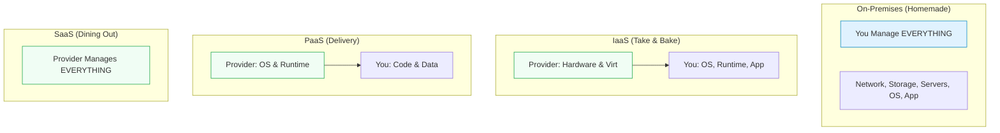

# SECTION 1: Cloud Fundamentals & The Google Difference

> **Official Doc Reference**: [GCP Overview](https://cloud.google.com/docs/overview)

## 1️⃣ What is Cloud Computing?
**The "Hotel vs House" Analogy** 🏨
*   **On-Premises (Your House):** You own it. You fix the leaky roof. You pay the electric bill even if you're on vacation. You buy the furniture (Capital Expense).
*   **Cloud (Hotel):** You check in. You use the room. You check out. You pay only for the nights you stayed (Operational Expense). If the AC breaks, the hotel fixes it, not you.

### Service Models (The "Pizza" Stack) 🍕
Understanding who manages what is the #1 concept in Cloud.

| Model | Analogy | Example | You Manage... |
| :--- | :--- | :--- | :--- |
| **On-Prem** | Cooking at home | Your Data Center | **Everything** |
| **IaaS** | Take-and-Bake Pizza | **Compute Engine (VMs)** | OS, Security Patches, App |
| **PaaS** | Pizza Delivery | **App Engine, Cloud Run** | Just Code & Data |
| **SaaS** | Restaurant | **Gmail, Google Drive** | **Nothing** (Just use it) |

---

## 2️⃣ Why Google Cloud? (The Differentiators)
Why choose GCP over AWS or Azure? It usually comes down to 3 things:

### 1. The Global Fiber Network 🌐
Google owns one of the largest private fiber optic networks in the world.
*   **Benefit:** Your traffic travels on Google's private wires (faster, safer) rather than the public internet.
*   **Result:** Use `Premium Tier` network for global speed.

### 2. Live Migration 🦅
*   **The Magic:** Google can move your running Virtual Machine from one physical server to another **without you noticing**.
*   **Why:** Hardware maintenance happens seamlessly. AWS/Azure often require rebooting your VM for host updates. This is a huge GCP "Superpower".

### 3. TrueTime & Spanner ⏱️
*   Google put **Atomic Clocks** in their data centers to synchronize time globally.
*   Allows **Cloud Spanner** (Global Database) to handle consistent transactions worldwide. (Unmatched by competitors).

---

## 3️⃣ CAP Theorem (The Trade-Off)
In any distributed system, you can only pick 2:
1.  **Consistency (C):** Everyone sees the same data instantly.
2.  **Availability (A):** The system never goes down.
3.  **Partition Tolerance (P):** System survives network cuts.

> **Exam Tip:** Standard databases (SQL) choose **CP**. Standard NoSQL (Cassandra) choose **AP**.
> **GCP Exception:** Cloud Spanner technically chooses **CP** but its network is so good it *feels* like **CA**.

---

## 4️⃣ Hands-On Lab: The Console Tour 🕹️
**Objective:** Get comfortable with the Google Cloud Console.

1.  **Log in:** Go to [console.cloud.google.com](https://console.cloud.google.com).
2.  **The Project Picker:** Top left corner. Click it to see your projects.
    *   *Note:* You must always be "inside" a project to do anything.
3.  **The Hamburger Menu 🍔:** Top left. This is your navigation map.
    *   **Action:** Pin "Compute Engine" and "VPC Network" to the top for easy access.
4.  **Cloud Shell 💻:** Top right (Icon looks like `>_`).
    *   Click it. It opens a standard Linux terminal in your browser.
    *   **Action:** Type `echo "Hello GCP"` to verify it works. This is your command center.

---

## 5️⃣ Checkpoint Quiz
<form>
  <!-- Question 1 -->
  

    
1. You want to deploy a legacy Windows application where you need full control over the Operating System configuration. Which service model fits best?

    

      <label class="block"><input type="radio" name="q1" value="wrong"> PaaS (App Engine)</label>
      <label class="block"><input type="radio" name="q1" value="correct"> IaaS (Compute Engine)</label>
      <label class="block"><input type="radio" name="q1" value="wrong"> SaaS (Gmail)</label>
      <label class="block"><input type="radio" name="q1" value="wrong"> FaaS (Cloud Functions)</label>
    

    

      Correct! IaaS gives you "Infrastructure" (The VM), leaving the OS management to you.
    

  

  <!-- Question 2 -->
  

    
2. Which unique GCP feature allows a running VM to move hosts without rebooting during maintenance?

    

      <label class="block"><input type="radio" name="q2" value="wrong"> Auto Scaling</label>
      <label class="block"><input type="radio" name="q2" value="wrong"> Global Load Balancing</label>
      <label class="block"><input type="radio" name="q2" value="correct"> Live Migration</label>
      <label class="block"><input type="radio" name="q2" value="wrong"> Shielded VMs</label>
    

    

      Correct! Live Migration is a key differentiator for Compute Engine.
    

  

  <!-- Question 3 -->
  

    
3. What is the primary financial benefit of the "Cloud Model" (OpEx) over "On-Premises" (CapEx)?

    

      <label class="block"><input type="radio" name="q3" value="wrong"> You spend more upfront to save later.</label>
      <label class="block"><input type="radio" name="q3" value="correct"> You pay only for what you use (Pay-as-you-go).</label>
      <label class="block"><input type="radio" name="q3" value="wrong"> Hardware is free.</label>
      <label class="block"><input type="radio" name="q3" value="wrong"> You own the servers.</label>
    

    

      Correct! OpEx avoids large upfront capital expenditures.
    

  

</form>

---

### ⚡ Zero-to-Hero: Pro Tips
*   **Cloud Shell is Ephemeral:** Your home directory (`~`) is saved (5GB), but the system installed outside of it resets when the session ends. Don't install heavy software in Root (`/`) and expect it to stay.
*   **The "G" Key:** inside the Console, press `g` then `c` to jump to **C**ompute Engine immediately. Keyboard shortcuts save lives!

---
<!-- FLASHCARDS
[
  {"term": "IaaS", "def": "Infrastructure as a Service. You manage the OS and App (e.g., Compute Engine)."},
  {"term": "PaaS", "def": "Platform as a Service. You manage only Code (e.g., App Engine)."},
  {"term": "OpEx", "def": "Operational Expenditure. Pay-as-you-go model (Cloud)."},
  {"term": "Live Migration", "def": "GCP capability to move running VMs without downtime."},
  {"term": "Region", "def": "A specific geographical location to host resources (e.g., us-central1)."}
]
-->