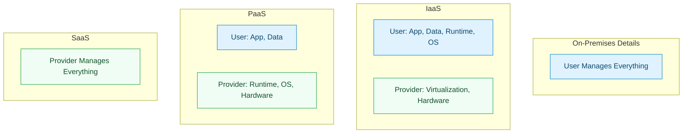
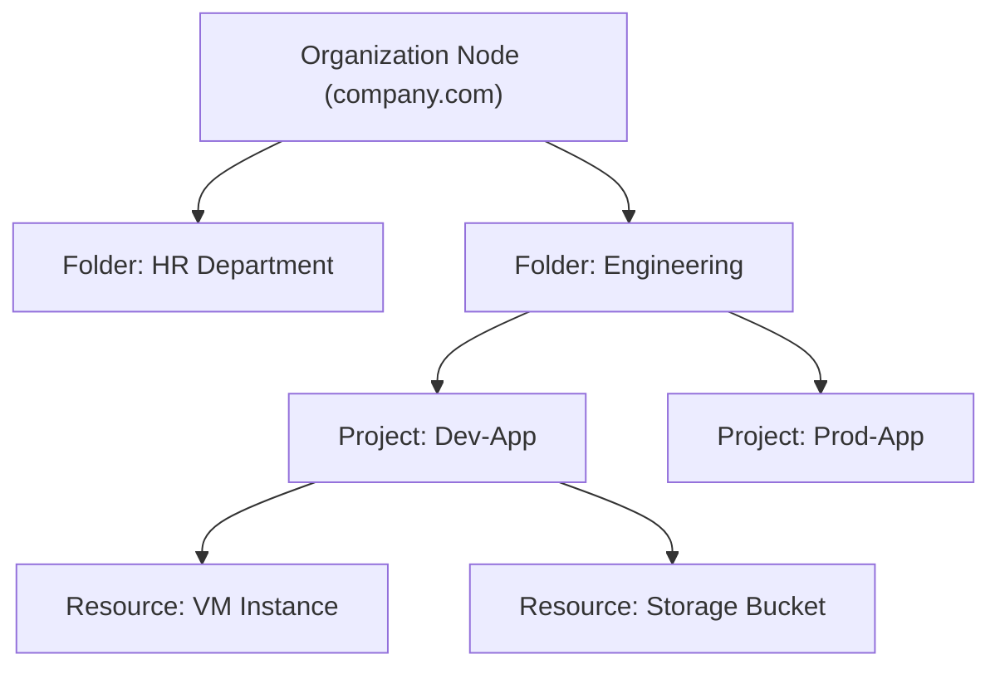

# SECTION 1: Cloud Foundations & Resource Hierarchy

> **Official Doc Reference**: [Resource Hierarchy](https://cloud.google.com/resource-manager/docs/cloud-platform-resource-hierarchy)

## 1️⃣ What is Cloud Computing? (The "Hotel" Analogy)
> **Definition**: Cloud computing is the on-demand delivery of IT resources over the Internet with pay-as-you-go pricing. Instead of buying, owning, and maintaining physical data centers and servers, you access technology services, such as computing power, storage, and databases, on an as-needed basis from a cloud provider like Google Cloud.



### The "Pizza as a Service" Metaphor 🍕
*   **On-Premises (Homemade Pizza):** You buy the dough, cheese, oven, gas, and table. You bake it. You clean the mess.
*   **IaaS (Take and Bake):** You buy the pre-made pizza (VM), but you bake it in your oven (OS/App config).
*   **PaaS (Pizza Delivery):** You order the pizza. It arrives ready. You just set the table (Code) and eat.
*   **SaaS (Dining Out):** You walk into a restaurant. You eat. You pay. No cooking, no cleaning. (Gmail, Drive).

### Why Switch to Cloud?
1.  **Trade CapEx for OpEx:** Stop spending millions upfront on hardware (Capital Expense). Pay only for what you use (Operational Expense).
3.  **Speed (Agility):** Developers can spin up resources in minutes, not weeks.
4.  **TCO (Total Cost of Ownership):**
    *   It's not just hardware. On-prem TCO includes: Electricity, Cooling, Real Estate, Security Guards, and IT Staff salaries.
    *   **Cloud TCO:** shift responsibility for the "lower stack" to Google, often lowering TCO despite monthly bills.

## 1.5️⃣ CAP Theorem (The Trade-Off)
In distributed systems (like Cloud), you can only have 2 of 3:
*   **Consistency:** Everyone sees the same data at the same time.
*   **Availability:** The system is always on.
*   **Partition Tolerance:** The system works even if network cables are cut.
*   *GCP Magic:* Google Spanner (Database) creates a "CA" system that effectively feels like "CP" and "AP" combined using atomic clocks (TrueTime). This is a unique GCP differentiator.

## 2️⃣ The GCP Resource Hierarchy
This is **THE** most important concept in GCP governance. You absolutely must memorize this tree structure.



### The 4 Layers
1.  **Organization Node (Root):**
    *   Represents your company (e.g., `google.com`).
    *   **Pro Tip:** If you use a personal Gmail (`@gmail.com`), you do **NOT** have an Organization Node. You start at the Project level.
    *   Centralized control for Policy (IAM, Org Policy).

2.  **Folders (Grouping):**
    *   Used to group Projects by Department ("HR", "IT") or Environment ("Prod", "Staging").
    *   **Inheritance:** Permissions granted on a Folder flow down to all Projects inside.
    *   **Best Practice Structure:**
        ```mermaid
        graph TD
            Org[Organization] --> F_Prod[Folder: Prod]
            Org --> F_NonProd[Folder: Non-Prod]
            F_Prod --> P_App1[Project: App1-Prod]
            F_NonProd --> F_Dev[Folder: Dev]
            F_NonProd --> F_Test[Folder: Test]
            F_Dev --> P_App1Dev[Project: App1-Dev]
        ```
    *   *Why?* You can apply a broad policy ("No Public IPs") to the `Non-Prod` folder, and a stricter policy ("No Deletion") to the `Prod` folder.

3.  **Projects (The Base Unit):**
    *   **Billing:** Every resource MUST belong to a Project. The Project pays the bill.
    *   **APIs:** You enable APIs (e.g., Compute Engine API) at the Project level.
    *   **Isolation:** Projects are isolated silos. Network traffic does not cross projects by default.

4.  **Resources:**
    *   The actual things you pay for: VMs, Disks, Buckets, Load Balancers.

## 3️⃣ Project Identifiers (Exam Gold 🥇)
Every project has 3 IDs. You will be tested on which one to use when.

| Identifier | Format | Mutability | Used For |
| :--- | :--- | :--- | :--- |
| **Project Name** | "My First App" | **Changeable** | Human friendly display only. |
| **Project ID** | `my-first-app-8852` | **Immutable** (Unchangeable) | **Technical CLI/Terraform references.** Unique across ALL of GCP. |
| **Project Number** | `10384759283` | **Immutable** | **Internal Google use.** Service Accounts use this (`12345@cloudbuild..`). |

> **Critical Exam Rule:** If a command needs to target a project, use the **Project ID**.

## 4️⃣ Resource Scope (Location)
Resources in GCP live in one of three scopes. Mixing these up causes errors.

1.  **Zonal Resources:** Live in a single building.
    *   *Examples:* VM Instance, Persistent Disk.
    *   *Risk:* If the zone fails, they die.
2.  **Regional Resources:** Live across a city (multiple zones).
    *   *Examples:* Static IP Address, Subnet.
    *   *Benefit:* Survives a single zone failure.
3.  **Global Resources:** Live everywhere.
    *   *Examples:* VPC Network, Images, Cloud IAM, Firewall Rules.
    *   *Benefit:* Available to all regions instantly.

## 5️⃣ Hands-On Lab: Exploring the Hierarchy
**Mission:** Identify your Project ID and Number.

1.  Open Cloud Shell.
2.  Run: `gcloud projects list`
    *   *Result:* Shows `PROJECT_ID`, `NAME`, `PROJECT_NUMBER`.
3.  Run: `gcloud config set project [YOUR_PROJECT_ID]`
    *   *Result:* Sets your active working context.

## 6️⃣ Checkpoint Questions

**Q1. Which Identifier is globally unique and cannot be changed?**
*   A. Project Name
*   B. Project ID
*   C. Project Number
*   D. Organization Node
> **Answer: B.** Project ID is immutable and unique. The name is mutable. Number is for internal Google use.

**Q2. You want to grant the "Network Admin" role to your entire Networking Team for ALL projects. Where do you attach the policy?**
*   A. At each Project individually
*   B. At the Organization Node
*   C. At the Folder level (e.g., "Networking Folder")
*   D. On the specific VPC
> **Answer: C.** (Or B). Best practice is Folder level for team-specific inheritance.

**Q3. Is a VPC Network Zonal or Global?**
*   A. Zonal
*   B. Regional
*   C. Global
*   D. Multi-Regional
> **Answer: C.** The VPC is global. Subnets are Regional.

**Q4. Which resource always lives in a single Zone?**
*   A. Static IP
*   B. Disk (Persistent Disk)
*   C. Image
*   D. VPC Network
> **Answer: B.** Disks are zonal. If the zone fails, the disk is inaccessible (unless Regional PD is used).

**Q5. What is the correct hierarchy from top to bottom?**
*   A. Organization -> Project -> Folder -> Resource
*   B. Project -> Folder -> Organization -> Resource
*   C. Organization -> Folder -> Project -> Resource
*   D. Organization -> Resource -> Project -> Folder
> **Answer: C.** Org > Folder > Project > Resource.

**Q6. You are a startup without a Google Workspace or Cloud Identity account (using @gmail.com). What node is missing from your hierarchy?**
*   A. Project
*   B. Folder
*   C. Organization
*   D. Billing Account
> **Answer: C.** Consumer accounts start at the Project level. No Org Node.

**Q7. Which expenditure model does Cloud Computing primarily use?**
*   A. CapEx (Capital Expenditure)
*   B. OpEx (Operational Expenditure)
*   C. Upfront Licensing
*   D. Depreciation Amortization
> **Answer: B.** Pay-as-you-go is OpEx.

**Q8. According to the CAP Theorem, GCP's Cloud Spanner offers valid consistency and availability. What does it trade off (technically), even though it feels like it doesn't?**
*   A. Atomic Clocks
*   B. Partition Tolerance
*   C. Latency
*   D. Security
> **Answer: B.** Spanner claims "CA" in practice, but strictly speaking, no system can violate CA. It manages Partition Tolerance with TrueTime.


<!-- FLASHCARDS
[
  {
    "term": "Project ID",
    "def": "The globally unique, immutable identifier for your project. Used in CLI/Terraform."
  },
  {
    "term": "Organization Node",
    "def": "The root node for a company. Not available for @gmail.com users."
  },
  {
    "term": "Folder",
    "def": "A grouping of projects (e.g., by Department). Policies inherit down from here."
  },
  {
    "term": "Zonal Resource",
    "def": "Lives in 1 Zone. Dies if zone fails. Ex: VM, Persistent Disk."
  },
  {
    "term": "Global Resource",
    "def": "Available everywhere. Ex: VPC Network, Firewall Rules, IAM."
  }
]
-->