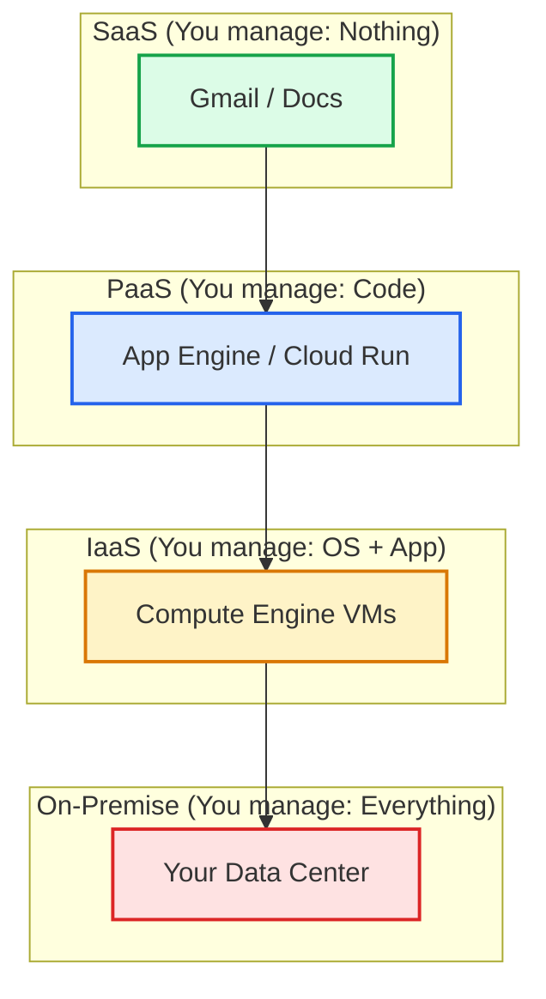

# Day 1: Cloud Foundations – Understanding the Cloud & GCP

**Duration:** ⏱️ 45 Minutes  
**Level:** Absolute Beginner  
**ACE Exam Weight:** ⭐ High (Foundational concepts appear across the exam)

---

> [!TIP]
> **TL;DR (Too Long; Didn't Read)**  
> Cloud computing = Renting computers over the internet instead of buying them. You pay monthly like electricity, not upfront like buying a generator. GCP is Google's cloud platform with services like Compute Engine (VMs), Cloud Storage (files), and App Engine (apps).

---

## 🎯 Learning Objectives

By the end of this lesson, you will confidently:

| ✅ Objective | Why It Matters |
|-------------|----------------|
| **Explain** cloud computing in simple terms | Foundation for every GCP concept |
| **Compare** On-Premise vs Cloud infrastructure | Common exam scenario questions |
| **Distinguish** IaaS, PaaS, SaaS models | Helps choose the right GCP service |
| **Identify** why enterprises choose GCP | Context for architecture decisions |
| **Navigate** the Google Cloud Console | Essential hands-on skill |

---

## 🧠 1. What Is Cloud Computing? (Plain-English)

**Cloud Computing = Renting computing resources over the internet.**

Think of it this way: Instead of buying and managing physical computers in your office, you *rent* them from Google, Amazon, or Microsoft. They handle the hardware; you just use it.

### 🚫 The Old Way (Buying Physical Hardware)

| Resource | What You Had To Do |
|----------|--------------------|
| 🖥️ **Servers** | Purchase machines, rack them in a room |
| 💾 **Storage** | Buy hard drives, set up backup systems |
| 🔌 **Networking** | Run cables, configure routers & switches |
| 🏢 **Data Centers** | Rent space, pay for cooling & electricity |

### ✅ The New Way (Renting from the Cloud)

You access these same resources via the internet from a provider like Google Cloud.

> **💡 Key Insight:** You pay only for what you use, when you use it — like a utility bill, not a giant upfront purchase.

---

## 🌍 2. Real-World Analogy: Electricity ⚡

Understanding the shift from On-Premise to Cloud is easier with an analogy.

| Feature | 🏭 Old Way (On-Premise) | 🔌 New Way (Cloud) |
| :--- | :--- | :--- |
| **Source** | Build your own power plant. | Plug into the public grid. |
| **Cost** | Buy generators & fuel upfront. | Pay a monthly bill based on usage. |
| **Maintenance** | You fix it when it breaks. | The utility provider maintains it. |
| **Capacity** | Fixed (Power outages if overloaded). | Scales instantly (Unlimited power). |

**Cloud works exactly the same way.** You don't build the data center; you just plug in and use the power (compute/storage) you need.

---

## 🏢 3. On-Premise vs. Cloud (Exam Favorite)

The ACE exam frequently tests your understanding of *why* a company would move to the cloud.

| Feature | On-Premise (Traditional) | Cloud |
| :--- | :--- | :--- |
| **Upfront Cost** | 💰 **Very High (CapEx)** Capital Expenditure (owning assets). | 📉 **Low (OpEx)** Operational Expenditure (renting services). |
| **Scaling** | 🐢 **Slow** Weeks/Months to order hardware. | 🚀 **Instant** Minutes to spin up thousands of VMs. |
| **Maintenance** | 🔧 **Your Responsibility** Patching, hardware replacement. | ☁️ **Provider's Responsibility** Automated updates and repairs. |
| **Availability** | ⚠️ **Limited** Single point of failure. | 🌐 **Global** Redundant across multiple regions. |

> **🎯 ACE Tip:** If a question mentions "cost optimization", "scalability", or "global reach" → **Cloud** is standardly the correct answer.
---

## 🧩 4. Cloud Service Models (IaaS, PaaS, SaaS)

**The Big Question:** Who manages what? This is the #1 confusion for beginners.

### Quick Reference Table

| Model | One-Liner | You Manage | Provider Manages | GCP Example |
|-------|-----------|------------|------------------|-------------|
| **IaaS** | "Rent the hardware" | OS, Apps, Data | Hardware, Network | **Compute Engine** |
| **PaaS** | "Just bring code" | Code only | Everything else | **App Engine, Cloud Run** |
| **SaaS** | "Just use it" | Configuration | Everything | **Gmail, Google Docs** |

### 🔹 IaaS – Infrastructure as a Service
**Think:** "Virtual hardware rental"  
**Reality:** You get a virtual machine. You install the OS, apps, and manage everything on top.  
**Best for:** When you need full control (custom software, legacy apps).

### 🔹 PaaS – Platform as a Service  
**Think:** "Just deploy your code"  
**Reality:** You upload your application code. The platform handles servers, scaling, patching.  
**Best for:** Modern web apps, APIs, microservices.

### 🔹 SaaS – Software as a Service
**Think:** "Log in and use it"  
**Reality:** The software is ready to use in your browser. No installation needed.  
**Best for:** Email, documents, CRM systems.

### Responsibility Pyramid (Visual)

> **🎯 Exam Shortcut:**
> *   “No server management at all” → **SaaS**
> *   “Deploy code only” → **PaaS**
> *   “Full control over VM / OS” → **IaaS**

---

## ☁️ 5. Why Google Cloud Platform (GCP)?

Companies choose Google Cloud specifically for these advantages:

1.  **🌐 Global Network:** Google's private fiber network provides low-latency global connectivity.
2.  **🔒 Security:** "Secure by Design" infrastructure (encrypted at rest & in transit by default).
3.  **📊 Data & AI:** Best-in-class tools for Big Data (BigQuery) and ML (Vertex AI).
4.  **💰 Discounts:** Automatic savings with *Sustained Use Discounts* (no action needed).
5.  **🧩 Developer-Friendly:** Modern, container-first approach (Kubernetes was born here).

---

## 🛠️ 6. Hands-On Lab: Explore Google Cloud Console

**🧪 Lab Objective:** Get familiar with the GCP Console UI navigation.

### ✅ Steps

1.  **Open the Console**
    *   Navigate to [console.cloud.google.com](https://console.cloud.google.com).
2.  **Sign In**
    *   Use your Google account credentials.
3.  **Explore the Navigation Menu (☰)**
    *   Located in the top-left corner. This is your primary map.
    *   Click it to see the "Pinned" products like Compute Engine and Storage.
4.  **Check the Project Selector**
    *   Located in the top bar. Every resource in GCP *must* belong to a Project.
5.  **Use the Search Bar**
    *   Top middle. Try searching for "Billing" or "Support".
6.  **Visit Key Services (View Only)**
    *   Click **Compute Engine** (Virtual Machines).
    *   Click **Cloud Storage** (Buckets).
    *   Click **IAM & Admin** (Permissions).

> **⛔ CAUTION:** Do **NOT** create resources yet (cost safety). Just look around!

---

## ⚠️ 7. Common Beginner Mistakes

Avoid these traps that catch many first-time learners:

*   ❌ **Thinking cloud is “free forever”:** Always check the Free Tier limits.
*   ❌ **Forgetting to delete resources:** Leaving a 64-core VM running can cost $$$ overnight.
*   ❌ **Confusing GCP with Google Workspace:** GCP is for building apps; Workspace (Gmail/Docs) is for business productivity.
*   ❌ **Skipping hands-on practice:** You cannot pass the ACE exam just by reading theory.

---

<!-- QUIZ_START -->
## 📝 8. Quick Knowledge Check (Quiz)

1.  **What is cloud computing?**
    *   A. **Remote servers / On-demand IT resources** ✅
    *   B. Physical hardware
    *   C. Local storage
    *   D. None
    *   **Explanation:** Cloud computing is the on-demand delivery of compute, storage, and other IT resources via the internet with pay-as-you-go pricing.

2.  **Which is a Google Cloud region?**
    *   A. **us-east1** ✅
    *   B. aws-west
    *   C. azure-central
    *   D. None
    *   **Explanation:** us-east1 (South Carolina) is a standard GCP region. aws-west and azure-central belong to other providers.

3.  **What is GCP Console?**
    *   A. **Web UI** ✅
    *   B. Command line
    *   C. API
    *   D. SDK
    *   **Explanation:** The Google Cloud Console is the primary web interface used to manage your GCP resources visually.

4.  **Cloud storage benefit?**
    *   A. **Scalability** ✅
    *   B. Fixed cost
    *   C. Local only
    *   D. Limited
    *   **Explanation:** Cloud Storage is designed for 'Exabyte' scale, allowing you to store virtually unlimited data that grows with your needs.

5.  **GCP stands for?**
    *   A. **Google Cloud Platform** ✅
    *   B. General Computing
    *   C. Global CPU
    *   D. None
    *   **Explanation:** GCP stands for Google Cloud Platform.
<!-- QUIZ_END -->
---

## 🎯 9. ACE Exam Tips (Gold)

*   **Scenario Questions:** The exam will ask questions like *"Company X wants to move to the cloud to reduce maintenance overhead..."*
    *   Look for **PaaS** or **SaaS** options first.
*   **Keywords to Watch:**
    *   "Cost-effective"
    *   "Scalable"
    *   "Minimal management"
*   **Elimination Strategy:** If a requirement includes "Auto-scaling" or "Global reach", eliminate typical **On-Premise** answers immediately.

---

## ✅ 10. Day 1 Checklist

    <h3>
        <svg viewBox="0 0 24 24" fill="none" stroke="currentColor" stroke-width="2" stroke-linecap="round" stroke-linejoin="round" width="24" height="24" class="text-blurple">
            <path d="M22 11.08V12a10 10 0 1 1-5.93-9.14"></path>
            <polyline points="22 4 12 14.01 9 11.01"></polyline>
        </svg>
        Day 1 Checklist
    </h3>
    <template x-for="(item, index) in items" :key="index">
        

            

                <svg viewBox="0 0 24 24" fill="none" stroke="currentColor" stroke-width="3" stroke-linecap="round" stroke-linejoin="round">
                    <polyline points="20 6 9 17 4 12"></polyline>
                </svg>
            

            
        

    </template>

### 🚀 What’s Next?
**Day 2: GCP Projects, Billing & Free Tier**
*   What a GCP Project is 🏗️
*   How billing works 💳
*   How to avoid surprise charges 💸

<!-- FLASHCARDS
[
  {
    "term": "Cloud Computing",
    "def": "On-demand delivery of compute, storage, applications via the internet. Pay-as-you-go."
  },
  {
    "term": "CapEx",
    "def": "Capital Expenditure. Upfront cost for physical hardware (Data Centers)."
  },
  {
    "term": "OpEx",
    "def": "Operational Expenditure. Ongoing cost for services (Cloud). Pay for what you use."
  },
  {
    "term": "TCO",
    "def": "Total Cost of Ownership. Hidden costs (AC, Security, Staff) + Hardware."
  },
  {
    "term": "GCP",
    "def": "Google Cloud Platform. A suite of cloud services hosted on Google's infrastructure."
  }
]
-->
