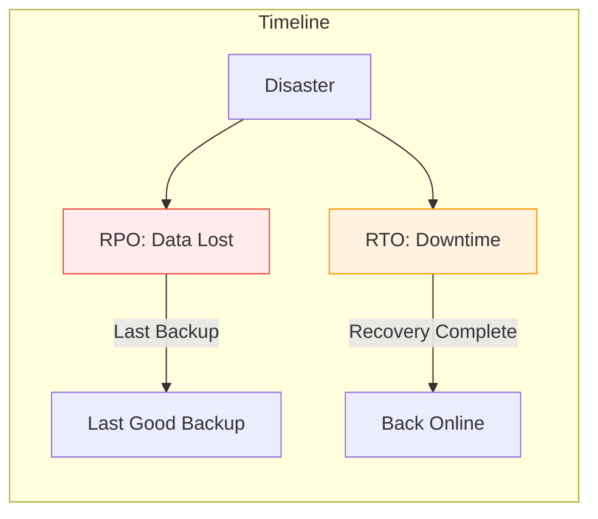
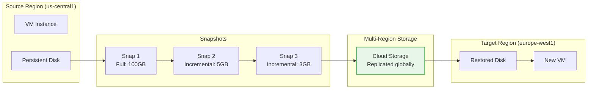
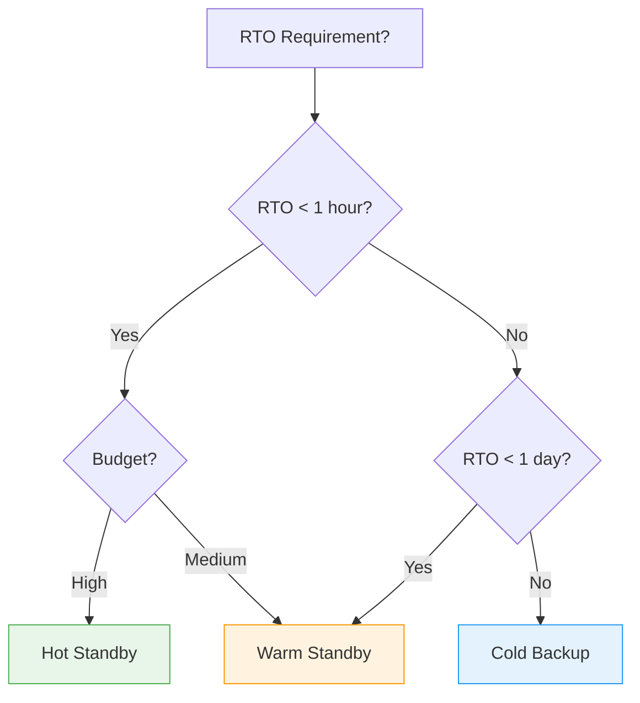
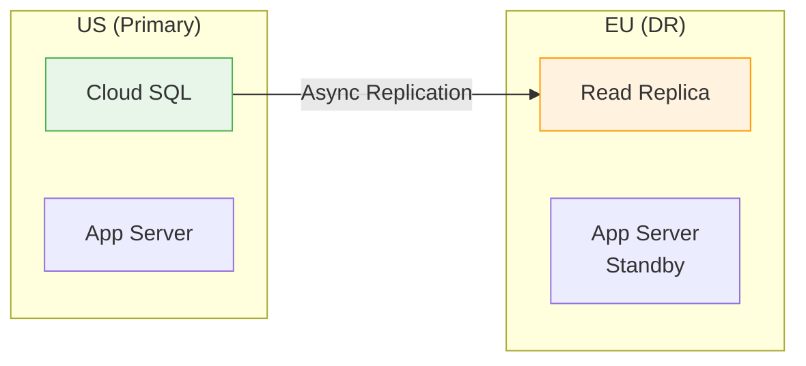

# BONUS: Backup & Disaster Recovery

**Duration:** ⏱️ 45 Minutes  
**Level:** Intermediate  
**ACE Exam Weight:** ⭐⭐⭐ High (DR is heavily tested in scenario questions)

---

> [!TIP]
> **TL;DR (Backup & DR Essentials)**  
> **RPO** = How much data can you lose? **RTO** = How long can you be offline? Snapshots are GLOBAL (restore anywhere), INCREMENTAL (saves money), and INDEPENDENT (deleting VM keeps snapshots). DR tiers: Cold (cheap, RTO=days) → Warm (RTO=hours) → Hot (expensive, RTO=minutes).

---

## 🎯 Learning Objectives

| ✅ Skill | Why It Matters |
|---------|----------------|
| **Understand** RTO and RPO | Drives all DR architecture decisions |
| **Configure** snapshot schedules | Automate backups without manual work |
| **Design** Cold/Warm/Hot DR | Match cost to business requirements |
| **Implement** cross-region replication | Survive regional outages |

---

## 🧠 1. Backup vs Disaster Recovery (Plain-English)

### 💡 Real-World Analogy

| Concept | Analogy |
|---------|---------|
| **Backup** | Photocopy of your passport. If you lose it, you can prove who you are. |
| **Disaster Recovery** | Second passport + suitcase + plane ticket in a safe deposit box in another country. If your house burns down, you fly there and continue your life. |

### Key Metrics



| Metric | Question | Example |
|--------|----------|---------|
| **RPO** (Recovery Point Objective) | How much data can we lose? | "We can lose 15 minutes of work" |
| **RTO** (Recovery Time Objective) | How long can we be offline? | "We must be back in 4 hours" |

> **🎯 ACE Tip:** Lower RPO/RTO = Higher cost. The exam tests if you can match requirements to appropriate DR tier.

---

## 📸 2. GCP Backup Tools

### Snapshot Types

| Type | Scope | Speed | Use Case |
|------|-------|-------|----------|
| **Disk Snapshot** | Single disk | Fast | VM backup |
| **Machine Image** | Entire VM (disks + config) | Medium | Full VM clone |
| **Custom Image** | OS template | Fast | Golden image |
| **Cloud SQL Backup** | Database | Auto | Managed DB |

### Snapshot Architecture



### Key Facts About Snapshots
*   ✅ **Incremental** - Only changed blocks are stored (saves money)
*   ✅ **Global** - Can restore in any region
*   ✅ **Independent** - Deleting VM doesn't delete snapshots
*   ✅ **Consistent** - Application-consistent if VM is running

---

## 🔄 3. DR Strategy Tiers

### Comparison Table

| Strategy | RTO | RPO | Cost | Architecture |
|----------|-----|-----|------|--------------|
| **Cold** | Days | Hours-Days | 💰 | Backups in Archive storage, no running infra |
| **Warm** | Hours | Minutes | 💰💰 | Database active, app servers off |
| **Hot** | Minutes | Seconds | 💰💰💰 | Active-Active in multiple regions |
| **Multi-Region Active-Active** | Near-Zero | Near-Zero | 💰💰💰💰 | Everything running everywhere |

### Strategy Decision Tree



---

## 🛠️ 4. Hands-On Lab: Automated Snapshot Schedule

### Step 1: Create Snapshot Schedule
```bash
gcloud compute resource-policies create snapshot-schedule daily-backup \
    --description="Daily backup at 2 AM" \
    --max-retention-days=14 \
    --start-time=02:00 \
    --daily-schedule \
    --region=us-central1 \
    --storage-location=us
```

### Step 2: Attach to Disk
```bash
gcloud compute disks add-resource-policies my-disk \
    --resource-policies=daily-backup \
    --zone=us-central1-a
```

### Step 3: Verify
```bash
# List snapshots
gcloud compute snapshots list

# Check schedule
gcloud compute resource-policies describe daily-backup --region=us-central1
```

### Step 4: Restore in Different Region
```bash
# Create disk from snapshot in Europe
gcloud compute disks create recovered-disk \
    --source-snapshot=my-disk-snapshot-001 \
    --zone=europe-west1-b

# Create VM from restored disk
gcloud compute instances create recovered-vm \
    --disk=name=recovered-disk,boot=yes \
    --zone=europe-west1-b
```

---

## 🌍 5. Cross-Region DR Patterns

### Pattern 1: Database Replication


### Pattern 2: Global Load Balancer Failover
```bash
# Configure health check
gcloud compute health-checks create http my-health-check \
    --port=80 \
    --request-path=/healthz

# Backend service with multiple regions
gcloud compute backend-services create my-global-backend \
    --global \
    --health-checks=my-health-check \
    --load-balancing-scheme=EXTERNAL
```

---

## ⚠️ 6. Exam Traps & Pro Tips

### ❌ Common Mistakes
| Mistake | Reality |
|---------|---------|
| "Snapshots are zonal" | No! Snapshots are globally accessible |
| "Deleting VM deletes snapshots" | No! Snapshots are independent |
| "Hot standby is always best" | No! It's expensive and often overkill |

### ✅ Pro Tips
*   **Use snapshot schedules** instead of manual snapshots
*   **Test your DR plan** - an untested plan is no plan
*   **Cross-region restores** are slower but possible
*   **Machine Images** are better for full VM clones

---

<!-- QUIZ_START -->
## 📝 7. Knowledge Check Quiz

1. **What does RPO (Recovery Point Objective) measure?**
    *   A. Time to recover
    *   B. **Maximum acceptable data loss** ✅
    *   C. Cost of recovery
    *   D. Backup frequency

2. **Where are GCP snapshots stored?**
    *   A. In the same zone as the disk
    *   B. In the same region as the disk
    *   C. **In Cloud Storage (globally accessible)** ✅
    *   D. On the VM's local SSD

3. **Which DR strategy has the lowest cost but highest RTO?**
    *   A. Hot Standby
    *   B. Warm Standby
    *   C. **Cold Backup** ✅
    *   D. Active-Active

4. **If you delete a VM, what happens to its snapshots?**
    *   A. They are automatically deleted
    *   B. They expire after 30 days
    *   C. **They remain and are independent** ✅
    *   D. They become read-only

5. **You need to move a VM from Project A to Project B. What should you create?**
    *   A. Snapshot
    *   B. **Machine Image** ✅
    *   C. Export to VMDK
    *   D. Live migration
<!-- QUIZ_END -->

---

<!-- FLASHCARDS
[
  {"term": "RPO", "def": "Recovery Point Objective. How much data can you afford to lose."},
  {"term": "RTO", "def": "Recovery Time Objective. How long can you be offline."},
  {"term": "Snapshot", "def": "Incremental backup of a Persistent Disk. Stored globally. Independent of VM."},
  {"term": "Machine Image", "def": "Complete VM backup including disks, metadata, and configuration."},
  {"term": "Cold DR", "def": "Lowest cost DR. Backups only, no running infrastructure. RTO = days."},
  {"term": "Hot DR", "def": "Highest cost DR. Active-Active across regions. RTO = minutes."},
  {"term": "Snapshot Schedule", "def": "Resource policy for automated daily/weekly backups with retention."}
]
-->

---

### 🗑️ Lab Cleanup (Mandatory)

> **⚠️ Critical:** Delete resources to avoid unecessary billing!

1.  **Delete Project:** (Fastest way)
    ```bash
    gcloud projects delete $PROJECT_ID
    ```
2.  **Or Delete Resources Individually:**
    ```bash
    # Example commands (verify before running)
    gcloud compute instances delete [INSTANCE_NAME] --quiet
    gcloud storage rm -r gs://[BUCKET_NAME]
    ```
