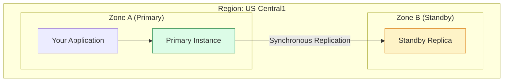

# SECTION 20: Cloud SQL (Databases)

> **Official Doc Reference**: [Cloud SQL Documentation](https://cloud.google.com/sql/docs)

## 1️⃣ Overview: Structured Data
*   **What is it?** Fully managed MySQL, PostgreSQL, or SQL Server.
*   **The Problem:** Running a database on a VM is hard. Backups? Patches? Replication? Failover?
*   **The Solution:** Cloud SQL does all of that automatically.

## 2️⃣ Architecture Diagram: High Availability (HA)

*   **Failover:** If Zone A burns down, Google automatically switches the IP to point to Zone B. Your app pauses for 60 seconds, then reconnects. **Zero data loss** (Synchronous).

## 3️⃣ Read Replicas vs HA (Exam Critical 🥇)

| Feature | **High Availability (HA)** | **Read Replica** |
| :--- | :--- | :--- |
| **Purpose** | **Reliability** (Survive a crash). | **Performance** (Scale Reads). |
| **Zones** | Primary + Standby (Waitng). | Any Zone (Active). |
| **Replication** | Synchronous (Slow writing, safe data). | Asynchronous (Fast writing, laggy data). |
| **Can you query it?** | NO. Standby is asleep. | YES. Read-Only queries. |

## 4️⃣ Connecting Securely (Private IP) 🔒
*   **Public IP:** (Easy / Insecure). Put the DB on the internet. Whitelist your IP.
*   **Private IP:** (Hard / Secure). The DB only exists inside your VPC.
    *   *Req:* Requires **Private Service Access** (Peering) between your VPC and Google's monitoring VPC.

## 5️⃣ Zero-to-Hero: Cloud SQL Proxy ⚡
*   **Problem:** Connecting to a DB requires managing SSL certificates + IP whitelisting. Painful.
*   **Solution:** **Cloud SQL Auth Proxy**.
    *   A tiny binary runs on your client machine.
    *   It creates a secure tunnel automatically using IAM.
    *   *Code:* Connect to `localhost:3306`. The proxy tunnels it to Google.

## 6️⃣ Exam Traps 🚨
*   **Trap:** "I need to store 50TB of data for analytics."
    *   *Answer:* **BigQuery**. Cloud SQL is for transactional data (OLTP), usually under 10TB.
*   **Trap:** "I need global scale (Active-Active in US and Europe)."
    *   *Answer:* **Cloud Spanner**. Cloud SQL is Regional.
*   **Trap:** "I accidentally deleted a table. How do I recover?"
    *   *Answer:* **Point-in-Time Recovery (PITR)**. You can roll back the database to "10:42 AM yesterday".

## 7️⃣ Checkpoint Questions (Exam Style)
**Q1. You want to offload read-heavy analytics queries from your primary database. What do you create?**
*   A. High Availability Standby.
*   B. A Read Replica.
*   C. A Cloud Storage Bucket.
*   D. A Backup.
> **Answer: B.** Replicas are for scaling reads.

**Q2. Which connection method uses IAM permissions instead of IP whitelisting?**
*   A. Public IP.
*   B. Cloud SQL Auth Proxy.
*   C. VPN.
*   D. SSH Tunnel.
> **Answer: B.** The Auth Proxy handles the crypto and auth for you.

**Q3. True or False: Cloud SQL automatically scales storage capacity up when you run out of space.**
*   A. True
*   B. False
> **Answer: A.** If "Automatic Storage Increase" is enabled (default), it adds disk space as you grow.
