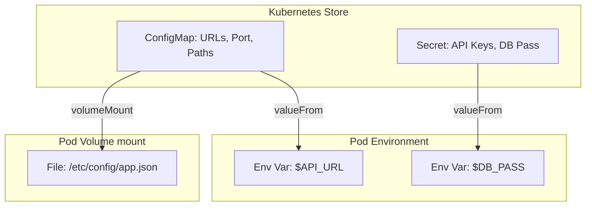

# Day 20: GKE ConfigMaps & Secrets

**Duration:** ⏱️ 45 Minutes  
**Level:** Intermediate  
**ACE Exam Weight:** ⭐⭐⭐⭐ High

---

## 🎯 Learning Objectives

By the end of Day 20, you will be able to:
*   **Decouple** application configuration from container images for multi-environment portability.
*   **Architect** secure secret management using Kubernetes Secrets and GKE's Application-layer Encryption.
*   **Inject** configuration data as both environment variables and mounted volume files.
*   **Validate** security postures using the 12-Factor App methodology.

---

## 🧠 1. Decoupling Config from Code

The gold standard for cloud-native apps is the **12-Factor Methodology**. Factor III states: *Store config in the environment*. You should use the **same** Docker image for Dev, Staging, and Production.

### The Injection Flow



| Object | Data Type | ACE Exam Note |
| :--- | :--- | :--- |
| **ConfigMap** | Plain Text | Use for non-sensitive data. Size limit: 1MB. |
| **Secret** | Base64 Encoded | Use for passwords/keys. **Warning:** Base64 is NOT encryption. |

---

## 🔐 2. Hardening GKE Secrets

On GKE, security goes beyond basic Kubernetes.

> [!IMPORTANT]
> **ACE Exam Alert: Encryption at Rest**
> By default, GKE encrypts data at rest (including Secrets in etcd). However, for high-security compliance, you can enable **Application-layer Secrets Encryption**. This uses Google Cloud KMS (Key Management Service) to wrap the Kubernetes secrets in an extra layer of protection.

---

## 🛠️ 3. Hands-On Lab: Multi-Method Injection

We will create a Secret and mount it as a file inside a container.

### 🧪 Lab Objective
Practice mounting sensitive data as a volume instead of an environment variable (which is often more secure as env vars can show up in logs).

### ✅ Steps

1.  **Create a Secret**:
    ```bash
    kubectl create secret generic mysql-pass --from-literal=password=P@ssw0rd123
    ```

2.  **Deploy a Pod with Volume Mount** (`secret-pod.yaml`):
    ```yaml
    apiVersion: v1
    kind: Pod
    metadata:
      name: secret-reader
    spec:
      containers:
      - name: alpine
        image: alpine
        command: ["sh", "-c", "sleep 3600"]
        volumeMounts:
        - name: secret-vol
          mountPath: "/etc/secrets"
          readOnly: true
      volumes:
      - name: secret-vol
        secret:
          secretName: mysql-pass
    ```

3.  **Read the Secret from File**:
    ```bash
    kubectl exec secret-reader -- cat /etc/secrets/password
    ```
    *Result: "P@ssw0rd123" is printed. The file exists only in the Pod's memory!*

---

## ⚠️ 4. Exam Traps & Best Practices

> [!WARNING]
> **Base64 Confusion**: Many candidates think `metadata: { name: my-secret }` means the data is encrypted. Standard Kubernetes Secrets are only **Base64 encoded**. Anyone with `get secrets` permissions can decode them easily. Use RBAC (Role-Based Access Control) to limit who can see secrets.

> [!TIP]
> **External Integration**: For enterprise-grade security, use **GCP Secret Manager** and sync it with GKE using the **External Secrets Operator** or the **Secret Manager CSI Driver**.

---

## 📝 5. Knowledge Check

<!-- QUIZ_START -->
1.  **You need to provide a database connection string that is different for Dev and Prod, but not sensitive. Which object should you use?**
    *   A. Secret
    *   B. **ConfigMap** ✅
    *   C. Environment Variable hardcoded in Dockerfile
    *   D. PersistentVolumeClaim

2.  **Which statement about Kubernetes Secrets is TRUE?**
    *   A. They are encrypted with AES-256 by default in the cluster.
    *   B. **They are Base64 encoded and should be protected with RBAC.** ✅
    *   C. They can store files up to 10GB in size.
    *   D. They are automatically synced with your local hard drive.

3.  **How can you add an extra layer of security to GKE secrets to meet strict compliance requirements?**
    *   A. By using a ConfigMap instead.
    *   B. **By enabling Application-layer Secrets Encryption using Google Cloud KMS.** ✅
    *   C. By password-protecting the kubectl command.
    *   D. By running GKE in a private VPC only.

4.  **You have a ConfigMap containing 50 different property settings. What is the most efficient way to give a Pod access to all of them as files?**
    *   A. Use 50 `valueFrom` entries in environment variables.
    *   B. **Mount the ConfigMap as a Volume at a specific path.** ✅
    *   C. Copy the properties into the Docker image.
    *   D. Use a StatefulSet to attach a disk with the config.
<!-- QUIZ_END -->

---

<div class="checklist-card" x-data="{ 
    items: [
        { text: 'I can explain why we decouple config from images.', checked: false },
        { text: 'I know that Secrets are only Base64 encoded by default.', checked: false },
        { text: 'I understand how to mount a Secret as a volume.', checked: false },
        { text: 'I understand the role of KMS in GKE secret protection.', checked: false }
    ]
}">
    <h3>
        <svg viewBox="0 0 24 24" fill="none" stroke="currentColor" stroke-width="2" stroke-linecap="round" stroke-linejoin="round" class="text-blurple">
            <path d="M22 11.08V12a10 10 0 1 1-5.93-9.14"></path>
            <polyline points="22 4 12 14.01 9 11.01"></polyline>
        </svg>
        Day 20 Mastery Checklist
    </h3>
    <template x-for="(item, index) in items" :key="index">
        <div class="checklist-item" @click="item.checked = !item.checked">
            <div class="checklist-box" :class="{ 'checked': item.checked }">
                <svg viewBox="0 0 24 24" fill="none" stroke="currentColor" stroke-width="3" stroke-linecap="round" stroke-linejoin="round">
                    <polyline points="20 6 9 17 4 12"></polyline>
                </svg>
            </div>
            <span x-text="item.text" :class="{ 'line-through text-slate-400': item.checked }"></span>
        </div>
    </template>
</div>
