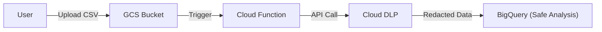

# SECTION 20: Security Command Center & DLP

> **Official Doc Reference**: [SCC Overview](https://cloud.google.com/security-command-center)

## 1️⃣ Security Command Center (SCC)
SCC is the "Dashboard" for your organization's security posture.

| Feature | Standard Tier (Free) | Premium Tier (Paid) |
| :--- | :--- | :--- |
| **Asset Discovery** | ✅ Yes | ✅ Yes |
| **Basic Findings** | ✅ (Open Firewall, Public Bucket) | ✅ Yes |
| **Threat Detection** | ❌ No | ✅ (Cryptomining, SSH Brute Force) |
| **Compliance** | ❌ No | ✅ (PCI-DSS, CIS Benchmarks) |
| **Vulnerability Scan** | ❌ No | ✅ (Web App Scanners) |

**Use Case:** Your boss asks, "Are we PCI compliant?" -> You look at SCC Premium.

## 2️⃣ Cloud DLP (Data Loss Prevention)
DLP is a fully managed service to inspect/redact sensitive data.
*   **InfoTypes:** Pre-built detectors for Credit Cards, US SSN, Email, Passport Numbers.
*   **Actions:**
    *   **Inspect:** "Tell me where the credit cards are."
    *   **Redact:** "Replace the credit card with `###-####`."
    *   **De-identify:** Tokenize the data (reversible or irreversible).

### Architecture Tip: DLP in Data Pipelines


## 3️⃣ Cloud Armor (WAF)
Cloud Armor is a **Web Application Firewall** that sits at the Global Load Balancer edge.
*   **Protects against:**
    *   DDoS Attacks (L3/L4/L7).
    *   OWASP Top 10 (SQL Injection, XSS).
    *   Geo-blocking (Block traffic from specific countries).

## 4️⃣ Hands-On Lab: Redacting Sensitive Data 🕵️‍♂️
**Mission:** Use DLP to mask a phone number in a text string.

1.  **Open Cloud Shell.**
2.  **Run the Inspect API:**
    ```bash
    gcloud dlp inspect \
      --content="My phone number is 555-123-4567" \
      --info-types=PHONE_NUMBER
    ```
    *Output:* It will tell you it found a "PHONE_NUMBER" at "Likelihood: VERY_LIKELY".

3.  **Run the De-identify API:** (Requires creating a template, usually done via UI).
    *   Go to Security > DLP > De-identify Templates.
    *   Create a template to replace `PHONE_NUMBER` with `[REDACTED]`.

## 5️⃣ Checkpoint Questions
1.  **Which service detects if your compute instances are effectively mining cryptocurrency?**
    *   *Answer: Security Command Center (Premium Tier) - Event Threat Detection.*
2.  **You need to store user data in BigQuery but cannot store PII (Personally Identifiable Information). What tool do you use?**
    *   *Answer: Cloud DLP (to de-identify before ingestion).*
3.  **Where does Cloud Armor run?**
    *   *Answer: At the Global Cloud Load Balancer edge.*
