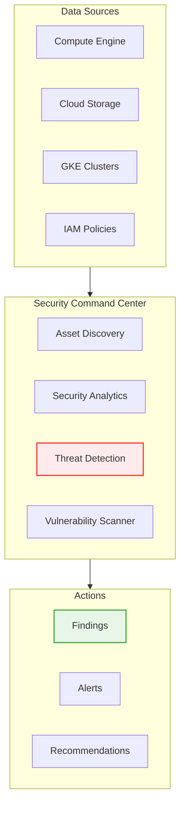
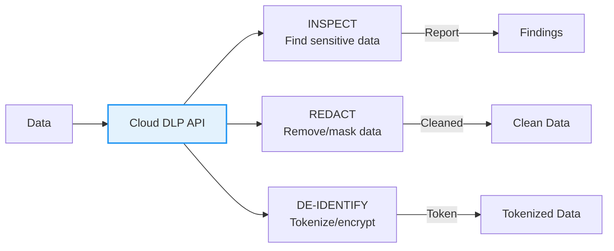
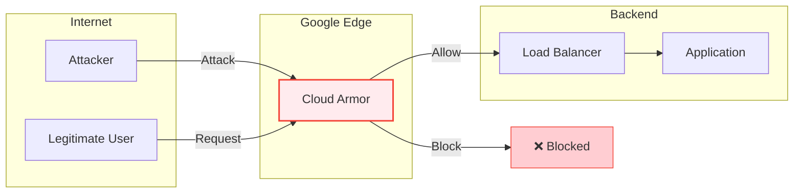

# BONUS: Security Command Center, DLP & Cloud Armor

**Duration:** ⏱️ 45 Minutes  
**Level:** Advanced  
**ACE Exam Weight:** ⭐⭐⭐ High (Security is 19% of the exam)

---

## 🎯 Learning Objectives

By the end of this lesson, you will:

*   **Navigate** Security Command Center for threat detection
*   **Use** Cloud DLP to find and redact sensitive data
*   **Configure** Cloud Armor for DDoS and WAF protection
*   **Design** security operations workflows

---

## 🛡️ 1. Security Command Center (SCC)

**SCC = Your security dashboard for the entire organization.**

### Tier Comparison

| Feature | Standard (Free) | Premium (Paid) |
|---------|----------------|----------------|
| **Asset Discovery** | ✅ | ✅ |
| **Security Findings** | Basic (public buckets, open firewalls) | ✅ Advanced |
| **Threat Detection** | ❌ | ✅ Cryptomining, brute force, malware |
| **Vulnerability Scanning** | ❌ | ✅ Web app scanning |
| **Compliance Reports** | ❌ | ✅ CIS, PCI-DSS, NIST |
| **Container Threat Detection** | ❌ | ✅ GKE runtime threats |

### SCC Architecture



### Common Findings
| Finding | Severity | Remediation |
|---------|----------|-------------|
| Public bucket | HIGH | Remove allUsers/allAuthenticatedUsers |
| Open firewall (0.0.0.0/0 SSH) | CRITICAL | Restrict to known IPs |
| Cryptomining detected | CRITICAL | Stop instance, investigate |
| Default service account used | MEDIUM | Create custom SA with minimal permissions |

---

## 🔍 2. Cloud DLP (Data Loss Prevention)

**DLP = Find, classify, and protect sensitive data automatically.**

### InfoTypes (What DLP Detects)

| Category | Examples |
|----------|----------|
| **Financial** | Credit card, bank account |
| **PII** | SSN, passport, driver's license |
| **Healthcare** | Medical record, FDA code |
| **Credentials** | API keys, passwords |
| **Custom** | Employee IDs, internal codes |

### DLP Actions



### DLP in Data Pipelines
```bash
# Inspect text for sensitive data
gcloud dlp inspect \
    --content="My SSN is 123-45-6789 and email is john@example.com" \
    --info-types=US_SOCIAL_SECURITY_NUMBER,EMAIL_ADDRESS

# Inspect a Cloud Storage bucket
gcloud dlp jobs create \
    --storage-path="gs://my-bucket/*" \
    --info-types=CREDIT_CARD_NUMBER,US_SOCIAL_SECURITY_NUMBER \
    --actions=publishToPubsub
```

---

## 🔥 3. Cloud Armor (WAF + DDoS Protection)

**Cloud Armor = Protection at the edge of Google's network.**

### Protection Layers



### Security Policy Rules

| Rule Type | Example | Use Case |
|-----------|---------|----------|
| **IP Allowlist** | Allow only 203.0.113.0/24 | Corporate access only |
| **IP Denylist** | Block 192.0.2.0/24 | Known bad actors |
| **Geo-blocking** | `origin.region_code != 'US'` | GDPR compliance |
| **Rate limiting** | Max 100 req/min per IP | Prevent abuse |
| **WAF rules** | OWASP ModSecurity CRS | Block SQL injection, XSS |

### Create Cloud Armor Policy
```bash
# Create security policy
gcloud compute security-policies create my-policy \
    --description="Block attackers and rate limit"

# Add rule to block a country
gcloud compute security-policies rules create 1000 \
    --security-policy=my-policy \
    --expression="origin.region_code == 'XX'" \
    --action=deny-403

# Add rate limiting
gcloud compute security-policies rules create 2000 \
    --security-policy=my-policy \
    --expression="true" \
    --action=rate-based-ban \
    --rate-limit-threshold-count=100 \
    --rate-limit-threshold-interval-sec=60

# Attach to backend service
gcloud compute backend-services update my-backend \
    --security-policy=my-policy \
    --global
```

---

## 🛠️ 4. Hands-On Lab: DLP Data Redaction

### Step 1: Inspect Sensitive Data
```bash
# Create test file
echo "Customer: John Doe, SSN: 123-45-6789, Card: 4111-1111-1111-1111" > sensitive.txt

# Upload to bucket
gsutil cp sensitive.txt gs://my-bucket/

# Run DLP inspection
gcloud dlp jobs create \
    --storage-path="gs://my-bucket/sensitive.txt" \
    --info-types=US_SOCIAL_SECURITY_NUMBER,CREDIT_CARD_NUMBER \
    --actions=saveFindings
```

### Step 2: Create De-identification Template
```bash
# Via Console: Security > DLP > Templates > Create
# Or via API with redaction config
cat > deidentify-template.json << 'EOF'
{
  "deidentifyTemplate": {
    "displayName": "Redact PII",
    "deidentifyConfig": {
      "infoTypeTransformations": {
        "transformations": [{
          "primitiveTransformation": {
            "replaceConfig": {
              "newValue": {"stringValue": "[REDACTED]"}
            }
          }
        }]
      }
    }
  }
}
EOF
```

---

## ⚠️ 5. Exam Traps & Pro Tips

### ❌ Common Mistakes
| Mistake | Reality |
|---------|---------|
| "SCC Standard detects threats" | No! Threat detection is Premium only |
| "Cloud Armor protects all traffic" | No! Only traffic through GCLB |
| "DLP encrypts data" | No! DLP inspects/redacts; use KMS for encryption |

### ✅ Pro Tips
*   **SCC Premium** is required for compliance reports
*   **Cloud Armor** only works with HTTP(S) Load Balancer
*   **DLP** can be triggered automatically via Pub/Sub + Functions
*   **Combine all three** for defense in depth

---

<!-- QUIZ_START -->
## 📝 6. Knowledge Check Quiz

1. **Which service detects if your VMs are mining cryptocurrency?**
    *   A. Cloud DLP
    *   B. Cloud Armor
    *   C. **Security Command Center Premium** ✅
    *   D. Cloud IAM

2. **You need to remove credit card numbers from data before storing in BigQuery. What do you use?**
    *   A. Cloud KMS
    *   B. **Cloud DLP** ✅
    *   C. VPC Service Controls
    *   D. Cloud Armor

3. **Where does Cloud Armor enforce security policies?**
    *   A. At the VM level
    *   B. In Cloud Storage
    *   C. **At the Global HTTP(S) Load Balancer edge** ✅
    *   D. In the VPC

4. **Which SCC feature is only available in the Premium tier?**
    *   A. Asset Discovery
    *   B. Security Findings
    *   C. **Compliance Reports (CIS, PCI-DSS)** ✅
    *   D. IAM Recommendations

5. **You want to block traffic from a specific country. What do you use?**
    *   A. VPC Firewall
    *   B. **Cloud Armor geo-blocking** ✅
    *   C. Cloud NAT
    *   D. Identity-Aware Proxy
<!-- QUIZ_END -->

---

<!-- FLASHCARDS
[
  {"term": "SCC", "def": "Security Command Center. Centralized security dashboard for GCP. Premium tier adds threat detection."},
  {"term": "Cloud DLP", "def": "Data Loss Prevention. Inspect, classify, and redact sensitive data like SSN and credit cards."},
  {"term": "Cloud Armor", "def": "Web Application Firewall at the edge. Protects against DDoS, SQL injection, and geo-blocks."},
  {"term": "InfoType", "def": "DLP detector category like CREDIT_CARD_NUMBER or US_SOCIAL_SECURITY_NUMBER."},
  {"term": "Event Threat Detection", "def": "SCC Premium feature that detects cryptomining, malware, and brute force attacks."},
  {"term": "WAF", "def": "Web Application Firewall. Filters malicious HTTP traffic at Layer 7."}
]
-->
