# Day 21: Week 3 Project - The Automated Security Auditor

**Duration:** ⏱️ 90 Minutes (Hands-On Project)  
**Level:** Intermediate  
**ACE Exam Weight:** ⭐⭐⭐ High (Cloud Operations & CLI skills are critical)

---

## 🎯 Project Objectives

By the end of this project, you will:

*   **Master** Cloud Shell and gcloud CLI for automation
*   **Create** custom log-based metrics for security events
*   **Configure** alerting policies for real-time notifications
*   **Investigate** security incidents using Cloud Logging
*   **Build** a complete audit trail system

---

## 🧠 1. Project Scenario (Mission Briefing)

**Situation:** Your security team received a complaint that someone deleted a critical firewall rule last night. Your manager wants answers: **WHO did it, WHEN, and how do we prevent silent deletions?**

Your mission: Build an automated security auditor that detects and alerts on suspicious GCP activities.

### 🏗️ Solution Architecture

```mermaid
flowchart LR
    subgraph Events["Security Events"]
        FW[🔥 Firewall Deleted]
        SA[🔑 SA Key Created]
        VM[💻 VM Deleted]
    end
    
    subgraph Logging["Cloud Logging"]
        AL[Audit Logs]
        LBM[Log-Based Metrics]
    end
    
    subgraph Alerting["Cloud Monitoring"]
        AP[Alerting Policy]
        NC[Notification Channel]
    end
    
    subgraph Notify["Notifications"]
        EM[📧 Email]
        SL[💬 Slack]
        PS[📱 PagerDuty]
    end
    
    Events --> AL --> LBM --> AP --> NC --> Notify
    
    style LBM fill:#e8f5e9,stroke:#4caf50,stroke-width:2px
    style AP fill:#e3f2fd,stroke:#2196f3,stroke-width:2px
```



---

## 🔧 2. Cloud Shell Power User Cheatsheet

### Essential gcloud Commands

| Task | Command |
|------|---------|
| **Set project** | `gcloud config set project PROJECT_ID` |
| **List projects** | `gcloud projects list` |
| **Current config** | `gcloud config list` |
| **Authenticate** | `gcloud auth login` |
| **Get access token** | `gcloud auth print-access-token` |

### Compute Commands
```bash
# List all VMs
gcloud compute instances list

# Create a VM
gcloud compute instances create my-vm \
    --zone=us-central1-a \
    --machine-type=e2-micro

# SSH into VM
gcloud compute ssh my-vm --zone=us-central1-a

# Delete VM
gcloud compute instances delete my-vm --zone=us-central1-a
```

### Firewall Commands
```bash
# List firewall rules
gcloud compute firewall-rules list

# Create firewall rule
gcloud compute firewall-rules create allow-ssh \
    --direction=INGRESS \
    --priority=1000 \
    --network=default \
    --action=ALLOW \
    --rules=tcp:22 \
    --source-ranges=0.0.0.0/0

# Delete firewall rule
gcloud compute firewall-rules delete allow-ssh
```

### Logging Commands
```bash
# Read recent logs
gcloud logging read "resource.type=gce_instance" --limit=10

# Read with time filter
gcloud logging read "timestamp>=\"2024-01-01T00:00:00Z\"" --limit=50

# Read firewall deletions
gcloud logging read 'protoPayload.methodName="v1.compute.firewalls.delete"' --limit=5
```

---

## 🛠️ 3. Lab Part 1: Generate & Investigate an Incident

### Step 1: Create Evidence (Simulate the Incident)
```bash
# Create a "suspicious" firewall rule
gcloud compute firewall-rules create allow-bad-traffic \
    --direction=INGRESS \
    --priority=1000 \
    --network=default \
    --action=ALLOW \
    --rules=tcp:666 \
    --source-ranges=0.0.0.0/0

# Wait 30 seconds for logs to propagate
sleep 30

# Now delete it (this is what we'll detect!)
gcloud compute firewall-rules delete allow-bad-traffic --quiet
```

### Step 2: Hunt in Log Explorer
```bash
# Open in browser or use CLI
# Filter for firewall deletions
gcloud logging read '
  resource.type="gce_firewall_rule" AND
  protoPayload.methodName="v1.compute.firewalls.delete"
' --format="json" --limit=5
```

### Step 3: Extract the Culprit
Look for these key fields in the log entry:
```json
{
  "protoPayload": {
    "authenticationInfo": {
      "principalEmail": "your-email@domain.com"  // WHO
    },
    "methodName": "v1.compute.firewalls.delete",  // WHAT
    "resourceName": "projects/PROJECT/global/firewalls/allow-bad-traffic"  // WHICH
  },
  "timestamp": "2024-01-15T10:30:00.000Z"  // WHEN
}
```

---

## 🛠️ 4. Lab Part 2: Create Log-Based Metrics

### Via Console
1. Go to **Logging** > **Log Explorer**
2. Enter filter:
   ```
   resource.type="gce_firewall_rule"
   protoPayload.methodName="v1.compute.firewalls.delete"
   ```
3. Click **Actions** > **Create Metric**
4. Name: `firewall-deletions`
5. Type: Counter
6. Click **Create Metric**

### Via gcloud
```bash
gcloud logging metrics create firewall-deletions \
    --description="Counts firewall rule deletions" \
    --log-filter='
      resource.type="gce_firewall_rule" AND
      protoPayload.methodName="v1.compute.firewalls.delete"
    '
```

### Verify Metric Exists
```bash
gcloud logging metrics list
```

---

## 🛠️ 5. Lab Part 3: Create Alerting Policy

### Via Console
1. Go to **Monitoring** > **Alerting** > **Create Policy**
2. **Condition:**
   - Resource type: `logging.googleapis.com/user/firewall-deletions`
   - Threshold: `> 0`
   - Duration: `1 minute`
3. **Notifications:** Add email channel
4. **Name:** "Critical: Firewall Deletion Detected"
5. Click **Create Policy**

### Via gcloud
```bash
# Create notification channel first
gcloud alpha monitoring channels create \
    --display-name="Security Team Email" \
    --type=email \
    --channel-labels=email_address=security@company.com

# Get channel ID
CHANNEL_ID=$(gcloud alpha monitoring channels list --format="value(name)" | head -1)

# Create alerting policy
gcloud alpha monitoring policies create \
    --display-name="Firewall Deletion Alert" \
    --condition-display-name="Firewall deleted" \
    --condition-filter='metric.type="logging.googleapis.com/user/firewall-deletions"' \
    --condition-threshold-value=0 \
    --condition-threshold-comparison=COMPARISON_GT \
    --notification-channels=$CHANNEL_ID
```

---

## 🛠️ 6. Lab Part 4: Test the Full Pipeline

```bash
# Create and delete another firewall rule
gcloud compute firewall-rules create test-alert \
    --direction=INGRESS \
    --network=default \
    --action=ALLOW \
    --rules=tcp:9999 \
    --source-ranges=0.0.0.0/0

# Delete it to trigger the alert
gcloud compute firewall-rules delete test-alert --quiet

# Check your email in ~5 minutes!
```

---

## ⚠️ 7. Pro Tips & Best Practices

### Security Monitoring Best Practices
| Event | Log Filter | Why Monitor |
|-------|-----------|-------------|
| Firewall deletions | `v1.compute.firewalls.delete` | Network security holes |
| SA key creation | `google.iam.admin.v1.CreateServiceAccountKey` | Credential theft |
| IAM changes | `SetIamPolicy` | Privilege escalation |
| VPC creation | `v1.compute.networks.insert` | Unauthorized networks |
| Bucket made public | `storage.setIamPermissions` | Data exposure |

### Automation Tips
```bash
# Create alias for common filters
alias firewall-audit='gcloud logging read "protoPayload.methodName:firewalls" --limit=20'

# Save as script
cat << 'EOF' > ~/security-audit.sh
#!/bin/bash
echo "=== Recent Security Events ==="
gcloud logging read "
  protoPayload.methodName:delete OR
  protoPayload.methodName:SetIamPolicy
" --limit=50 --format="table(timestamp,protoPayload.methodName,protoPayload.authenticationInfo.principalEmail)"
EOF
chmod +x ~/security-audit.sh
```

---

## 🎯 8. ACE Exam Focus

### Key Concepts
| Topic | What to Know |
|-------|-------------|
| **Cloud Shell** | 5GB persistent home dir, pre-authenticated, 60-min timeout |
| **Log-based Metrics** | Count or distribution from log entries |
| **Audit Logs** | Admin Activity (always on), Data Access (must enable) |
| **Alerting** | Metric + Threshold + Duration + Notification Channel |

### Exam Traps
*   ⚠️ **Audit logs ≠ all logs** - Data Access logs must be enabled
*   ⚠️ **Cloud Shell times out** after 60 minutes of inactivity
*   ⚠️ **Log-based metrics are delayed** - not real-time

---

<!-- QUIZ_START -->
## 📝 9. Knowledge Check Quiz

1. **Which gcloud command reads Cloud Logging entries for a specific resource type?**
    *   A. `gcloud compute logs list`
    *   B. **`gcloud logging read 'resource.type="gce_instance"'`** ✅
    *   C. `gcloud monitoring logs filter`
    *   D. `gcloud audit logs query`

2. **You want to track how many times a specific API is called per hour. What should you create?**
    *   A. An Uptime Check
    *   B. **A Log-based Metric** ✅
    *   C. A Cloud Function
    *   D. A Dashboard

3. **Which field in a Cloud Logging entry reveals WHO performed an action?**
    *   A. `resource.labels`
    *   B. `timestamp`
    *   C. **`protoPayload.authenticationInfo.principalEmail`** ✅
    *   D. `severity`

4. **What is the persistent storage size available in Cloud Shell?**
    *   A. 1 GB
    *   B. **5 GB** ✅
    *   C. 10 GB
    *   D. Unlimited

5. **Which type of Audit Log is always enabled and cannot be disabled?**
    *   A. Data Access Logs
    *   B. **Admin Activity Logs** ✅
    *   C. System Event Logs
    *   D. Policy Denied Logs
<!-- QUIZ_END -->

---

## ✅ Project Checklist

- [ ] Create and delete a test firewall rule
- [ ] Find the deletion event in Log Explorer
- [ ] Identify WHO/WHEN/WHAT from the log entry
- [ ] Create `firewall-deletions` log-based metric
- [ ] Set up alerting policy with email notification
- [ ] Verify alert triggers on test deletion

---

### 🚀 What's Next?
**Day 22: Cloud Operations (Logging & Monitoring)**
*   Deep dive into Cloud Monitoring
*   Custom dashboards
*   SLOs and Error Budgets

<!-- FLASHCARDS
[
  {"term": "Cloud Shell", "def": "Browser-based CLI with 5GB persistent storage. Pre-authenticated with gcloud. Times out after 60 min."},
  {"term": "Log-based Metric", "def": "Custom metric created from log entries. Can be counter or distribution type."},
  {"term": "Audit Logs", "def": "Record of admin actions. Admin Activity is always on; Data Access must be enabled."},
  {"term": "Alerting Policy", "def": "Metric condition + threshold + notification channel. Triggers when condition is met."},
  {"term": "principalEmail", "def": "Field in audit logs that identifies WHO performed an action."},
  {"term": "gcloud logging read", "def": "CLI command to query Cloud Logging. Supports filters and time ranges."}
]
-->
