# Week 3 Project: The Automated Auditor

> **Objective**: track down a specific "suspicious" action in Cloud Logging and create a metric for it.

## 🏗️ Architecture

```mermaid
graph LR
    Hacker[🕵️ Stranger] -- Deletes Firewall --> Log[📜 Cloud Logging]
    Log -- Matches Filter --> Metric[📈 Log-Based Metric]
    Metric -- Triggers --> Alert[🔔 Email Alert]
```

## 📸 Expected Console Output

*Figure 1: Identifying the exact timestamp of the security event.*

## 🛠️ The Challenge
Someone deleted a firewall rule last night. Your manager is furious. You need to find out **who** and **when**, and set up an alarm so it never happens silently again.

## 🚀 Lab Steps
1.  **Generate Noise**: Create a firewall rule `allow-bad`, then **delete** it.
2.  **Log Explorer**:
    - Filter for `resource.type="gce_firewall_rule"`.
    - Filter for `protoPayload.methodName="v1.compute.firewalls.delete"`.
3.  **Analyze**: Expand the log entry. Look for `principalEmail` (That's the culprit!).
4.  **Create Metric**: Click **Create Metric**. Name it `firewall-deletions`.
5.  **Alerting** (Optional): In Monitoring, create an alert if `firewall-deletions > 0`.

## 🎯 Verification
Show the Log Entry JSON proving you found the "deletion" event.
