# Day 21: Containers 101 - Before GKE

> **Official Doc Reference**: [Containers Concepts](https://cloud.google.com/containers) | [Artifact Registry](https://cloud.google.com/artifact-registry/docs)

## Learning Objectives
By the end of this day, you should be able to:
- Understand containers vs VMs and when to use each
- Build, tag, and push Docker images
- Use Artifact Registry for container storage
- Apply container security best practices

---

## 1️⃣ What is a Container? 📦

### VMs vs Containers

```mermaid
graph TB
    subgraph "Virtual Machines"
        HW1[🖥️ Hardware]
        HV1[Hypervisor]
        VM1[Guest OS 1]
        VM2[Guest OS 2]
        App1[App A]
        App2[App B]
        
        HW1 --> HV1
        HV1 --> VM1 & VM2
        VM1 --> App1
        VM2 --> App2
    end
    
    subgraph "Containers"
        HW2[🖥️ Hardware]
        OS2[Host OS]
        Docker[🐳 Container Runtime]
        Con1[Container A]
        Con2[Container B]
        Con3[Container C]
        
        HW2 --> OS2 --> Docker
        Docker --> Con1 & Con2 & Con3
    end
```



| Aspect | Virtual Machine | Container |
|--------|----------------|-----------|
| **Isolation** | Full OS per VM | Shared kernel |
| **Size** | GBs (includes OS) | MBs (app + deps only) |
| **Boot Time** | Minutes | Milliseconds |
| **Portability** | Limited | "Works everywhere" |
| **Overhead** | High | Low |

### The "Shipping Container" Analogy 🚢

Think of shipping containers:
- **Before containers**: Goods loaded loosely, different for every ship
- **After containers**: Standardized boxes, fit any ship, train, or truck

**Software containers** = Code + dependencies in a standardized package that runs anywhere.

---

## 2️⃣ Docker Fundamentals 🐳

### Core Concepts

| Term | Description | Analogy |
|------|-------------|---------|
| **Dockerfile** | Instructions to build an image | Recipe 📝 |
| **Image** | Built artifact, immutable | Cake 🎂 |
| **Container** | Running instance of an image | Slice being eaten 🍰 |
| **Registry** | Storage for images | Bakery warehouse 🏭 |
| **Tag** | Version label for images | "v1.0", "latest" |

### Image Layers

```mermaid
graph TB
    subgraph "Docker Image Layers"
        L1[📦 Base: python:3.11-slim]
        L2[📦 WORKDIR /app]
        L3[📦 COPY requirements.txt]
        L4[📦 RUN pip install]
        L5[📦 COPY . .]
        L6[📦 CMD python app.py]
    end
    
    L1 --> L2 --> L3 --> L4 --> L5 --> L6
    
    Note1[Each layer is cached!<br>Change code = only L5 & L6 rebuild]
```



---

## 3️⃣ Hands-On Lab: Build Your First Container 🛠️

### Step 1: Create Application Files

```bash
# Create project directory
mkdir my-container && cd my-container
```

**app.py:**
```python
from flask import Flask
import os

app = Flask(__name__)

@app.route('/')
def hello():
    return f"Hello from Container! Host: {os.uname().nodename}"

if __name__ == '__main__':
    app.run(host='0.0.0.0', port=8080)
```

**requirements.txt:**
```text
flask==2.3.2
gunicorn==21.2.0
```

### Step 2: Write Dockerfile

```dockerfile
# Use official Python runtime as base
FROM python:3.11-slim

# Set working directory
WORKDIR /app

# Copy requirements first (layer caching)
COPY requirements.txt .
RUN pip install --no-cache-dir -r requirements.txt

# Copy application code
COPY . .

# Run as non-root user (security!)
RUN useradd -m appuser
USER appuser

# Expose port
EXPOSE 8080

# Start command
CMD ["gunicorn", "--bind", "0.0.0.0:8080", "app:app"]
```

### Step 3: Build & Run Locally

```bash
# Build the image
docker build -t my-flask-app:v1 .

# Run container
docker run -p 8080:8080 my-flask-app:v1

# Test it
curl http://localhost:8080
```

### Step 4: Push to Artifact Registry

```bash
# Configure Docker for Artifact Registry
gcloud auth configure-docker us-central1-docker.pkg.dev

# Tag for Artifact Registry
docker tag my-flask-app:v1 \
    us-central1-docker.pkg.dev/PROJECT_ID/my-repo/flask-app:v1

# Push
docker push us-central1-docker.pkg.dev/PROJECT_ID/my-repo/flask-app:v1
```

---

## 4️⃣ Artifact Registry vs Container Registry

| Feature | Container Registry (gcr.io) | Artifact Registry |
|---------|----------------------------|-------------------|
| **Status** | Legacy | Recommended ✅ |
| **Formats** | Docker only | Docker, Maven, npm, Python, etc. |
| **Security** | Basic | Fine-grained IAM, VPC-SC |
| **Regional** | Multi-region only | Regional OR multi-region |
| **Pricing** | Storage only | Storage + egress |

```bash
# Create Artifact Registry repository
gcloud artifacts repositories create my-repo \
    --repository-format=docker \
    --location=us-central1 \
    --description="My container images"
```

---

## 5️⃣ Multi-Stage Builds (Smaller Images)

```dockerfile
# Stage 1: Build
FROM golang:1.21 AS builder
WORKDIR /app
COPY . .
RUN CGO_ENABLED=0 go build -o myapp

# Stage 2: Runtime (tiny!)
FROM alpine:3.18
COPY --from=builder /app/myapp /myapp
CMD ["/myapp"]
```

**Result**: 
- Without multi-stage: ~800 MB (includes Go compiler)
- With multi-stage: ~15 MB (just the binary)

---

## 6️⃣ Container Security Best Practices 🔒

| Practice | Why | How |
|----------|-----|-----|
| **Run as non-root** | Limits damage if compromised | `USER appuser` in Dockerfile |
| **Use minimal base images** | Fewer vulnerabilities | `alpine`, `distroless`|
| **Scan for vulnerabilities** | Catch issues early | Artifact Registry scanning |
| **Pin versions** | Reproducible builds | `python:3.11.4` not `python:latest` |
| **No secrets in images** | Prevent leaks | Use Secret Manager |

```bash
# Enable vulnerability scanning
gcloud artifacts repositories update my-repo \
    --location=us-central1 \
    --vulnerability-scanning=STANDARD
```

---

## 7️⃣ Key Docker Commands (Exam)

```bash
# Build
docker build -t NAME:TAG .

# Run
docker run -p HOST:CONTAINER IMAGE

# List images
docker images

# List running containers
docker ps

# Stop container
docker stop CONTAINER_ID

# Push to registry
docker push REGISTRY/IMAGE:TAG

# Pull from registry
docker pull REGISTRY/IMAGE:TAG
```

---

## 8️⃣ Exam Scenarios & Traps 🚨

| Scenario | Answer |
|----------|--------|
| "Store container images securely" | **Artifact Registry** |
| "Reduce image size" | **Multi-stage builds** |
| "Run containers without managing servers" | **Cloud Run** |
| "Orchestrate many containers" | **GKE** |
| "Need to build images from source" | **Cloud Build** |

> [!WARNING]
> **Trap**: Container Registry (gcr.io) is legacy. New projects should use **Artifact Registry**.

> [!TIP]
> **Security**: Always run containers as non-root and scan images for vulnerabilities.

---

## 9️⃣ Cheat Sheet

```text
┌─────────────────────────────────────────────────────────┐
│                  CONTAINERS CHEAT SHEET                 │
├─────────────────────────────────────────────────────────┤
│ DOCKER BASICS:                                          │
│ docker build -t NAME:TAG .        # Build image         │
│ docker run -p 8080:8080 IMAGE     # Run container      │
│ docker push REGISTRY/IMAGE:TAG    # Push to registry   │
├─────────────────────────────────────────────────────────┤
│ ARTIFACT REGISTRY:                                      │
│ gcloud artifacts repositories create REPO               │
│ gcloud auth configure-docker REGION-docker.pkg.dev     │
├─────────────────────────────────────────────────────────┤
│ BEST PRACTICES:                                         │
│ - Use non-root USER                                    │
│ - Pin image versions                                   │
│ - Multi-stage builds for smaller images               │
│ - Scan images for vulnerabilities                     │
└─────────────────────────────────────────────────────────┘
```

---

## 🔟 Checkpoint Quiz

1. **Which file defines how to build a Docker image?**
   - A) build.yaml
   - B) Dockerfile ✅
   - C) container.json
   - D) image.yml

2. **What's the recommended registry for new GCP projects?**
   - A) Docker Hub
   - B) Container Registry (gcr.io)
   - C) Artifact Registry ✅
   - D) GitHub Container Registry

3. **How do you reduce container image size?**
   - A) Use larger base images
   - B) Multi-stage builds ✅
   - C) Add more layers
   - D) Include build tools in final image

4. **Container security: Which user should run your app?**
   - A) root
   - B) admin
   - C) Non-root user ✅
   - D) docker

5. **True or False: Containers share the host OS kernel.**
   - Answer: **True** (Unlike VMs which have their own kernel)

---

<!-- FLASHCARDS
[
  {"term": "Container", "def": "Lightweight, isolated environment for running applications."},
  {"term": "Dockerfile", "def": "Text file with instructions to build a Docker image."},
  {"term": "Image", "def": "Immutable, layered artifact containing app and dependencies."},
  {"term": "Artifact Registry", "def": "GCP's recommended registry for containers and packages."},
  {"term": "Multi-Stage Build", "def": "Dockerfile technique to create smaller final images."},
  {"term": "Non-root User", "def": "Security practice to limit container privileges."}
]
-->
