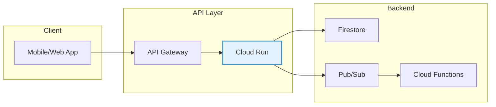
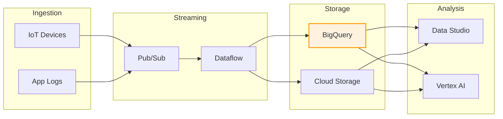
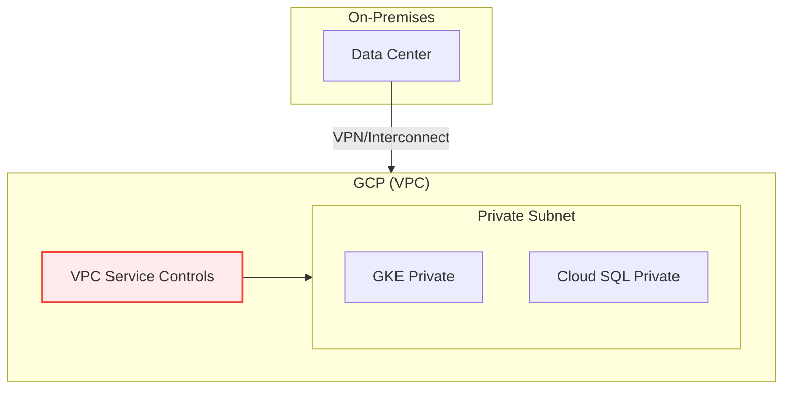
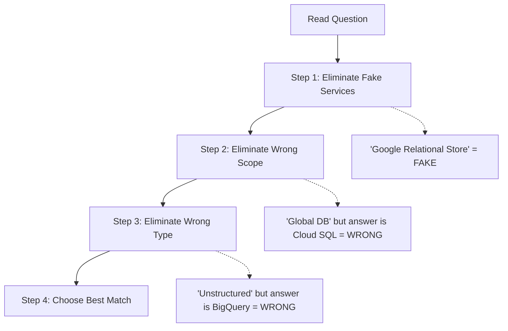

# BONUS: Architecture Thinking - Putting It All Together

**Duration:** ⏱️ 60 Minutes  
**Level:** Advanced  
**ACE Exam Weight:** ⭐⭐⭐⭐ Very High (Scenario questions dominate the exam)

---

## 🎯 Learning Objectives

By the end of this lesson, you will:

*   **Apply** architectural thinking to exam scenarios
*   **Match** business requirements to GCP services
*   **Use** elimination strategies for complex questions
*   **Recognize** common architecture patterns

---

## 🧠 1. The Architecture Mindset

**ACE Exam ≠ "What is a VM?"**
**ACE Exam = "Given these requirements, which services should you use?"**

### The Translation Game

| When They Say... | They Mean... | Answer Pattern |
|-----------------|--------------|----------------|
| "Fault-tolerant web app" | Auto-healing, multi-zone | MIG or Cloud Run |
| "Store relational data" | SQL, transactions | Cloud SQL or Spanner |
| "Store images/videos" | Unstructured, large files | Cloud Storage |
| "Cheap/cost-effective" | Minimize spend | Preemptible, smaller types |
| "Global users" | Low latency worldwide | Global LB, multi-region |
| "Compliance required" | HIPAA, PCI, SOC2 | CMEK, VPC-SC, Regions |

---

## 🏗️ 2. Common Architecture Patterns

### Pattern 1: Scalable Web Application

```mermaid
flowchart LR
    subgraph Users["Users"]
        U1[🌍 Global Users]
    end
    
    subgraph Edge["Edge"]
        GLB[Global HTTP(S) LB]
        CDN[Cloud CDN]
        CA[Cloud Armor]
    end
    
    subgraph Compute["Compute"]
        MIG1[MIG: us-central1]
        MIG2[MIG: europe-west1]
    end
    
    subgraph Data["Data"]
        SQL[Cloud SQL HA]
        GCS[Cloud Storage]
        MC[Memorystore]
    end
    
    Users --> GLB
    GLB --> CDN --> CA
    CA --> MIG1 & MIG2
    MIG1 & MIG2 --> SQL & GCS & MC
    
    style GLB fill:#e8f5e9,stroke:#4caf50,stroke-width:2px
```

**Use When:** "High availability", "global reach", "auto-scaling"

---

### Pattern 2: Serverless API Backend



**Use When:** "No infrastructure management", "pay per request", "variable traffic"

---

### Pattern 3: Data Analytics Pipeline



**Use When:** "Real-time analytics", "process petabytes", "ML insights"

---

### Pattern 4: Secure Enterprise (Compliance)



**Use When:** "No public IPs", "regulatory compliance", "hybrid cloud"

---

## 🎯 3. The Elimination Strategy

### Step-by-Step Process



### Quick Reference: Scope Matching

| Scope | Correct Services | Wrong Services |
|-------|-----------------|----------------|
| **Global** | Spanner, Global LB, Cloud CDN | Cloud SQL, Regional LB |
| **Regional** | Cloud SQL, Cloud Run, MIG | Cloud Spanner |
| **Zonal** | Compute Engine, Persistent Disk | Regional resources |

### Quick Reference: Data Type Matching

| Data Type | Correct Services | Wrong Services |
|-----------|-----------------|----------------|
| **Relational** | Cloud SQL, Spanner | Bigtable, Firestore |
| **Key-Value** | Firestore, Memorystore | Cloud SQL |
| **Time-Series** | Bigtable | Cloud SQL, Spanner |
| **Analytics** | BigQuery | Cloud SQL |
| **Unstructured** | Cloud Storage | BigQuery |

---

## 🛠️ 4. Scenario Practice

### Scenario 1
> "A gaming company needs to store player scores with sub-millisecond reads. Global users. Writes happen frequently."

**Analysis:**
- Sub-millisecond reads → Fast storage
- Global → All regions
- Frequent writes → High throughput

**Answer:** **Bigtable** (wide-column, global, low latency)

---

### Scenario 2
> "A startup wants to run a Python web app. They have no DevOps team and unpredictable traffic."

**Analysis:**
- No DevOps → Managed/Serverless
- Python web app → Container or PaaS
- Unpredictable traffic → Auto-scaling

**Answer:** **Cloud Run** (serverless, scales to zero, no infra management)

---

### Scenario 3
> "A bank needs to store transaction records for 7 years. Data must be encrypted with keys they control."

**Analysis:**
- 7 years → Archive/Coldline storage
- Bank → Compliance requirement
- Keys they control → CMEK

**Answer:** **Cloud Storage (Archive) + CMEK**

---

## ⚠️ 5. Exam Traps

### ❌ Common Mistakes
| Trap | Reality |
|------|---------|
| "Cloud SQL is global" | No! Cloud SQL is regional (use Spanner for global) |
| "BigQuery stores files" | No! BigQuery is for analytics, use GCS for files |
| "App Engine is containers" | No! App Engine is PaaS, Cloud Run is containers |
| "Firestore is SQL" | No! Firestore is NoSQL document DB |

---

<!-- QUIZ_START -->
## 📝 6. Knowledge Check Quiz

1. **A customer needs a fault-tolerant web app that auto-scales based on traffic. What should they use?**
    *   A. Single Compute Engine VM
    *   B. **Managed Instance Group with autoscaling** ✅
    *   C. Cloud Functions
    *   D. Cloud SQL

2. **You need to store 1 petabyte of sensor logs and query them with SQL. What's the best option?**
    *   A. Cloud SQL
    *   B. Firestore
    *   C. **BigQuery** ✅
    *   D. Cloud Storage

3. **A company needs global, ACID-compliant transactions. Which database should they use?**
    *   A. Cloud SQL
    *   B. Firestore
    *   C. **Cloud Spanner** ✅
    *   D. Bigtable

4. **You need to run a script every night at 2 AM. What's the simplest solution?**
    *   A. Compute Engine cron job
    *   B. **Cloud Scheduler + Cloud Functions** ✅
    *   C. Always-on Cloud Run service
    *   D. GKE CronJob

5. **A marketing team wants a cheap static website. What should they use?**
    *   A. App Engine Standard
    *   B. Compute Engine
    *   C. **Cloud Storage (static website) + Cloud CDN** ✅
    *   D. Cloud Run
<!-- QUIZ_END -->

---

<!-- FLASHCARDS
[
  {"term": "Architecture Thinking", "def": "Matching business requirements to GCP service capabilities."},
  {"term": "Elimination Strategy", "def": "Remove fake services, wrong scope, and wrong type to find the answer."},
  {"term": "MIG", "def": "Managed Instance Group. Auto-scaling, auto-healing group of VMs."},
  {"term": "Serverless", "def": "No infrastructure management. Pay per request. Cloud Run, Functions."},
  {"term": "Best Practice", "def": "Use managed services over DIY. Choose the narrowest capability that fits."},
  {"term": "Fault Tolerance", "def": "System continues operating despite failures. Use multi-zone/region."}
]
-->

---

### 🗑️ Lab Cleanup (Mandatory)

> **⚠️ Critical:** Delete resources to avoid unecessary billing!

1.  **Delete Project:** (Fastest way)
    ```bash
    gcloud projects delete $PROJECT_ID
    ```
2.  **Or Delete Resources Individually:**
    ```bash
    # Example commands (verify before running)
    gcloud compute instances delete [INSTANCE_NAME] --quiet
    gcloud storage rm -r gs://[BUCKET_NAME]
    ```
