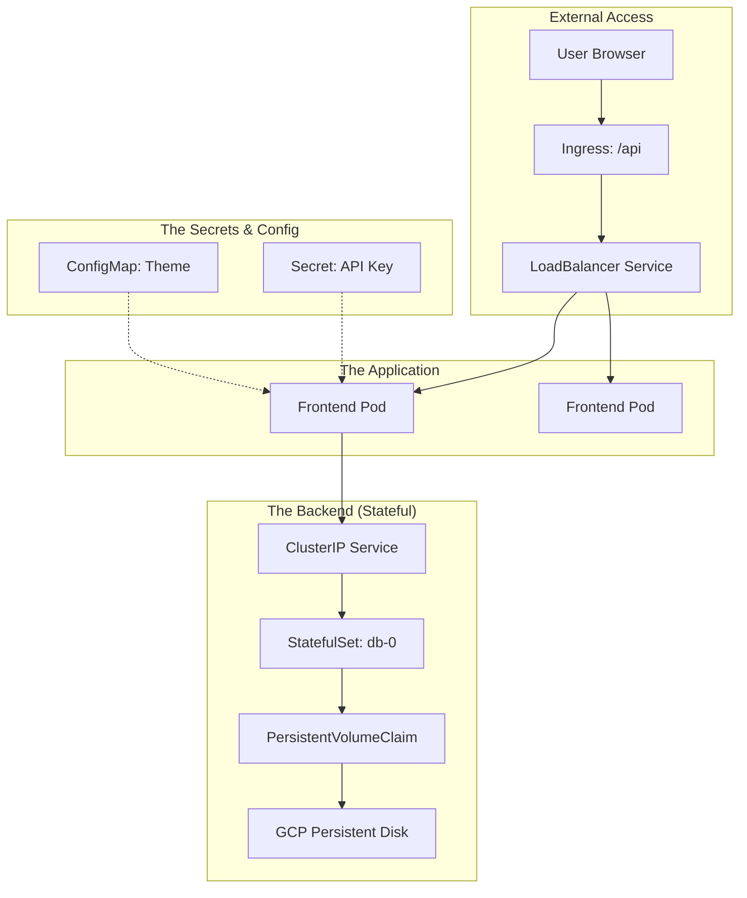

# Day 21: Week 3 Review & Kubernetes Deep Dive

**Level:** Review / Milestone  
**Milestone:** 🏁 Week 3 Complete! (Kubernetes Mastered)

---

## 🔁 1. Week 3 Visual Recap

Kubernetes is the most complex topic in the ACE exam. Let's look at how all the pieces we learned fit together in a single production architecture.



---

## 🎯 2. ACE Exam: High-Frequency Scenarios

| Scenario | Recommended Solution |
| :--- | :--- |
| **"Minimize management overhead for GKE"** | **Autopilot Mode**. |
| **"Running a database that needs fixed disk storage"** | **StatefulSet** + Persistent Volume. |
| **"Injecting non-sensitive environment variables"** | **ConfigMap**. |
| **"Exposing an HTTP app with path-based routing (/v1, /v2)"** | **Ingress**. |
| **"Ensuring specific hardware (GPUs) is used"** | **GKE Standard** + Node Pools. |

---

## 🧪 3. Hands-On Review Lab: The "Full Stack" Blueprint

In this review lab, we unify everything into one cohesive deployment.

### 🧪 Lab Objective
Deploy a web application, provide it with a config, and expose it to the internet.

### ✅ Steps

1.  **Configure Environment**:
    ```bash
    kubectl create configmap web-config --from-literal=ENVIRONMENT=production
    ```

2.  **Deploy Application** (`review-app.yaml`):
    ```yaml
    apiVersion: apps/v1
    kind: Deployment
    metadata:
      name: review-web
    spec:
      replicas: 3
      selector:
        matchLabels:
          app: review-web
      template:
        metadata:
          labels:
            app: review-web
        spec:
          containers:
          - name: nginx
            image: nginx:latest
            env:
            - name: APP_ENV
              valueFrom:
                configMapKeyRef:
                  name: web-config
                  key: ENVIRONMENT
    ```

3.  **Expose via LoadBalancer**:
    ```bash
    kubectl expose deployment review-web --type=LoadBalancer --port=80
    ```

4.  **Verification**: 
    `kubectl get services` -> Click the External IP.

---

## 📝 4. Week 3 Mock Exam (ACE Standards)


1.  **A team needs to deploy 50 different microservices, each requiring its own external IP address for HTTP traffic. What is the most COST-EFFECTIVE way to handle this in GKE?**
    *   A. Create 50 Services of type LoadBalancer.
    *   B. **Create 50 ClusterIP Services and one Ingress object with routing rules.** ✅
    *   C. Use NodePort services for all 50 apps.
    *   D. Create 50 separate GKE clusters.

2.  **You are migrating a legacy license-server that is hardcoded to look for a host with the specific name 'lic-srv-01'. Which Kubernetes object ensures the pod always gets this specific hostname?**
    *   A. Deployment
    *   B. **StatefulSet** ✅
    *   C. DaemonSet
    *   D. ReplicaSet

3.  **A developer wants to SSH into the GKE worker nodes to debug a kernel crash. Which GKE mode must the cluster be using?**
    *   A. Autopilot
    *   B. **Standard** ✅
    *   C. Serverless
    *   D. Cloud Run

4.  **You need to ensure that your GKE cluster can automatically scale up when there are no more resources for new pods, and scale down when nodes are underutilized. Which feature must you enable?**
    *   A. Horizontal Pod Autoscaler (HPA)
    *   B. **Cluster Autoscaler** ✅
    *   C. Vertical Pod Autoscaler (VPA)
    *   D. Cloud Load Balancer

5.  **True or False: In GKE Autopilot, you pay for the number of nodes in the 'Google-managed' project.**
    *   A. True
    *   B. **False (You pay for the CPU/RAM requested by your Pods)** ✅


---

<div class="checklist-card" x-data="{ 
    items: [
        { text: 'I can explain the relationship between a Deployment and a Service.', checked: false },
        { text: 'I know when to choose Autopilot vs Standard.', checked: false },
        { text: 'I understand why Ingress is better than individual LoadBalancers.', checked: false },
        { text: 'I completed the Week 3 final review lab.', checked: false }
    ]
}">
    <h3>
        <svg viewBox="0 0 24 24" fill="none" stroke="currentColor" stroke-width="2" stroke-linecap="round" stroke-linejoin="round" class="text-blurple">
            <path d="M22 11.08V12a10 10 0 1 1-5.93-9.14"></path>
            <polyline points="22 4 12 14.01 9 11.01"></polyline>
        </svg>
        Week 3 Mastery Checklist
    </h3>
    <template x-for="(item, index) in items" :key="index">
        <div class="checklist-item" @click="item.checked = !item.checked">
            <div class="checklist-box" :class="{ 'checked': item.checked }">
                <svg viewBox="0 0 24 24" fill="none" stroke="currentColor" stroke-width="3" stroke-linecap="round" stroke-linejoin="round">
                    <polyline points="20 6 9 17 4 12"></polyline>
                </svg>
            </div>
            <span x-text="item.text" :class="{ 'line-through text-slate-400': item.checked }"></span>
        </div>
    </template>
</div>

---

### 🗑️ Lab Cleanup (Mandatory)

> **⚠️ Critical:** Delete resources to avoid unecessary billing!

1.  **Delete Project:** (Fastest way)
    ```bash
    gcloud projects delete $PROJECT_ID
    ```
2.  **Or Delete Resources Individually:**
    ```bash
    # Example commands (verify before running)
    gcloud compute instances delete [INSTANCE_NAME] --quiet
    gcloud storage rm -r gs://[BUCKET_NAME]
    ```
