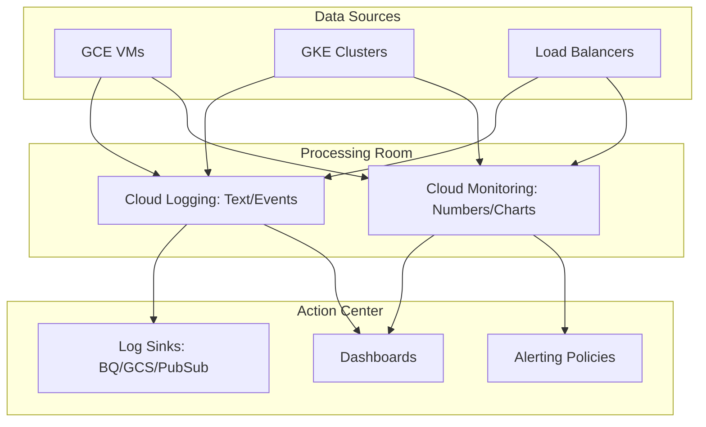

# Day 22: Cloud Operations (Monitoring & Logging)

**Duration:** ⏱️ 45 Minutes  
**Level:** Intermediate  
**ACE Exam Weight:** ⭐⭐⭐⭐ High

---

## 🎯 Learning Objectives

By the end of Day 22, you will be able to:
*   **Differentiate** between Cloud Monitoring (Metrics) and Cloud Logging (Audit/Text).
*   **Visualize** the flow of logs using Sinks and Exports.
*   **Architect** alerting policies for proactive incident response.
*   **Install** and configure the Ops Agent for deep resource visibility.

---

## 🧠 1. The Operations Ecosystem

The **Google Cloud Operations Suite** (formerly Stackdriver) is your centralized observability platform. It is split into three core pillars: **Health** (Monitoring), **Traceability** (Logging), and **Intelligence** (Error Reporting/Trace/Profiler).

### The Observability Pipeline



---

## 📊 2. Monitoring vs. Logging: The Great Divide

Understanding the distinction is vital for the ACE exam.

| Feature | Cloud Monitoring | Cloud Logging |
| :--- | :--- | :--- |
| **Data Type** | **Metrics** (Numeric/Timeseries) | **Entries** (Text/JSON/Events) |
| **Question** | "Is the CPU high?" | "What exactly failed?" |
| **Retention** | 6 weeks (basic) | 30 days (standard) |
| **Action** | Threshold-based Alerting | Log-based Metrics & Sinks |

---

## 🛠️ 3. Hands-On Lab: The "Zero Visibility" Fix

By default, GCP cannot see your VM's **Memory (RAM)** or **Disk Usage**. This is because the Hypervisor only sees the outside "box" (CPU/Network).

### 🧪 Lab Objective
Install the **Ops Agent** to gain internal OS visibility and create an Uptime Check.

### ✅ Steps

1.  **Initialize the VM**:
    ```bash
    gcloud compute instances create monitor-node --zone=us-central1-a
    ```

2.  **Deploy the Ops Agent (Internal Vision)**:
    SSH into the instance and run the one-liner:
    ```bash
    curl -sSO https://dl.google.com/cloudagents/add-google-cloud-ops-agent-repo.sh
    sudo bash add-google-cloud-ops-agent-repo.sh --also-install
    ```

3.  **Verify Metrics**:
    Go to **Monitoring > Dashboards > VM Instances**.
    > [!TIP]
    > Notice that `agent.googleapis.com/memory/percent_used` now has data. Without the agent, this graph would be blank!

4.  **Create a Global Uptime Check**:
    - Target: Your VM's External IP.
    - Path: `/`
    - Checkers: Global (US, Europe, Asia).
    *This tests if your app is reachable globally.*

---

## ⚠️ 4. Exam Traps & Best Practices

> [!IMPORTANT]
> **ACE Exam Alert: Log Sinks**
> If you need to keep logs for 7 years (compliance), standard Cloud Logging is too expensive. You must create a **Log Sink** to export logs to **Cloud Storage (GCS)** for long-term archival or **BigQuery** for analysis.

> [!WARNING]
> **Workspace Boundary**: Monitoring data exists within a **Scoping Project**. You can add multiple projects to one Scoping Project to see all your VMs in a single dashboard!

---

<!-- QUIZ_START -->
## 📝 5. Knowledge Check

1.  **A company needs to analyze log data from the last 2 years using SQL. Where should they export their logs?**
    *   A. Cloud Storage
    *   B. **BigQuery** ✅
    *   C. Cloud Monitoring Dashboard
    *   D. Pub/Sub

2.  **Why is the 'Ops Agent' necessary for monitoring disk space utilization on a Compute Engine VM?**
    *   A. To encrypt the disk.
    *   B. **The hypervisor cannot see the file system structure inside the Guest OS.** ✅
    *   C. To improve disk performance.
    *   D. To enable auto-scaling.

3.  **You want an SMS notification when 'DATABASE_CONNECTION_REFUSED' appears in logs. What is the best approach?**
    *   A. Check the Logs Explorer every hour.
    *   B. **Create a Log-based Metric and then an Alerting Policy.** ✅
    *   C. Create an Uptime Check.
    *   D. Export logs to Cloud Storage.

4.  **What is the default retention period for standard logs in Cloud Logging?**
    *   A. 7 days
    *   B. **30 days** ✅
    *   C. 1 year
    *   D. Permanently

5.  **What does an Uptime Check monitor?**
    *   A. RAM usage on a VM
    *   B. **Whether a URL or service is reachable** ✅
    *   C. Disk space utilization
    *   D. CPU temperature
<!-- QUIZ_END -->
---

<div class="checklist-card" x-data="{ 
    items: [
        { text: 'I understand that Monitoring is for numbers and Logging is for text.', checked: false },
        { text: 'I know that Log Sinks are used for long-term storage.', checked: false },
        { text: 'I successfully installed the Ops Agent on a VM.', checked: false },
        { text: 'I understand what a Scoping Project is.', checked: false }
    ]
}">
    <h3>
        <svg viewBox="0 0 24 24" fill="none" stroke="currentColor" stroke-width="2" stroke-linecap="round" stroke-linejoin="round" class="text-blurple">
            <path d="M22 11.08V12a10 10 0 1 1-5.93-9.14"></path>
            <polyline points="22 4 12 14.01 9 11.01"></polyline>
        </svg>
        Day 22 Mastery Checklist
    </h3>
    <template x-for="(item, index) in items" :key="index">
        <div class="checklist-item" @click="item.checked = !item.checked">
            <div class="checklist-box" :class="{ 'checked': item.checked }">
                <svg viewBox="0 0 24 24" fill="none" stroke="currentColor" stroke-width="3" stroke-linecap="round" stroke-linejoin="round">
                    <polyline points="20 6 9 17 4 12"></polyline>
                </svg>
            </div>
            <span x-text="item.text" :class="{ 'line-through text-slate-400': item.checked }"></span>
        </div>
    </template>
</div>
