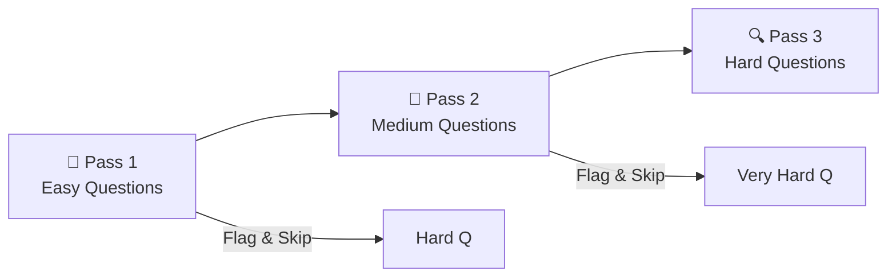

# Day 22: The 45-Day Final Mock Exam

> **Objective**: Test your knowledge with exam-style questions and develop test-taking strategies.

---

## 🧠 Exam Day Strategy

### The 3-Pass Method



1. **Pass 1 (Speed)**: Answer all questions you know instantly. Flag and skip the rest.
2. **Pass 2 (Think)**: Return to flagged questions. Eliminate wrong answers.
3. **Pass 3 (Guess Smart)**: For remaining, use elimination. Never leave blank.

### Key Strategies

| Strategy | How to Apply |
|----------|--------------|
| **Read the End First** | What are they asking? "Minimize cost?" "High availability?" |
| **Eliminate 2 Answers** | Usually 2 are obviously wrong |
| **Choose "Google Way"** | Managed service > DIY almost always |
| **Keyword Mapping** | Match keywords to services (see below) |

---

## 🎯 Keyword Cheat Sheet

| Keywords | Service |
|----------|---------|
| "Global + Relational + Strong consistency" | **Spanner** |
| "Analytics + SQL + Petabytes" | **BigQuery** |
| "Serverless containers" | **Cloud Run** |
| "Managed Kubernetes" | **GKE** |
| "Private connection + High bandwidth" | **Dedicated Interconnect** |
| "Over internet + Encrypted" | **Cloud VPN** |
| "Streaming + Real-time" | **Pub/Sub + Dataflow** |
| "Least privilege IAM" | **Custom roles** |
| "Auto-scaling VMs" | **Managed Instance Groups** |
| "Static website" | **Cloud Storage + Load Balancer** |

---

## 📝 Sample Exam Questions

### Section 1: Compute (Questions 1-5)

**Q1.** Your application requires VMs that can be preempted to save costs but need at least 24 hours of guaranteed runtime. Which option should you choose?

- A) Preemptible VMs
- B) Spot VMs
- C) Standard VMs with Committed Use Discount ✅
- D) Sole-tenant nodes

> **Explanation**: Preemptible/Spot VMs can be terminated anytime. For guaranteed runtime, use standard VMs. CUD saves up to 57%.

---

**Q2.** You need to run a stateless web application that auto-scales based on traffic. What should you use?

- A) Single Compute Engine VM
- B) Managed Instance Group with autoscaler ✅
- C) Unmanaged Instance Group
- D) Cloud Functions

> **Explanation**: MIGs with autoscaling handle stateless web apps. Cloud Functions is for event-driven, not sustained web traffic.

---

**Q3.** Your company wants to run containers without managing the underlying infrastructure. They need auto-scaling to zero. Best option?

- A) GKE Standard
- B) GKE Autopilot
- C) Cloud Run ✅
- D) Compute Engine with Docker

> **Explanation**: Cloud Run is serverless and scales to zero. GKE requires cluster management.

---

**Q4.** You're running batch processing jobs that can tolerate interruptions. How do you minimize costs?

- A) Use preemptible/Spot VMs ✅
- B) Use committed use discounts
- C) Use sustained use discounts
- D) Use premium machine types

> **Explanation**: Spot VMs are 60-91% cheaper and perfect for fault-tolerant batch jobs.

---

**Q5.** An application needs dedicated physical servers for licensing compliance. What do you use?

- A) Standard VMs
- B) Preemptible VMs
- C) Sole-tenant nodes ✅
- D) Cloud Run

> **Explanation**: Sole-tenant nodes provide dedicated physical servers for compliance/licensing.

---

### Section 2: Networking (Questions 6-10)

**Q6.** You need to connect your on-premises data center to GCP with a 50 Gbps dedicated private connection. Best option?

- A) Cloud VPN
- B) Partner Interconnect
- C) Dedicated Interconnect ✅
- D) Direct Peering

> **Explanation**: Dedicated Interconnect provides 10-200 Gbps private connections.

---

**Q7.** Your application serves users globally and needs to minimize latency. Which load balancer?

- A) Regional External TCP Load Balancer
- B) Global External HTTP(S) Load Balancer ✅
- C) Internal TCP Load Balancer
- D) Network Load Balancer

> **Explanation**: Global HTTP(S) LB uses anycast IP and routes to nearest healthy backend.

---

**Q8.** You want VMs in different VPCs to communicate without using public IPs. What do you configure?

- A) Cloud NAT
- B) VPC Peering ✅
- C) Cloud VPN
- D) Shared VPC

> **Explanation**: VPC Peering connects VPCs privately. Cloud NAT is for egress. Shared VPC is for multi-project.

---

**Q9.** Your web servers need to make outbound API calls but shouldn't have public IPs. Solution?

- A) VPC Peering
- B) Cloud NAT ✅
- C) Cloud VPN
- D) External IP

> **Explanation**: Cloud NAT provides outbound internet access for VMs without public IPs.

---

**Q10.** Users report slow performance. Your static assets are served from US but most users are in Asia. Quick fix?

- A) Move buckets to Asia
- B) Enable Cloud CDN ✅
- C) Use larger VMs
- D) Increase bandwidth

> **Explanation**: Cloud CDN caches content at edge locations globally, serving Asian users faster.

---

### Section 3: Storage & Databases (Questions 11-15)

**Q11.** Your app needs a relational database with automatic failover and up to 64TB storage. Best choice?

- A) Cloud SQL ✅
- B) Cloud Spanner
- C) BigQuery
- D) Firestore

> **Explanation**: Cloud SQL supports MySQL/PostgreSQL with HA and up to 64TB storage.

---

**Q12.** You need a globally distributed, strongly consistent relational database. Which service?

- A) Cloud SQL
- B) Cloud Spanner ✅
- C) Firestore
- D) Bigtable

> **Explanation**: Spanner is the only globally distributed, strongly consistent relational database.

---

**Q13.** Store infrequently accessed data for at least 365 days at lowest cost. Which storage class?

- A) Standard
- B) Nearline
- C) Coldline
- D) Archive ✅

> **Explanation**: Archive is cheapest for data accessed < once/year with 365-day minimum.

---

**Q14.** Your analytics team needs to run SQL queries on petabytes of log data. Best service?

- A) Cloud SQL
- B) Cloud Spanner
- C) BigQuery ✅
- D) Firestore

> **Explanation**: BigQuery is designed for petabyte-scale analytics with SQL.

---

**Q15.** IoT devices send millions of small messages per second. You need low-latency reads/writes. Which database?

- A) Cloud SQL
- B) Firestore
- C) Bigtable ✅
- D) BigQuery

> **Explanation**: Bigtable is designed for high-throughput, low-latency reads/writes at scale.

---

### Section 4: Security & IAM (Questions 16-20)

**Q16.** A developer needs to read Cloud Storage objects but not delete them. Best approach?

- A) Grant roles/storage.admin
- B) Grant roles/storage.objectViewer ✅
- C) Grant roles/owner
- D) Create a custom role with all permissions

> **Explanation**: objectViewer allows read access without delete. Follow least privilege.

---

**Q17.** Your application running on a VM needs to access Cloud Storage. Best practice?

- A) Store service account key on VM
- B) Use default Compute Engine service account with necessary roles ✅
- C) Use your personal credentials
- D) Create a user account for the VM

> **Explanation**: Use attached service accounts, not keys. Keys can leak.

---

**Q18.** You need to encrypt data with your own keys stored in GCP. Which service?

- A) Cloud KMS ✅
- B) Cloud HSM
- C) Secret Manager
- D) Cloud IAM

> **Explanation**: Cloud KMS manages customer-managed encryption keys (CMEK).

---

**Q19.** An auditor needs to view all IAM policies but not modify them. Which role?

- A) roles/viewer
- B) roles/iam.securityReviewer ✅
- C) roles/iam.securityAdmin
- D) roles/owner

> **Explanation**: securityReviewer can view policies. Viewer is too broad. Admin can modify.

---

**Q20.** Store database passwords securely for Cloud Run applications. Best service?

- A) Cloud KMS
- B) Environment variables
- C) Secret Manager ✅
- D) Cloud Storage

> **Explanation**: Secret Manager stores, manages, and rotates secrets. Cloud Run integrates natively.

---

## 🏆 Scoring Guide

| Score | Level | Recommendation |
|-------|-------|----------------|
| 18-20 | 🏆 Expert | Ready for exam! |
| 14-17 | ✅ Proficient | Review weak areas |
| 10-13 | 📖 Learning | Study more, retake |
| 0-9 | 🔄 Beginning | Review all content |

---

## 🎓 Graduation Checklist

Before taking the real exam, ensure you can:

- [ ] Create and manage VMs, MIGs, and autoscaling
- [ ] Configure VPCs, subnets, firewall rules
- [ ] Deploy applications to Cloud Run and GKE
- [ ] Choose the right database for different scenarios
- [ ] Implement IAM best practices (least privilege)
- [ ] Use Cloud Monitoring and Logging
- [ ] Estimate costs with the Pricing Calculator

---

## ⚡ Next Steps

1. **Book your exam**: [Google Cloud Certification](https://cloud.google.com/certification)
2. **Practice more**: [Official Practice Exam](https://cloud.google.com/certification/practice-exam/cloud-engineer)
3. **Build projects**: Apply what you learned!

> "The Cloud is just a tool. **You** are the builder."

---

<!-- FLASHCARDS
[
  {"term": "Elimination Strategy", "def": "Remove 2 obviously wrong answers first."},
  {"term": "Keyword Mapping", "def": "Global + Relational = Spanner. Analytics + SQL = BigQuery."},
  {"term": "Managed over DIY", "def": "Always prefer Managed Services (Cloud SQL) over DIY (VM)."},
  {"term": "Least Privilege", "def": "Always give the minimum permission needed."},
  {"term": "Cost vs Speed", "def": "Know when the exam asks for Cheapest vs Fastest."},
  {"term": "3-Pass Method", "def": "Easy first, medium second, hard last with elimination."}
]
-->

---

### 🗑️ Lab Cleanup (Mandatory)

> **⚠️ Critical:** Delete resources to avoid unecessary billing!

1.  **Delete Project:** (Fastest way)
    ```bash
    gcloud projects delete $PROJECT_ID
    ```
2.  **Or Delete Resources Individually:**
    ```bash
    # Example commands (verify before running)
    gcloud compute instances delete [INSTANCE_NAME] --quiet
    gcloud storage rm -r gs://[BUCKET_NAME]
    ```
