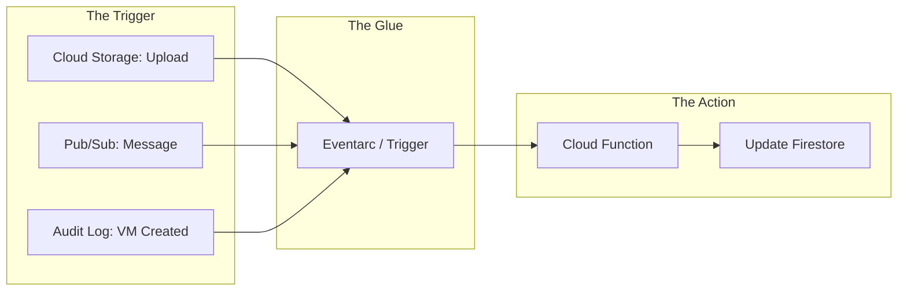

# Day 23: Cloud Functions & Eventarc

**Duration:** ⏱️ 45 Minutes  
**Level:** Intermediate  
**ACE Exam Weight:** ⭐⭐⭐⭐ High

---

## 🎯 Learning Objectives

By the end of Day 23, you will be able to:
*   **Architect** event-driven solutions using the "Trigger -> Action" pattern.
*   **Differentiate** between 1st Gen and 2nd Gen Cloud Functions (Architecture & Limits).
*   **Implement** Eventarc to unify events from 100+ Google Cloud sources.
*   **Deploy** a serverless function with environment variables and trigger filters.

---

## 🧠 1. The Serverless "Rube Goldberg" Machine

Cloud Functions are designed for **Glue Code**. They connect disparate services without requiring you to manage a single server, container, or runtime environment.

### Event-Driven Flow



---

## ⚡ 2. 1st Gen vs. 2nd Gen: The Shift to Cloud Run

Cloud Functions 2nd Gen is actually powered by **Cloud Run** under the hood, giving it massive performance and flexibility gains.

| Feature | 1st Generation | 2nd Generation (ACE Choice) |
| :--- | :--- | :--- |
| **Max Timeout** | 9 Minutes | **60 Minutes** (HTTP) |
| **Concurrency** | 1 request per instance | **1000+ requests per instance** |
| **Max Memory** | 8 GB | **16 GB+** |
| **Triggers** | Limited (PubSub/GCS) | **Eventarc (100+ Event Types)** |
| **Traffic Splitting** | Not natively supported | **Supported (Blue/Green)** |

---

## 🛠️ 3. Hands-On Lab: The "Auto-Log" Trigger

We will create a function that automatically logs metadata whenever a file is uploaded to a specific bucket.

### 🧪 Lab Objective
Deploy a 2nd Gen Python function and use Eventarc to bridge Cloud Storage events to it.

### ✅ Steps

1.  **Prepare the Storage Bucket**:
    ```bash
    export BUCKET_NAME="my-event-bucket-${PROJECT_ID}"
    gcloud storage buckets create gs://$BUCKET_NAME --location=us-central1
    ```

2.  **Define the Logic** (`main.py`):
    ```python
    import functions_framework

    @functions_framework.cloud_event
    def monitor_gcs(cloud_event):
        data = cloud_event.data
        name = data["name"]
        bucket = data["bucket"]
        print(f"File {name} detected in bucket {bucket}!")
    ```

3.  **Deploy as 2nd Gen**:
    ```bash
    gcloud functions deploy cloud-visual-logs \
      --gen2 \
      --runtime=python310 \
      --region=us-central1 \
      --source=. \
      --entry-point=monitor_gcs \
      --trigger-event-filters="type=google.cloud.storage.object.v1.finalized" \
      --trigger-event-filters="bucket=$BUCKET_NAME"
    ```

4.  **Test & Audit**:
    Upload a dummy file and check the logs in the **Cloud Logging** console or via CLI:
    ```bash
    gcloud functions logs read cloud-visual-logs --gen2 --region=us-central1
    ```

---

## ⚠️ 4. Exam Traps & Best Practices

> [!IMPORTANT]
> **ACE Exam Alert: The 9-Minute Wall**
> If an exam question asks you to process a large file that takes **15 minutes** to complete, Cloud Functions **1st Gen** is the WRONG answer. You must use **2nd Gen** or **Cloud Run**.

> [!TIP]
> **Cold Starts**: To eliminate "Cold Start" latency for production-critical functions, set `--min-instances 1`. This keeps one instance always warm and ready (but you'll pay for it!).

---

<!-- QUIZ_START -->
## 📝 5. Knowledge Check

1.  **Which technology powers Cloud Functions 2nd Gen, allowing for high concurrency and longer timeouts?**
    *   A. App Engine
    *   B. **Cloud Run** ✅
    *   C. Compute Engine
    *   D. Cloud Build

2.  **You need to trigger a function whenever a new BigQuery dataset is created. Which service unifies these events for Cloud Functions?**
    *   A. Cloud Scheduler
    *   B. **Eventarc** ✅
    *   C. Pub/Sub
    *   D. Cloud Tasks

3.  **An application requirement states that a function must handle 100 concurrent requests within a single instance to reduce costs. Which version should you use?**
    *   A. Cloud Functions 1st Gen
    *   B. **Cloud Functions 2nd Gen** ✅
    *   C. Cloud Functions legacy
    *   D. Local Docker container

4.  **What is the primary use case for Cloud Functions in a Google Cloud architecture?**
    *   A. Hosting a complex, high-traffic web application.
    *   B. **Acting as 'Glue Code' to respond to cloud events.** ✅
    *   C. Storing large amounts of unstructured data.
    *   D. Running long-term stateful databases.

5.  **How can you eliminate cold start latency for production-critical functions?**
    *   A. Use 1st Gen instead of 2nd Gen
    *   B. **Set min-instances to 1 to keep an instance warm** ✅
    *   C. Increase the memory allocation
    *   D. Deploy to multiple regions
<!-- QUIZ_END -->
---

<div class="checklist-card" x-data="{ 
    items: [
        { text: 'I understand why 2nd Gen is superior for long-running tasks.', checked: false },
        { text: 'I can explain the role of Eventarc as an event broker.', checked: false },
        { text: 'I know how to deploy a function with specific event filters.', checked: false },
        { text: 'I understand the trade-off of using min-instances.', checked: false }
    ]
}">
    <h3>
        <svg viewBox="0 0 24 24" fill="none" stroke="currentColor" stroke-width="2" stroke-linecap="round" stroke-linejoin="round" class="text-blurple">
            <path d="M22 11.08V12a10 10 0 1 1-5.93-9.14"></path>
            <polyline points="22 4 12 14.01 9 11.01"></polyline>
        </svg>
        Day 23 Mastery Checklist
    </h3>
    <template x-for="(item, index) in items" :key="index">
        <div class="checklist-item" @click="item.checked = !item.checked">
            <div class="checklist-box" :class="{ 'checked': item.checked }">
                <svg viewBox="0 0 24 24" fill="none" stroke="currentColor" stroke-width="3" stroke-linecap="round" stroke-linejoin="round">
                    <polyline points="20 6 9 17 4 12"></polyline>
                </svg>
            </div>
            <span x-text="item.text" :class="{ 'line-through text-slate-400': item.checked }"></span>
        </div>
    </template>
</div>
