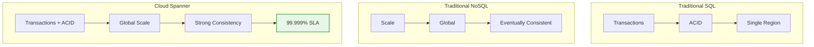
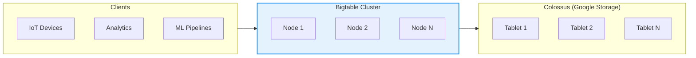
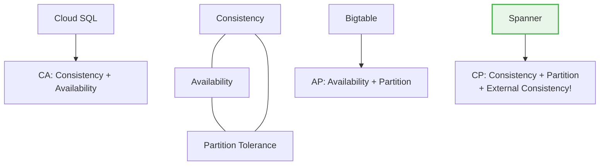

# BONUS: Cloud Spanner & Bigtable Deep Dive

**Duration:** ⏱️ 45 Minutes  
**Level:** Advanced  
**ACE Exam Weight:** ⭐⭐ Medium (Database selection questions)

---

## 🎯 Learning Objectives

By the end of this lesson, you will:

*   **Understand** globally distributed database architecture
*   **Compare** Spanner vs Bigtable vs Cloud SQL use cases
*   **Apply** CAP theorem to database selection
*   **Design** schemas for each database type

---

## 🧠 1. The Database Selection Problem

**Which database do I use?** This is one of the most common GCP architecture questions.

### 💡 Real-World Analogy: Storage Facilities

| Database | Analogy | Best For |
|----------|---------|----------|
| **Cloud SQL** | Personal safe deposit box | Structured data, transactions |
| **Spanner** | Global bank network | Global scale + ACID transactions |
| **Bigtable** | Giant warehouse with shelves | High-throughput, time-series |
| **Firestore** | Filing cabinet | Mobile/web app data |
| **BigQuery** | Library archives | Analytics, historical queries |

---

## 🌐 2. Cloud Spanner: The Global Database

### What Makes Spanner Special?



### TrueTime: The Secret Sauce
Spanner uses **atomic clocks + GPS** in every data center to synchronize time globally within microseconds. This enables:
- Global strong consistency
- Lock-free reads
- Serializable transactions across continents

### When to Use Spanner

| Use Case | Why Spanner |
|----------|-------------|
| Global financial systems | ACID across regions, zero data loss |
| Gaming leaderboards | Low latency worldwide |
| Inventory management | Consistent stock counts globally |
| Healthcare records | Compliance + availability |

### Spanner Pricing Considerations
*   **Minimum:** 1 node (~$0.90/hour)
*   **Not for:** Small projects, dev/test (use Cloud SQL instead)
*   **Sweet spot:** 10TB+ data, global users

---

## 📊 3. Bigtable: The Wide-Column Workhorse

### Architecture Overview



### Key Characteristics
*   **Schema:** Row key + Column families + Timestamps
*   **Scale:** Petabytes, millions of ops/sec
*   **Latency:** Single-digit milliseconds
*   **No:** Joins, secondary indexes, SQL

### When to Use Bigtable

| Use Case | Why Bigtable |
|----------|--------------|
| Time-series data | IoT sensors, stock prices |
| User analytics | Clickstream, session data |
| ML feature store | Fast lookups for training |
| Graph data | Social connections |

### Row Key Design (Critical!)
```
# GOOD: Reverse timestamp for recent-first queries
rowKey = "user#123#20240115120000"

# BAD: Sequential timestamps (hotspotting)
rowKey = "20240115120000#user#123"

# GOOD: Salted prefix for distribution
rowKey = "a#user#123#20240115"  # where 'a' = hash(user_id) % 10
```

---

## 4. CAP Theorem & GCP Databases

### The CAP Trade-off



### Database Selection Matrix

| Requirement | Cloud SQL | Spanner | Bigtable | Firestore |
|-------------|-----------|---------|----------|-----------|
| **ACID transactions** | ✅ | ✅ | ❌ | ✅ (limited) |
| **Global scale** | ❌ | ✅ | ✅ | ✅ |
| **SQL support** | ✅ | ✅ | ❌ | ❌ |
| **Sub-ms latency** | ⚡ | ⚡ | ⚡⚡ | ⚡ |
| **Petabyte scale** | ❌ | ✅ | ✅ | ❌ |
| **Cost** | 💰 | 💰💰💰 | 💰💰 | 💰 |

---

## 🛠️ 5. Quick Lab: Query Both Databases

### Spanner Query (SQL)
```sql
-- Spanner uses standard SQL
SELECT 
    user_id, 
    username,
    created_at
FROM Users
WHERE region = 'us-central1'
ORDER BY created_at DESC
LIMIT 100;
```

### Bigtable Query (HBase CLI)
```bash
# Bigtable uses HBase shell or client libraries
# Scan recent rows for a user
scan 'user_events', {
    ROWPREFIXFILTER => 'user#123#',
    LIMIT => 100,
    REVERSED => true
}
```

### Bigtable with Python
```python
from google.cloud import bigtable

client = bigtable.Client(project='my-project', admin=True)
instance = client.instance('my-instance')
table = instance.table('user_events')

# Read rows
rows = table.read_rows(row_set=row_set, limit=100)
for row in rows:
    print(row.row_key, row.cells)
```

---

## ⚠️ 6. Common Pitfalls

### Spanner Mistakes
| Mistake | Impact | Solution |
|---------|--------|----------|
| Using for small data | Expensive overkill | Use Cloud SQL |
| Poor interleaving | Slow joins | Design parent-child tables |
| No indexes | Full scans | Create secondary indexes |

### Bigtable Mistakes
| Mistake | Impact | Solution |
|---------|--------|----------|
| Sequential row keys | Hotspotting | Reverse/salt row keys |
| Too many column families | Slow reads | Keep <10 families |
| Using for small data | Min 3 nodes = $$ | Use Firestore instead |

---

## 🎯 7. ACE Exam Focus

### Quick Decision Guide

| Scenario | Answer |
|----------|--------|
| "Global, ACID, SQL" | **Spanner** |
| "IoT time-series, millions writes/sec" | **Bigtable** |
| "MySQL compatibility needed" | **Cloud SQL** |
| "Mobile app, offline sync" | **Firestore** |
| "Analytics, petabyte queries" | **BigQuery** |

### Exam Traps
*   ⚠️ **Spanner is expensive** - minimum cost ~$650/month
*   ⚠️ **Bigtable has no SQL** - HBase API only
*   ⚠️ **Bigtable minimum is 1 node** production, scales to thousands

---

<!-- QUIZ_START -->
## 📝 8. Knowledge Check Quiz

1. **Which GCP database provides global ACID transactions with SQL support?**
    *   A. Bigtable
    *   B. Firestore
    *   C. **Cloud Spanner** ✅
    *   D. Cloud SQL

2. **What type of data model does Bigtable use?**
    *   A. Relational (tables with joins)
    *   B. Document (JSON)
    *   C. **Wide-column (row key + column families)** ✅
    *   D. Graph

3. **You're building an IoT platform that ingests millions of sensor readings per second. Which database is best?**
    *   A. Cloud SQL
    *   B. Firestore
    *   C. **Bigtable** ✅
    *   D. Cloud Spanner

4. **What technology does Cloud Spanner use to achieve global consistency?**
    *   A. Two-phase commit
    *   B. Paxos consensus
    *   C. **TrueTime (atomic clocks + GPS)** ✅
    *   D. Vector clocks

5. **Which is a critical Bigtable row key design mistake?**
    *   A. Using composite keys
    *   B. **Using sequential timestamps as prefix** ✅
    *   C. Including user IDs
    *   D. Using reverse timestamps
<!-- QUIZ_END -->

---

<!-- FLASHCARDS
[
  {"term": "Cloud Spanner", "def": "Globally distributed, horizontally scalable SQL database with ACID transactions. Uses TrueTime for consistency."},
  {"term": "Bigtable", "def": "Wide-column NoSQL database for high-throughput workloads. Great for time-series and IoT data."},
  {"term": "TrueTime", "def": "Google's globally synchronized clock using atomic clocks and GPS. Enables Spanner's consistency."},
  {"term": "Hotspotting", "def": "When writes concentrate on few nodes due to sequential keys. Avoid by salting row keys."},
  {"term": "CAP Theorem", "def": "Distributed systems can only guarantee 2 of 3: Consistency, Availability, Partition tolerance."},
  {"term": "Wide-column", "def": "Data model with row keys, column families, and billions of columns. Used by Bigtable and HBase."}
]
-->

---

### 🗑️ Lab Cleanup (Mandatory)

> **⚠️ Critical:** Delete resources to avoid unecessary billing!

1.  **Delete Project:** (Fastest way)
    ```bash
    gcloud projects delete $PROJECT_ID
    ```
2.  **Or Delete Resources Individually:**
    ```bash
    # Example commands (verify before running)
    gcloud compute instances delete [INSTANCE_NAME] --quiet
    gcloud storage rm -r gs://[BUCKET_NAME]
    ```
