# Module 14: BigQuery Analytics

> **🎯 Objectives:**
> *   Master core concepts
> *   Build hands-on resources
> *   Pass the ACE exam scenarios

| 📚 Concepts | 🧪 Lab | 📝 Quiz | 💼 Interview |
|---|---|---|---|
| [Jump to Theory](#concepts) | [Jump to Lab](#hands-on-lab) | [Jump to Quiz](#knowledge-check) | [Jump to Interview](#interview-questions) |

---


> **🎯 Objectives:**
> *   Master core concepts
> *   Build hands-on resources
> *   Pass the ACE exam scenarios

| 📚 Concepts | 🧪 Lab | 📝 Quiz | 💼 Interview |
|---|---|---|---|
| [Jump to Theory](#concepts) | [Jump to Lab](#hands-on-lab) | [Jump to Quiz](#knowledge-check) | [Jump to Interview](#interview-questions) |

---


> **🎯 Objectives:**
> *   Master core concepts
> *   Build hands-on resources
> *   Pass the ACE exam scenarios

| 📚 Concepts | 🧪 Lab | 📝 Quiz | 💼 Interview |
|---|---|---|---|
| [Jump to Theory](#concepts) | [Jump to Lab](#hands-on-lab) | [Jump to Quiz](#knowledge-check) | [Jump to Interview](#interview-questions) |

---


> **Official Doc Reference**: [BigQuery Documentation](https://cloud.google.com/bigquery/docs)

## Learning Objectives
By the end of this day, you should be able to:
- Understand BigQuery's serverless architecture and when to use it
- Create datasets, tables, and run SQL queries
- Implement partitioning and clustering for cost optimization
- Load data from Cloud Storage and other sources

---

## 🏢 Industry Context: BigQuery in Production

> [!NOTE]
> **Role Lens:** BigQuery is THE interview topic for Data Engineers. Cost optimization questions are guaranteed.

### Job Roles & BigQuery Usage

| Role | How They Use BigQuery | Day-to-Day Tasks |
|------|----------------------|------------------|
| **Data Engineer** | Build data pipelines | ETL, partitioning, scheduling |
| **Data Analyst** | Query and analyze | SQL, dashboards, reporting |
| **FinOps Analyst** | Optimize costs | Slot usage, query patterns |
| **ML Engineer** | Feature engineering | BigQuery ML, training data |

### Cost Optimization Patterns

| Pattern | Savings | Implementation |
|---------|---------|----------------|
| **Partitioning** | 90%+ | Filter by partition column |
| **Clustering** | 50-80% | Sort by frequently filtered columns |
| **SELECT specific columns** | 50%+ | Avoid SELECT * |
| **Slot-based pricing** | Predictable | Switch at > $10k/month |

### ❌ Interview Mistakes to Avoid

| Mistake | Why It's Bad | What to Say Instead |
|---------|--------------|---------------------|
| "I use SELECT * for convenience" | Wastes money scanning all columns | "I always select only needed columns" |
| "BigQuery is for everything" | Not for OLTP | "BigQuery for analytics; Cloud SQL for transactions" |
| "I don't partition tables" | Full scans are expensive | "I partition by date for time-based queries" |

### 🔍 Role Lens: What Each Role Focuses On

> **🔵 Data Engineer:** Master partitioning, clustering, and Dataflow integration. Know how to optimize ETL costs.

> **🟢 Data Analyst:** Focus on SQL proficiency, scheduled queries, and dashboard integration with Looker.

> **🟠 FinOps Analyst:** Understand slot pricing vs on-demand, identify expensive queries from INFORMATION_SCHEMA.

> **🔴 ML Engineer:** Know BigQuery ML syntax, feature engineering techniques, and export to Vertex AI.

---

## 1️⃣ What is BigQuery? 🏛️

**BigQuery** is Google's fully-managed, serverless data warehouse designed for large-scale analytics. Think of it as a **massive library** where:
- You don't manage the building (infrastructure)
- You just ask questions (SQL queries)
- You pay only for the books you read (data scanned)

### Architecture Overview

```mermaid
graph TB
    subgraph "BigQuery Architecture"
        Client[👤 User/Application]
        BQ[🔷 BigQuery API]
        
        subgraph "Dremel Engine"
            Root[Root Server]
            Mix1[Mixer 1]
            Mix2[Mixer 2]
            Leaf1[Leaf 1]
            Leaf2[Leaf 2]
            Leaf3[Leaf 3]
            Leaf4[Leaf 4]
        end
        
        subgraph "Colossus Storage"
            Col1[(Column 1)]
            Col2[(Column 2)]
            Col3[(Column 3)]
        end
    end
    
    Client --> BQ
    BQ --> Root
    Root --> Mix1 & Mix2
    Mix1 --> Leaf1 & Leaf2
    Mix2 --> Leaf3 & Leaf4
    Leaf1 & Leaf2 & Leaf3 & Leaf4 --> Col1 & Col2 & Col3
```



### Key Concepts

| Concept | Description | Analogy |
|---------|-------------|---------|
| **Dataset** | Container for tables | A folder in your library |
| **Table** | Structured data storage | A book with chapters |
| **View** | Virtual table from a query | A bookmark to specific pages |
| **Partitioned Table** | Table split by date/integer | Books organized by year |
| **Clustered Table** | Data sorted within partitions | Alphabetized chapters |

---

## 2️⃣ Real-World Analogy: The Infinite Library 📚

Imagine a library with **infinite shelves** and **1000 librarians**:
- You ask: "Find all books about 'Cloud' published in 2024"
- All 1000 librarians search simultaneously (parallel processing)
- They only look at the 2024 section (partitioning)
- Within 2024, books are alphabetized (clustering)
- You pay per page they read, not per librarian

**That's BigQuery** - massively parallel, column-oriented, pay-per-query.

---

## 3️⃣ BigQuery Pricing 💰

| Pricing Model | How It Works | Best For |
|---------------|--------------|----------|
| **On-Demand** | $5 per TB scanned | Occasional queries |
| **Flat-Rate** | $2,000+/month for slots | Heavy, predictable usage |
| **Storage** | $0.02/GB/month (active) | All data |

> [!TIP]
> **Cost Optimization**: Use `SELECT specific_columns` instead of `SELECT *`. You pay for data scanned!

---

## 4️⃣ Hands-On Lab: Your First BigQuery Analysis 🛠️

### Step 1: Create a Dataset
```bash
# In Cloud Shell
bq mk --dataset --location=US my_dataset
```

### Step 2: Query Public Data (Free!)
```sql
-- Query GitHub public dataset
SELECT 
  repo_name,
  COUNT(*) as commit_count
FROM `bigquery-public-data.github_repos.commits`
WHERE 
  author.date > '2024-01-01'
GROUP BY repo_name
ORDER BY commit_count DESC
LIMIT 10;
```

### Step 3: Create a Partitioned Table
```sql
CREATE TABLE my_dataset.sales_partitioned
PARTITION BY DATE(sale_date)
CLUSTER BY region, product_id
AS
SELECT 
  order_id,
  sale_date,
  region,
  product_id,
  amount
FROM my_dataset.raw_sales;
```

### Step 4: Load Data from Cloud Storage
```bash
bq load \
  --source_format=CSV \
  --skip_leading_rows=1 \
  my_dataset.customers \
  gs://my-bucket/customers.csv \
  name:STRING,email:STRING,signup_date:DATE
```

---

## 5️⃣ Partitioning vs Clustering

```mermaid
graph LR
    subgraph "Without Optimization"
        A[Full Table Scan 💸]
    end
    
    subgraph "With Partitioning"
        B[Scan Only 2024 Partition ✅]
    end
    
    subgraph "With Clustering"
        C[Scan Only 'US' Region ✅✅]
    end
    
    A -->|100 TB scanned| Cost1[$500]
    B -->|10 TB scanned| Cost2[$50]
    C -->|1 TB scanned| Cost3[$5]
```



| Feature | Partitioning | Clustering |
|---------|--------------|------------|
| **What** | Divides table into segments | Sorts data within partitions |
| **By** | Date, timestamp, or integer | Up to 4 columns |
| **Benefit** | Reduces data scanned | Further reduces data scanned |
| **Limit** | 4,000 partitions | N/A |

---

## 6️⃣ Exam Scenarios & Traps 🚨

| Scenario | Answer |
|----------|--------|
| "Analyze petabytes of log data with SQL" | **BigQuery** |
| "Need ACID transactions on relational data" | **Cloud SQL** or **Spanner** (NOT BigQuery) |
| "Real-time streaming analytics" | **BigQuery Streaming Insert** + **Dataflow** |
| "Reduce query costs for date-based queries" | **Partition by date** |
| "Query runs slow on large table" | Check if table is **partitioned/clustered** |

> [!CAUTION]
> **Trap**: BigQuery is NOT for OLTP (transactional workloads). Use Cloud SQL or Spanner for that!

---

## 7️⃣ Cheat Sheet

```text
┌─────────────────────────────────────────────────────────┐
│                    BIGQUERY CHEAT SHEET                 │
├─────────────────────────────────────────────────────────┤
│ bq mk --dataset DATASET           # Create dataset     │
│ bq ls                              # List datasets      │
│ bq query "SELECT..."              # Run query          │
│ bq load DATASET.TABLE FILE        # Load data          │
│ bq extract DATASET.TABLE gs://... # Export data        │
├─────────────────────────────────────────────────────────┤
│ PARTITION BY DATE(col)            # Date partitioning  │
│ CLUSTER BY col1, col2             # Clustering         │
│ SELECT * EXCEPT(col)              # Exclude columns    │
│ APPROX_COUNT_DISTINCT(col)        # Fast distinct      │
└─────────────────────────────────────────────────────────┘
```

---

## 8️⃣ Checkpoint Quiz

1. **What is the primary pricing model for BigQuery on-demand?**
   - A) Per hour of query execution
   - B) Per TB of data scanned ✅
   - C) Per row returned
   - D) Flat monthly fee

2. **Which feature reduces costs for queries filtering by date?**
   - A) Views
   - B) Clustering
   - C) Partitioning ✅
   - D) Caching

3. **You need to analyze 10 years of sales data occasionally. Which pricing?**
   - A) Flat-rate
   - B) On-demand ✅
   - C) Free tier
   - D) Committed use

4. **BigQuery is best suited for:**
   - A) High-frequency transactional writes
   - B) Large-scale analytical queries ✅
   - C) Document storage
   - D) Real-time gaming leaderboards

5. **True or False: You can cluster a table by up to 10 columns.**
   - Answer: **False** (Maximum is 4 columns)

---

<!-- FLASHCARDS
[
  {"term": "BigQuery", "def": "Serverless, petabyte-scale data warehouse for analytics."},
  {"term": "Partitioning", "def": "Dividing a table by date/integer to reduce scan costs."},
  {"term": "Clustering", "def": "Sorting data within partitions by up to 4 columns."},
  {"term": "Dremel", "def": "BigQuery's query engine that enables parallel processing."},
  {"term": "On-Demand Pricing", "def": "$5 per TB of data scanned by queries."}
]
-->
---

### 🗑️ Lab Cleanup (Mandatory)

> **⚠️ Critical:** Delete resources to avoid unecessary billing!

1.  **Delete Project:** (Fastest way)
    ```bash
    gcloud projects delete $PROJECT_ID
    ```
2.  **Or Delete Resources Individually:**
    ```bash
    # Example commands (verify before running)
    gcloud compute instances delete [INSTANCE_NAME] --quiet
    gcloud storage rm -r gs://[BUCKET_NAME]
    ```