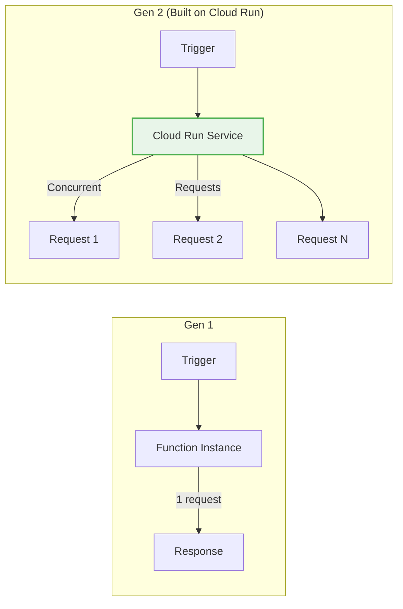
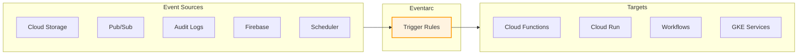
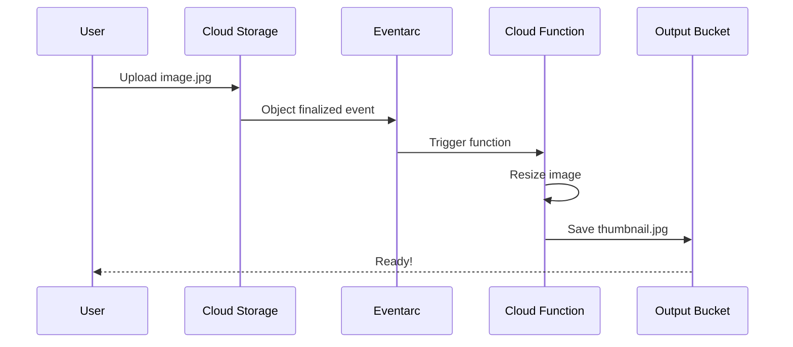
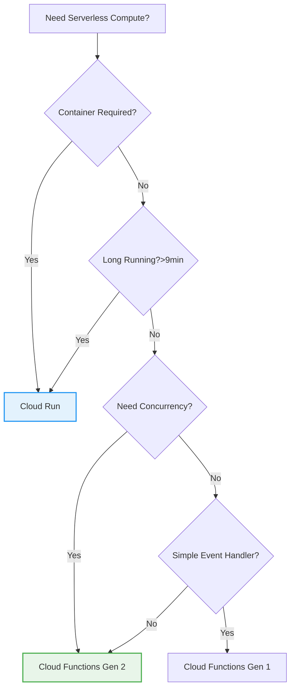

# Day 23: Cloud Functions & Event-Driven Architecture

**Duration:** ⏱️ 60 Minutes  
**Level:** Intermediate  
**ACE Exam Weight:** ⭐⭐ Medium (Serverless compute is a core exam topic)

---

## 🎯 Learning Objectives

By the end of this lesson, you will:

*   **Understand** Cloud Functions Gen 1 vs Gen 2 differences
*   **Design** event-driven architectures using Eventarc
*   **Deploy** functions triggered by HTTP, Pub/Sub, and Cloud Storage
*   **Compare** Cloud Functions vs Cloud Run for serverless workloads
*   **Implement** best practices for function performance and security

---

## 🧠 1. What Are Cloud Functions? (Plain-English)

**Cloud Functions = Code that runs when something happens.**

Think of it like a **motion-sensor light**: you don't leave it on 24/7. It only turns on when someone walks by. Similarly, Cloud Functions only run (and charge you) when triggered.

### 💡 Real-World Analogy: The Automatic Door

| Scenario | Traditional Server | Cloud Functions |
|----------|-------------------|-----------------|
| **Setup** | Hire a doorman 24/7 | Install motion sensor |
| **Cost** | Pay salary even when no visitors | Pay only when door opens |
| **Scaling** | One doorman = bottleneck | Unlimited parallel triggers |
| **Maintenance** | You manage the doorman | Google manages everything |

> **Key Insight:** You write the code, Google handles servers, scaling, and patching.

---

## 🔄 2. Gen 1 vs Gen 2: The Evolution

Cloud Functions Gen 2 is a **major upgrade** built on Cloud Run infrastructure.

| Feature | Gen 1 | Gen 2 |
|---------|-------|-------|
| **Max Timeout** | 9 minutes | **60 minutes** |
| **Max Memory** | 8 GB | **32 GB** |
| **Concurrency** | 1 request/instance | **Up to 1000 requests/instance** |
| **Cold Start** | Slower | **Faster** (Runs on Cloud Run) |
| **Traffic Splitting** | ❌ No | ✅ Yes (Canary deployments) |
| **Eventarc Support** | Limited | **Full** (90+ event sources) |
| **Pricing** | Per invocation | Per invocation + Cloud Run pricing |

### Architecture Comparison



> **🎯 ACE Tip:** If a question mentions "long-running function" (>9 min) or "concurrent requests" → **Gen 2** is the answer.

---

## 🔗 3. Eventarc: The Universal Event Router

**Eventarc = The nervous system of your cloud.**

It connects events from 90+ sources to any target that can receive HTTP requests.

### Event Flow Architecture



### Common Eventarc Triggers

| Event Source | Example Use Case |
|-------------|-----------------|
| **Cloud Storage** | Image uploaded → Resize & thumbnail |
| **Pub/Sub** | Message received → Process order |
| **Audit Logs** | VM created → Send Slack notification |
| **Cloud Scheduler** | Every 5 min → Run cleanup job |
| **Firestore** | Document updated → Sync to BigQuery |

---

## 4. Trigger Types Deep Dive

### HTTP Triggers (Synchronous)
```bash
# Deploy HTTP function
gcloud functions deploy hello-http \
    --gen2 \
    --runtime python311 \
    --trigger-http \
    --allow-unauthenticated \
    --region us-central1
```

**Use When:** You need a REST API endpoint, webhook, or direct invocation.

### Event Triggers (Asynchronous)
```bash
# Deploy function triggered by Cloud Storage
gcloud functions deploy process-image \
    --gen2 \
    --runtime python311 \
    --trigger-event-filters="type=google.cloud.storage.object.v1.finalized" \
    --trigger-event-filters="bucket=my-bucket" \
    --region us-central1
```

**Use When:** Background processing, file processing, data pipelines.

---

## 🛠️ 5. Hands-On Lab: Build an Image Processor

**Mission:** Create an automatic image thumbnail generator.

### Architecture


### Step 1: Create Buckets
```bash
# Source bucket (uploads go here)
gcloud storage buckets create gs://PROJECT_ID-uploads --location=us-central1

# Output bucket (thumbnails go here)
gcloud storage buckets create gs://PROJECT_ID-thumbnails --location=us-central1
```

### Step 2: Create the Function
Create `main.py`:
```python
from google.cloud import storage
from PIL import Image
import io
import functions_framework

@functions_framework.cloud_event
def generate_thumbnail(cloud_event):
    """Triggered by Cloud Storage finalize event."""
    data = cloud_event.data
    bucket_name = data["bucket"]
    file_name = data["name"]
    
    # Skip if already a thumbnail
    if file_name.startswith("thumb_"):
        return
    
    # Download, resize, upload
    storage_client = storage.Client()
    bucket = storage_client.bucket(bucket_name)
    blob = bucket.blob(file_name)
    
    image_data = blob.download_as_bytes()
    image = Image.open(io.BytesIO(image_data))
    image.thumbnail((128, 128))
    
    # Save to output bucket
    output_bucket = storage_client.bucket(f"{bucket_name.split('-')[0]}-thumbnails")
    output_blob = output_bucket.blob(f"thumb_{file_name}")
    
    buffer = io.BytesIO()
    image.save(buffer, format='JPEG')
    output_blob.upload_from_string(buffer.getvalue(), content_type='image/jpeg')
    
    print(f"Thumbnail created: thumb_{file_name}")
```

### Step 3: Deploy
```bash
gcloud functions deploy generate-thumbnail \
    --gen2 \
    --runtime python311 \
    --trigger-event-filters="type=google.cloud.storage.object.v1.finalized" \
    --trigger-event-filters="bucket=PROJECT_ID-uploads" \
    --region us-central1 \
    --source .
```

### Step 4: Test
```bash
# Upload a test image
gcloud storage cp test-image.jpg gs://PROJECT_ID-uploads/

# Check the output bucket
gcloud storage ls gs://PROJECT_ID-thumbnails/
```

---

## ⚠️ 6. Common Pitfalls & Pro Tips

### ❌ Mistakes to Avoid
| Mistake | Problem | Solution |
|---------|---------|----------|
| Infinite loops | Function triggers itself | Check file prefix/suffix before processing |
| Cold starts | Slow first request | Use min instances or Gen 2 |
| Timeout errors | Function runs too long | Increase timeout or use Cloud Run Jobs |
| Missing permissions | Function can't access resources | Grant service account proper IAM roles |

### ✅ Pro Tips
*   **Use `--min-instances=1`** for production to eliminate cold starts
*   **Set `--memory=256MB`** minimum for Python/Node (128MB is too small)
*   **Use Secrets Manager** instead of environment variables for API keys
*   **Enable Cloud Trace** for debugging distributed systems

---

## 🎯 7. ACE Exam Focus

### Decision Tree: When to Use What?



### Exam Traps
*   ⚠️ **Gen 1 max timeout is 9 minutes** (not 15!)
*   ⚠️ **Gen 2 is built on Cloud Run** (know this for architecture questions)
*   ⚠️ **Eventarc uses CloudEvents format** (standardized, portable)

---

<!-- QUIZ_START -->
## 📝 8. Knowledge Check Quiz

1. **What is the maximum execution timeout for Cloud Functions Gen 2?**
    *   A. 9 minutes
    *   B. 15 minutes
    *   C. **60 minutes** ✅
    *   D. Unlimited

2. **Cloud Functions Gen 2 is built on top of which service?**
    *   A. App Engine
    *   B. Compute Engine
    *   C. **Cloud Run** ✅
    *   D. Kubernetes Engine

3. **Which component routes events from sources to targets in GCP?**
    *   A. Cloud Scheduler
    *   B. Pub/Sub
    *   C. **Eventarc** ✅
    *   D. Cloud Tasks

4. **You need a function that processes 500 concurrent requests. Which should you use?**
    *   A. Cloud Functions Gen 1
    *   B. **Cloud Functions Gen 2** ✅
    *   C. App Engine Standard
    *   D. Compute Engine

5. **What event format does Eventarc use for standardization?**
    *   A. JSON-RPC
    *   B. Protocol Buffers
    *   C. **CloudEvents** ✅
    *   D. Apache Avro
<!-- QUIZ_END -->

---

## ✅ Day 23 Checklist

- [ ] Understand Gen 1 vs Gen 2 differences
- [ ] Deploy an HTTP-triggered function
- [ ] Deploy an event-triggered function
- [ ] Complete the image processor lab
- [ ] Pass the quiz with 80%+

---

### 🚀 What's Next?
**Day 24: Advanced IAM & Identity Governance**
*   Service Account best practices
*   Workload Identity Federation
*   IAM Conditions and Deny Policies

<!-- FLASHCARDS
[
  {"term": "Cloud Functions", "def": "Serverless FaaS (Function as a Service). Upload code, Google runs it on demand."},
  {"term": "Gen 2", "def": "Latest Cloud Functions version. Built on Cloud Run. 60min timeout, concurrent requests."},
  {"term": "Eventarc", "def": "Universal event router. Connects 90+ GCP sources to any HTTP target."},
  {"term": "CloudEvents", "def": "Standardized event format used by Eventarc. Portable across cloud providers."},
  {"term": "Cold Start", "def": "Delay when a new function instance must be created. Mitigate with min-instances."},
  {"term": "Trigger", "def": "The event that causes a function to execute (HTTP, Pub/Sub, Storage, etc)."}
]
-->
