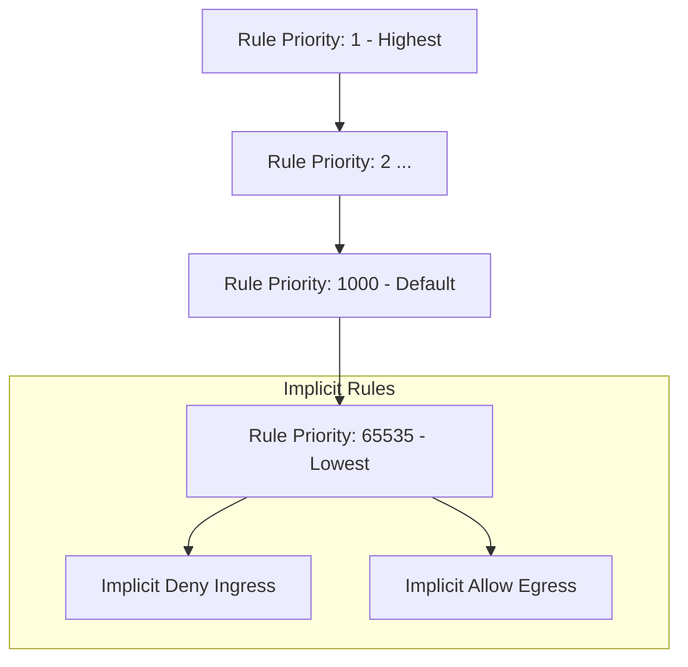
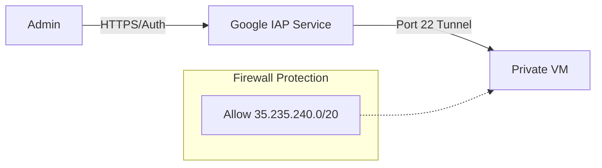

# Day 24: Network Security (Firewalls & IAP)

**Duration:** ⏱️ 45 Minutes  
**Level:** Intermediate  
**ACE Exam Weight:** ⭐⭐⭐⭐ High

---

## 🎯 Learning Objectives

By the end of Day 24, you will be able to:
*   **Configure** stateful VPC firewall rules with granular priorities and targets.
*   **Implement** Identity-Aware Proxy (IAP) to secure SSH/RDP access without public IPs.
*   **Understand** Cloud Armor's role in L7 filtering and DDoS mitigation.
*   **Audit** network traffic using Firewall Insights and Log Analysis.

---

## 🛡️ 1. VPC Firewall Rules: The Perimeter

GCP Firewalls are **stateful** (if you allow ingress, egress is automatically allowed for that session) and distributed (enforced at each VM, not at a single bottleneck).

### Rule Evaluation Order



| Element | Property | ACE Exam Note |
| :--- | :--- | :--- |
| **Priority** | 0 - 65535 | **Lower number wins**. A rule with priority 100 overrides priority 500. |
| **Targets** | Tags / Service Accounts | Best practice: Use **Service Accounts** for dynamic security. |
| **Source** | IP Ranges / Tags | Use `0.0.0.0/0` only for public web traffic (Port 80/443). |

---

## 🏰 2. Identity-Aware Proxy (IAP)

IAP changes the security paradigm from "Network-based" to "Identity-based." Instead of opening a firewall port to the whole internet, you only open it to Google's specialized proxy service.

### The IAP Tunneling Flow



> [!IMPORTANT]
> **ACE Exam Alert: The Magic Range**
> To enable IAP for SSH/RDP, you MUST allow ingress from the IP range **`35.235.240.0/20`** on Port 22 (SSH) or 3389 (RDP). This is a common exam question!

---

## 🛠️ 3. Hands-On Lab: The "Fortress" VM

### 🧪 Lab Objective
Access a VM that has **no external IP** and is blocked from the general internet, using only IAP.

### ✅ Steps

1.  **Create a Stealth VM**:
    ```bash
    gcloud compute instances create stealth-box \
      --network=default \
      --no-address \
      --zone=us-central1-a
    ```

2.  **Verify Inaccessibility**:
    Try to SSH. It will timeout because there is no path from your computer to a private IP.

3.  **Deploy the "Secret Tunnel" Rule**:
    ```bash
    gcloud compute firewall-rules create allow-ssh-iap \
      --direction=INGRESS \
      --priority=1000 \
      --network=default \
      --action=ALLOW \
      --rules=tcp:22 \
      --source-ranges=35.235.240.0/20
    ```

4.  **Execute the Tunnel**:
    ```bash
    gcloud compute ssh stealth-box --tunnel-through-iap --zone=us-central1-a
    ```
    *Result: Successful login! The VM remains invisible to the public internet.*

---

## 🛡️ 4. Beyond Firewalls: Cloud Armor

While firewalls handle Layer 4 (IP/Port), **Cloud Armor** handles Layer 7 (HTTP/S).

*   **WAF (Web Application Firewall)**: Blocks SQL Injection and Cross-Site Scripting (XSS).
*   **DDoS Protection**: Automatically mitigates massive flooding attacks.
*   **Adaptive Protection**: Uses ML to detect anomalies in traffic patterns.

---

<!-- QUIZ_START -->
## 📝 5. Knowledge Check

1.  **A developer created a firewall rule with priority 500 to DENY traffic, and another rule with priority 200 to ALLOW that same traffic. What will happen?**
    *   A. Traffic is denied because Deny always wins.
    *   B. **Traffic is allowed because priority 200 is evaluated first.** ✅
    *   C. Both rules are ignored.
    *   D. GCP will throw an error for conflicting rules.

2.  **Which IP range must be allowed in your firewall to enable Identity-Aware Proxy (IAP) for administrative access?**
    *   A. 0.0.0.0/0
    *   B. **35.235.240.0/20** ✅
    *   C. 10.0.0.0/8
    *   D. 192.168.1.0/24

3.  **What is the default action for any INGRESS traffic that doesn't match a specific firewall rule?**
    *   A. Allow
    *   B. **Deny** ✅
    *   C. Log and Allow
    *   D. Forward to the admin

4.  **You want to protect your globally exposed application from SQL injection attacks. Which service should you use?**
    *   A. VPC Firewall Rules
    *   B. **Cloud Armor** ✅
    *   C. Cloud NAT
    *   D. IAM Conditions

5.  **True or False: GCP Firewall Rules are stateful.**
    *   A. **True** ✅
    *   B. False
<!-- QUIZ_END -->
---

<div class="checklist-card" x-data="{ 
    items: [
        { text: 'I can explain the priority system (0-65535).', checked: false },
        { text: 'I know the IAP source range by heart.', checked: false },
        { text: 'I understand the difference between Firewall Rules (L4) and Cloud Armor (L7).', checked: false },
        { text: 'I successfully SSHed into a VM with no public IP.', checked: false }
    ]
}">
    <h3>
        <svg viewBox="0 0 24 24" fill="none" stroke="currentColor" stroke-width="2" stroke-linecap="round" stroke-linejoin="round" class="text-blurple">
            <path d="M22 11.08V12a10 10 0 1 1-5.93-9.14"></path>
            <polyline points="22 4 12 14.01 9 11.01"></polyline>
        </svg>
        Day 24 Mastery Checklist
    </h3>
    <template x-for="(item, index) in items" :key="index">
        <div class="checklist-item" @click="item.checked = !item.checked">
            <div class="checklist-box" :class="{ 'checked': item.checked }">
                <svg viewBox="0 0 24 24" fill="none" stroke="currentColor" stroke-width="3" stroke-linecap="round" stroke-linejoin="round">
                    <polyline points="20 6 9 17 4 12"></polyline>
                </svg>
            </div>
            <span x-text="item.text" :class="{ 'line-through text-slate-400': item.checked }"></span>
        </div>
    </template>
</div>
