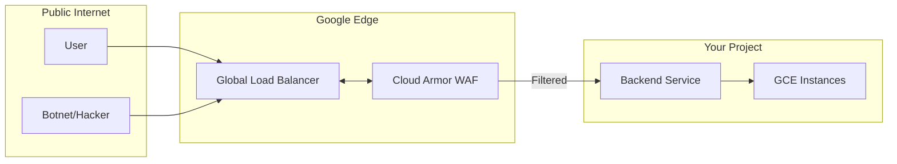

# Day 25: Cloud Armor & Data Security

**Duration:** ⏱️ 45 Minutes  
**Level:** Intermediate  
**ACE Exam Weight:** ⭐⭐⭐⭐ High

---

## 🎯 Learning Objectives

By the end of Day 25, you will be able to:
*   **Protect** web applications at the edge using Cloud Armor Security Policies.
*   **Configure** WAF rules to detect and block SQL injection and Cross-Site Scripting (XSS).
*   **Differentiate** between Default Encryption, Customer-Managed Keys (CMEK), and Customer-Supplied Keys (CSEK).
*   **Implement** geo-blocking and rate limiting to mitigate automated attacks.

---

## 🛡️ 1. Cloud Armor: The Edge Shield

Cloud Armor works in tandem with the **Global HTTP(S) Load Balancer** to provide a multi-layer defense. It stops malicious traffic at the Google edge, before it even enters your VPC.

### The Defense-in-Depth Pipeline



| Rule Type | Use Case | ACE Exam Note |
| :--- | :--- | :--- |
| **IP-based** | Block/Allow specific CIDRs. | Simplest form of filtering. |
| **Geo-based** | Block countries for compliance/risk. | Uses Google's global IP-to-location map. |
| **Expression-based** | Block SQLi, XSS, specific headers. | Uses predefined "WAF" rules. |
| **Rate Limiting** | Prevent DDoS by throttling IPs. | Enforces a max RPS (Requests Per Second). |

---

## 🔐 2. Protecting Data at Rest

Google encrypts all data at rest by default. However, for many compliance standards, you need more control over the **Keys**.

### The Key Management Spectrum

1.  **Default Encryption**: Google manage the keys. No effort, zero cost.
2.  **CMEK (Customer-Managed)**: You create a key in **Cloud KMS**. You control rotation and can disable the key at any time.
3.  **CSEK (Customer-Supplied)**: You provide the raw key for every disk/bucket operation. Google doesn't store it. If you lose it, the data is gone forever.

> [!IMPORTANT]
> **ACE Exam Alert: Crypto-shredding**
> If you need to instantly and irreversibly destroy large amounts of data, the fastest way is to **delete the CMEK key** in Cloud KMS. This renders all encrypted chunks unreadable immediately.

---

## 🛠️ 3. Hands-On Lab: Defeating SQL Injection

### 🧪 Lab Objective
Deploy a Cloud Armor policy that uses a predefined rule to block common SQL injection patterns.

### ✅ Steps

1.  **Initialize the Policy**:
    ```bash
    gcloud compute security-policies create waf-policy-sql \
        --description "WAF policy with SQLi protection"
    ```

2.  **Add Predefined SQLi Rule**:
    We use the priority system where 1000 is for our custom rule.
    ```bash
    gcloud compute security-policies rules create 1000 \
        --security-policy waf-policy-sql \
        --expression "evaluatePredefinedExpr('sqli-v33-stable')" \
        --action "deny-403" \
        --description "Deny SQL Injection attempts"
    ```

3.  **Attach to Backend**:
    Attach this policy to an existing Global Load Balancer backend.
    ```bash
    gcloud compute backend-services update my-web-backend \
        --security-policy waf-policy-sql \
        --global
    ```

---

## 📝 4. Knowledge Check

<!-- QUIZ_START -->
1.  **You need to ensure that your web application is only accessible from users in the United Kingdom for legal compliance. Which service should you use?**
    *   A. VPC Firewall Rules
    *   B. **Cloud Armor Security Policy (Geo-blocking)** ✅
    *   C. IAM Conditions
    *   D. Cloud CDN

2.  **What is the most secure key management option where Google never stores the raw key on persistent storage?**
    *   A. Default Google-managed encryption
    *   B. Cloud KMS (CMEK)
    *   C. **Customer-Supplied Encryption Keys (CSEK)** ✅
    *   D. IAM Service Accounts

3.  **Which Google Cloud service provides protection against Distributed Denial of Service (DDoS) attacks at the global edge?**
    *   A. Cloud NAT
    *   B. **Cloud Armor** ✅
    *   C. Cloud Router
    *   D. VPC Peering

4.  **How is Cloud Armor billed in the standard tier?**
    *   A. Per CPU hour.
    *   B. **Per security policy and per incoming request.** ✅
    *   C. Per number of VMs protected.
    *   D. It is a free service included with all projects.

5.  **You want to implement 'Crypto-shredding' for an old project. What is the correct procedure?**
    *   A. Format the hard drives.
    *   B. **Delete the Customer-Managed Key (CMEK) associated with the data.** ✅
    *   C. Change the project billing account.
    *   D. Move the data to Coldline storage.
<!-- QUIZ_END -->

---

<div class="checklist-card" x-data="{ 
    items: [
        { text: 'I understand that Cloud Armor lives at the Global Load Balancer edge.', checked: false },
        { text: 'I can differentiate between CMEK and CSEK.', checked: false },
        { text: 'I know how to block traffic based on Geography.', checked: false },
        { text: 'I know what predefined WAF rules are (SQLi/XSS).', checked: false }
    ]
}">
    <h3>
        <svg viewBox="0 0 24 24" fill="none" stroke="currentColor" stroke-width="2" stroke-linecap="round" stroke-linejoin="round" class="text-blurple">
            <path d="M22 11.08V12a10 10 0 1 1-5.93-9.14"></path>
            <polyline points="22 4 12 14.01 9 11.01"></polyline>
        </svg>
        Day 25 Mastery Checklist
    </h3>
    <template x-for="(item, index) in items" :key="index">
        <div class="checklist-item" @click="item.checked = !item.checked">
            <div class="checklist-box" :class="{ 'checked': item.checked }">
                <svg viewBox="0 0 24 24" fill="none" stroke="currentColor" stroke-width="3" stroke-linecap="round" stroke-linejoin="round">
                    <polyline points="20 6 9 17 4 12"></polyline>
                </svg>
            </div>
            <span x-text="item.text" :class="{ 'line-through text-slate-400': item.checked }"></span>
        </div>
    </template>
</div>
