# SECTION 25: Cloud Armor & Data Security

> **Official Doc Reference**: [Cloud Armor](https://cloud.google.com/armor/docs) | [Cloud Key Management](https://cloud.google.com/kms/docs)

## 1️⃣ Cloud Armor: The Shield 🛡️
Cloud Armor is a **Web Application Firewall (WAF)** and **DDoS Protection** service.
It sits at the **Global Load Balancer** edge. It stops bad traffic *before* it reaches your servers.

### Key Features
*   **DDoS Defense:** Automatically mitigates Layer 3/4 attacks.
*   **WAF Rules:** Blocks common attacks like **SQL Injection (SQLi)** and **Cross-Site Scripting (XSS)**.
*   **Geo-Blocking:** "Block all traffic from Country X".
*   **Rate Limiting:** "Allow max 100 requests per minute per IP".

## 2️⃣ Architecture: Where does it sit?

```mermaid
graph LR
    Hacker[🔴 Hacker] -- Attack --> GLB[🌐 Global Load Balancer]
    User[🟢 User] -- Request --> GLB
    GLB -- Filter --> CA[🛡️ Cloud Armor Policy]
    CA -- Block --> Hacker
    CA -- Allow --> Backend[🏢 Backend Service]
```


## 3️⃣ Data Security: Encryption 🔒
Once the traffic is in, how do we protect the data?

### Default Encryption
**Google encrypts ALL data at rest and in transit by default.**
*   Disks, Buckets, SQL backups... all encrypted. (AES-256).

### CMEK (Customer-Managed Encryption Keys)
For regulated industries (Banking/Health), you might need to manage the keys yourself.
*   **Cloud KMS (Key Management Service):** You create/rotate the keys.
*   **Crypto-shredding:** If you destroy the key in KMS, the data is unreadable forever (even by Google).

## 4️⃣ Hands-On Lab: Set up a WAF Rule 🛠️

**Scenario:** We want to block a specific IP address (simulating an attacker) from accessing our website.

### Step 1: Create a Security Policy
```bash
gcloud compute security-policies create block-bad-guys \
    --description "Block specific IPs and SQLi"
```

### Step 2: Add a Rule to Block an IP
```bash
# Block IP 1.2.3.4
gcloud compute security-policies rules create 1000 \
    --security-policy block-bad-guys \
    --src-ip-ranges "1.2.3.4" \
    --action "deny-403"
```

### Step 3: Attach to Backend Service
*(Assuming you have a Load Balancer backend service called 'my-web-backend')*
```bash
gcloud compute backend-services update my-web-backend \
    --security-policy block-bad-guys \
    --global
```

### Step 4: Verify
If you visit from `1.2.3.4`, you get a `403 Forbidden`. Everyone else gets `200 OK`.

## 5️⃣ Exam Tips 💡
1.  **"Block SQL Injection"** = Cloud Armor.
2.  **"Restrict access to specific Countries"** = Cloud Armor (Geo-match).
3.  **"Protects Global Load Balancer"** = Cloud Armor.
4.  **"You manage the encryption keys"** = CMEK (Cloud KMS).

## 6️⃣ Checkpoint Questions

**Q1. You need to prevent an attacker from sending 1 million requests per second to your backend.**
*   A. Use a bigger VM.
*   B. **Configure Cloud Armor Rate Limiting.**
*   C. Use Cloud CDN.
> **Answer: B.** Rate limiting stops the flood at the edge.

**Q2. Which Load Balancer type supports Cloud Armor?**
*   A. Network Load Balancer (Regional).
*   B. **Global HTTP(S) Load Balancer.**
*   C. Internal TCP Load Balancer.
> **Answer: B.** Cloud Armor lives at the global edge (Layer 7).

## ✅ Day 25 Checklist
<div class="checklist-card" x-data="{ 
    items: [
        { text: 'I know what a WAF is.', checked: false },
        { text: 'I created a Cloud Armor Security Policy.', checked: false },
        { text: 'I understand the difference between Default Encryption and CMEK.', checked: false }
    ]
}">
    <h3>
        <svg viewBox="0 0 24 24" fill="none" stroke="currentColor" stroke-width="2" stroke-linecap="round" stroke-linejoin="round" width="24" height="24" class="text-blurple">
            <path d="M22 11.08V12a10 10 0 1 1-5.93-9.14"></path>
            <polyline points="22 4 12 14.01 9 11.01"></polyline>
        </svg>
        Day 25 Checklist
    </h3>
    <template x-for="(item, index) in items" :key="index">
        <div class="checklist-item" @click="item.checked = !item.checked">
            <div class="checklist-box" :class="{ 'checked': item.checked }">
                <svg viewBox="0 0 24 24" fill="none" stroke="currentColor" stroke-width="3" stroke-linecap="round" stroke-linejoin="round">
                    <polyline points="20 6 9 17 4 12"></polyline>
                </svg>
            </div>
            <span x-text="item.text" :class="{ 'line-through text-slate-400': item.checked }"></span>
        </div>
    </template>
</div>
