# Day 25: Pub/Sub & Data Pipelines

**Duration:** ⏱️ 60 Minutes  
**Level:** Intermediate  
**ACE Exam Weight:** ⭐⭐⭐⭐ High (Event-driven architecture is heavily tested)

> **Official Doc Reference**: [Pub/Sub Documentation](https://cloud.google.com/pubsub/docs)

---

> [!TIP]
> **TL;DR (Pub/Sub in 30 Seconds)**  
> Pub/Sub = Asynchronous messaging between services. Publishers send to **Topics**, subscribers receive from **Subscriptions**. **Pull** = subscriber requests messages (batch processing). **Push** = Pub/Sub sends to HTTPS endpoint (Cloud Functions). Message size limit: 10MB. Delivery: **At-least-once** (design for duplicates!). Combine with **Dataflow** for real-time processing.

---

## 🎯 Learning Objectives

| ✅ Skill | Why It Matters |
|---------|----------------|
| **Understand** publish-subscribe architecture | Foundation of event-driven systems |
| **Create** topics and subscriptions | Core hands-on skill |
| **Choose** Push vs Pull delivery | Right tool for each scenario |
| **Build** data pipelines with Dataflow | Real-time streaming pattern |

## 1️⃣ What is Pub/Sub? 📬

**Pub/Sub** (Publish/Subscribe) is Google's fully-managed messaging service that enables **asynchronous communication** between services. Think of it as a **post office**:

- **Publishers** drop letters (messages) in the mailbox (topic)
- The post office (Pub/Sub) holds them reliably
- **Subscribers** pick up their mail from their PO Box (subscription)

### Why Use Pub/Sub?

| Problem | Pub/Sub Solution |
|---------|------------------|
| Services tightly coupled | Decouples senders from receivers |
| Data loss during spikes | Buffers messages, guarantees delivery |
| Scaling bottlenecks | Handles millions of messages/second |
| Complex integrations | Event-driven, loosely coupled architecture |

---

## 2️⃣ Architecture Overview

```mermaid
graph LR
    subgraph Publishers
        P1[🏭 IoT Sensors]
        P2[🌐 Web App]
        P3[📱 Mobile App]
    end
    
    subgraph "Pub/Sub"
        T1[📨 Topic: orders]
        S1[📥 Sub: analytics]
        S2[📥 Sub: warehouse]
        S3[📥 Sub: notifications]
    end
    
    subgraph Subscribers
        A1[📊 BigQuery]
        A2[🏢 Inventory System]
        A3[📧 Email Service]
    end
    
    P1 & P2 & P3 --> T1
    T1 --> S1 & S2 & S3
    S1 --> A1
    S2 --> A2
    S3 --> A3
```



### Key Concepts

| Concept | Description | ACE Exam Key |
|---------|-------------|--------------|
| **Topic** | Named flow for messages | "Communication Channel" |
| **Subscription** | How messages are pulled/pushed | "Destination" |
| **Message** | Payload + Attributes | Max size: 10MB |
| **Acknowledgment (Ack)** | "I got it, don't resend" | Ack Deadline: 10-600s |
| **Dead Letter Topic** | Store unprocessable messages | "Troubleshooting poison pills" |
| **Snapshot/Seek** | **Replay** messages from the past | "Bug recovery", "Retesting" |

---

## 3️⃣ Push vs Pull Delivery

```mermaid
graph TB
    subgraph "PULL (Subscriber initiates)"
        Topic1[📨 Topic] --> Sub1[📥 Subscription]
        Sub1 -.->|"1. Pull request"| Worker1[⚙️ Worker]
        Worker1 -.->|"2. Messages"| Sub1
        Worker1 -.->|"3. Ack"| Sub1
    end
    
    subgraph "PUSH (Pub/Sub initiates)"
        Topic2[📨 Topic] --> Sub2[📥 Subscription]
        Sub2 -->|"HTTP POST"| Endpoint[🌐 HTTPS Endpoint]
        Endpoint -->|"200 OK = Ack"| Sub2
    end
```



| Feature | Pull | Push |
|---------|------|------|
| **Who initiates** | Subscriber | Pub/Sub |
| **Best for** | Large volume, batch processing | Webhooks, Cloud Functions |
| **Scaling** | You manage workers | Auto-scales to endpoint |
| **Endpoint needed** | No | Yes (HTTPS) |
| **Example** | Dataflow pipeline | Cloud Run, Cloud Functions |

---

---

## 4️⃣ Advanced Features (The Best-in-Market Edge)

### 🎯 Exactly-Once Delivery
Pub/Sub now supports **Exactly-once delivery** for a specific subscription. This prevents duplicates *before* they reach your code.
> **Note:** Requires a 7-day retention period.

### 🔍 Filtering
Don't waste money! You can filter messages at the **subscription** level so the subscriber only receives what it needs (e.g., `attributes.priority = "high"`).

### 📐 Schemas (Registry)
Enforce data quality using **Protocol Buffers** or **Avro**. If a publisher sends a message that doesn't match the schema, Pub/Sub rejects it.

---

## 5️⃣ Hands-On Lab: Build an Event Pipeline 🛠️

### Step 1: Create a Topic
```bash
# Create a topic for order events
gcloud pubsub topics create orders

# Verify
gcloud pubsub topics list
```

### Step 2: Create Subscriptions
```bash
# Pull subscription for analytics
gcloud pubsub subscriptions create analytics-sub \
    --topic=orders \
    --ack-deadline=60

# Push subscription to Cloud Function (example)
gcloud pubsub subscriptions create notify-sub \
    --topic=orders \
    --push-endpoint=https://my-function-url.run.app
```

### Step 3: Publish Messages
```bash
# Publish a single message
gcloud pubsub topics publish orders \
    --message='{"order_id": "12345", "amount": 99.99}'

# Publish with attributes
gcloud pubsub topics publish orders \
    --message='{"order_id": "12346", "amount": 150.00}' \
    --attribute='priority=high,region=us-west'
```

### Step 4: Pull Messages
```bash
# Pull and acknowledge messages
gcloud pubsub subscriptions pull analytics-sub --auto-ack --limit=10
```

### Step 5: Python Example
```python
from google.cloud import pubsub_v1

# Publisher
publisher = pubsub_v1.PublisherClient()
topic_path = publisher.topic_path('my-project', 'orders')

data = '{"order_id": "12347", "amount": 200.00}'
future = publisher.publish(topic_path, data.encode('utf-8'))
print(f"Published message ID: {future.result()}")

# Subscriber (Pull)
subscriber = pubsub_v1.SubscriberClient()
subscription_path = subscriber.subscription_path('my-project', 'analytics-sub')

def callback(message):
    print(f"Received: {message.data}")
    message.ack()

subscriber.subscribe(subscription_path, callback=callback)
```

---

## 6️⃣ Pub/Sub + Dataflow Pipeline

```mermaid
graph LR
    IoT[🌡️ IoT Sensors] -->|Stream| Topic[📨 Pub/Sub Topic]
    Topic --> Dataflow[⚡ Dataflow]
    Dataflow -->|Transform| BQ[(📊 BigQuery)]
    Dataflow -->|Alert| Alert[🚨 Alert System]
```



**Common Pattern**: Real-time data ingestion
1. **Pub/Sub** receives streaming events
2. **Dataflow** processes in real-time (filter, aggregate, enrich)
3. **BigQuery** stores for analytics

---

## 7️⃣ Exam Scenarios & Traps 🚨

| Scenario | Answer |
|----------|--------|
| "Decouple microservices" | **Pub/Sub** |
| "Process events in real-time" | **Pub/Sub + Dataflow** |
| "IoT device sends data to cloud" | **Pub/Sub as ingestion** |
| "Need exactly-once processing" | **Dataflow** (Pub/Sub is at-least-once) |
| "Trigger Cloud Function on event" | **Push subscription** |
| "Batch process messages hourly" | **Pull subscription** |

> [!CAUTION]
> **Trap**: Pub/Sub guarantees **at-least-once** delivery. Messages may be delivered multiple times. Design subscribers to be idempotent!

> [!TIP]
> **Exam Watch**: "Global, scalable, asynchronous messaging" = Pub/Sub. "Managed Kafka" = Confluent Cloud or self-managed.

---

## 8️⃣ Cheat Sheet

```text
┌─────────────────────────────────────────────────────────┐
│                    PUB/SUB CHEAT SHEET                  │
├─────────────────────────────────────────────────────────┤
│ gcloud pubsub topics create TOPIC        # Create topic │
│ gcloud pubsub topics publish TOPIC --message="..."     │
│ gcloud pubsub subscriptions create SUB --topic=TOPIC   │
│ gcloud pubsub subscriptions pull SUB --auto-ack        │
├─────────────────────────────────────────────────────────┤
│ Message size limit:        10 MB                       │
│ Message retention:         7 days (default)            │
│ Ack deadline:              10-600 seconds              │
│ Delivery guarantee:        At-least-once               │
└─────────────────────────────────────────────────────────┘
```

---

## 9️⃣ Checkpoint Quiz

1. **What is the maximum message size in Pub/Sub?**
   - A) 1 MB
   - B) 10 MB ✅
   - C) 100 MB
   - D) Unlimited

2. **Which delivery method should you use with Cloud Functions?**
   - A) Pull
   - B) Push ✅
   - C) Streaming
   - D) Batch

3. **Pub/Sub provides which delivery guarantee?**
   - A) Exactly-once
   - B) At-most-once
   - C) At-least-once ✅
   - D) Best-effort

4. **What happens to unacknowledged messages?**
   - A) Deleted immediately
   - B) Redelivered to subscriber ✅
   - C) Sent to publisher
   - D) Stored in BigQuery

5. **You need to process streaming IoT data in real-time. Which combination?**
   - A) Cloud Storage + BigQuery
   - B) Pub/Sub + Dataflow ✅
   - C) Cloud SQL + Cloud Functions
   - D) Compute Engine + Pub/Sub

---

<!-- FLASHCARDS
[
  {"term": "Topic", "def": "Named channel where publishers send messages."},
  {"term": "Subscription", "def": "Entity representing a message stream from a topic."},
  {"term": "Push Delivery", "def": "Pub/Sub sends messages to an HTTPS endpoint."},
  {"term": "Pull Delivery", "def": "Subscriber requests messages from Pub/Sub."},
  {"term": "At-Least-Once", "def": "Guarantee that messages are delivered, but may arrive more than once."},
  {"term": "Dead Letter Topic", "def": "Destination for messages that can't be processed after max retries."}
]
-->

---

### 🗑️ Lab Cleanup (Mandatory)

> **⚠️ Critical:** Delete resources to avoid unecessary billing!

1.  **Delete Project:** (Fastest way)
    ```bash
    gcloud projects delete $PROJECT_ID
    ```
2.  **Or Delete Resources Individually:**
    ```bash
    # Example commands (verify before running)
    gcloud compute instances delete [INSTANCE_NAME] --quiet
    gcloud storage rm -r gs://[BUCKET_NAME]
    ```
