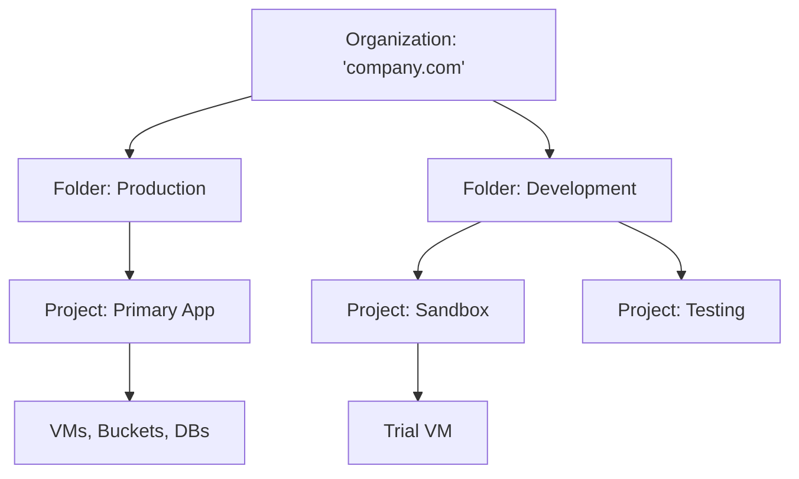

# Day 26: Resource Management & Billing

**Duration:** ⏱️ 45 Minutes  
**Level:** Beginner/Intermediate  
**ACE Exam Weight:** ⭐⭐⭐⭐ High

---

## 🎯 Learning Objectives

By the end of Day 26, you will be able to:
*   **Navigate** the Google Cloud resource hierarchy (Org, Folders, Projects).
*   **Architect** a cost-control strategy using Budgets, Alerts, and Quotas.
*   **Analyze** complex spending patterns using Billing Exports to BigQuery.
*   **Implement** labels for granular cost tracking and filtering.

---

## 🏗️ 1. The Resource Hierarchy

In Google Cloud, resources aren't just floating in space. They follow a strict hierarchy that dictates how permissions and billing are inherited.



| Level | Key Responsibility | ACE Exam Note |
| :--- | :--- | :--- |
| **Organization** | Root node. | Requires a verified Google Workspace domain. |
| **Folder** | Grouping (per dept, per env). | Used to apply bulk IAM policies. |
| **Project** | The boundary for resources. | Every project **must** be linked to a Billing Account. |
| **Label** | Key-Value pairs on resources. | Best for categorizing costs (e.g. `team:data`). |

---

## 📊 2. Budgets vs. Quotas: The Safestop

It is a common mistake to think Budgets stop your spending. They don't. Only **Quotas** actually halt resource creation.

| Feature | Budgets & Alerts | Quotas |
| :--- | :--- | :--- |
| **Goal** | Cost Awareness | Safety & Capacity |
| **Action** | Sends an email/notification. | Blocks the `Create` operation. |
| **Stops Spend?** | **NO**. Resources keep running. | **YES**. Prevents new spend. |
| **Increase?** | You set the limit yourself. | You must request from Google. |

---

## 🛠️ 3. Hands-On Lab: Cost Safety Net

### 🧪 Lab Objective
Set up a multi-threshold budget and understand where to find your current Quota usage.

### ✅ Steps

1.  **Create a Budget**:
    - Go to **Billing > Budgets & alerts**.
    - Set Monthy Budget: **$10.00**.
    - Set Thresholds:
        - 50% (Email Admins)
        - 90% (Email Admins + PubSub Notification)
        - 100% (Email Admins)

2.  **Inspect Quotas**:
    - Go to **IAM & Admin > Quotas**.
    - Filter by: **Service: Compute Engine API**.
    - Metric: **CPUs (all regions)**.
    - *Observation:* Note your current limit (usually 8 or 32 for new accounts). If you try to create 100 VMs, this is where it would be blocked!

3.  **Label a Resource**:
    ```bash
    gcloud compute instances add-labels monitor-node \
      --labels="env=dev,owner=learner" \
      --zone=us-central1-a
    ```
    *Now, your next billing report allows you to filter specifically for `env=dev` costs.*

---

## ⚠️ 4. Exam Traps & Best Practices

> [!IMPORTANT]
> **ACE Exam Alert: BigQuery Export**
> If you need to "Visualize billing data over the last 12 months with custom charts," the first step is always **exporting the billing data to BigQuery**. Standard console reports only show limited history.

> [!WARNING]
> **Billing Account Permissions**: To link a project to a billing account, you must have the **Billing Account User** role on the *Billing Account*, and **Project Creator/Owner** on the *Project*.

---

<!-- QUIZ_START -->
## 📝 5. Knowledge Check

1.  **You want to receive an automated notification when your monthly spend reaches $500, but you do NOT want your services to stop. What should you configure?**
    *   A. A hard Quota limit.
    *   B. **A Billing Budget and Alert.** ✅
    *   C. An IAM Policy.
    *   D. A Firewall Rule.

2.  **You are unable to create a new Compute Engine instance in the `us-east1` region because you have 'exceeded account limits.' How do you resolve this?**
    *   A. Increase your Billing Budget.
    *   B. **Request a Quota increase in the Console.** ✅
    *   C. Change your credit card.
    *   D. Delete your project and start over.

3.  **Which level of the resource hierarchy is best suited for applying a single IAM policy that affects all production projects simultaneously?**
    *   A. Project level
    *   B. **Folder level ('Production' folder)** ✅
    *   C. Resource level
    *   D. Label level

4.  **What is the primary benefit of exporting billing data to BigQuery?**
    *   A. It makes the bill cheaper.
    *   B. **It allows for complex SQL analysis and long-term data retention.** ✅
    *   C. It automatically pays the bill using credits.
    *   D. It encrypts the billing data.

5.  **You need to track exactly how much the 'Marketing' team is spending on Cloud Storage vs the 'Engineering' team within the same project. What should you use?**
    *   A. Folders
    *   B. **Labels (e.g., team=marketing, team=eng)** ✅
    *   C. Different Billing Accounts
    *   D. Different VPCs
<!-- QUIZ_END -->
---

<div class="checklist-card" x-data="{ 
    items: [
        { text: 'I can draw the Org -> Folder -> Project hierarchy.', checked: false },
        { text: 'I understand that Budgets do not stop services.', checked: false },
        { text: 'I know the difference between Billing Account Admin and User.', checked: false },
        { text: 'I understand how to use Labels for cost tracking.', checked: false }
    ]
}">
    <h3>
        <svg viewBox="0 0 24 24" fill="none" stroke="currentColor" stroke-width="2" stroke-linecap="round" stroke-linejoin="round" class="text-blurple">
            <path d="M22 11.08V12a10 10 0 1 1-5.93-9.14"></path>
            <polyline points="22 4 12 14.01 9 11.01"></polyline>
        </svg>
        Day 26 Mastery Checklist
    </h3>
    <template x-for="(item, index) in items" :key="index">
        <div class="checklist-item" @click="item.checked = !item.checked">
            <div class="checklist-box" :class="{ 'checked': item.checked }">
                <svg viewBox="0 0 24 24" fill="none" stroke="currentColor" stroke-width="3" stroke-linecap="round" stroke-linejoin="round">
                    <polyline points="20 6 9 17 4 12"></polyline>
                </svg>
            </div>
            <span x-text="item.text" :class="{ 'line-through text-slate-400': item.checked }"></span>
        </div>
    </template>
</div>
